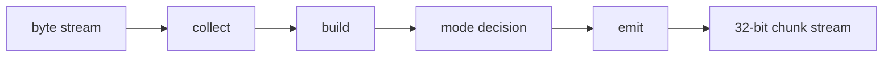

# Dynamic Huffman Encoder Specification

## 1. Purpose

`dynamic_huffman_encoder` la khoi trung tam cua nhanh TX. No nhan byte stream
da duoc chuan hoa tu `huffman_aes_tx_top`, tu minh di qua cac pha:

- collect
- build
- mode decision
- emit

Module nay khong quan tam den MMIO, DMA hay AES. No chi lam viec voi block
byte input, frequency table, codebook va bitstream output.

Current verification status:

| Case | Coverage/use |
|---|---|
| `tx_compress_only_input1/input4_cov` | Whole-file dynamic Huffman behavior qua SoC TX-only |
| `tx_compress_only_alnum63_cov` | Alnum63 stress within 256-symbol byte alphabet |
| `tx_compress_only_ascii_sweep_cov` | Byte-symbol sweep and mode-decision coverage |
| `tx_encoder_direct_cov` | Direct encoder mode/error/FSM branches |
| `tx_builder_packer_direct_cov` | Huffman builder and packer interaction branches |

## 2. Role In TX Stack

`dynamic_huffman_encoder` nam giua:

```text
input adapter
-> dynamic_huffman_encoder
-> bit_packer_128
```

No dung cac helper module:

| Module | Role |
|---|---|
| `control_fsm` | Dieu khien phase va sticky state |
| `input_collect_unit` | Thu thap byte va dem tan suat |
| `block_buffer` | Luu block byte hien tai |
| `frequency_counter` | Dem tan suat symbol |
| `huffman_builder` | Xay symbol list, code length va canonical code |
| `mode_decision_logic` | Chon `RAW_FULL`, `RAW_PARTIAL`, `COMPRESSED`, `ONE_SYMBOL` |
| `emit_backend` | Emit header va payload bitstream |
| `header_formatter` | Dinh dang header block |
| `payload_emitter` | Emit raw bytes hoac Huffman bits |
| `stream_output_interface` | Xuat bitstream thanh chunk 32-bit |

## 3. High-Level Flow



## 4. Input Contract

Module nhan control va byte stream tu adapter:

- `start_block` bat dau mot block encoder
- `whole_file_enable`, `whole_file_emit_table`, `whole_file_table_valid` dieu khien whole-file flow
- `byte_in[7:0]` va `byte_valid` mang du lieu byte
- `block_start` va `block_end` danh dau dau/cuoi block
- `stream_ready` la handshake tu packer/consumer phia sau

Quy uoc:

- mot block la mot tap byte lien tiep
- block size hop le trong flow TX hien tai la `1..32`
- `block_start` phai noi voi byte dau tien
- `block_end` phai noi voi byte cuoi cung

Neu input khong hop le, encoder se phat error sticky va dung transfer.

### 4.1 Interface summary

| Port | Dir | Width | Data format | Meaning |
|---|---|---:|---|---|
| `clk` | in | 1 | `clk` | System clock |
| `rst_n` | in | 1 | `rst_n` | Active-low reset |
| `start_block` | in | 1 | pulse | Start one encoder block |
| `whole_file_enable` | in | 1 | policy flag | Enable whole-file flow |
| `whole_file_emit_table` | in | 1 | bool | Emit global codebook table |
| `whole_file_table_valid` | in | 1 | bool | Global table already valid |
| `external_symbol_count` | in | 9 | unsigned symbol count | Number of symbols in whole-file table |
| `external_symbol_read_addr` | out | 9 | unsigned symbol address | Address into external symbol list |
| `external_symbol_read_data` | in | 8 | symbol byte | External symbol value |
| `external_code_len_read_index` | out | 8 | unsigned symbol index | Index for code-length lookup |
| `external_code_len_read_data` | in | 5 | code length | External code length |
| `external_code_read_index` | out | 8 | unsigned symbol index | Index for code lookup |
| `external_code_read_data` | in | 13 | canonical code word | External code bit pattern |
| `byte_in` | in | 8 | symbol byte | Input byte from TX adapter |
| `byte_valid` | in | 1 | valid flag | Input byte is valid |
| `byte_ready` | out | 1 | ready flag | Encoder can accept next byte |
| `block_start` | in | 1 | pulse | First byte of a block |
| `block_end` | in | 1 | pulse | Last byte of a block |
| `stream_ready` | in | 1 | ready flag | Downstream packer ready |
| `stream_data` | out | 32 | little-endian chunk | Output bit chunk |
| `stream_len` | out | 6 | unsigned bit count | Valid bits in chunk |
| `stream_valid` | out | 1 | valid flag | Chunk is valid |
| `stream_last` | out | 1 | bool | Last chunk of frame |
| `busy` | out | 1 | busy flag | Encoder active |
| `done` | out | 1 | pulse | Encoder completed block |
| `error_flag` | out | 1 | error flag | Encoder error |
| `selected_mode_out` | out | 2 | mode code | Mode selected for block |
| `fsm_state` | out | 4 | state code | Control FSM state debug |

## 5. Phase Sequence

### 5.1 Collect

`input_collect_unit`:

- chuan hoa byte
- dua byte vao `block_buffer`
- tang dem frequency
- cap nhat `symbol_count`

### 5.2 Build

`huffman_builder`:

- lay symbol active tu frequency table
- tinh do dai code
- tao canonical code
- luu code length table cho emit va cho RX rebuild sau nay

### 5.3 Mode Decision

`mode_decision_logic` chon mot trong 4 mode:

| Mode | Meaning |
|---|---|
| `RAW_FULL` | Emit raw 32 byte day du |
| `RAW_PARTIAL` | Emit raw block size that |
| `COMPRESSED` | Emit Huffman header + payload |
| `ONE_SYMBOL` | Emit 1 symbol repeated block size |

Lua chon khong chi dua tren bit count ma con dua tren storage size sau khi
dua vao `bit_packer_128`.

### 5.4 Emit

`emit_backend` phat ra:

- header bits
- payload bits
- valid bits count
- done pulse

`stream_output_interface` chuyen stream bit thanh chunk 32-bit cho `bit_packer_128`.

## 6. Output Contract

| Port | Dir | Width | Data format | Meaning |
|---|---|---:|---|---|
| `stream_data` | out | 32 | little-endian chunk | Output bit chunk |
| `stream_len` | out | 6 | unsigned bit count | Number of valid bits in `stream_data` |
| `stream_valid` | out | 1 | valid flag | Output chunk is valid |
| `stream_last` | out | 1 | bool | Last chunk of frame |
| `stream_ready` | in | 1 | ready flag | Downstream consumer ready |
| `done` | out | 1 | pulse | Encoder completed the block |
| `busy` | out | 1 | busy flag | Encoder is active |
| `error_flag` | out | 1 | error flag | Encoder error |
| `selected_mode_out` | out | 2 | mode code | Selected mode for this block |
| `fsm_state` | out | 4 | state code | Control FSM state debug |

`stream_len` la so bit hop le trong `stream_data`.

## 7. Mode Encoding

| Bits | Mode |
|---:|---|
| `00` | `RAW_FULL` |
| `01` | `RAW_PARTIAL` |
| `10` | `COMPRESSED` |
| `11` | `ONE_SYMBOL` |

## 8. Mode Bitstream Format

### 8.1 `RAW_FULL`

```text
mode[1:0] = 00
payload   = 32 raw bytes
```

### 8.2 `RAW_PARTIAL`

```text
mode[1:0]       = 01
block_size[5:0] = valid byte count
payload         = block_size raw bytes
```

### 8.3 `COMPRESSED`

```text
mode[1:0]        = 10
block_size[5:0]
symbol_count[8:0]
symbol/code_len table
payload Huffman code bits
```

Each table entry is:

```text
symbol[7:0] + code_len[4:0] = 13 bits
```

### 8.4 `ONE_SYMBOL`

```text
mode[1:0]             = 11
block_size[5:0]
one_symbol_value[7:0]
```

## 9. Current Limits

- block size toi da: `32 byte`
- so symbol toi da trong 1 block: phu thuoc block va normalize rule
- alphabet active hien tai: full byte alphabet `0x00..0xFF`
- `huffman_symbol_map.vh` dang map identity, nen input byte nao cung la symbol hop le
- whole-file mode co the emit codebook toi da 256 symbol; `symbol_count=0` nghia la reuse table
- TX FPGA demo hien dung `CODE_WIDTH=13`; neu input pathological can code dai hon thi can tang `CODE_WIDTH` hoac them long-code fallback

## 10. Current Design Notes

`dynamic_huffman_encoder` da duoc dung trong:

- `huffman_aes_tx_top`
- whole-file dynamic Huffman flow

No khong tu lam AES. AES nam o wrapper ben tren.

## 11. Internal state / helper outputs

| Signal | Width | Data format | Meaning |
|---|---:|---|---|
| `ctrl_state_w` | 4 | state code | Control FSM state |
| `ctrl_mode_selected_latched_w` | 2 | mode code | Latched mode from control FSM |
| `ctrl_busy_w` | 1 | busy flag | Encoder busy |
| `ctrl_done_w` | 1 | pulse | Encoder done |
| `ctrl_error_flag_w` | 1 | error flag | Encoder error |
| `collect_busy_w` | 1 | busy flag | Input collect unit busy |
| `collect_done_w` | 1 | pulse | Input collect unit done |
| `collect_protocol_error_w` | 1 | error flag | Input protocol error |
| `collect_overflow_error_w` | 1 | error flag | Input overflow error |
| `build_busy_w` | 1 | busy flag | Huffman builder busy |
| `build_done_w` | 1 | pulse | Huffman builder done |
| `build_error_w` | 1 | error flag | Huffman builder error |
| `mode_busy_w` | 1 | busy flag | Mode decision logic busy |
| `mode_done_w` | 1 | pulse | Mode decision logic done |
| `mode_error_w` | 1 | error flag | Mode decision logic error |
| `mode_selected_w` | 2 | mode code | Mode chosen by policy |
| `emit_busy_w` | 1 | busy flag | Emit backend busy |
| `emit_done_w` | 1 | pulse | Emit backend done |
| `emit_error_w` | 1 | error flag | Emit backend error |
| `hb_symbol_read_addr_mux_w` | 9 | unsigned symbol address | Whole-file symbol read address mux |
| `hb_code_len_read_index_mux_w` | 8 | unsigned symbol index | Code-length read index mux |
| `hb_code_read_index_mux_w` | 8 | unsigned symbol index | Code read index mux |
| `raw_total_bits_w` | 16 | unsigned bit count | Raw mode total bits estimate |
| `compressed_header_bits_w` | 16 | unsigned bit count | Compressed header bits estimate |
| `compressed_payload_bits_w` | 16 | unsigned bit count | Compressed payload bits estimate |
| `compressed_total_bits_w` | 16 | unsigned bit count | Compressed total bits estimate |
| `one_symbol_total_bits_w` | 16 | unsigned bit count | One-symbol mode total bits estimate |

## 12. Related Specs

- [TX path end-to-end](./tx_path_end_to_end_spec.md)
- [Whole-file Huffman](./14_dynamic_whole_file_huffman_spec.md)
