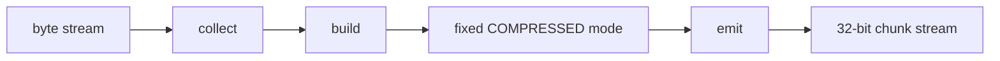

# Dynamic Huffman Encoder Specification

## 1. Purpose

`dynamic_huffman_encoder` la khoi trung tam cua nhanh TX. No nhan byte stream
da duoc chuan hoa tu `huffman_aes_tx_top`, tu minh di qua cac pha:

- collect
- build
- fixed mode-select latch
- emit

Module nay khong quan tam den MMIO, DMA hay AES. No chi lam viec voi block
byte input, frequency table, codebook va bitstream output. RTL hien tai khong
con `mode_decision_logic.v`; TX encoder luon emit Huffman `COMPRESSED`. Quyet
dinh luu compressed hay raw o cap file thuoc firmware/metadata.

Current verification status:

| Case | Coverage/use |
|---|---|
| `tx_compress_only_input1/input4_cov` | Whole-file dynamic Huffman behavior qua SoC TX-only |
| `tx_compress_only_alnum63_cov` | Alnum63 stress within 256-symbol byte alphabet |
| `tx_compress_only_ascii_sweep_cov` | Byte-symbol sweep and whole-file table behavior |
| `tx_encoder_direct_cov` | Direct encoder emit/header/payload defensive branches |
| `tx_builder_packer_direct_cov` | Huffman builder and packer interaction branches |

## 2. Role In TX Stack

`dynamic_huffman_encoder` nam giua:

```text
input adapter
-> dynamic_huffman_encoder
-> bit_packer_128
```

No dung cac helper module:

| Module | Role |
|---|---|
| `control_fsm` | Dieu khien phase va sticky state |
| `input_collect_unit` | Thu thap byte va dem tan suat |
| `block_buffer` | Luu block byte hien tai |
| `frequency_counter` | Dem tan suat symbol |
| `huffman_builder` | Xay symbol list, code length va canonical code |
| `emit_backend` | Emit header va payload bitstream |
| `header_formatter` | Dinh dang header block |
| `payload_emitter` | Emit raw bytes hoac Huffman bits |
| `stream_output_interface` | Xuat bitstream thanh chunk 32-bit |

## 3. High-Level Flow



## 4. Input Contract

Module nhan:

- `start_block`
- `byte_in[7:0]`
- `byte_valid`
- `byte_ready`
- `block_start`
- `block_end`

Quy uoc:

- `start_block` la pulse dieu khien bat dau mot Huffman block moi.
- `byte_valid/byte_ready` la handshake byte stream.
- `block_start` phai di cung byte dau tien cua block.
- `block_end` phai di cung byte cuoi cung cua block.
- mot block payload hop le trong flow TX hien tai la `1..32` byte.
- trong `whole_file_enable=1`, codebook co the lay tu external/global table,
  nhung payload van duoc feed vao encoder theo tung block toi da 32 byte.

Neu input khong hop le, encoder se phat error sticky va dung transfer.

## 5. Phase Sequence

### 5.1 Collect

`input_collect_unit`:

- chuan hoa byte
- dua byte vao `block_buffer`
- tang dem frequency
- cap nhat `symbol_count`

### 5.2 Build

`huffman_builder`:

- lay symbol active tu frequency table
- tinh do dai code
- tao canonical code
- luu code length table cho emit va cho RX rebuild sau nay

### 5.3 Fixed Mode Select

RTL hien tai khong con block-level mode decision. Sau phase build, encoder latch
co dinh:

```text
selected_mode = COMPRESSED = 2'b10
```

Voi whole-file mode, control FSM di thang tu collect sang emit khi global table
da valid. Voi legacy per-block simulation path, phase mode-select chi ton tai de
giu handshake cu nhung khong scan buffer va khong tinh raw/one-symbol fallback.

Implementation note:

- In synthesis, `dynamic_huffman_encoder` forces its internal
  `whole_file_mode_w = 1'b1`. This matches the FPGA/report path, where whole-file
  dynamic Huffman is the active design point.
- In simulation, `whole_file_enable` is still honored so coverage can exercise
  legacy per-block compatibility modes.

### 5.4 Emit

`emit_backend` phat ra:

- header bits
- payload bits
- valid bits count
- done pulse

`stream_output_interface` chuyen stream bit thanh chunk 32-bit cho `bit_packer_128`.

## 6. Output Contract

Encoder xuat:

- `out_chunk[31:0]`
- `out_chunk_valid`
- `out_chunk_ready`
- `out_chunk_bits[5:0]`
- `done`
- `busy`
- `error`
- `selected_mode[1:0]`, hien la `2'b10`

`out_chunk_bits` la so bit hop le trong `out_chunk`.

## 7. Mode Encoding

RX parser van ho tro day du format cu de giai ma stream hop le/coverage. TX
encoder active hien chi phat `COMPRESSED`.

| Bits | Mode |
|---:|---|
| `00` | `RAW_FULL` |
| `01` | `RAW_PARTIAL` |
| `10` | `COMPRESSED` |
| `11` | `ONE_SYMBOL` |

## 8. Mode Bitstream Format

### 8.1 `RAW_FULL`

```text
mode[1:0] = 00
payload   = 32 raw bytes
```

### 8.2 `RAW_PARTIAL`

```text
mode[1:0]       = 01
block_size[5:0] = valid byte count
payload         = block_size raw bytes
```

### 8.3 `COMPRESSED`

```text
mode[1:0]        = 10
block_size[5:0]
symbol_count[8:0]
symbol/code_len table
payload Huffman code bits
```

Each table entry is:

```text
symbol[7:0] + code_len[4:0] = 13 bits
```

### 8.4 `ONE_SYMBOL`

```text
mode[1:0]             = 11
block_size[5:0]
one_symbol_value[7:0]
```

## 9. Current Limits

- block size toi da: `32 byte`
- so symbol toi da trong 1 block: phu thuoc block va normalize rule
- alphabet active hien tai: full byte alphabet `0x00..0xFF`
- `huffman_symbol_map.vh` dang map identity, nen input byte nao cung la symbol hop le
- whole-file mode co the emit codebook toi da 256 symbol; `symbol_count=0` nghia la reuse table
- TX FPGA demo hien dung `CODE_WIDTH=13`; neu input pathological can code dai hon thi can tang `CODE_WIDTH` hoac them long-code fallback

## 10. Current Design Notes

`dynamic_huffman_encoder` da duoc dung trong:

- `huffman_aes_tx_top`
- whole-file dynamic Huffman flow

No khong tu lam AES. AES nam o wrapper ben tren.

Area-optimized synthesis notes:

- `frequency_counter.freq_table`, `block_buffer.block_mem`, symbol list,
  code-length memory, canonical code memory, and TX APB FIFOs infer distributed
  RAM in the latest Vivado run.
- `code_length_builder` writes `node_weight`, `node_parent`, and `node_order`
  through one explicit write port per table, so Vivado no longer dissolves the
  Huffman tree into thousands of FF/LUT registers.
- Large data memories are not reset entry-by-entry in synthesis; logical clear
  is done with valid bits or FSM clear states.
- TX-only post-implementation at 50 MHz is `11933` LUTs, `5469` FFs, `3979`
  slices, `208` control sets, WNS `+1.277 ns`.

## 11. Related Specs

- [TX path end-to-end](./tx_path_end_to_end_spec.md)
- [Whole-file Huffman](./14_dynamic_whole_file_huffman_spec.md)
