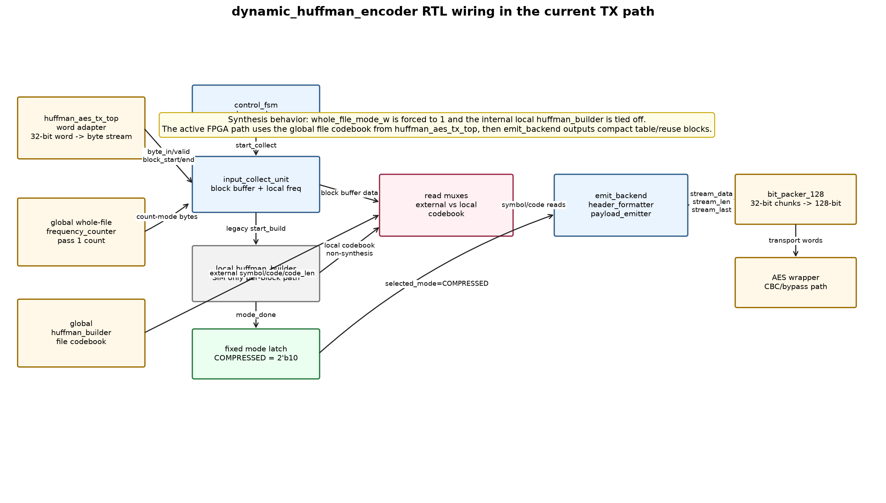
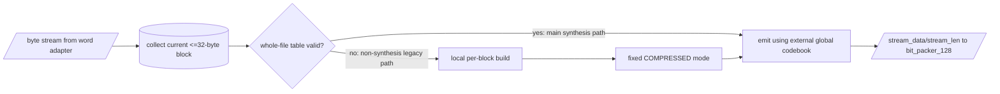
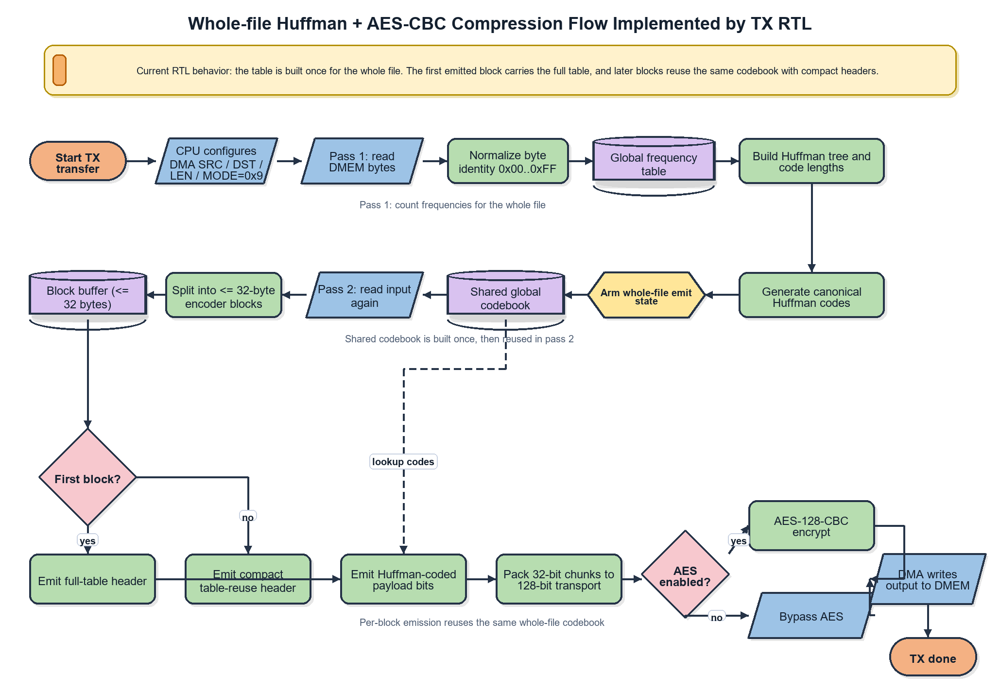

# Dynamic Huffman Encoder Specification

Status: updated against current RTL on 2026-06-15.

Primary RTL files:

- `rtl/dynamic_huffman_encoder.v`
- `rtl/huffman_aes_tx_top.v`
- `rtl/control_fsm.v`
- `rtl/input_collect_unit.v`
- `rtl/emit_backend.v`
- `rtl/header_formatter.v`
- `rtl/payload_emitter.v`
- `rtl/bit_packer_128.v`

## 1. Purpose

`dynamic_huffman_encoder` is the block-local encoder in the TX path. It accepts
one byte stream block at a time, stores the block bytes, and emits a
variable-length bitstream made of a Huffman header plus Huffman-coded payload.

The current active report/FPGA path is whole-file dynamic Huffman:

```text
huffman_aes_tx_top pass 1
-> global frequency_counter
-> global huffman_builder
-> dynamic_huffman_encoder external codebook ports
-> emit_backend
-> bit_packer_128
-> AES-CBC wrapper
```

Important current RTL point: in synthesis, `dynamic_huffman_encoder` forces
`whole_file_mode_w = 1'b1`, and its internal per-block `huffman_builder` is
tied off under `ifdef SYNTHESIS`. Therefore, the report should not describe the
FPGA path as "rebuild Huffman table for every 32-byte block". The active FPGA
path builds one file-level table in `huffman_aes_tx_top`, then reuses it while
`dynamic_huffman_encoder` emits each block.

## 2. Position In TX Stack

```text
DMEM source words
-> dma_tx_engine
-> apb_huffman_tx_if
-> huffman_aes_tx_top
   -> 32-bit word adapter
   -> global frequency counter / global Huffman builder
   -> dynamic_huffman_encoder
   -> bit_packer_128
   -> AES input wrapper
-> AES-CBC core / bypass path
-> TX output FIFO / DMEM destination
```

`dynamic_huffman_encoder` does not know about MMIO, DMEM addresses, file IDs,
metadata, IV storage, or AES output. Those responsibilities belong to the DMA,
APB wrapper, firmware, and AES wrapper around it.

## 3. RTL Wiring Diagram



Figure. Current RTL wiring of `dynamic_huffman_encoder` in the TX path. The
main FPGA path uses the external whole-file codebook generated by
`huffman_aes_tx_top`. The internal local builder is only for non-synthesis
per-block compatibility and coverage.

## 4. Submodules And Responsibilities

| Module | Current responsibility |
|---|---|
| `control_fsm` | Generates phase pulses: collect, optional local build, fixed mode, emit |
| `input_collect_unit` | Accepts byte handshake, writes block buffer, maintains local frequency data |
| `block_buffer` | Stores the current `<=32` byte block for payload emission |
| `frequency_counter` | Counts byte-symbol frequencies inside `input_collect_unit`; local count is not the main synthesis codebook source |
| `huffman_builder` | Local per-block builder in non-synthesis path; tied off in synthesis |
| `emit_backend` | Runs header formatter, payload emitter, and stream output interface |
| `header_formatter` | Emits mode, size, table entries, or compact table-reuse header |
| `payload_emitter` | Re-reads block bytes and emits Huffman code bits |
| `stream_output_interface` | Multiplexes header/payload chunks into the downstream 32-bit stream |

## 5. Main Control Flow



For thesis/report explanation, use:

```text
collect block bytes -> use already-built whole-file table -> emit header/payload
```

Do not present the current FPGA path as:

```text
collect every block -> rebuild table every block
```

## 6. Input Contract

Main input signals:

| Signal | Meaning |
|---|---|
| `start_block` | One-cycle pulse for a new encoder block |
| `whole_file_enable` | Selects whole-file external-codebook behavior in simulation; forced active in synthesis |
| `whole_file_emit_table` | Tells emit path to include the full table on this block |
| `whole_file_table_valid` | Must be high before whole-file emit can start |
| `external_symbol_count` | Number of symbols in the global codebook |
| `external_symbol_read_addr/data` | Read port for global symbol list |
| `external_code_len_read_index/data` | Read port for global code lengths |
| `external_code_read_index/data` | Read port for global canonical codes |
| `byte_in`, `byte_valid`, `byte_ready` | Byte-stream handshake from the word adapter |
| `block_start` | Asserted with the first byte of the block |
| `block_end` | Asserted with the last byte of the block |

Valid block size in the current TX flow is `1..32` bytes. `huffman_aes_tx_top`
enforces this before it starts the encoder block.

## 7. Phase Details

### 7.1 Collect

`input_collect_unit` accepts one byte at a time, stores it into the local block
buffer, and records local frequency information. In whole-file synthesis mode,
the local frequency table is not used to build the active codebook. The block
buffer remains essential because `payload_emitter` later re-reads the block
bytes and maps each byte through the external global codebook.

### 7.2 Build

There are two builder paths:

| Path | Build location | Active in synthesis? | Purpose |
|---|---|---|---|
| Whole-file path | `huffman_aes_tx_top.u_file_huffman_builder` | Yes | Main report/FPGA codebook |
| Per-block legacy path | `dynamic_huffman_encoder.u_huffman_builder` | No | Non-synthesis compatibility/coverage |

The whole-file builder receives frequency counts from
`huffman_aes_tx_top.u_file_frequency_counter`, then exposes symbol, code-length,
and canonical-code read ports to `dynamic_huffman_encoder`.

### 7.3 Fixed Mode

The old block-level `mode_decision_logic` is not active. Current TX encoder
mode is fixed:

```text
selected_mode = COMPRESSED = 2'b10
```

Raw-vs-compressed storage policy is a file-level firmware/metadata decision,
not a per-block decision inside this encoder.

### 7.4 Emit

`emit_backend` emits:

- header chunks from `header_formatter`;
- payload chunks from `payload_emitter`;
- `stream_data[31:0]`;
- `stream_len[5:0]`, the number of valid bits in `stream_data`;
- `stream_valid`;
- `stream_last`.

During whole-file emit, read muxes select the external global codebook:

| Consumer | Address source | Data source |
|---|---|---|
| Header symbol list | `emit_symbol_read_addr_w` | `external_symbol_read_data` |
| Header code lengths | `emit_code_len_read_index_w` | `external_code_len_read_data` |
| Payload code lengths | `emit_code_len_read_index_w` | `external_code_len_read_data` |
| Payload canonical codes | `emit_code_read_index_w` | `external_code_read_data` |
| Payload bytes | `emit_buffer_read_addr_w` | local block buffer |

`whole_file_emit_table=1` makes the first compressed block carry the full
symbol/code-length table. Later blocks carry only a compact table-reuse header
and use the same global codebook.

## 8. Output Contract

| Output | Meaning |
|---|---|
| `stream_data[31:0]` | Packed header/payload bits |
| `stream_len[5:0]` | Number of valid bits in `stream_data` |
| `stream_valid` | Chunk valid |
| `stream_ready` | Downstream ready from `bit_packer_128` |
| `stream_last` | Last chunk of this encoder block |
| `busy` | Encoder/control activity |
| `done` | Current block done |
| `error_flag` | Sticky encoder error |
| `selected_mode_out[1:0]` | Latched mode, currently `2'b10` for compressed |
| `fsm_state[3:0]` | Debug state from `control_fsm` |

## 9. Bitstream Format

RX still supports the legacy modes for compatibility and negative tests, but
the active TX path emits compressed blocks.

| Bits | Mode | TX active? |
|---:|---|---|
| `00` | `RAW_FULL` | No |
| `01` | `RAW_PARTIAL` | No |
| `10` | `COMPRESSED` | Yes |
| `11` | `ONE_SYMBOL` | No |

Normal compressed block:

```text
mode[1:0]        = 10
block_size[5:0]
symbol_count[8:0]
symbol/code_len entries
payload Huffman code bits
```

Each table entry is:

```text
symbol[7:0] + code_len[4:0] = 13 bits
```

Whole-file table-reuse compressed block:

```text
mode[1:0]         = 10
reuse_size_present= 0 -> implicit block_size = 32
reuse_size_present= 1 -> next 6 bits carry block_size
payload Huffman code bits using previous table
```

The compact reuse header avoids re-sending the full codebook for every 32-byte
block in a file.

## 10. Whole-File Compression Flow



Figure. Current whole-file Huffman compression flow implemented by TX RTL.

Algorithm-level sequence:

1. CPU writes DMA registers and starts TX whole-file mode.
2. DMA/TX pass 1 reads source bytes from DMEM.
3. `frequency_counter` normalizes each byte and accumulates a 256-entry
   frequency table.
4. `huffman_builder` creates the symbol list, Huffman tree/code lengths, and
   canonical codes.
5. DMA/TX pass 2 reads the same source bytes again in `<=32` byte blocks.
6. `dynamic_huffman_encoder` collects the current block into `block_buffer`.
7. `emit_backend` emits a full compressed header/table on the first block.
8. Later blocks emit compact table-reuse headers.
9. Payload bytes are replaced by canonical Huffman code bits.
10. `bit_packer_128` packs variable-length chunks into 128-bit transport words.
11. AES wrapper encrypts transport words in CBC mode unless the testcase uses
    compression-only bypass.
12. DMA writes the final transport/ciphertext to DMEM.

## 11. Limits And Caveats

- Block payload size: maximum `32` bytes.
- Active alphabet: full byte alphabet `0x00..0xFF`.
- `huffman_symbol_map.vh` is identity-style for current byte-symbol mapping.
- Whole-file mode can emit up to `256` byte symbols.
- `CODE_WIDTH=13` in the current FPGA-demo configuration. Existing regression
  datasets fit this limit. Pathological distributions may need a larger code
  width or a long-code fallback.
- Power/resource numbers are Vivado estimates for the implemented design, not
  a property of this encoder module alone.

## 12. Thesis Explanation Wording

Use this wording:

```text
The TX compression path uses whole-file dynamic Huffman coding. The hardware
first scans the input file to build a global byte-frequency table and a
canonical Huffman codebook. It then reads the file again in 32-byte blocks. The
first compressed block carries the code-length table needed by RX, while later
blocks use a compact table-reuse header. The dynamic_huffman_encoder therefore
does not rebuild the Huffman tree for every block in the FPGA path; it emits
each block using the external whole-file codebook produced by huffman_aes_tx_top.
```

## 13. Related Specs

- [Current system spec](./00_current_system_spec.md)
- [Whole-file Huffman](./14_dynamic_whole_file_huffman_spec.md)
- [TX path end-to-end](./tx_path_end_to_end_spec.md)
- [Bit packer](./bit_packer_128_spec.md)
- [Spec flow index](./spec_flow_index.md)
