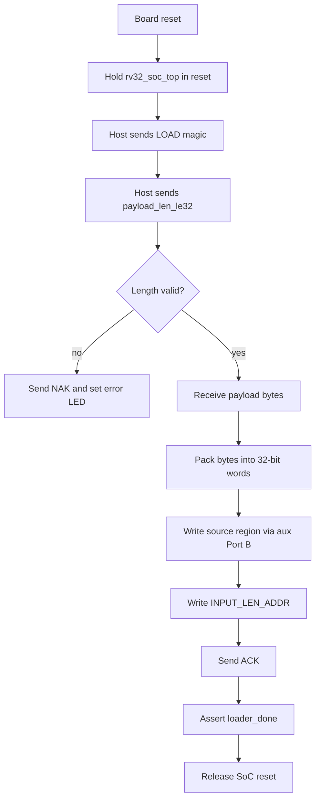

# FPGA UART DMEM Loader Specification

## 1. Purpose

This spec defines the active FPGA-side runtime input loader used by the
`rv32_soc_fpga_demo_top` flow.

The goal is:

```text
host file
-> UART
-> uart_dmem_loader
-> DMEM source region
-> INPUT_LEN word
-> release RV32I reset
-> normal DMA/TX software flow
```

The loader is intentionally small and fixed-purpose. It is a bring-up path for
loading the plaintext source buffer into `DMEM` before the CPU starts.

## 1.1 Loader Flow Chart



## 2. Scope

This loader is active only in:

- `rtl/rv32_soc_fpga_demo_top.v`

It is not part of the main simulation loopback path, and it is not instantiated
inside `rv32_soc_top` itself.

## 3. Top-Level Connectivity

### 3.1 Modules

| Module | Role |
|---|---|
| `rv32_soc_fpga_demo_top` | FPGA wrapper top |
| `uart_dmem_loader` | UART RX/TX protocol parser + DMEM auxiliary writer |
| `rv32_soc_top` | Main SoC |
| `dmem_ip_wrapper` | DMEM wrapper exposing Port A for CPU and Port B for auxiliary master |
| `DMEM_ip` | Vivado true dual-port BRAM |

### 3.2 Connection graph

```text
uart_rx_i
-> uart_dmem_loader
-> aux_en/aux_we/aux_addr/aux_wdata
-> rv32_soc_top aux_* input
-> dmem_ip_wrapper Port B
-> DMEM_ip Port B

uart_dmem_loader.done
-> rv32_soc_fpga_demo_top soc_rst release
-> RV32I CPU starts only after payload is loaded
```

### 3.3 Reset policy

`rv32_soc_fpga_demo_top` now has two reset domains:

1. `por_rst_w`
   - generated by the power-on shift register
   - resets the UART loader itself

2. `soc_rst_w`
   - `por_rst_w | !loader_done`
   - keeps `rv32_soc_top` in reset until the loader completes

This means:

- DMEM can be written through Port B before CPU execution starts
- the CPU sees a fully populated source buffer and a valid `INPUT_LEN_ADDR`

## 4. UART Electrical/Timing Contract

### 4.1 UART mode

- `8N1`
- baud rate: `115200`
- FPGA demo clock assumption: `50 MHz`

At `50 MHz`, the loader uses a UART prescale derived from:

```text
prescale = CLK_HZ / BAUD_RATE = 50_000_000 / 115200 = 434
```

### 4.2 Board pins

Current ZedBoard demo constraints:

| Signal | Port | Pin | Note |
|---|---|---|---|
| `uart_rx_i` | JA1 | `Y11` | host TX -> FPGA RX |
| `uart_tx_o` | JA2 | `AA11` | FPGA TX -> host RX |

Board wiring:

1. connect USB-UART TX to `JA1`
2. connect USB-UART RX to `JA2`
3. connect common GND

The current XDC uses `LVCMOS33` for these Pmod pins and enables a pull-up on
`uart_rx_i` so the line idles high.

## 5. Loader Data Contract

### 5.1 Host frame format

The current frame is fixed and minimal:

```text
byte[0..3]   = ASCII "LOAD"
byte[4..7]   = payload_len_bytes, little-endian uint32
byte[8..]    = payload bytes
```

The loader does not currently accept:

- arbitrary destination address
- arbitrary metadata words
- multi-frame sessions
- runtime readback commands

It is a single-shot input loader.

### 5.2 DMEM write behavior

On a valid frame:

1. payload bytes are written sequentially starting at:
   - `SRC_BASE_ADDR = 0x0000_0400`
2. bytes are packed into 32-bit words using byte enables on DMEM Port B
3. when the full payload is drained, the loader writes:
   - `INPUT_LEN_ADDR = 0x0000_0040`
   - value = `payload_len_bytes`
4. after that, it releases the SoC reset

Byte packing matches the simulation loader:

```text
word[7:0]   = byte0
word[15:8]  = byte1
word[23:16] = byte2
word[31:24] = byte3
```

So the payload layout inside DMEM is consistent with:

- `tb_rv32_soc_mmio_dma.v`
- `test_mmio_tx_only.c`
- `test_mmio_dma.c`

### 5.3 Size limit

The loader currently accepts at most:

- `7168` bytes

This matches the practical source buffer window:

```text
SRC_BASE_ADDR    = 0x00000400
TX_DST_BASE_ADDR = 0x00002000
source bytes     = 0x1C00 = 7168
```

If `payload_len == 0` or `payload_len > 7168`, the loader enters the error
path and does not release the SoC reset.

## 6. ACK / Error Contract

The loader returns one UART byte to the host:

| Byte | Meaning |
|---:|---|
| `0x79` | load success |
| `0x1F` | load error |

Success means:

- payload was accepted
- source bytes were written to DMEM
- `INPUT_LEN_ADDR` was written
- CPU reset was released

Error means:

- invalid length contract
- CPU stays held in reset

## 7. LED Contract

Current `rv32_soc_fpga_demo_top` LEDs:

| LED | Meaning |
|---|---|
| `led_o[0]` | heartbeat |
| `led_o[1]` | loader busy |
| `led_o[2]` | loader done |
| `led_o[3]` | loader error OR memory error |

Practical interpretation:

- `LD2 = 1` and `LD3 = 0`: input load finished, CPU released
- `LD3 = 1`: loader error or memory error

## 8. Software/Bitstream Contract

The loader only prepares `DMEM`.

What happens next depends on the `instruction.mem` that was built into the
bitstream.

### 8.1 Recommended active flow

Current practical FPGA demo flow:

1. compile `test_mmio_tx_only.c`
2. build `TX-only` bitstream
3. program the board
4. use the UART loader to push `input.txt`
5. CPU reads `INPUT_LEN_ADDR`
6. CPU configures DMA TX mode `0x5`
7. TX produces compressed output in the TX destination buffer

This is the cleanest current board demo because:

- the loader provides plaintext input directly
- TX-only does not require ciphertext pre-generation
- TX-only avoids the unresolved board-side output/readback complexity of a full
  TX->RX loopback demo

## 9. Host Utility

The repository now includes:

- `tools/uart_dmem_loader.py`

and Makefile helper:

```bash
cd sim
make uart_load UART_PORT=/dev/ttyUSB0 UART_INPUT=input1.txt
```

The script:

1. opens the serial port in raw mode
2. sends `"LOAD" + len + payload`
3. waits for `0x79` or `0x1F`

`make uart_load` is not a simulation command.
It is a host-side command for the FPGA demo flow:

- read a local input file on the PC
- send that file over UART
- let `uart_dmem_loader` write it into `DMEM`

## 10. Current Limitations

The current loader does not yet provide:

1. DMEM readback
2. TX ciphertext dump over UART
3. RX-only metadata loading such as IV + ciphertext contract
4. multiple transactions without reconfiguration/reset
5. dynamic destination address selection

So this is a practical input loader, not yet a full host debug transport.
