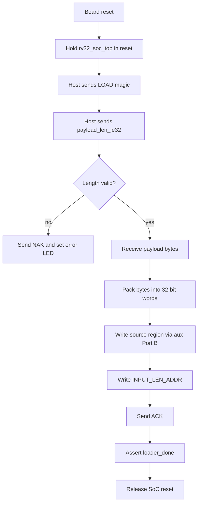

# FPGA UART DMEM Loader Specification

## 1. Purpose

This spec defines the active FPGA-side runtime input loader used by the
`rv32_soc_fpga_zcu102_top` flow. The legacy ZedBoard wrapper
`rv32_soc_fpga_demo_top` keeps the same loader contract.

The goal is:

```text
host file
-> UART
-> uart_dmem_loader
-> DMEM source region
-> INPUT_LEN word
-> release RV32I reset
-> normal DMA/TX software flow
```

The loader is intentionally small and fixed-purpose. It is a bring-up path for
loading the plaintext source buffer into `DMEM` before the CPU starts.

Current integration status:

| Item | Status |
|---|---|
| FPGA wrapper | `rv32_soc_fpga_zcu102_top` |
| Input/readback protocol | `"LOAD" + payload_len_le32 + payload`, `"READ" + addr_le32 + len_le32` |
| Default baud | `115200` |
| Demo clock | ZCU102 USER_SI570 300 MHz input, divided to 50 MHz inside the wrapper |
| Build style | TX-only, RX-only, or full FPGA demo bitstreams using `rv32_soc_fpga_zcu102_top` |
| Board controls | ZCU102 pushbuttons for full reset, optional manual run/resume, zeroize, file-id select, snapshot |
| Remaining gap | higher-level host dump script and firmware-done handshake |

## 1.1 Loader Flow Chart



## 2. Scope

This loader is active in:

- `rtl/rv32_soc_fpga_zcu102_top.v`
- `rtl/rv32_soc_fpga_demo_top.v` for the legacy ZedBoard override path

It is not part of the main simulation loopback path, and it is not instantiated
inside `rv32_soc_top` itself.

The standard `make all TESTNAME=...` simulation flow uses only
`tb/tb_rv32_soc_mmio_dma.v` and testcase wrappers in `testcase/`. For that
flow, use `testcase/dmem_load_readback_smoke.v` to verify the shared DMEM
aux-port load/readback contract. Full UART serial protocol simulation would
require a separate FPGA-wrapper testbench, so it is intentionally outside the
current `make all` path.

## 3. Top-Level Connectivity

### 3.1 Modules

| Module | Role |
|---|---|
| `rv32_soc_fpga_zcu102_top` | ZCU102 FPGA wrapper top |
| `uart_dmem_loader` | UART RX/TX protocol parser + DMEM auxiliary writer |
| `rv32_soc_top` | Main SoC |
| `dmem_ip_wrapper` | DMEM wrapper exposing Port A for CPU and Port B for auxiliary master |
| `DMEM_ip` | Vivado true dual-port BRAM |

### 3.2 Connection graph

```text
uart_rx_i
-> uart_dmem_loader
-> aux_en/aux_we/aux_addr/aux_wdata
-> rv32_soc_top aux_* input
-> dmem_ip_wrapper Port B
-> DMEM_ip Port B

uart_dmem_loader.done
-> rv32_soc_fpga_zcu102_top soc_rst release
-> RV32I CPU starts automatically after payload is loaded
```

### 3.3 Reset policy

`rv32_soc_fpga_zcu102_top` now has two reset domains:

1. `por_rst_w`
   - generated by the power-on shift register
   - resets the UART loader itself

2. `soc_rst_w`
   - `por_rst_w | !loader_done | !run_latched | button_soc_hold`
   - keeps `rv32_soc_top` in reset until the loader completes
   - `run_latched` is set automatically on the `loader_done` pulse

This means:

- DMEM can be written through Port B before CPU execution starts
- the CPU sees a fully populated source buffer and a valid `INPUT_LEN_ADDR`
- the user no longer needs to press Center/SW15 for a normal run

## 4. UART Electrical/Timing Contract

### 4.1 UART mode

- `8N1`
- baud rate: `115200`
- FPGA demo clock assumption: `50 MHz`

At `50 MHz`, the loader uses a UART prescale derived from:

```text
prescale = CLK_HZ / BAUD_RATE = 50_000_000 / 115200 = 434
```

### 4.2 Board pins

Current ZCU102 demo constraints:

| Signal | Port | Pin | Note |
|---|---|---|---|
| `clk_p_i` | USER_SI570_P | `AL8` | 300 MHz differential clock P |
| `clk_n_i` | USER_SI570_N | `AL7` | 300 MHz differential clock N |
| `uart_rx_i` | UART2_TXD_O_FPGA_RXD | `E13` | USB-UART bridge TX -> FPGA RX |
| `uart_tx_o` | UART2_RXD_I_FPGA_TXD | `F13` | FPGA TX -> USB-UART bridge RX |
| `btn_reset_i` | CPU_RESET | `AM13` | full loader/SoC reset |
| `btn_run_i` | GPIO_SW_C | `AG13` | optional manual run/resume latch; normal flow auto-runs after UART load |
| `btn_zeroize_i` | GPIO_SW_N | `AG15` | clear secure metadata/IV region and hold SoC reset |
| `btn_file_next_i` | GPIO_SW_E | `AE14` | select next demo `file_id` |
| `btn_file_prev_i` | GPIO_SW_W | `AF15` | select previous demo `file_id` |
| `btn_snapshot_i` | GPIO_SW_S | `AE15` | copy result words into snapshot DMEM region |

The default XDC is:

```text
vivado/constraints/zcu102_demo.xdc
```

The clock ports use `DIFF_SSTL12`; UART, LEDs, and pushbuttons use `LVCMOS33`.

## 5. Loader Data Contract

### 5.1 Host frame format

The loader supports two host commands.

LOAD frame:

```text
byte[0..3]   = ASCII "LOAD"
byte[4..7]   = payload_len_bytes, little-endian uint32
byte[8..]    = payload bytes
```

READ frame:

```text
byte[0..3]   = ASCII "READ"
byte[4..7]   = dmem_addr, little-endian uint32
byte[8..11]  = read_len_bytes, little-endian uint32
```

The loader does not currently accept:

- arbitrary destination address
- arbitrary metadata words
- unaligned READ address or length
- READ while DMA owns DMEM Port B

`LOAD` prepares the source buffer and releases the CPU. `READ` can be issued
afterward to dump result words, metadata, ciphertext, or restored plaintext from
DMEM.

### 5.2 DMEM write behavior

On a valid frame:

1. payload bytes are written sequentially starting at:
   - `SRC_BASE_ADDR = 0x0000_2000`
2. bytes are packed into 32-bit words using byte enables on DMEM Port B
3. when the full payload is drained, the loader writes:
   - `INPUT_LEN_ADDR = 0x0000_0040`
   - value = `payload_len_bytes`
4. after that, it releases the SoC reset

Byte packing matches the simulation loader:

```text
word[7:0]   = byte0
word[15:8]  = byte1
word[23:16] = byte2
word[31:24] = byte3
```

So the payload layout inside DMEM is consistent with:

- `tb_rv32_soc_mmio_dma.v`
- `test_mmio_tx_only.c`
- `test_mmio_dma.c`

### 5.3 Size limit

The loader currently accepts at most:

- `7168` bytes

This is the RTL parameter `MAX_INPUT_BYTES=7168` in `uart_dmem_loader.v`,
`rv32_soc_fpga_zcu102_top.v`, and the legacy `rv32_soc_fpga_demo_top.v`. The
physical source buffer window is larger:

```text
SRC_BASE_ADDR    = 0x00002000
TX_DST_BASE_ADDR = 0x00004000
source bytes     = 0x2000 = 8192
```

The loader intentionally caps runtime UART input at `7168` bytes to leave
bring-up margin below the `0x2000` source window. This is not a dynamic value:
changing the FPGA-side limit requires changing the `MAX_INPUT_BYTES` parameter
and rebuilding the bitstream.

If `payload_len == 0` or `payload_len > 7168`, the loader enters the error path
and does not release the SoC reset.

### 5.4 READ behavior

On a valid READ frame:

1. `dmem_addr` must be 4-byte aligned
2. `read_len_bytes` must be nonzero and 4-byte aligned
3. the range must stay inside the 32 KiB DMEM window
4. the loader returns `0x79`
5. the loader returns `read_len_bytes` raw data bytes, little-endian per word

READ uses DMEM Port B. During an active TX/RX DMA transfer, `rv32_soc_top`
gives Port B to DMA and the auxiliary readback path returns zero. In practice,
the host should wait long enough after LOAD or poll result words until firmware
has finished.

The address range `0x0000_7F80..0x0000_7FBF` is a read-only UART debug window,
not normal DMEM. A READ from that window returns live CPU/SoC signals captured
inside the FPGA wrapper:

| Address | Meaning |
|---:|---|
| `0x0000_7F80` | signature `"CPU1"` as word `0x31555043` |
| `0x0000_7F84` | CPU status bits: reset, hold, IMEM seen, IMEM/DMEM/MMIO active, TX/RX done/error |
| `0x0000_7F88` | current fetch PC from the IMEM address bus |
| `0x0000_7F8C` | current IMEM instruction data word |
| `0x0000_7F90` | cycle counter since SoC reset release |
| `0x0000_7F94` | IMEM fetch count |
| `0x0000_7F98` | CPU DMEM access count |
| `0x0000_7F9C` | CPU MMIO access count |
| `0x0000_7FA0` | last CPU DMEM/MMIO address |
| `0x0000_7FA4` | last CPU DMEM/MMIO write data |
| `0x0000_7FA8` | last CPU DMEM control word: byte-enable and MMIO flag |
| `0x0000_7FAC` | writeback count |
| `0x0000_7FB0` | last writeback info: valid bit and destination register |
| `0x0000_7FB4` | last writeback data |
| `0x0000_7FB8` | UART loader bytes loaded |
| `0x0000_7FBC` | CPU debug version |

This lets the host confirm that the CPU is out of reset, fetching IMEM, issuing
DMEM/MMIO accesses, and reaching DMA done/error states without adding a new
UART command.

## 6. ACK / Error Contract

The loader returns one UART byte to the host:

| Byte | Meaning |
|---:|---|
| `0x79` | command accepted |
| `0x1F` | command rejected |

LOAD success means:

- payload was accepted
- source bytes were written to DMEM
- `INPUT_LEN_ADDR` was written
- CPU reset was released

READ success means:

- address and length were valid
- the requested data bytes follow the ACK

LOAD error means:

- invalid length contract
- CPU stays held in reset

READ error means:

- invalid alignment, length, or address range

## 7. LED Contract

Current `rv32_soc_fpga_zcu102_top` LEDs:

| LED | Meaning |
|---|---|
| `led_o[0]` | heartbeat from the divided 50 MHz PL clock |
| `led_o[1]` | IMEM program seen: CPU fetched a nonzero instruction from `instruction.mem` |
| `led_o[2]` | UART loader: blink while loading, solid when input load is done |
| `led_o[3]` | TX DMA: blink during/stretched after TX busy, solid after TX done |
| `led_o[4]` | RX DMA: blink during/stretched after RX busy, solid after RX done |
| `led_o[5]` | sticky error: loader, TX/RX DMA, or DMEM memory error |
| `led_o[6]` | selected secure-storage `file_id`: off means `file_id=1`, on means `file_id=3` |
| `led_o[7]` | board-control function: blink while zeroize/snapshot/file-select logic is busy, solid after zeroize or snapshot completes |

The current Vivado flow does not consume a standalone `.coe` file. `make
compile` creates `sim/instruction.mem`, and `vivado/synth_soc.tcl` copies that
file into the Vivado project so `rtl/imem_sync.v` can initialize IMEM with
`$readmemh("instruction.mem", ...)`. Therefore `led_o[1]` is the board-level
runtime proof that the program image was built into the FPGA and the CPU has
started fetching it.

Practical interpretation:

- `LD0` blinking: bitstream clock/reset path is alive.
- `LD1 = 1`: firmware image in IMEM has been fetched by the CPU.
- `LD2 = 1`, `LD5 = 0`: UART input load finished without loader/memory error.
- `LD3 = 1`: TX path reached done.
- `LD4 = 1`: RX path reached done.
- `LD5 = 1`: stop and inspect UART readback/logs because an error latched.
- `LD6 = 0/1`: selected secure-storage file is `file_id=1` / `file_id=3`.
- `LD7` blinking/solid: board-control action is active / last zeroize or snapshot finished.

### 7.1 Pushbutton Contract

| Button | RTL port | Function |
|---|---|---|
| CPU_RESET / SW20 | `btn_reset_i` | Reset UART loader, board-control latch state, and SoC logic. Host must send `LOAD` again. This is not a DMEM erase. |
| Center / SW15 | `btn_run_i` | Optional manual set of `run_latched`; normal flow sets it automatically when UART `LOAD` completes. |
| North / SW18 | `btn_zeroize_i` | Clear secure metadata/IV DMEM region `0x100..0x1FF`, reset/hold SoC during clearing, clear run latch. |
| East / SW17 | `btn_file_next_i` | Toggle selected secure-storage `file_id` between `1` and `3`; value is written to `0x54`. |
| West / SW14 | `btn_file_prev_i` | Toggle selected secure-storage `file_id` between `1` and `3`; value is written to `0x54`. |
| South / SW16 | `btn_snapshot_i` | Copy result words `0x00..0x3C` to snapshot region `0x200..0x23F`. |

Board-control DMEM words:

| Address | Meaning |
|---:|---|
| `0x0000_0050` | status word |
| `0x0000_0054` | selected file ID, default `1` |
| `0x0000_0058` | event counter |
| `0x0000_0200..0x0000_023F` | snapshot copy of `RESULT_WORD(0..15)` |
| `0x0000_0240..0x0000_024C` | snapshot magic, file ID, count, status |

UART-only virtual debug words:

| Address | Meaning |
|---:|---|
| `0x0000_7F80..0x0000_7FBF` | live CPU debug window; readable over UART, not written into DMEM |

The AES key is currently a fixed RTL parameter, not runtime key RAM. Therefore
the zeroize button clears firmware-owned IV/metadata state and resets DMA IV
registers through SoC reset. A future runtime key register file would need a
dedicated clear path to make the key itself zeroizable.

## 8. Software/Bitstream Contract

The loader only prepares `DMEM`.

What happens next depends on the `instruction.mem` that was built into the
bitstream.

### 8.1 Recommended active flow

Current practical FPGA demo flow:

1. compile `test_mmio_tx_only.c`
2. build a ZCU102 bitstream with `make vivado_flow_tx` for a TX smoke test or
   `make vivado_flow_full` for the full TX+RX SoC
3. program the board
4. use the UART loader to push `input1.txt`
5. CPU reads `INPUT_LEN_ADDR`
6. CPU configures DMA mode from the compiled firmware
7. accelerator output is written back to the firmware-selected DMEM buffer

TX-only remains the cleanest smoke test because:

- the loader provides plaintext input directly
- TX-only does not require ciphertext pre-generation or metadata lookup
- READ can dump result/debug words and output buffers after the firmware run

## 9. Host Utility

The repository now includes:

- `tools/uart_dmem_loader.py`

and Makefile helper:

```bash
cd sim
make uart_load UART_PORT=/dev/ttyUSB0 UART_INPUT=input1.txt
make uart_read UART_PORT=/dev/ttyUSB0 UART_READ_ADDR=0x0 UART_READ_LEN=64
make uart_load_read UART_PORT=/dev/ttyUSB0 UART_INPUT=input1.txt UART_READ_ADDR=0x0 UART_READ_LEN=64
python3 ../tools/uart_dmem_loader.py --port /dev/ttyUSB0 --cpu-info
```

The script:

1. opens the serial port in raw mode
2. optionally sends `"LOAD" + len + payload`
3. optionally sends `"READ" + addr + len`
4. waits for `0x79` or `0x1F`
5. prints READ data as 32-bit words when `--words` is used

When the READ covers `0x00000000..0x0000003f`, the script also decodes the
firmware result block and then reads the live CPU debug window. It now prints a
`CPU / firmware` section with:

- firmware signature and PASS/FAIL error mask
- reset PC and `_start` boot convention (`sp=0x00007f00`, then `main`)
- input length words from `0x40/0x44`
- CPU polling-loop counts recorded by the firmware
- DMA jobs launched by the CPU-visible software flow
- board-control status from `0x50..0x58` when the extra READ succeeds
- live CPU status from `0x7f80..0x7fbf`: fetch PC, instruction word, cycle
  count, fetch count, DMEM/MMIO access count, last writeback, and loader bytes

The result section is CPU/firmware-published state in DMEM. The `CPU live debug`
section is FPGA-side observation of live CPU buses. It is still not a full
register-file trace; it reports only the last writeback destination/data.

`make uart_load` is not a simulation command.
It is a host-side command for the FPGA demo flow:

- read a local input file on the PC
- send that file over UART
- let `uart_dmem_loader` write it into `DMEM`
- read result/debug data back from `DMEM`

## 10. Current Limitations

The current loader does not yet provide:

1. arbitrary destination address selection for LOAD
2. RX-only metadata loading such as IV + ciphertext contract
3. a hardware "firmware finished" interrupt/ACK over UART
4. protection against reading while DMA is actively using DMEM Port B
5. full CPU register-file dump or instruction trace

So this is now a practical input plus DMEM-readback transport, but not a full
debug monitor or filesystem protocol.
