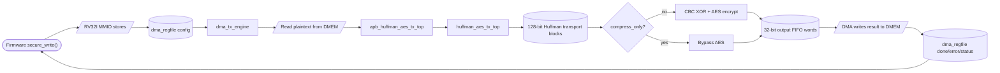
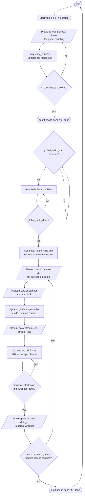
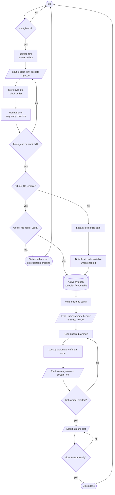
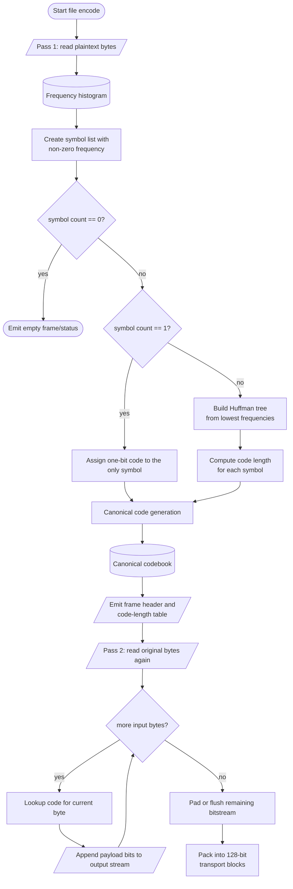
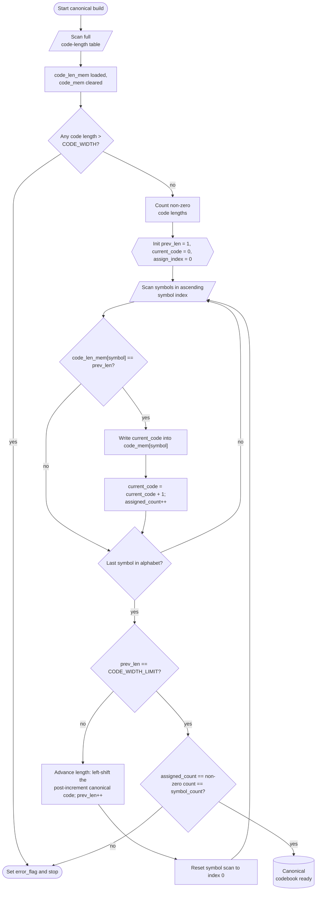
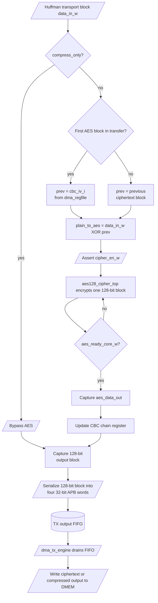
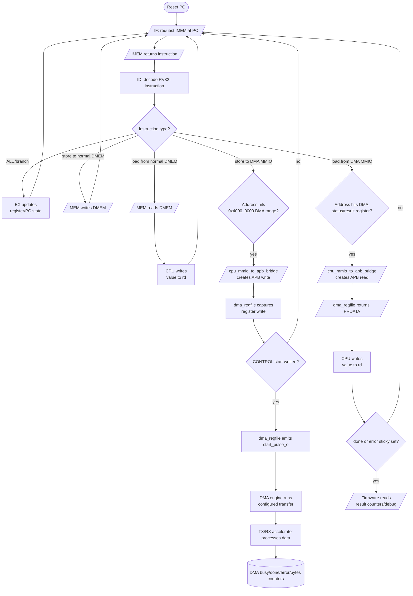
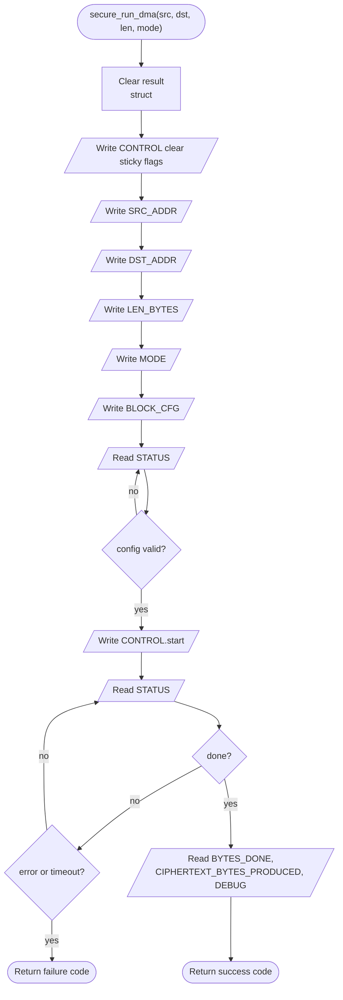

# Huffman, AES, And RISC-V DMA Flowchart Specification

Status: current RTL/software flowchart note for report drawing.

## 1. Purpose

Tai lieu nay gom cac flowchart can ve khi trinh bay TX secure-storage path:

- `huffman_aes_tx_top`
- `dynamic_huffman_encoder`
- canonical code generation va canonical codebook
- luong nen Huffman
- luong ma hoa AES-128-CBC
- RV32I doc instruction va cau hinh DMA bang software

Flowchart trong tai lieu nay bam theo implementation hien tai. Control plane dung
RV32I load/store MMIO, khong dung custom RISC-V instruction.

## 2. Source Files

| Area | Source |
|---|---|
| TX Huffman/AES core | `rtl/huffman_aes_tx_top.v` |
| Dynamic Huffman encoder | `rtl/dynamic_huffman_encoder.v` |
| Canonical code generator | `rtl/canonical_code_generator.v` |
| Huffman builder | `rtl/huffman_builder.v` |
| TX APB wrapper and CBC chaining | `rtl/apb_huffman_aes_tx_top.v` |
| RV32I pipeline | `rtl/top_rv32_sync.v` |
| MMIO to APB bridge | `rtl/cpu_mmio_to_apb_bridge.v` |
| DMA register file | `rtl/dma_regfile.v` |
| SoC wiring | `rtl/rv32_soc_top.v` |
| Firmware DMA helper | `testcase/secure_storage_fw.h` |

## 3. Flowchart Symbol Convention

Khi ve lai bang Word/PowerPoint, uu tien dung vai tro cua shape thay vi
chi dung hinh chu nhat va hinh thoi:

| Mermaid form | Meaning in this spec | Suggested Word flowchart shape |
|---|---|---|
| `(["..."])` | start, end, or externally visible phase completion | Terminator |
| `[/.../]` | firmware action, MMIO/APB transaction, DMEM read/write, stream I/O | Data / Input-Output |
| `["..."]` | internal transform or combinational/sequential processing step | Process |
| `[("...")]` | stored state, table, FIFO, register-file content, block buffer | Stored Data or Internal Storage |
| `{{"..."}}` | setup or initialization before the main step | Preparation |
| `{"..."}` | branch or control decision | Decision |

Main report intent:

- firmware, DMEM, and APB-visible transfers should look like I/O shapes;
- buffers, tables, and FIFOs should look like stored-data or internal-storage shapes;
- do not use the database cylinder just because something is "memory"; reserve it for
  a clearly modeled storage repository when that distinction helps;
- only real branch points should use diamonds;
- preparation hexagons should be reserved for setup/init steps, not generic state updates.

## 4. Overall TX Flow



## 5. Flowchart: `huffman_aes_tx_top`

`huffman_aes_tx_top` la TX datapath core ben trong `apb_huffman_aes_tx_top`.
Trong flow bao cao chinh, module nay xu ly plaintext theo chinh sach whole-file:
dem tan suat tren toan input, build global Huffman codebook, nen payload,
pack thanh block 128-bit, roi phat `cipher_en/data_in` cho parent wrapper.



Key notes:

- `tx_done` cua core bao giai doan TX core da xong; parent wrapper van phai
  drain AES/bypass output FIFO ve DMA.
- Whole-file flow duoc ve theo 3 pha co dinh: count bytes, build global
  codebook, roi emit compressed data.
- `data_in` la Huffman transport block 128-bit; AES-CBC XOR nam o parent
  `apb_huffman_aes_tx_top`, khong nam trong `huffman_aes_tx_top`.

## 6. Flowchart: `dynamic_huffman_encoder`

`dynamic_huffman_encoder` gom ba khoi chinh:

- `control_fsm`: dieu phoi collect/build/emit
- `input_collect_unit`: nhan byte va luu block buffer
- `emit_backend`: phat header/table/payload Huffman ra stream bit chunks

Trong FPGA synthesis path hien tai, whole-file external codebook la path active.
Local per-block builder chi la legacy/non-synthesis fallback.



Important handshake points:

- `byte_ready` comes from collect capacity and FSM state.
- `stream_valid/stream_ready` protects the output bit-chunk stream.
- External codebook read addresses are generated by the encoder and served by
  the whole-file builder in `huffman_aes_tx_top`.
- In whole-file mode, `whole_file_table_valid` must already be high when
  collection finishes; otherwise `control_fsm` raises encoder error.

## 7. Flowchart: Huffman Compression

Day la algorithm-level flow dung de ve slide/report. No tuong ung voi whole-file
dynamic Huffman policy hien tai.



Mapping to RTL:

| Step | RTL block |
|---|---|
| Count frequencies | `frequency_counter` |
| Build tree/code lengths | `huffman_builder` |
| Build canonical codes/codebook | `canonical_code_generator` |
| Canonical lookup and emission | `dynamic_huffman_encoder.emit_backend` |
| 128-bit packing | `bit_packer_128` |

## 8. Flowchart: Canonical Code Generation And Canonical Codebook

Canonical stage nam giua `huffman_builder` va payload emit path. Trong RTL hien
tai, `canonical_code_generator` khong sort mot mang symbol cuc bo roi swap tung
cap. Thay vao do, no:

1. quet toan bo bang `code_len` cua alphabet 256 symbol;
2. copy code length hop le vao `code_len_mem`, dong thoi clear `code_mem`;
3. dem so symbol co `code_len != 0`;
4. voi moi do dai `prev_len = 1 .. CODE_WIDTH`, quet lai symbol theo thu tu
   tang dan cua chi so symbol;
5. moi symbol co do dai bang `prev_len` se duoc gan `current_code`, sau do
   `current_code` tang len 1;
6. khi chuyen sang do dai tiep theo, `current_code` duoc left-shift 1 bit.

Vi quet symbol theo thu tu tang dan cho tung do dai, canonical ordering duoc
tao ra ma khong can mot khoi sort rieng. Ket qua cuoi cung la canonical
codebook duoi dang:

- `symbol_count`
- `code_len_mem[symbol]`
- `code_mem[symbol]`

va trong whole-file TX path, bo bang nay duoc dua ra ngoai qua cac port:

- `external_symbol_count`
- `external_code_len_read_*`
- `external_code_read_*`

de `dynamic_huffman_encoder` lookup code cho payload byte.



Algorithm note for report text:

```text
for symbol in full_alphabet:
    code_len_mem[symbol] = src_code_len[symbol]
    code_mem[symbol] = 0
    if code_len_mem[symbol] != 0:
        nonzero_count++

current_code = 0
for current_len = 1 to CODE_WIDTH:
    for symbol in full_alphabet_in_ascending_order:
        if code_len_mem[symbol] == current_len:
            code_mem[symbol] = current_code
            current_code = current_code + 1
            assigned_count++
    if current_len != CODE_WIDTH:
        current_code = current_code << 1

check assigned_count == nonzero_count == symbol_count
```

RTL-specific notes:

- `symbol_read_addr/symbol_read_data` interface duoc giu lai de hop voi
  `huffman_builder`, nhung implementation canonical hien tai dua tren full
  `code_len` scan.
- `ST_SORT` van ton tai chu yeu cho compatibility/coverage, nhung synthesized
  path thuc te di tu `ST_LOAD` sang `ST_ASSIGN`.
- Flow nay tao canonical order theo `code length`, roi theo `symbol index`.

## 9. Flowchart: AES-128-CBC Encryption

AES-CBC encryption for TX nam trong `apb_huffman_aes_tx_top`. Huffman core chi
tao transport block; parent wrapper XOR voi IV/ciphertext truoc va cap block cho
`aes128_cipher_top`.



CBC contract:

- First block uses `cbc_iv_i`.
- Later blocks use the previous ciphertext block.
- Firmware writes IV words into `dma_regfile` before starting TX.
- RX must restore the same IV before AES-CBC decrypt.

## 10. Flowchart: RV32I Instruction Fetch And Software DMA Config

Software controls DMA with normal RV32I instructions:

- instruction fetch reads IMEM through `if_stage_sync`
- decode/execute computes addresses and values
- store instructions to DMA MMIO become APB writes through
  `cpu_mmio_to_apb_bridge`
- load instructions from DMA MMIO poll status/result registers



Firmware configuration order in `secure_run_dma()`:



## 11. Suggested Figure Set For Report

| Figure | Use |
|---|---|
| Overall TX Flow | High-level architecture slide |
| `huffman_aes_tx_top` Flowchart | RTL datapath explanation |
| `dynamic_huffman_encoder` Flowchart | Huffman encoder internal explanation |
| Canonical code generation/codebook Flow | Explain canonical table build between builder and payload emit |
| Huffman Compression Flow | Algorithm explanation |
| AES-128-CBC Encryption Flow | Security/encryption explanation |
| RV32I Instruction Fetch And DMA Config | Software-controlled accelerator explanation |
