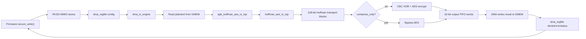
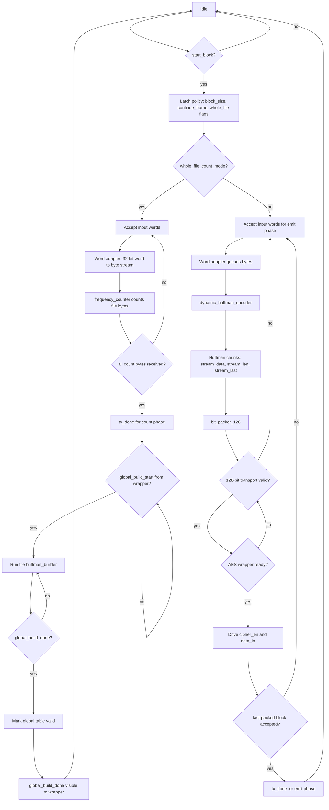
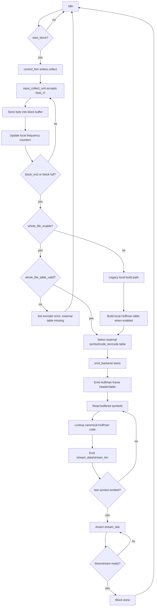
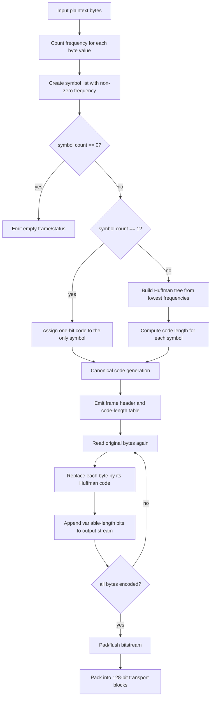
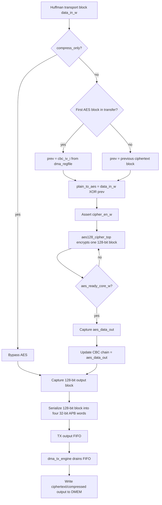
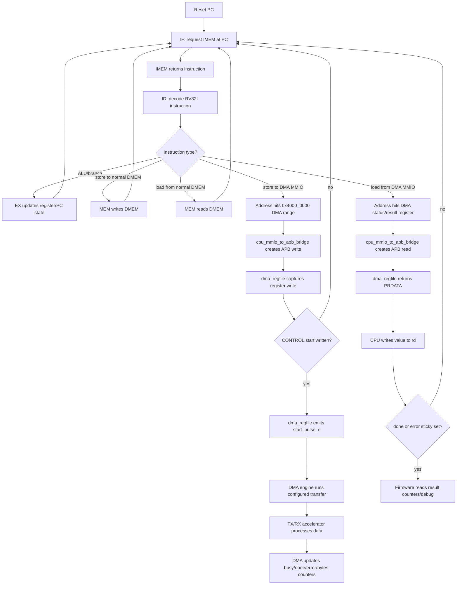
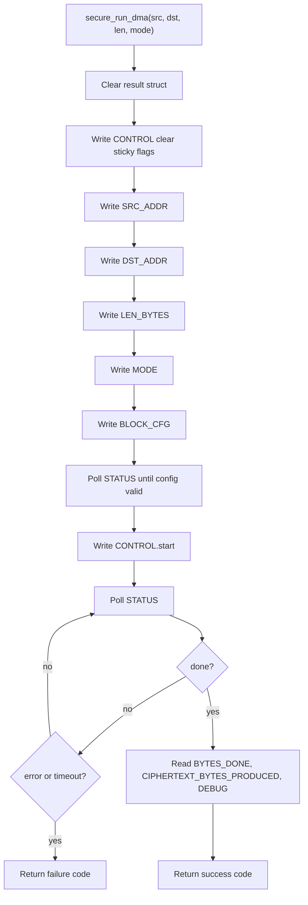

# Huffman, AES, And RISC-V DMA Flowchart Specification

Status: current RTL/software flowchart note for report drawing.

## 1. Purpose

Tai lieu nay gom cac flowchart can ve khi trinh bay TX secure-storage path:

- `huffman_aes_tx_top`
- `dynamic_huffman_encoder`
- luong nen Huffman
- luong ma hoa AES-128-CBC
- RV32I doc instruction va cau hinh DMA bang software

Flowchart trong tai lieu nay bam theo implementation hien tai. Control plane dung
RV32I load/store MMIO, khong dung custom RISC-V instruction.

## 2. Source Files

| Area | Source |
|---|---|
| TX Huffman/AES core | `rtl/huffman_aes_tx_top.v` |
| Dynamic Huffman encoder | `rtl/dynamic_huffman_encoder.v` |
| TX APB wrapper and CBC chaining | `rtl/apb_huffman_aes_tx_top.v` |
| RV32I pipeline | `rtl/top_rv32_sync.v` |
| MMIO to APB bridge | `rtl/cpu_mmio_to_apb_bridge.v` |
| DMA register file | `rtl/dma_regfile.v` |
| SoC wiring | `rtl/rv32_soc_top.v` |
| Firmware DMA helper | `testcase/secure_storage_fw.h` |

## 3. Overall TX Flow

## 4. Flowchart: `huffman_aes_tx_top`

`huffman_aes_tx_top` la TX datapath core ben trong `apb_huffman_aes_tx_top`.
Module nay nhan word 32-bit tu APB-side TX interface, chuyen thanh byte stream,
build hoac dung whole-file Huffman codebook, nen stream, pack thanh block 128-bit,
roi phat `cipher_en/data_in` cho parent wrapper.

Key notes:

- `tx_done` cua core bao giai doan TX core da xong; parent wrapper van phai
  drain AES/bypass output FIFO ve DMA.
- Whole-file flow co ba buoc control: count bytes, wrapper pulses
  `global_build_start` de build codebook, sau do emit compressed data.
- `data_in` la Huffman transport block 128-bit; AES-CBC XOR nam o parent
  `apb_huffman_aes_tx_top`, khong nam trong `huffman_aes_tx_top`.

## 5. Flowchart: `dynamic_huffman_encoder`

`dynamic_huffman_encoder` gom ba khoi chinh:

- `control_fsm`: dieu phoi collect/build/emit
- `input_collect_unit`: nhan byte va luu block buffer
- `emit_backend`: phat header/table/payload Huffman ra stream bit chunks

Trong FPGA synthesis path hien tai, whole-file external codebook la path active.
Local per-block builder chi la legacy/non-synthesis fallback.

Important handshake points:

- `byte_ready` comes from collect capacity and FSM state.
- `stream_valid/stream_ready` protects the output bit-chunk stream.
- External codebook read addresses are generated by the encoder and served by
  the whole-file builder in `huffman_aes_tx_top`.
- In whole-file mode, `whole_file_table_valid` must already be high when
  collection finishes; otherwise `control_fsm` raises encoder error.

## 6. Flowchart: Huffman Compression

Day la algorithm-level flow dung de ve slide/report. No tuong ung voi whole-file
dynamic Huffman policy hien tai.

Mapping to RTL:

| Step | RTL block |
|---|---|
| Count frequencies | `frequency_counter` |
| Build tree/code lengths | `huffman_builder` |
| Canonical lookup and emission | `dynamic_huffman_encoder.emit_backend` |
| 128-bit packing | `bit_packer_128` |

## 7. Flowchart: AES-128-CBC Encryption

AES-CBC encryption for TX nam trong `apb_huffman_aes_tx_top`. Huffman core chi
tao transport block; parent wrapper XOR voi IV/ciphertext truoc va cap block cho
`aes128_cipher_top`.

CBC contract:

- First block uses `cbc_iv_i`.
- Later blocks use the previous ciphertext block.
- Firmware writes IV words into `dma_regfile` before starting TX.
- RX must restore the same IV before AES-CBC decrypt.

## 8. Flowchart: RV32I Instruction Fetch And Software DMA Config

Software controls DMA with normal RV32I instructions:

- instruction fetch reads IMEM through `if_stage_sync`
- decode/execute computes addresses and values
- store instructions to DMA MMIO become APB writes through
  `cpu_mmio_to_apb_bridge`
- load instructions from DMA MMIO poll status/result registers

Firmware configuration order in `secure_run_dma()`:

## 9. Suggested Figure Set For Report

| Figure | Use |
|---|---|
| Overall TX Flow | High-level architecture slide |
| `huffman_aes_tx_top` Flowchart | RTL datapath explanation |
| `dynamic_huffman_encoder` Flowchart | Huffman encoder internal explanation |
| Huffman Compression Flow | Algorithm explanation |
| AES-128-CBC Encryption Flow | Security/encryption explanation |
| RV32I Instruction Fetch And DMA Config | Software-controlled accelerator explanation |
