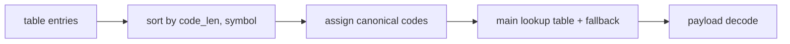

# Huffman Block Decoder Specification

## 1. Purpose

`huffman_block_decoder` nhan metadata/payload tu `huffman_block_parser`, phuc hoi
plaintext byte stream va dua byte sang `rx_byte_packer_32`.

Module nay khong biet AES hay DMA. No chi decode tung Huffman/raw block.

## 2. Supported Modes

| Mode | Decoder behavior |
|---|---|
| `RAW_FULL` | Emit 32 raw bytes |
| `RAW_PARTIAL` | Emit `block_size` raw bytes |
| `COMPRESSED` | Rebuild canonical table, decode payload bits |
| `ONE_SYMBOL` | Emit repeated `one_symbol_value` |

## 3. Canonical Huffman Flow

Compressed mode steps:

1. receive all `symbol + code_len` entries
2. check duplicate symbol and invalid length
3. sort entries
4. assign canonical codes
5. fill main decode table for short codes
6. keep fallback list for long codes
7. consume payload bits until `block_size` bytes are emitted

## 4. Main Table And Fallback

Decoder uses `HUFFMAN_DECODE_TABLE_IP` as main lookup table.

Current split:

- main table handles prefixes up to `MAIN_LOOKUP_BITS = 11`
- longer codes are handled by fallback scan

This keeps decode architecture general while moving the common lookup into BRAM.

## 5. Parser Handshake

Inputs from parser:

- `block_meta_valid`
- `entry_valid`
- `payload_window_valid`
- `parser_block_done`
- `parser_frame_done`

Outputs to parser:

- `block_meta_ready`
- `entry_ready`
- `payload_consume_valid`
- `payload_consume_len`
- `payload_block_done`

## 6. Byte Output Contract

Decoder outputs:

- `out_byte[7:0]`
- `out_valid`
- `out_last_in_block`
- `out_last_in_frame`
- `out_ready`

`out_last_in_frame` is only asserted on the last plaintext byte of the full
frame, not just the last block.

## 7. Error Conditions

Decoder can raise `error_flag` for:

- invalid metadata for selected mode
- duplicate compressed symbol
- invalid code length
- malformed canonical order
- fallback table overflow
- lookup miss
- payload ended before enough bytes were decoded
- no matching long-code fallback entry

## 8. Related Specs

- [RX path end-to-end](./rx_path_end_to_end_spec.md)
- [Huffman block parser](./huffman_block_parser_spec.md)
- [RX byte packer 32](./rx_byte_packer_32_spec.md)
