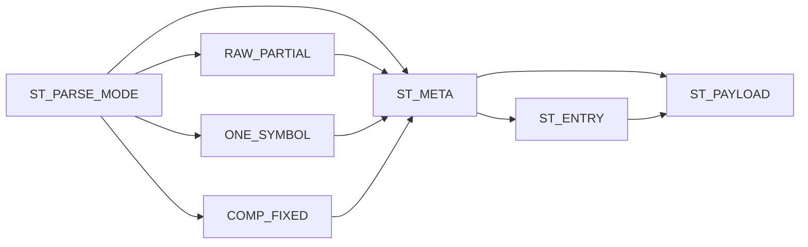

# Huffman Block Parser Specification

## 1. Purpose

`huffman_block_parser` nhan bit chunks tu `bit_depacker_128`, tach thanh metadata
block, table entry va payload window cho `huffman_block_decoder`.

Parser khong tu decode Huffman symbol. No chi parse format transport cua TX.

Current verification status:

| Case | Coverage/use |
|---|---|
| `dma_compress_aes_input1/input3/alnum63` | Normal parser path from real TX transport stream |
| `rx_parser_decoder_cov` | Legal raw/compressed/one-symbol parser branches |
| `rx_parser_decoder_error_direct_cov` | Invalid mode/size/table/payload parser branches |
| `rx_depacker_packer_direct_cov` | Parser receives malformed depacker output and reports error |

## 2. Position In RX Path

```text
bit_depacker_128
-> huffman_block_parser
-> huffman_block_decoder
```

## 3. Supported Block Modes

| Bits | Mode | Parser action |
|---:|---|---|
| `00` | `RAW_FULL` | Set block size 32, expose raw payload |
| `01` | `RAW_PARTIAL` | Parse 6-bit block size, expose raw payload |
| `10` | `COMPRESSED` | Parse 6-bit block size, 9-bit symbol count, table entries, payload |
| `11` | `ONE_SYMBOL` | Parse block size and repeated symbol |

## 4. Parser State Flow



## 5. Outputs To Decoder

| Output | Meaning |
|---|---|
| `block_meta_valid` | Metadata ready for decoder |
| `block_mode` | One of 4 block modes |
| `block_size` | Expected plaintext bytes in this block |
| `symbol_count` | Number of compressed table entries; `0` means reuse previous table, `1..256` means load table |
| `one_symbol_value` | Repeated byte for one-symbol mode |
| `entry_valid` | One `symbol + code_len` table entry valid |
| `entry_last` | Last compressed table entry |
| `payload_window_valid` | Payload bits available |
| `payload_window_len` | Number of valid payload bits visible |

## 6. Payload Handshake

Decoder consumes payload by asserting:

- `payload_consume_valid`
- `payload_consume_len`

Parser then shifts the consumed bits out of its buffer. For compressed mode,
parser lets decoder decide how many bits correspond to the matched code.

## 7. Frame Done

Parser asserts:

- `block_done` when the current block payload is fully consumed
- `frame_done` when the final chunk has been consumed and no bits remain

## 8. Validation

Parser validates:

- legal block mode
- legal block size for raw/one-symbol/compressed modes
- legal symbol value: any byte `0x00..0xFF`
- legal compressed code length
- table entry format

## 9. Related Specs

- [RX path end-to-end](./rx_path_end_to_end_spec.md)
- [Huffman block decoder](./huffman_block_decoder_spec.md)
- [Bit depacker 128](./bit_depacker_128_spec.md)
