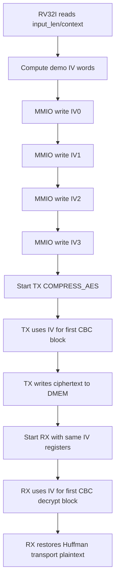

# IV Generation and CBC Contract Specification

## 1. Purpose

Tai lieu nay chot 3 diem cho he thong hien tai:

1. IV duoc tao o dau
2. CPU RV32I ghi IV xuong phan cung theo contract nao
3. TX/RX dung IV do trong AES-CBC theo cach nao

Spec nay mo ta **flow active hien tai trong repo**, khong mo ta cac huong cu
nhu ECB hay host-preprocess.

## 1.1 IV And CBC Flow Chart



## 2. Current Ownership

IV hien tai do **software RV32I** tao.

Phan cung hien tai:

- khong co TRNG
- khong tu sinh IV
- khong co key register runtime
- khong co mode register de chon ECB/CBC

Phan cung chi cung cap:

- `IV0` tai `0x4000_0028`
- `IV1` tai `0x4000_002C`
- `IV2` tai `0x4000_0030`
- `IV3` tai `0x4000_0034`

trong `dma_regfile`.

## 3. Register Contract

Bon thanh ghi 32-bit tao thanh IV 128-bit:

```text
cbc_iv = {IV3, IV2, IV1, IV0}
```

Rule:

- CPU phai ghi `IV0..IV3` truoc `CONTROL.start` khi dung `COMPRESS_AES`
- khong duoc ghi IV khi `STATUS.busy = 1`
- `CONTROL.soft_reset` xoa IV ve `0`
- RX phai dung lai dung cung IV da dung luc TX encrypt

`COMPRESS_ONLY` bypass AES, vi vay khong dung IV.

### 3.1 IV Register Function Table

| Register | Bits in `cbc_iv` | Writer | Consumer | Note |
|---|---:|---|---|---|
| `IV0` | `[31:0]` | RV32I software | TX/RX CBC logic | Least significant IV word; write before AES transfer start |
| `IV1` | `[63:32]` | RV32I software | TX/RX CBC logic | Part of same 128-bit IV snapshot |
| `IV2` | `[95:64]` | RV32I software | TX/RX CBC logic | Must match between TX encrypt and RX decrypt |
| `IV3` | `[127:96]` | RV32I software | TX/RX CBC logic | Most significant IV word |
| `STATUS.busy` | N/A | DMA regfile/engine | RV32I software | If `1`, software must not rewrite IV |
| `CONTROL.soft_reset` | N/A | RV32I software | DMA regfile | Clears IV registers to zero |

## 4. Current Software IV Generation

Implementation hien tai nam trong:

- [test_mmio_dma.c](/mnt/h/Academic/senior_project/DATN/work/luc/AES_huffman_all6/testcase/test_mmio_dma.c)

Ham dang duoc dung:

```c
static void write_demo_iv(uint32_t input_len);
```

IV hien tai la **demo deterministic IV**, duoc tao tu:

- `sw_iv_counter`
- `input_len`
- `SRC_BASE_ADDR`
- `TX_DST_BASE_ADDR`
- `RX_DST_BASE_ADDR`
- cac constant co dinh

No khong doc:

- timer MMIO
- cycle counter hardware
- host nonce
- TRNG

## 5. Detailed IV Generation Flow

### 5.1 Inputs

Software su dung:

- `sw_iv_counter` khoi tao `0x10203040`
- `input_len`
- `SRC_BASE_ADDR`
- `TX_DST_BASE_ADDR`
- `RX_DST_BASE_ADDR`

### 5.2 Step 1: increment software counter

```c
sw_iv_counter = sw_iv_counter + 1u;
```

Y nghia:

- moi lan goi ham, counter tang len
- tranh viec IV giong het nhau neu lap lai cung input trong cung mot session

### 5.3 Step 2: create initial mix

```c
mix = input_len ^ SRC_BASE_ADDR ^ TX_DST_BASE_ADDR ^ RX_DST_BASE_ADDR;
mix = mix ^ sw_iv_counter ^ 0x43424331u;
```

`0x43424331` la constant debug theo y nghia `"CBC1"`.

### 5.4 Step 3: whitening by shift-xor

```c
mix = mix ^ (mix << 13);
mix = mix ^ (mix >> 17);
mix = mix ^ (mix << 5);
```

Muc dich:

- phan tan bit
- tranh output chi la XOR tho giua vai field input

### 5.5 Step 4: derive IV words

```c
DMA_IV0 = 0x43424331u;
DMA_IV1 = mix ^ 0x3a5c742eu;
DMA_IV2 = rotl32(DMA_IV1 ^ 0x9e3779b9u, 7u);
DMA_IV3 = rotl32(DMA_IV2 + 0x3c6ef372u, 17u);
```

Trong do:

```c
rotl32(x, sh) = (x << sh) | (x >> (32 - sh))
```

### 5.6 Step 5: MMIO writes

CPU ghi xuong:

```text
0x40000028 <- IV0
0x4000002C <- IV1
0x40000030 <- IV2
0x40000034 <- IV3
```

## 6. RV32I Instruction-Level View

IV hien tai duoc CPU tinh bang instruction RV32I thuong:

- `lw`
- `sw`
- `add` / `addi`
- `xor`
- `slli`
- `srli`
- `or`

Khong can:

- `mul`
- CSR counter
- timer instruction dac biet

Pseudo-assembly muc cao:

```text
lw    t0, sw_iv_counter
addi  t0, t0, 1
sw    t0, sw_iv_counter

li    t1, input_len
li    t2, SRC_BASE_ADDR
xor   t1, t1, t2
li    t2, TX_DST_BASE_ADDR
xor   t1, t1, t2
li    t2, RX_DST_BASE_ADDR
xor   t1, t1, t2
xor   t1, t1, t0
li    t2, 0x43424331
xor   t1, t1, t2

slli  t2, t1, 13
xor   t1, t1, t2
srli  t2, t1, 17
xor   t1, t1, t2
slli  t2, t1, 5
xor   t1, t1, t2

sw    iv0, DMA_IV0
sw    iv1, DMA_IV1
sw    iv2, DMA_IV2
sw    iv3, DMA_IV3
```

## 7. CBC Use In TX

TX top nhan:

- `cbc_iv_i = {IV3, IV2, IV1, IV0}`

Contract hien tai:

```text
C0 = AES_encrypt(P0 XOR IV)
Cn = AES_encrypt(Pn XOR Cn-1)
```

Trong implementation:

- word plaintext transport dau tien XOR voi `cbc_iv_i`
- cac word sau XOR voi ciphertext word truoc
- chain reset khi reset, soft reset, hoac clear pipeline

File RTL lien quan:

- [apb_huffman_aes_tx_top.v](/mnt/h/Academic/senior_project/DATN/work/luc/AES_huffman_all6/rtl/apb_huffman_aes_tx_top.v)

## 8. CBC Use In RX

RX top nhan cung `cbc_iv_i`.

Contract hien tai:

```text
P0 = AES_decrypt(C0) XOR IV
Pn = AES_decrypt(Cn) XOR Cn-1
```

Trong implementation:

- RX giu lai ciphertext block truoc
- output cua `aes128_cipher_inv_top` duoc XOR voi previous ciphertext
- block dau tien XOR voi `cbc_iv_i`

File RTL lien quan:

- [apb_huffman_aes_rx_top.v](/mnt/h/Academic/senior_project/DATN/work/luc/AES_huffman_all6/rtl/apb_huffman_aes_rx_top.v)

## 9. Current Security Status

IV hien tai:

- do RV32I tao
- co thay doi theo software counter va input context
- phu hop de simulation lap lai va debug
- **khong** duoc xem la IV entropy manh cho san pham that

Ly do:

- khong co nguon random that
- khong co timer/cycle counter hardware trong cong thuc hien tai
- input/context co the doan duoc

## 10. Current Source Of Truth

Neu can biet thiet ke hien tai dang lam gi, uu tien cac file sau:

1. [00_current_system_spec.md](/mnt/h/Academic/senior_project/DATN/work/luc/AES_huffman_all6/docs/00_current_system_spec.md)
2. [memory_map_dma_software_contract.md](/mnt/h/Academic/senior_project/DATN/work/luc/AES_huffman_all6/docs/memory_map_dma_software_contract.md)
3. [dma_riscv_instruction_programming_spec.md](/mnt/h/Academic/senior_project/DATN/work/luc/AES_huffman_all6/docs/dma_riscv_instruction_programming_spec.md)
4. [test_mmio_dma.c](/mnt/h/Academic/senior_project/DATN/work/luc/AES_huffman_all6/testcase/test_mmio_dma.c)

## 11. Recommended Next Revision

Neu can nang cap IV sau nay, thu tu hop ly la:

1. demo FPGA:
   - RV32I doc them timer/counter MMIO roi tron vao IV
2. board demo co host:
   - host gui nonce moi cho moi message
3. secure mode:
   - bo sung TRNG hoac PRNG co seed/entropy phu hop

Nhung cac huong tren hien **chua** nam trong implementation active.
