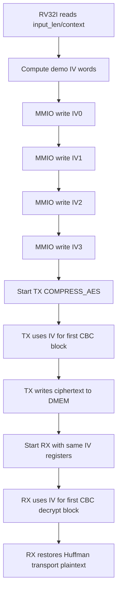

# IV Generation and CBC Contract Specification

## 1. Mục đích

Tài liệu này chot 3 diem cho hệ thống hiện tại:

1. IV được tạo o đầu
2. CPU RV32I ghi IV xuong phần cứng theo contract nào
3. TX/RX dung IV do trong AES-CBC theo cach nào

Spec này mô tả **flow active hiện tại trong repo**, không mô tả các hướng cũ
như ECB hay host-preprocess.

Trạng thái kiểm chứng hiện tại:

| Case | Coverage/use |
|---|---|
| `dma_compress_aes_input1/input3/alnum63` | RV32I writes IV, TX encrypts with CBC, RX decrypts with the same IV |
| `tx_compress_aes_block_input3` | TX-only AES-CBC path with software-provided IV |
| `mmio_regfile_basic` | CPU read/write coverage for `IV0..IV3` registers |
| `mmio_regfile_negative` | Invalid MMIO/error behavior around DMA config path |
| Full coverage regression | Included in `34/34` PASS baseline |

## 1.1 IV And CBC Flow Chart



## 2. Current Ownership

IV hiện tại do **software RV32I** tạo.

Phần cứng hiện tại:

- không có TRNG
- không tu sinh IV
- không có key register runtime
- không có mode register để chọn ECB/CBC

Phần cứng chỉ cung cấp:

- `IV0` tai `0x4000_0028`
- `IV1` tai `0x4000_002C`
- `IV2` tai `0x4000_0030`
- `IV3` tai `0x4000_0034`

trong `dma_regfile`.

## 3. Thanh ghi Contract

Bon thanh ghi 32-bit tạo thanh IV 128-bit:

```text
cbc_iv = {IV3, IV2, IV1, IV0}
```

Rule:

- CPU phải ghi `IV0..IV3` trước `CONTROL.start` khi dung `COMPRESS_AES`
- không được ghi IV khi `STATUS.busy = 1`
- `CONTROL.soft_reset` xoa IV ve `0`
- RX phải dùng lại dung cung IV da dung lúc TX encrypt

`COMPRESS_ONLY` bypass AES, vi vay không dùng IV.

### 3.1 IV Thanh ghi Chức năng Table

| Thanh ghi | Bits in `cbc_iv` | Bên ghi | Bên dùng | Ghi chú |
|---|---:|---|---|---|
| `IV0` | `[31:0]` | RV32I software | TX/RX CBC logic | Least significant IV word; write before AES transfer start |
| `IV1` | `[63:32]` | RV32I software | TX/RX CBC logic | Part of same 128-bit IV snapshot |
| `IV2` | `[95:64]` | RV32I software | TX/RX CBC logic | Must match between TX encrypt and RX decrypt |
| `IV3` | `[127:96]` | RV32I software | TX/RX CBC logic | Most significant IV word |
| `STATUS.busy` | N/A | DMA regfile/engine | RV32I software | If `1`, software must not rewrite IV |
| `CONTROL.soft_reset` | N/A | RV32I software | DMA regfile | Clears IV registers to zero |

## 4. Current Software IV Generation

Implementation hiện tại nằm trong:

- [test_mmio_dma.c](/mnt/h/Academic/senior_project/DATN/work/lúc/AES_huffman_all6/testcase/test_mmio_dma.c)

Ham dang được dùng:

```c
static void write_demo_iv(uint32_t input_len);
```

IV hiện tại là **demo deterministic IV**, được tạo tu:

- `sw_iv_counter`
- `input_len`
- `SRC_BASE_ADDR`
- `TX_DST_BASE_ADDR`
- `RX_DST_BASE_ADDR`
- các constant cố định

No không đọc:

- timer MMIO
- cycle counter hardware
- host nonce
- TRNG

## 5. Detailed IV Generation Flow

### 5.1 Inputs

Software sử dụng:

- `sw_iv_counter` khoi tạo `0x10203040`
- `input_len`
- `SRC_BASE_ADDR`
- `TX_DST_BASE_ADDR`
- `RX_DST_BASE_ADDR`

### 5.2 Step 1: increment software counter

```c
sw_iv_counter = sw_iv_counter + 1u;
```

Ý nghĩa:

- mới lần goi ham, counter tăng len
- tránh việc IV giong het nhau nếu lặp lại cung input trong cùng một session

### 5.3 Step 2: create initial mix

```c
mix = input_len ^ SRC_BASE_ADDR ^ TX_DST_BASE_ADDR ^ RX_DST_BASE_ADDR;
mix = mix ^ sw_iv_counter ^ 0x43424331u;
```

`0x43424331` là constant debug theo ý nghĩa `"CBC1"`.

### 5.4 Step 3: whitening by shift-xor

```c
mix = mix ^ (mix << 13);
mix = mix ^ (mix >> 17);
mix = mix ^ (mix << 5);
```

Mục đích:

- phan tan bit
- tránh output chỉ là XOR tho giua vai field input

### 5.5 Step 4: derive IV words

```c
DMA_IV0 = 0x43424331u;
DMA_IV1 = mix ^ 0x3a5c742eu;
DMA_IV2 = rotl32(DMA_IV1 ^ 0x9e3779b9u, 7u);
DMA_IV3 = rotl32(DMA_IV2 + 0x3c6ef372u, 17u);
```

Trong do:

```c
rotl32(x, sh) = (x << sh) | (x >> (32 - sh))
```

### 5.6 Step 5: MMIO writes

CPU ghi xuong:

```text
0x40000028 <- IV0
0x4000002C <- IV1
0x40000030 <- IV2
0x40000034 <- IV3
```

## 6. RV32I Instruction-Level View

IV hiện tại được CPU tính bằng instruction RV32I thuong:

- `lw`
- `sw`
- `add` / `addi`
- `xor`
- `slli`
- `srli`
- `or`

Không cần:

- `mul`
- CSR counter
- timer instruction dac biet

Pseudo-assembly muc cao:

```text
lw    t0, sw_iv_counter
addi  t0, t0, 1
sw    t0, sw_iv_counter

li    t1, input_len
li    t2, SRC_BASE_ADDR
xor   t1, t1, t2
li    t2, TX_DST_BASE_ADDR
xor   t1, t1, t2
li    t2, RX_DST_BASE_ADDR
xor   t1, t1, t2
xor   t1, t1, t0
li    t2, 0x43424331
xor   t1, t1, t2

slli  t2, t1, 13
xor   t1, t1, t2
srli  t2, t1, 17
xor   t1, t1, t2
slli  t2, t1, 5
xor   t1, t1, t2

sw    iv0, DMA_IV0
sw    iv1, DMA_IV1
sw    iv2, DMA_IV2
sw    iv3, DMA_IV3
```

## 7. CBC Use In TX

TX top nhận:

- `cbc_iv_i = {IV3, IV2, IV1, IV0}`

Contract hiện tại:

```text
C0 = AES_encrypt(P0 XOR IV)
Cn = AES_encrypt(Pn XOR Cn-1)
```

Trong implementation:

- word plaintext transport đầu tiên XOR với `cbc_iv_i`
- các word sau XOR với ciphertext word trước
- chain reset khi reset, soft reset, hoặc clear pipeline

File RTL lien quan:

- [apb_huffman_aes_tx_top.v](/mnt/h/Academic/senior_project/DATN/work/lúc/AES_huffman_all6/rtl/apb_huffman_aes_tx_top.v)

## 8. CBC Use In RX

RX top nhận cung `cbc_iv_i`.

Contract hiện tại:

```text
P0 = AES_decrypt(C0) XOR IV
Pn = AES_decrypt(Cn) XOR Cn-1
```

Trong implementation:

- RX giữ lại ciphertext block trước
- output của `aes128_cipher_inv_top` được XOR với previous ciphertext
- block đầu tiên XOR với `cbc_iv_i`

File RTL lien quan:

- [apb_huffman_aes_rx_top.v](/mnt/h/Academic/senior_project/DATN/work/lúc/AES_huffman_all6/rtl/apb_huffman_aes_rx_top.v)

## 9. Current Security Trạng thái

IV hiện tại:

- do RV32I tạo
- có thay đổi theo software counter và input context
- phụ hop để simulation lặp lại và debug
- **không** được xem là IV entropy manh cho san pham that

Lý do:

- không có nguồn random that
- không có timer/cycle counter hardware trong cổng thuc hiện tại
- input/context có thể doan được

## 10. Current Source Of Truth

Nếu cần biết thiết kế hiện tại dang làm gi, ưu tiên các file sau:

1. [00_current_system_spec.md](/mnt/h/Academic/senior_project/DATN/work/lúc/AES_huffman_all6/docs/00_current_system_spec.md)
2. [memory_map_dma_software_contract.md](/mnt/h/Academic/senior_project/DATN/work/lúc/AES_huffman_all6/docs/memory_map_dma_software_contract.md)
3. [dma_riscv_instruction_programming_spec.md](/mnt/h/Academic/senior_project/DATN/work/lúc/AES_huffman_all6/docs/dma_riscv_instruction_programming_spec.md)
4. [test_mmio_dma.c](/mnt/h/Academic/senior_project/DATN/work/lúc/AES_huffman_all6/testcase/test_mmio_dma.c)

## 11. Recommended Next Revision

Nếu cần nang cap IV sau này, thứ tự hop ly là:

1. demo FPGA:
   - RV32I đọc thêm timer/counter MMIO rồi tron vao IV
2. board demo có host:
   - host gửi nonce mới cho mới message
3. secure mode:
   - bo sung TRNG hoặc PRNG có seed/entropy phụ hop

Nhưng các hướng trên hien **chưa** nằm trong implementation active.
