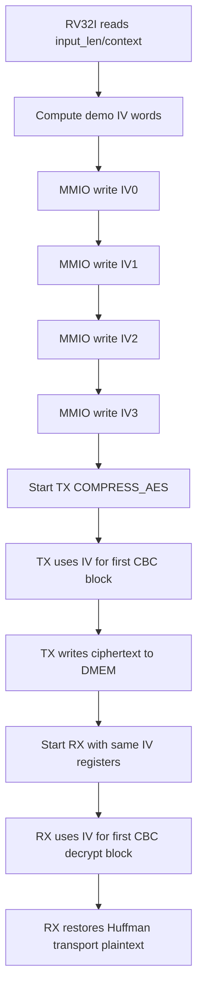

# IV Generation and CBC Contract Specification

## 1. Purpose

This document gives 3 points for the current system:

1. IV is created at the beginning
2. CPU RV32I writes IV to hardware according to which contract?
3. How din TX/RX use IV in AES-CBC?

This spec describes the current **active flow in the repo**, not old directions
like ECB or host-preprocess.

Current verification status:

| Case | Coverage/use |
|---|---|
| `dma_compress_aes_input1/input3/alnum63` | RV32I writes IV, TX encrypts with CBC, RX decrypts with the same IV |
| `tx_compress_aes_block_input3` | TX-only AES-CBC path with software-provided IV |
| `mmio_regfile_basic` | CPU read/write coverage for `IV0..IV3` registers |
| `mmio_regfile_negative` | Invalid MMIO/error behavior around DMA config path |
| Full coverage regression | Included in `34/34` PASS baseline |

## 1.1 IV And CBC Flow Chart



## 2. Current Ownership

The current IV is created by **software RV32I**.

Current hardware:

- no TRNG
- not practicing IV
- There is no key register runtime
- There is no mode register to select ECB/CBC

Hardware only provides:

- `IV0` download `0x4000_0028`
- `IV1` download `0x4000_002C`
- `IV2` download `0x4000_0030`
- `IV3` download `0x4000_0034`

in `dma_regfile`.

## 3. Register Contract

Four 32-bit registers create 128-bit IV:

```text
cbc_iv = {IV3, IV2, IV1, IV0}
```

Rule:

- CPU must write `IV0..IV3` before `CONTROL.start` when using `COMPRESS_AES`
- Do not write IV when `STATUS.busy = 1`
- `CONTROL.soft_reset` delete IV to `0`
- The RX must reuse the same IV port used when the TX encrypts

`COMPRESS_ONLY` bypass AES, do not use IV.

### 3.1 IV Register Function Table

| Register | Bits in `cbc_iv` | Register side | User side | Note |
|---|---:|---|---|---|
| `IV0` | `[31:0]` | RV32I software | TX/RX CBC logic | Least significant IV word; write before AES transfer start |
| `IV1` | `[63:32]` | RV32I software | TX/RX CBC logic | Part of same 128-bit IV snapshot |
| `IV2` | `[95:64]` | RV32I software | TX/RX CBC logic | Must match between TX encrypt and RX decrypt |
| `IV3` | `[127:96]` | RV32I software | TX/RX CBC logic | Most significant IV word |
| `STATUS.busy` | N/A | DMA regfile/engine | RV32I software | If `1`, software must not rewrite IV |
| `CONTROL.soft_reset` | N/A | RV32I software | DMA regfile | Clears IV registers to zero |

## 4. Current Software IV Generation

Current implementation is in:

- [test_mmio_dma.c](/mnt/h/Academic/senior_project/DATN/work/luc/AES_huffman_all6/testcase/test_mmio_dma.c)

The function currently used is:

```c
static void write_demo_iv(uint32_t input_len);
```

The current IV is **demo deterministic IV**, created from:

- `sw_iv_counter`
- `input_len`
- `SRC_BASE_ADDR`
- `TX_DST_BASE_ADDR`
- `RX_DST_BASE_ADDR`
- fixed constants

It does not read:

- timer MMIO
- cycle counter hardware
- host nonce
- TRNG

## 5. Detailed IV Generation Flow

### 5.1 Inputs

Software used:

- `sw_iv_counter` initializes `0x10203040`
- `input_len`
- `SRC_BASE_ADDR`
- `TX_DST_BASE_ADDR`
- `RX_DST_BASE_ADDR`

### 5.2 Step 1: increment software counter

```c
sw_iv_counter = sw_iv_counter + 1u;
```

Meaning:

- The first time I called ham, the counter increased
- Avoid having identical IVs if the input arc is repeated in the same session

### 5.3 Step 2: create initial mix

```c
mix = input_len ^ SRC_BASE_ADDR ^ TX_DST_BASE_ADDR ^ RX_DST_BASE_ADDR;
mix = mix ^ sw_iv_counter ^ 0x43424331u;
```

`0x43424331` is a debug constant in the sense of `"CBC1"`.

### 5.4 Step 3: whitening by shift-xor

```c
mix = mix ^ (mix << 13);
mix = mix ^ (mix >> 17);
mix = mix ^ (mix << 5);
```

Purpose:

- bit dissolving
- avoid output being just an XOR between the input fields

### 5.5 Step 4: derive IV words

```c
DMA_IV0 = 0x43424331u;
DMA_IV1 = mix ^ 0x3a5c742eu;
DMA_IV2 = rotl32(DMA_IV1 ^ 0x9e3779b9u, 7u);
DMA_IV3 = rotl32(DMA_IV2 + 0x3c6ef372u, 17u);
```

In due:

```c
rotl32(x, sh) = (x << sh) | (x >> (32 - sh))
```

### 5.6 Step 5: MMIO writes

CPU writes down:

```text
0x40000028 <- IV0
0x4000002C <- IV1
0x40000030 <- IV2
0x40000034 <- IV3
```

## 6. RV32I Instruction-Level View

The current IV is calculated by the CPU using the usual RV32I instruction:

- `lw`
- `sw`
- `add` / `addi`
- `xor`
- `slli`
- `srli`
- `or`

It needs:

- `mul`
- CSR counter
- timer instruction is very special

Pseudo-assembly high level:

```text
lw    t0, sw_iv_counter
addi  t0, t0, 1
sw    t0, sw_iv_counter

li    t1, input_len
li    t2, SRC_BASE_ADDR
xor   t1, t1, t2
li    t2, TX_DST_BASE_ADDR
xor   t1, t1, t2
li    t2, RX_DST_BASE_ADDR
xor   t1, t1, t2
xor   t1, t1, t0
li    t2, 0x43424331
xor   t1, t1, t2

slli  t2, t1, 13
xor   t1, t1, t2
srli  t2, t1, 17
xor   t1, t1, t2
slli  t2, t1, 5
xor   t1, t1, t2

sw    iv0, DMA_IV0
sw    iv1, DMA_IV1
sw    iv2, DMA_IV2
sw    iv3, DMA_IV3
```

## 7. CBC Use In TX

TX top receive:

- `cbc_iv_i = {IV3, IV2, IV1, IV0}`

Current Contract:

```text
C0 = AES_encrypt(P0 XOR IV)
Cn = AES_encrypt(Pn XOR Cn-1)
```

In implementation:

- word plaintext transport first XOR with `cbc_iv_i`
- XOR the following words with the previous ciphertext word
- chain resets on reset, soft reset, or clear pipeline

Related RTL files:

- [apb_huffman_aes_tx_top.v](/mnt/h/Academic/senior_project/DATN/work/luc/AES_huffman_all6/rtl/apb_huffman_aes_tx_top.v)

## 8. CBC Use In RX

RX top receives supply `cbc_iv_i`.

Current Contract:

```text
P0 = AES_decrypt(C0) XOR IV
Pn = AES_decrypt(Cn) XOR Cn-1
```

In implementation:

- RX retains the previous ciphertext block
- The output of `aes128_cipher_inv_top` is XORed with the previous ciphertext
- The first block is XORed with `cbc_iv_i`

Related RTL files:

- [apb_huffman_aes_rx_top.v](/mnt/h/Academic/senior_project/DATN/work/luc/AES_huffman_all6/rtl/apb_huffman_aes_rx_top.v)

## 9. Current Security Status

Current IV:

- created by RV32I
- varies according to software counter and input context
- sub-hop for repeated simulation and debugging
- **not** considered a strong IV entropy for that product

Reason:

- There is no random source that
- There is no timer/cycle counter hardware in the current port
- input/context is editable

## 10. Current Source Of Truth

If you need to know what the current design is doing, prioritize the following files:

1. [00_current_system_spec.md](/mnt/h/Academic/senior_project/DATN/work/luc/AES_huffman_all6/docs/00_current_system_spec.md)
2. [memory_map_dma_software_contract.md](/mnt/h/Academic/senior_project/DATN/work/luc/AES_huffman_all6/docs/memory_map_dma_software_contract.md)
3. [dma_riscv_instruction_programming_spec.md](/mnt/h/Academic/senior_project/DATN/work/luc/AES_huffman_all6/docs/dma_riscv_instruction_programming_spec.md)
4. [test_mmio_dma.c](/mnt/h/Academic/senior_project/DATN/work/luc/AES_huffman_all6/testcase/test_mmio_dma.c)

## 11. Recommended Next Revision

If IV capsules are needed later, the order of administration is:

1. demo FPGA:
   - RV32I reads the MMIO timer/counter and then enters IV
2. demo board with host:
   - host sends new nonce for new message
3. secure mode:
   - Additional TRNG or PRNG with additional seed/entropy

But the above directions are currently **not** in the active implementation.
