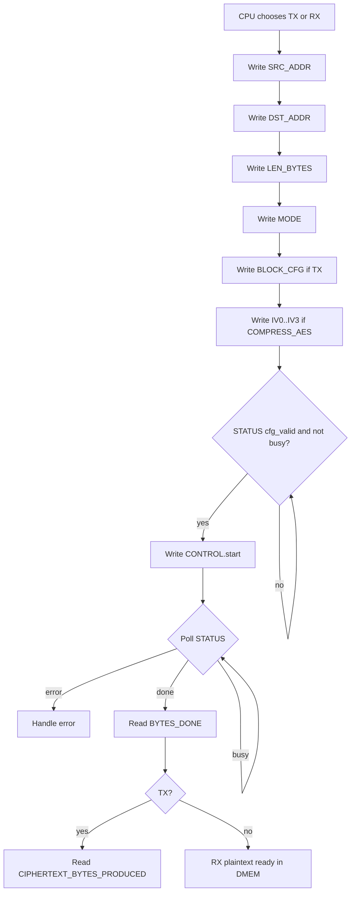

# 07. Memory Map and DMA Software Contract

## 1. Purpose

Tai lieu nay chot 2 thu:

1. memory map toi thieu cua SoC hien tai
2. contract phan mem khi CPU cau hinh va poll DMA

Spec nay dua tren code hien tai trong repo, sau khi loopback:

- `DMEM -> DMA TX -> TX -> DMEM`
- `DMEM -> DMA RX -> RX -> DMEM`

da pass simulation.

Regression baseline hien tai:

| Metric | Value |
|---|---:|
| Active testcase count | 34 |
| Passed testcase count | 34 |
| Raw DUT full `bcesft` | 93.52% |
| Raw DUT branch+statement | 95.27% |
| Closed DUT coverage | 95.90% |

## 1.1 Software Contract Flow Chart



## 2. System memory map

### 2.1 Global map

| Region | Base | End | Owner / meaning |
|---|---|---|---|
| `DMEM` | `0x0000_0000` | `0x0000_7FFF` | Data memory, CPU Port A, DMA Port B |
| `DMA MMIO` | `0x4000_0000` | `0x4000_00FF` | `dma_regfile` qua `cpu_mmio_to_apb_bridge` |

### 2.2 Current policy

- CPU hien chi duoc MMIO truc tiep vao `DMA MMIO`
- CPU khong truy cap truc tiep `TX` hay `RX` qua APB trong flow chinh
- `TX` va `RX` duoc dieu khien boi `dma_tx_engine` va `dma_rx_engine`

## 3. DMEM address usage

### 3.1 Address format

- Tieng dia chi cua he thong la **byte address**
- DMA va CPU deu ghi/dung byte address
- Current DMA engines require `SRC_ADDR` va `DST_ADDR` canh `4-byte`

### 3.2 Ownership

| Port | Owner |
|---|---|
| Port A | CPU |
| Port B | DMA engine dang active |

### 3.3 Software rule

Khi `DMA busy = 1`, software khong duoc:

- ghi de vao source buffer dang duoc DMA doc
- doc/ghi destination buffer dang duoc DMA ghi

Neu vi pham, phan cung van co the hoat dong, nhung semantics o muc he thong khong duoc dam bao.

### 3.4 Software storage table convention

Multi-record storage is managed by RV32I software in DMEM, not by a separate
RTL file system. Current testcase convention:

| Address | Name | Meaning |
|---:|---|---|
| `0x0000_0040` | `INPUT_LEN_ADDR` | Length of primary input loaded by TB/UART |
| `0x0000_0044` | `INPUT2_LEN_ADDR` | Length of secondary input for storage-table testcase |
| `0x0000_0100` | `STORAGE_TABLE_BASE` | Software metadata table |
| `0x0000_2000` | `SRC_BASE_ADDR` | Primary plaintext source |
| `0x0000_3000` | `SRC2_BASE_ADDR` | Secondary plaintext source |
| `0x0000_4000` | `TX_DST_BASE_ADDR` | Primary ciphertext/transport output |
| `0x0000_5000` | `TX2_DST_BASE_ADDR` | Secondary ciphertext/transport output |
| `0x0000_6000` | `RX_DST_BASE_ADDR` | Plaintext restore output |

Record fields are software-defined:

| Field | Required use |
|---|---|
| `valid` | record exists |
| `file_id` | key selected by user/software |
| `plain_len` | restored plaintext length expectation |
| `cipher_addr` | DMEM address to feed RX `SRC_ADDR` |
| `cipher_len` | value to feed RX `LEN_BYTES` |
| `mode` | original TX policy |
| `iv0..iv3` | IV words to rewrite before RX |

Hardware contract stays simple: CPU reads metadata from DMEM and writes
selected values into `dma_regfile`.

## 4. DMA MMIO register map

Base address:

- `DMA_BASE = 0x4000_0000`

| Offset | Name | Access | Meaning |
|---|---|---|---|
| `0x00` | `CONTROL` | W | `start`, `soft_reset`, `clear_done`, `clear_error` |
| `0x04` | `STATUS` | R | `busy`, `done_sticky`, `error_sticky`, `cfg_valid`, `direction` |
| `0x08` | `SRC_ADDR` | R/W | Byte address source trong `DMEM` |
| `0x0C` | `DST_ADDR` | R/W | Byte address destination trong `DMEM` |
| `0x10` | `LEN_BYTES` | R/W | So byte engine se xu ly |
| `0x14` | `MODE` | R/W | `direction[1:0]`, `compress_only[2]`, `whole_file[3]` |
| `0x18` | `BLOCK_CFG` | R/W | Kich thuoc block, don vi byte |
| `0x1C` | `BYTES_DONE` | R | So byte da xu ly theo mode hien tai |
| `0x20` | `DEBUG` | R | `engine_state`, `last_error_code` |
| `0x24` | `CIPHERTEXT_BYTES_PRODUCED` | R | So ciphertext byte cua lan TX gan nhat |
| `0x28` | `IV0` | R/W | CBC IV bits `[31:0]` |
| `0x2C` | `IV1` | R/W | CBC IV bits `[63:32]` |
| `0x30` | `IV2` | R/W | CBC IV bits `[95:64]` |
| `0x34` | `IV3` | R/W | CBC IV bits `[127:96]` |

## 4.1 DMA Register Function Summary

| Register | Software purpose | Required timing | Result / side effect |
|---|---|---|---|
| `CONTROL` | Launch transfer or clear sticky state | Write after all config registers are valid | `start` creates a pulse; invalid start returns APB error and does not launch DMA |
| `STATUS` | Poll transfer state | Read before/after `CONTROL.start` | `busy` gates reconfiguration; `done_sticky/error_sticky` terminate polling loop |
| `SRC_ADDR` | Select input buffer in DMEM | Write before `CONTROL.start` | DMA reads from this address |
| `DST_ADDR` | Select output buffer in DMEM | Write before `CONTROL.start` | DMA writes to this address |
| `LEN_BYTES` | Declare input length for selected mode | Write before `CONTROL.start` | TX consumes plaintext length; RX consumes ciphertext/transport length |
| `MODE` | Select `TX`, `RX`, `COMPRESS_ONLY`, `whole_file` | Write before `CONTROL.start` | Controls which DMA engine is started and how TX formats output |
| `BLOCK_CFG` | Set TX block size | Write before TX start | Current recommended value is `32`; ignored by RX |
| `BYTES_DONE` | Read produced byte count | Read after `done_sticky=1` | TX = transport bytes written; RX = plaintext bytes written |
| `DEBUG` | Inspect state/error during debug | Read any time | Not part of normal pass/fail software contract |
| `CIPHERTEXT_BYTES_PRODUCED` | Get TX output length for RX | Read after TX done | Software writes this value to RX `LEN_BYTES` |
| `IV0..IV3` | Supply AES-CBC IV | Write before AES TX/RX start | RX must use same IV as corresponding TX |

Current absence:

- no AES mode register
- no key register

`COMPRESS_AES` currently uses AES-128 CBC with fixed key material in RTL and
the CPU-written IV registers. `COMPRESS_ONLY` bypasses AES/CBC.

## 5. Register semantics

### 5.1 `CONTROL` at `0x00`

| Bit | Name | Type | Meaning |
|---:|---|---|---|
| 0 | `start` | W1P | Bat dau 1 transfer moi |
| 1 | `soft_reset` | W1P | Reset DMA state machine va sticky state |
| 2 | `clear_done` | W1P | Xoa `done_sticky` |
| 3 | `clear_error` | W1P | Xoa `error_sticky` |

Rule:

- `start` chi hop le khi `cfg_valid = 1` va `busy = 0`
- ghi reserved bit khac `0` phai coi la invalid

### 5.2 `STATUS` at `0x04`

| Bit | Name | Meaning |
|---:|---|---|
| 0 | `busy` | DMA engine dang chay |
| 1 | `done_sticky` | Transfer gan nhat da ket thuc |
| 2 | `error_sticky` | Transfer gan nhat bi loi |
| 3 | `cfg_valid` | Cau hinh hien tai hop le |
| 5:4 | `direction` | Mirror cua `MODE.direction` |
| 6 | `compress_only` | Mirror cua `MODE.compress_only` |
| 7 | `whole_file` | Mirror cua `MODE.whole_file` |
| 31:8 | reserved | Doc `0` |

### 5.3 `SRC_ADDR` / `DST_ADDR`

- La byte address
- Phai canh `4-byte`
- software phai tu dam bao vung nho hop le trong `DMEM`

### 5.4 `LEN_BYTES`

Semantics cua `LEN_BYTES` phu thuoc vao `MODE`:

- `MODE = 0x1`, `0x5`, `0x9`, hoac `0xD`: `LEN_BYTES` = plaintext bytes can doc tu `SRC_ADDR`
- `MODE = 0x2`: `LEN_BYTES` = ciphertext bytes can doc tu `SRC_ADDR`

Day la contract quan trong nhat cua he thong hien tai.

### 5.5 `MODE`

| Value | Meaning |
|---:|---|
| `0x1` | TX mode, `COMPRESS_AES` |
| `0x5` | TX mode, `COMPRESS_ONLY` per-block legacy |
| `0xD` | TX mode, `COMPRESS_ONLY + whole_file` default TX-only benchmark |
| `0x9` | TX mode, `COMPRESS_AES` + whole-file dynamic Huffman |
| `0x2` | RX mode |

Gia tri khac coi la invalid config.

`MODE` does not select ECB/CBC. AES mode is fixed to CBC for `COMPRESS_AES`.
`COMPRESS_ONLY` bypasses AES and therefore does not consume `IV0..IV3`.

### 5.6 `BLOCK_CFG`

- Gia tri hop le hien tai: `1..32`
- Khuyen nghi dung `16` hoac `32`
- Trong mode `whole_file`, software van ghi mot gia tri hop le, nhung TX khong cat file theo `BLOCK_CFG`
- Trong bai test loopback legacy/per-block hien tai dang dung `32`

### 5.7 `BYTES_DONE`

`BYTES_DONE` khong co cung y nghia cho moi mode:

- `TX mode`: so **ciphertext bytes** da duoc DMA drain tu `TX` va ghi ve `DMEM`
- `RX mode`: so **plaintext bytes** da duoc DMA lay tu `RX` va ghi ve `DMEM`

Day la semantics dung theo implementation hien tai.

Voi TX:

- `COMPRESS_AES`: output la stream da qua AES
- `COMPRESS_ONLY`: output la compressed transport stream, bypass AES

### 5.8 `CIPHERTEXT_BYTES_PRODUCED`

- Register nay mirror `tx_dma_bytes_done_w`
- No duoc cap nhat boi `dma_tx_engine`
- Muc dich cua no la tach rieng ket qua length cua TX khoi `BYTES_DONE`

Software phai dung register nay khi muon lay do dai ciphertext de chay RX.

Luu y:

- o `COMPRESS_ONLY`, register nay van hop le nhung no la do dai compressed transport stream
- RX path hien tai chua support loopback doi xung cho frame `COMPRESS_ONLY`

### 5.9 `IV0..IV3`

`IV0..IV3` la 128-bit AES CBC initialization vector do CPU ghi qua MMIO:

```text
iv_o = {IV3, IV2, IV1, IV0}
```

Rule:

- ghi IV truoc khi ghi `CONTROL.start`
- khong ghi IV khi `STATUS.busy = 1`; RTL tra `PSLVERR`
- `CONTROL.soft_reset` xoa IV ve `0`
- trong loopback TX->RX, RX phai dung lai cung IV voi TX

Trong test hien tai, `testcase/test_mmio_dma.c` sinh IV demo bang RV32I
software. Day la IV deterministic de simulation de lap lai, khong phai nguon
IV an toan cho san pham that.

### 5.10 `DEBUG`

| Bits | Meaning |
|---|---|
| `[3:0]` | `engine_state` |
| `[11:4]` | `last_error_code` |

`DEBUG` la register debug, khong nen dung lam dieu kien giao tiep chinh cua phan mem runtime.

## 6. DMA software contract

## 6.1 General sequence

Moi transfer DMA phai tuan thu thu tu:

1. ghi `SRC_ADDR`
2. ghi `DST_ADDR`
3. ghi `LEN_BYTES`
4. ghi `MODE`
5. ghi `BLOCK_CFG`
6. neu dung `COMPRESS_AES`, ghi `IV0..IV3`
7. doc `STATUS`, dam bao `cfg_valid = 1`
8. ghi `CONTROL.start = 1`
9. poll `STATUS`

## 6.2 Polling rule

Software khong nen chi doi `done_sticky = 1`, vi `done_sticky` la sticky bit.

Rule dung:

1. sau `start`, doi cho `busy = 1`
2. sau do doi:
   - `error_sticky = 1`, hoac
   - `busy = 0` va `done_sticky = 1`

Noi ngan gon:

- phai thay DMA da **that su vao busy**
- roi moi chap nhan `done`

## 6.3 TX contract

### Input

- `SRC_ADDR`: plaintext base
- `DST_ADDR`: ciphertext base
- `LEN_BYTES`: plaintext bytes
- `MODE = 0x9` cho whole-file `COMPRESS_AES`
- `MODE = 0x1` cho per-block `COMPRESS_AES`
- `MODE = 0xD` cho default `COMPRESS_ONLY + whole_file`
- `MODE = 0x5` chi dung khi can legacy per-block `COMPRESS_ONLY`

### Output

Sau khi TX xong:

- `BYTES_DONE` = ciphertext bytes produced
- `CIPHERTEXT_BYTES_PRODUCED` = ciphertext bytes produced
- software phai dung `CIPHERTEXT_BYTES_PRODUCED` neu muon chay RX tiep theo

### Example

- CPU muon ma hoa 16 byte plaintext
- CPU set `LEN_BYTES = 16`
- TX chay xong
- `CIPHERTEXT_BYTES_PRODUCED` co the la `32`
- RX phai dung `LEN_BYTES = 32`, khong phai `16`

## 6.4 RX contract

### Input

- `SRC_ADDR`: ciphertext base
- `DST_ADDR`: plaintext output base
- `LEN_BYTES`: ciphertext bytes, hien tai phai la boi so cua `16`
- `MODE = 0x2`

### Output

Sau khi RX xong:

- `BYTES_DONE` = plaintext bytes produced

Trong bai loopback hien tai:

- `TX BYTES_DONE = CIPHERTEXT_BYTES_PRODUCED`
- `RX LEN_BYTES phai = CIPHERTEXT_BYTES_PRODUCED`
- `RX BYTES_DONE = plaintext input length`

## 6.5 Loopback contract

Neu muon chay loopback `TX -> RX`, software phai lam dung thu tu:

1. chay TX voi:
   - `SRC_ADDR = plaintext`
   - `DST_ADDR = ciphertext_buf`
   - `LEN_BYTES = plaintext_len`
   - `MODE = 0x9` trong regression whole-file hien tai
   - `IV0..IV3 = IV dung cho CBC`
2. doi TX xong
3. doc `tx_cipher_len = CIPHERTEXT_BYTES_PRODUCED`
4. chay RX voi:
   - `SRC_ADDR = ciphertext_buf`
   - `DST_ADDR = plaintext_out`
   - `LEN_BYTES = tx_cipher_len`
   - `MODE = 0x2`
   - giu nguyen `IV0..IV3` hoac ghi lai dung cung IV
5. doi RX xong

## 7. Error handling contract

Software phai uu tien check:

1. `STATUS.error_sticky`
2. `DEBUG.last_error_code`

Khong nen doan loi dua tren `BYTES_DONE` mot minh.

Khuyen nghi:

- truoc transfer moi, neu can, ghi `CONTROL.clear_done | CONTROL.clear_error`
- neu DMA dang o trang thai khong sach, dung `CONTROL.soft_reset`

## 8. Recommended C macros

```c
#define DMA_BASE_ADDR   0x40000000u
#define DMA_CONTROL     (*(volatile uint32_t *)(DMA_BASE_ADDR + 0x00u))
#define DMA_STATUS      (*(volatile uint32_t *)(DMA_BASE_ADDR + 0x04u))
#define DMA_SRC_ADDR    (*(volatile uint32_t *)(DMA_BASE_ADDR + 0x08u))
#define DMA_DST_ADDR    (*(volatile uint32_t *)(DMA_BASE_ADDR + 0x0Cu))
#define DMA_LEN_BYTES   (*(volatile uint32_t *)(DMA_BASE_ADDR + 0x10u))
#define DMA_MODE        (*(volatile uint32_t *)(DMA_BASE_ADDR + 0x14u))
#define DMA_BLOCK_CFG   (*(volatile uint32_t *)(DMA_BASE_ADDR + 0x18u))
#define DMA_BYTES_DONE  (*(volatile uint32_t *)(DMA_BASE_ADDR + 0x1Cu))
#define DMA_DEBUG       (*(volatile uint32_t *)(DMA_BASE_ADDR + 0x20u))
#define DMA_CIPHERTEXT_BYTES_PRODUCED (*(volatile uint32_t *)(DMA_BASE_ADDR + 0x24u))
#define DMA_IV0         (*(volatile uint32_t *)(DMA_BASE_ADDR + 0x28u))
#define DMA_IV1         (*(volatile uint32_t *)(DMA_BASE_ADDR + 0x2Cu))
#define DMA_IV2         (*(volatile uint32_t *)(DMA_BASE_ADDR + 0x30u))
#define DMA_IV3         (*(volatile uint32_t *)(DMA_BASE_ADDR + 0x34u))

#define DMA_MODE_TX_COMPRESS_AES_WHOLE_FILE 0x00000009u
#define DMA_MODE_TX_COMPRESS_AES            0x00000001u
#define DMA_MODE_TX_COMPRESS_ONLY           0x0000000du
#define DMA_MODE_RX                         0x00000002u
```

## 9. Reference software skeleton

```c
static uint32_t rotl32(uint32_t x, uint32_t sh) {
    return (x << sh) | (x >> (32u - sh));
}

static void write_demo_iv(uint32_t input_len) {
    static uint32_t sw_iv_counter = 0x10203040u;
    uint32_t mix;

    sw_iv_counter = sw_iv_counter + 1u;
    mix = input_len ^ SRC_BASE_ADDR ^ TX_DST_BASE_ADDR ^ RX_DST_BASE_ADDR;
    mix = mix ^ sw_iv_counter ^ 0x43424331u;
    mix = mix ^ (mix << 13);
    mix = mix ^ (mix >> 17);
    mix = mix ^ (mix << 5);

    DMA_IV0 = 0x43424331u;
    DMA_IV1 = mix ^ 0x3a5c742eu;
    DMA_IV2 = rotl32(DMA_IV1 ^ 0x9e3779b9u, 7u);
    DMA_IV3 = rotl32(DMA_IV2 + 0x3c6ef372u, 17u);
}

static uint32_t dma_run(uint32_t src, uint32_t dst, uint32_t len, uint32_t mode) {
    uint32_t saw_busy = 0;

    DMA_SRC_ADDR  = src;
    DMA_DST_ADDR  = dst;
    DMA_LEN_BYTES = len;
    DMA_MODE      = mode;
    DMA_BLOCK_CFG = 32;
    if ((mode & 0x5u) == 0x1u)
        write_demo_iv(len);
    DMA_CONTROL   = 0x1;

    while (1) {
        uint32_t st = DMA_STATUS;
        if (st & 0x1) saw_busy = 1;
        if (st & 0x4) return 0xffffffffu;
        if (saw_busy && ((st & 0x1) == 0) && (st & 0x2))
            return (((mode & 0x3u) == 0x1u)) ? DMA_CIPHERTEXT_BYTES_PRODUCED
                                             : DMA_BYTES_DONE;
    }
}
```

## 10. Current limitation

Contract hien tai da du de chay simulation, nhung van con 2 gioi han kien truc:

- `CIPHERTEXT_BYTES_PRODUCED` hien la mirror cua `tx_dma_bytes_done_w`
- `BYTES_DONE` van phu thuoc mode:
  - TX: ciphertext bytes
  - RX: plaintext bytes

Spec nay da tach duoc register rieng cho software, nhung de lam sach hon nua ve sau co the:

- doi `BYTES_DONE` thanh result-length thuần theo engine active
- hoac tach them cac perf/result counter ro rang hon

## 11. Recommended next revision

Ban v2 nen bo sung:

1. interrupt status/enable
2. timeout/error taxonomy ro hon
3. perf counters rieng cho TX/RX
4. memory map mo rong cho debug/perf counters neu can
