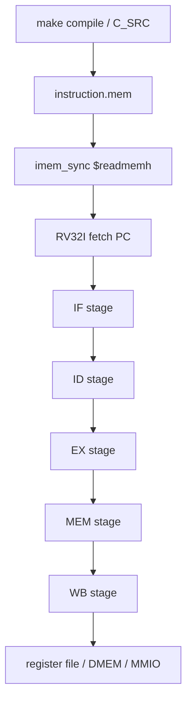

# 09. RV32I `instruction.mem` To Pipeline Flow Specification

## 1. Purpose

This document explains the **RV32I CPU** flow from `instruction.mem` loading into `IMEM` until the CPU:

1. fetches an instruction,
2. decodes it,
3. executes it,
4. accesses `DMEM` or `MMIO` when required,
5. writes the result back to the register file or DMEM.

The scope is the CPU pipeline. TX/RX details are only mentioned where software uses RV32I `lw`/`sw` instructions to configure DMA registers.

## 2. Scope of `.mem` Files

In the current system:

- `instruction.mem` is the RV32I program image.
- `make compile` generates the file.
- `imem_sync` loads it with `$readmemh("instruction.mem", ...)`.
- `instruction.mem` is not input payload data.

Keep these two flows separate:

| File type | Load location | Purpose |
|---|---|---|
| `instruction.mem` | `IMEM` | RV32I program instructions |
| `input*.txt` / `input*.bin` | `DMEM` | Payload data processed by CPU/DMA |

## 3. Flow Overview



## 4. Loading `instruction.mem` Into `IMEM`

### 4.1 File Generation

Current build flow:

1. `make compile` builds the C testcase into ELF/BIN/MEM outputs.
2. The generated memory image is copied to `sim/instruction.mem`.
3. `imem_sync` loads this file when simulation starts.

### 4.2 IMEM Load In RTL

`rtl/imem_sync.v` has two implementations:

- simulation behavioral model:
  - uses `reg [31:0] instructions_r [0:2047]`,
  - calls `$readmemh("instruction.mem", instructions_r)`;
- Vivado IP model:
  - uses `IMEM_ip`.

Simulation behavior:

```verilog
always @(posedge clk_i) begin
  if (en_i)
    instruction_r <= instructions_r[instr_addr_i];
  else
    instruction_r <= `NOP_INSTR;
end
```

This means:

- when fetch is enabled, IMEM returns the instruction at `PC[12:2]`;
- when fetch is disabled, IMEM returns NOP.

### 4.3 First Cycle After Reset

After simulation starts:

1. `instruction.mem` is already loaded in `IMEM`.
2. `rst_i` holds the CPU in reset.
3. `PC` returns to `RESET_PC = 0x00000000`.
4. When reset is released, IF starts fetching the first word at `PC = 0`.
5. `instruction_o` updates on the synchronous IMEM clock and then moves through ID/EX/MEM/WB.

In short:

- `instruction.mem` does not go through DMA.
- `instruction.mem` is not stored in DMEM.
- The CPU fetches instructions only from IMEM; payload data is loaded into DMEM by the loader, testbench, or UART path.

## 5. RV32I Pipeline In `top_rv32_sync`

The current CPU uses five stages:

1. IF
2. ID
3. EX
4. MEM
5. WB

### 5.1 IF Stage (`if_stage_sync`)

| Item | Content |
|---|---|
| Inputs | `clk_i`, `rst_i`, `flush_i`, `stall_i`, `if_bj_taken_i`, `if_pc_bj_i`, `imem_instr_i` |
| Outputs | `imem_en_o`, `imem_addr_o`, `ifid_pc_o`, `ifid_instruction_o` |
| Function | Maintains the PC, sends fetch requests to IMEM, receives the synchronous instruction response, holds state on stall, and clears stale fetch state on branch/jump/flush. |

Input/output description:

| Signal | Direction | Description |
|---|---|---|
| `clk_i` | input | Synchronous clock for all IF registers. |
| `rst_i` | input | Resets IF state to `RESET_PC` and drives the IF/ID instruction to NOP. |
| `flush_i` | input | Clears pending fetch request/response state and injects NOP into IF/ID. |
| `stall_i` | input | Holds PC and IF/ID state; an IMEM response that arrives during stall is buffered. |
| `if_bj_taken_i` | input | Branch/jump redirect decision from EX. |
| `if_pc_bj_i` | input | Redirect target PC when branch/jump is taken. |
| `imem_instr_i` | input | 32-bit instruction returned by IMEM for the previous fetch request. |
| `imem_en_o` | output | Fetch request enable to IMEM. |
| `imem_addr_o` | output | Fetch address derived from the current PC. |
| `ifid_pc_o` | output | PC latched into the IF/ID pipeline register. |
| `ifid_instruction_o` | output | Instruction latched into the IF/ID pipeline register; NOP on reset, flush, or invalid response. |

Registers in IF stage:

| Register | Bit width | Data format | Function |
|---|---:|---|---|
| `pc_r` | 32 | Byte PC, word-aligned (`PC[1:0]=00`) | Current IF-stage PC and source for the next IMEM fetch address. |
| `req_pc_r` | 32 | Byte PC | PC associated with the outstanding fetch request. |
| `req_valid_r` | 1 | Valid flag (`0/1`) | Marks that an IMEM request is waiting for an instruction response. |
| `resp_pc_r` | 32 | Byte PC | Buffered response PC when an instruction returns during stall. |
| `resp_instr_r` | 32 | Raw RV32I instruction word (`opcode=instr[6:0]`) | Buffered instruction response when an instruction returns during stall. |
| `resp_valid_r` | 1 | Valid flag (`0/1`) | Marks that `resp_pc_r` and `resp_instr_r` are valid. |
| `ifid_pc_r` | 32 | Byte PC | IF/ID pipeline register holding the PC for ID. |
| `ifid_instruction_r` | 32 | Raw RV32I instruction word; NOP is `0x00000013` | IF/ID pipeline register holding the instruction for ID. |

### 5.2 ID Stage (`id_stage`)

| Item | Content |
|---|---|
| Inputs | `clk_i`, `rst_i`, `ifid_pc_i`, `ifid_instruction_i`, `flush_i`, `hold_i`, `bubble_i`, `rf_rs1_data_i`, `rf_rs2_data_i` |
| Outputs | `rf_rs1_addr_o`, `rf_rs2_addr_o`, `idex_jal_o`, `idex_jalr_o`, `idex_se_alu_src1_o`, `idex_se_alu_src2_o`, `idex_aluop_o`, `idex_rs1_data_o`, `idex_rs2_data_o`, `idex_imm_o`, `idex_rs1_addr_o`, `idex_rs2_addr_o`, `idex_mem_we_o`, `idex_mem_en_o`, `idex_width_se_o`, `idex_wb_se_o`, `idex_regwrite_o`, `idex_rd_addr_o`, `idex_pc_o` |
| Function | Decodes opcode/funct fields, selects `rs1`/`rs2`/`rd`, generates the immediate, creates EX/MEM/WB control bits, reads register data, and latches all decoded values into ID/EX. `hold_i` preserves state; `bubble_i` or `flush_i` injects an inactive operation. |

Input/output description:

| Signal | Direction | Description |
|---|---|---|
| `clk_i` | input | Synchronous clock for ID/EX registers. |
| `rst_i` | input | Resets ID/EX to NOP and inactive controls. |
| `ifid_pc_i` | input | PC of the instruction being decoded. |
| `ifid_instruction_i` | input | 32-bit instruction from IF/ID. |
| `flush_i` | input | Clears ID/EX on branch/jump redirect or global pipeline flush. |
| `hold_i` | input | Holds current ID/EX state and prevents latching a new instruction. |
| `bubble_i` | input | Inserts NOP/inactive controls into ID/EX for hazard handling. |
| `rf_rs1_data_i` | input | Register file read data at `rs1`. |
| `rf_rs2_data_i` | input | Register file read data at `rs2`. |
| `rf_rs1_addr_o` | output | Register file read address for `rs1`. |
| `rf_rs2_addr_o` | output | Register file read address for `rs2`. |
| `idex_jal_o` | output | Latched control flag for `jal`. |
| `idex_jalr_o` | output | Latched control flag for `jalr`. |
| `idex_se_alu_src1_o` | output | ALU operand A select: `1=PC`, `0=rs1`. |
| `idex_se_alu_src2_o` | output | ALU operand B select: `1=rs2`, `0=immediate`. |
| `idex_aluop_o` | output | ALU/branch operation code sent to EX. |
| `idex_rs1_data_o` | output | Latched `rs1` data for EX. |
| `idex_rs2_data_o` | output | Latched `rs2` data for EX and stores. |
| `idex_imm_o` | output | Decoded immediate, sign/zero-extended as required by instruction format. |
| `idex_rs1_addr_o` | output | Latched `rs1` index for forwarding and hazard checks. |
| `idex_rs2_addr_o` | output | Latched `rs2` index for forwarding and hazard checks. |
| `idex_mem_we_o` | output | Store enable; asserted for `sb/sh/sw`. |
| `idex_mem_en_o` | output | Memory access enable; asserted for load/store. |
| `idex_width_se_o` | output | Load/store width code for byte, halfword, word, signed, and unsigned variants. |
| `idex_wb_se_o` | output | Writeback source select: ALU, memory, or `PC+4`. |
| `idex_regwrite_o` | output | Register file write enable for WB. |
| `idex_rd_addr_o` | output | Destination register index `rd`; `0` when no writeback is needed. |
| `idex_pc_o` | output | Latched PC for EX, branch target calculation, and `PC+4`. |

Registers in ID stage:

| Register | Bit width | Data format | Function |
|---|---:|---|---|
| `idex_jal_o` | 1 | Control flag (`0/1`) | Marks `jal`; EX redirects PC and WB writes `PC+4`. |
| `idex_jalr_o` | 1 | Control flag (`0/1`) | Marks `jalr`; EX redirects PC through computed target. |
| `idex_se_alu_src1_o` | 1 | Mux select (`1=PC`, `0=rs1`) | Selects ALU operand A. |
| `idex_se_alu_src2_o` | 1 | Mux select (`1=rs2`, `0=imm`) | Selects ALU operand B. |
| `idex_aluop_o` | 4 | ALU/branch op code from `defines.vh` | Drives ALU operation and branch comparison in EX. |
| `idex_rs1_data_o` | 32 | Raw register data word | Value read from register file `rs1`. |
| `idex_rs2_data_o` | 32 | Raw register data word | Value read from register file `rs2`; also store data. |
| `idex_imm_o` | 32 | Sign/zero-extended immediate word | Immediate generated from instruction fields. |
| `idex_rs1_addr_o` | 5 | Register index `x0..x31` | Source register 1 index for forwarding/hazard logic. |
| `idex_rs2_addr_o` | 5 | Register index `x0..x31` | Source register 2 index for forwarding/hazard logic. |
| `idex_mem_we_o` | 1 | Store enable flag (`0/1`) | Enables memory writes for store instructions. |
| `idex_mem_en_o` | 1 | Memory enable flag (`0/1`) | Enables memory access for load/store instructions. |
| `idex_width_se_o` | 3 | Load/store size code (`LB/LH/LW/LBU/LHU` or `SB/SH/SW`) | Selects access width and signed/unsigned load behavior. |
| `idex_wb_se_o` | 2 | Writeback select (`00=ALU`, `01=MEM`, `10=PC+4`, `11=INVALID`) | Selects WB data source. |
| `idex_regwrite_o` | 1 | Register write enable (`0/1`) | Allows WB to write the register file. |
| `idex_rd_addr_o` | 5 | Register index `x0..x31` | Destination register `rd`. |
| `idex_pc_o` | 32 | Byte PC, word-aligned | PC of the current instruction. |

### 5.3 EX Stage (`ex_stage`)

| Item | Content |
|---|---|
| Inputs | `clk_i`, `rst_i`, `flush_i`, `stall_i`, `ex_pc_i`, `ex_imm_i`, `ex_rs1_data_i`, `ex_rs2_data_i`, `ex_jal_i`, `ex_jalr_i`, `ex_alu_src1_i`, `ex_alu_src2_i`, `ex_aluop_i`, `ex_mem_we_i`, `ex_mem_en_i`, `ex_width_se_i`, `ex_wb_se_i`, `ex_regwrite_i`, `ex_rd_addr_i` |
| Outputs | `exif_pc_bj_o`, `exif_bj_taken_o`, `exmem_mem_we_o`, `exmem_mem_en_o`, `exmem_width_se_o`, `exmem_wb_se_o`, `exmem_regwrite_o`, `exmem_rd_addr_o`, `exmem_alu_result_o`, `exmem_rs2_data_o`, `exmem_pc_plus_o` |
| Function | Selects ALU operands, computes ALU result/effective address, evaluates branches, computes jump target, raises redirect for taken branch/jump, and latches control/data into EX/MEM. |

Input/output description:

| Signal | Direction | Description |
|---|---|---|
| `clk_i` | input | Synchronous clock for EX/MEM registers. |
| `rst_i` | input | Resets EX/MEM to inactive controls and zero data. |
| `flush_i` | input | Clears EX/MEM on branch/jump redirect. |
| `stall_i` | input | Holds EX/MEM and prevents latching a new EX result. |
| `ex_pc_i` | input | PC of the instruction in EX. |
| `ex_imm_i` | input | Immediate from ID. |
| `ex_rs1_data_i` | input | Forwarded `rs1` operand. |
| `ex_rs2_data_i` | input | Forwarded `rs2` operand; also store data for stores. |
| `ex_jal_i` | input | `jal` control flag. |
| `ex_jalr_i` | input | `jalr` control flag. |
| `ex_alu_src1_i` | input | ALU operand A select: `1=PC`, `0=rs1`. |
| `ex_alu_src2_i` | input | ALU operand B select: `1=rs2`, `0=immediate`. |
| `ex_aluop_i` | input | ALU operation or branch comparison code. |
| `ex_mem_we_i` | input | Store enable associated with the instruction. |
| `ex_mem_en_i` | input | Memory access enable associated with the instruction. |
| `ex_width_se_i` | input | Load/store width code associated with the instruction. |
| `ex_wb_se_i` | input | Writeback source select associated with the instruction. |
| `ex_regwrite_i` | input | Register write enable associated with the instruction. |
| `ex_rd_addr_i` | input | Destination register index associated with the instruction. |
| `exif_pc_bj_o` | output | Redirect target PC for taken branch/jump. |
| `exif_bj_taken_o` | output | Redirect flag to IF when branch/jump is taken. |
| `exmem_mem_we_o` | output | Store enable latched to MEM. |
| `exmem_mem_en_o` | output | Memory enable latched to MEM. |
| `exmem_width_se_o` | output | Memory access width latched to MEM. |
| `exmem_wb_se_o` | output | Writeback source select latched to MEM/WB. |
| `exmem_regwrite_o` | output | Register write enable latched to MEM/WB. |
| `exmem_rd_addr_o` | output | Destination register index latched to MEM/WB. |
| `exmem_alu_result_o` | output | ALU result; effective address for load/store. |
| `exmem_rs2_data_o` | output | Store data latched to MEM. |
| `exmem_pc_plus_o` | output | `PC + 4` latched for jump writeback. |

Registers in EX stage:

| Register | Bit width | Data format | Function |
|---|---:|---|---|
| `exmem_mem_we_o` | 1 | Store enable flag (`0/1`) | Carries store enable to MEM. |
| `exmem_mem_en_o` | 1 | Memory enable flag (`0/1`) | Carries memory access enable to MEM. |
| `exmem_width_se_o` | 3 | Load/store size code | Carries access width to MEM. |
| `exmem_wb_se_o` | 2 | Writeback select | Carries WB source select to WB. |
| `exmem_regwrite_o` | 1 | Register write enable | Carries register write enable to WB. |
| `exmem_rd_addr_o` | 5 | Register index `x0..x31` | Carries destination register index to WB. |
| `exmem_alu_result_o` | 32 | ALU result / effective address | Carries ALU result or load/store address. |
| `exmem_rs2_data_o` | 32 | Raw store data word | Carries store data to MEM. |
| `exmem_pc_plus_o` | 32 | Byte PC + 4 | Carries return address for `jal/jalr`. |

### 5.4 MEM Stage (`mem_stage`)

| Item | Content |
|---|---|
| Inputs | `clk_i`, `rst_i`, `mem_we_i`, `mem_en_i`, `mem_width_se_i`, `mem_alu_result_i`, `mem_data_i`, `mem_regwrite_i`, `mem_rd_addr_i`, `mem_wb_se_i`, `mem_pc_plus_i`, `data_r_i` |
| Outputs | `en_o`, `we_o`, `addr_o`, `data_w_o`, `mem_data_w`, `memwb_regwrite_o`, `memwb_rd_addr_o`, `memwb_wb_se_o`, `memwb_pc_plus_o`, `memwb_alu_result_o`, `memwb_mem_data_o`, `mem_stage_err_o` |
| Function | Performs DMEM/MMIO loads and stores, aligns byte/halfword/word accesses, sign/zero-extends load data, reports invalid access errors, and latches data/control into MEM/WB. |

Input/output description:

| Signal | Direction | Description |
|---|---|---|
| `clk_i` | input | Synchronous clock for MEM/WB registers. |
| `rst_i` | input | Resets MEM/WB to inactive controls and zero data. |
| `mem_we_i` | input | Store indicator for the current memory transaction. |
| `mem_en_i` | input | Enables a load/store access to DMEM or MMIO. |
| `mem_width_se_i` | input | Load/store width and signed/unsigned code. |
| `mem_alu_result_i` | input | Effective address from EX. |
| `mem_data_i` | input | Store data from `rs2`. |
| `mem_regwrite_i` | input | Register write enable passed from EX/MEM. |
| `mem_rd_addr_i` | input | Destination register index passed from EX/MEM. |
| `mem_wb_se_i` | input | Writeback source select passed from EX/MEM. |
| `mem_pc_plus_i` | input | `PC + 4` passed through for jump writeback. |
| `data_r_i` | input | 32-bit data read from DMEM/MMIO. |
| `en_o` | output | Request enable to DMEM/MMIO fabric. |
| `we_o` | output | 4-bit byte write enable for stores. |
| `addr_o` | output | DMEM/MMIO address derived from `mem_alu_result_i`. |
| `data_w_o` | output | Store data aligned into byte/halfword/word lanes. |
| `mem_data_w` | output | Sign/zero-extended load data for forwarding. |
| `memwb_regwrite_o` | output | Register write enable latched to WB. |
| `memwb_rd_addr_o` | output | Destination register index latched to WB. |
| `memwb_wb_se_o` | output | Writeback source select latched to WB. |
| `memwb_pc_plus_o` | output | `PC + 4` latched to WB. |
| `memwb_alu_result_o` | output | ALU result/effective address latched to WB. |
| `memwb_mem_data_o` | output | Load data latched to WB. |
| `mem_stage_err_o` | output | MEM error code: `00=OK`, `01=write_error`, `10=read_error`. |

Registers in MEM stage:

| Register | Bit width | Data format | Function |
|---|---:|---|---|
| `write_error` | 1 | Error flag (`0/1`) | Marks invalid stores, such as unsupported width or misalignment. |
| `read_error` | 1 | Error flag (`0/1`) | Marks invalid loads, such as unsupported width or misalignment. |
| `data_r_cvt_w` | 32 | Sign/zero-extended data word | Converted load data before latching to `memwb_mem_data_o`. |
| `memwb_regwrite_o` | 1 | Register write enable (`0/1`) | Carries register write enable to WB. |
| `memwb_rd_addr_o` | 5 | Register index `x0..x31` | Carries destination register index to WB. |
| `memwb_wb_se_o` | 2 | Writeback select | Carries WB data-source select to WB. |
| `memwb_pc_plus_o` | 32 | Byte PC + 4 | Carries jump return address to WB. |
| `memwb_alu_result_o` | 32 | ALU result / effective address | Carries ALU result or computed address to WB. |
| `memwb_mem_data_o` | 32 | Load data word | Carries final load data to WB. |
| `mem_stage_err_o` | 2 | Error code (`00=OK`, `01=write_error`, `10=read_error`) | Encodes MEM-stage access errors. |

### 5.5 WB Stage

| Item | Content |
|---|---|
| Inputs | `memwb_regwrite_w`, `memwb_rd_addr_w`, `memwb_wb_se_w`, `memwb_pc_plus_w`, `memwb_alu_result_w`, `memwb_mem_data_w` |
| Outputs | `wb_data_w`, `rf_reg_write_w`, `rf_rd_addr_w` |
| Function | Selects final writeback data according to `wb_se`, then drives register-file write enable, destination index, and write data. ALU ops, loads, `jal`, `lui`, and `auipc` converge here; stores do not write `rd`. |

Input/output description:

| Signal | Direction | Description |
|---|---|---|
| `memwb_regwrite_w` | input | Register file write enable from MEM/WB. |
| `memwb_rd_addr_w` | input | Destination register index `rd`. |
| `memwb_wb_se_w` | input | Writeback data-source select. |
| `memwb_pc_plus_w` | input | `PC + 4` value for `jal/jalr`. |
| `memwb_alu_result_w` | input | ALU result for ALU ops, `lui`, `auipc`, or other rd-writing system path. |
| `memwb_mem_data_w` | input | Load data from MEM. |
| `wb_data_w` | output | Final 32-bit data written to the register file. |
| `rf_reg_write_w` | output | Register file write enable. |
| `rf_rd_addr_w` | output | Register file destination write address. |

Registers in WB stage:

| Register | Bit width | Data format | Function |
|---|---:|---|---|
| None | - | Combinational mux over `memwb_*` inputs | WB has no separate pipeline register; it consumes MEM/WB registers produced by MEM stage. |

### 5.6 Control Signal Mapping By Instruction Group

| Instruction group | `idex_mem_en_o` | `idex_mem_we_o` | `idex_wb_se_o` | `idex_regwrite_o` | Note |
|---|---|---|---|---|---|
| `lw/lh/lb/lhu/lbu` | `1` | `0` | `MEM` | `1` | Load data writes `rd` in WB. |
| `sw/sh/sb` | `1` | `1` | invalid / don't care | `0` | Store writes DMEM/MMIO only. |
| `add/sub/xor/...` | `0` | `0` | `ALU` | `1` | ALU result writes `rd`. |
| `addi/ori/andi/xori/slli/srli/srai/slti/sltiu` | `0` | `0` | `ALU` | `1` | ALU immediate result writes `rd`. |
| `lui/auipc` | `0` | `0` | `ALU` | `1` | `lui` writes immediate; `auipc` writes `PC+imm`. |
| `jal/jalr` | `0` | `0` | `PC+4` | `1` | Jump and write return address. |
| `beq/bne/blt/bge/bltu/bgeu` | `0` | `0` | invalid | `0` | Branch compare only; no writeback. |
| `fence` | `0` | `0` | invalid | `0` | Placeholder; no data result. |
| `ebreak` | `0` | `0` | invalid | `0` | Testcase terminator. |

## 6. Data flow according to each type of instruction

### 6.1 `lw`


In this project, `lw` is used to:

- read `INPUT_LEN_ADDR`
- read `DMA_STATUS`
- read `BYTES_DONE`
- read `CIPHERTEXT_BYTES_PRODUCED`
- Read result words from DMEM

`lw` in the DMA flow is the most important instruction because it creates the polling loop:

1. CPU reads `STATUS`
2. CPU check `busy/done/error`
3. CPU repeats if not done
4. `mem_stage_sync` can hold 1 cycle for synchronous read

### 6.2 `sw`


In this project, `sw` is used to:

- write `SRC_ADDR`, `DST_ADDR`, `LEN_BYTES`, `MODE`, `BLOCK_CFG`
- write `IV0..IV3`
- write result words into DMEM

`sw` in DMA flow is the CPU way:

- select source/destination
- Load mode for TX/RX
- start transfer
- save the result summary

### 6.3 Branch / jump

Branch/jump is not a data plane, but is very important to the CPU:

- `beq`, `bne`
- `jal`
- `jalr`

General use for:

- exit the polling loop
- Jump to error handler
- Repeat check status

In the current testcase:

- `beq`/`bne` is used to escape polling
- `jal`/`jalr` are used to jump between code blocks or enter `main`
- But this command does not need MMIO, but still goes through IF/ID/EX/WB as usual

### 6.4 ALU immediate

`addi`, `andi`, `ori`, `xori`, `slli`, `srli`, `lui` are commonly used for:

- Calculate MMIO address
- create IV demo
- mask bit status
- shift/pack value

This is the group of RV32I commands used most to create demo IVs in `test_mmio_dma.c`.
Enough:

- `lui` generates the above 20-bit base value
- `xori` tron input length, address, counter
- `slli/srli` generates entropy based on bit pattern
- `ori/andi` mask or live bit control

## 7.1.1 Enough flow with `input1`

A graphical test case `input1` can be understood according to the following commands:

```asm
lw    a2, 64(zero)        # read input_len from DMEM[0x40]
sw    a4, 40(a3)          # write IV0
sw    a5, 44(a4)          # write IV1
sw    a5, 48(a4)          # write IV2
sw    a5, 52(a4)          # write IV3
sw    a4, 8(a5)           # SRC_ADDR
sw    a4, 12(a5)          # DST_ADDR
sw    a2, 16(a5)          # LEN_BYTES
sw    a4, 20(a5)          # MODE
sw    a4, 24(a5)          # BLOCK_CFG
sw    a4, 0(a5)           # CONTROL.start
lw    a4, 4(a3)           # poll STATUS
bne   a4, zero, .poll
lw    a5, 28(a3)          # BYTES_DONE / result
ebreak                    # testcase end marker
```

This assembly is not always 100% identical to the actual binary, but
This is the amount of logic that the CPU is running.

## 7. Amount of CPU used in DMA testcase

### 7.1 Getting Started

CPU runs `instruction.mem`, then:

1. `lw input_len` from `DMEM[0x40]`
2. Create `IV0..IV3` using instruction RV32I
3. write `DMA_SRC_ADDR`
4. write `DMA_DST_ADDR`
5. write `DMA_LEN_BYTES`
6. write `DMA_MODE`
7. write `DMA_BLOCK_CFG`
8. write `CONTROL.start`

### 7.2 Polling

Repeat CPU:

1. `lw DMA_STATUS`
2. Check `busy/done/error`
3. If not done, repeat

This is **software polling**, not an interrupt.

### 7.3 Closing

CPU read:

- `BYTES_DONE`
- `CIPHERTEXT_BYTES_PRODUCED`
- `DEBUG`

Then write:

- signature
- error mask
- status summary
- result head

Go to DMEM for testbench to read again.

## 8. Pipeline semantics are important

### 8.1 Load-use hazard

`top_rv32_sync` has hazard detection for load-use.
If `lw` generates an instruction code value immediately after use, the pipeline will bubble/hold.

### 8.2 MMIO hold

When CPU accesses MMIO:

- `cpu_mmio_to_apb_bridge` creates `cpu_stall_req_o`
- `top_rv32_sync` hold front-end pipeline
- The current instruction cannot be run until APB is finished

This is the reason why `lw DMA_STATUS` can stall, while `DMA busy` cannot cause global CPU stall.

### 8.3 Branch flush

When branch taken:

- IF and ID are flushed
- The PC is reloaded with the branch target address

### 8.4 Synchronous IMEM/DMEM

Current system reduces sat synchronous BRAM behavior:

- instruction after 1 fetch cycle
- load/store has response according to memory model timing

## 9. RV32I instruction set is actually used in the project

Mainly gathering the following groups:

### 9.1 By instruction support

| Nhom | Command | Current status | How to do it in RTL |
|---|---|---|---|
| U-type | `lui` | Support | Create ID `imm_u`, EX does not need rs1, WB writes `imm_u` into `rd` |
| U-type | `auipc` | Support | ID creates `imm_u`, EX uses `PC + imm_u`, WB writes results into `rd` |
| J-type | `jal` | Support | ID created `imm_j`, EX calculated `PC + imm_j`, IF/ID flushed when taken, WB registered `PC+4` |
| I-jump | `jalr` | Support | ID created `imm_i`, EX calculated `(rs1 + imm_i) & ~1`, IF/ID flushed when taken, WB registered `PC+4` |
| Branch | `beq` | Support | EX compares rs1/rs2 using ALU branch opcode |
| Branch | `bne` | Support | EX compares rs1/rs2 using ALU branch opcode |
| Branch | `blt` | Support | EX compares signed `<` |
| Branch | `bge` | Support | EX compares signed `>=` |
| Branch | `bltu` | Support | EX compares unsigned `<` |
| Branch | `bgeu` | Support | EX compares unsigned `>=` |
| Load | `lb` | Support | MEM reads 1 byte, sign-extends `rd` |
| Load | `lh` | Support | MEM reads 2 bytes, sign-extends `rd` |
| Load | `lw` | Support | MEM reads 4 bytes, write-back via `MEM` path |
| Load | `lbu` | Support | MEM reads 1 byte, zero-extended to `rd` |
| Load | `lhu` | Support | MEM reads 2 bytes, zero-extending `rd` |
| Store | `sb` | Support | MEM writes 1 byte according to `we_o` byte-enable |
| Store | `sh` | Support | MEM writes 2 bytes according to halfword alignment |
| Store | `sw` | Support | MEM writes 4 bytes to DMEM or MMIO |
| OP-IMM | `addi` | Support | ID creates `imm_i`, EX executes `ADD` with immediate |
| OP-IMM | `slti` | Support | ID created `imm_i`, EX performs signed compare |
| OP-IMM | `sltiu` | Support | ID creates `imm_i`, EX performs unsigned compare |
| OP-IMM | `xori` | Support | ID creates `imm_i`, EX performs XOR |
| OP-IMM | `ori` | Support | ID creates `imm_i`, EX performs OR |
| OP-IMM | `andi` | Support | ID creates `imm_i`, EX performs AND |
| OP-IMM | `slli` | Support | Creation ID `shamt`, EX shift left logical |
| OP-IMM | `srli` | Support | Creation ID `shamt`, EX shift right logical |
| OP-IMM | `srai` | Support | Create ID `shamt`, EX shift right arithmetic |
| OP | `add` | Support | EX ALU `ADD` |
| OP | `sub` | Support | EX ALU `SUB` |
| OP | `sll` | Support | EX ALU `SLL` |
| OP | `slt` | Support | EX ALU `SLT` |
| OP | `sltu` | Support | EX ALU `SLTU` |
| OP | `xor` | Support | EX ALU `XOR` |
| OP | `srl` | Support | EX ALU `SRL` |
| OP | `sra` | Support | EX ALU `SRA` |
| OP | `or` | Support | EX ALU `OR` |
| OP | `and` | Support | EX ALU `AND` |
| Fence | `fence` | Placeholder | Decoder passes as instruction non-data; There is no separate memory ordering engine |
| System | `ebreak` | Used as testcase terminator | Assembly testcase uses `ebreak` to complete the list; The current CPU does not have a trap/interrupt handler |
| System | `ecall` / CSR ops | Do not use in main flow | The decoder does receive the `SYSTEM` baseline, but the SoC currently does not have enough CSR/trap architecture. |

### 9.2 Notes on `SYSTEM`

In current RTL:

- `opcode == SYSTEM` is received by the decoder
- But the system doesn't have a trap handler/CSR block yet
- testcase uses `ebreak` as a terminal marker in the assembly, not
a complete trap flow

### 9.3 How each group of commands moves through the pipeline

| Instruction group | IF | ID | EX | MEM | WB |
|---|---|---|---|---|---|
| `lui`, `auipc` | fetch | decode imm_u | calculate/take value | does not use memory | write `rd` |
| `jal`, `jalr` | fetch | decode jump | Calculate target, flush IF/ID | does not use memory | write `PC+4` |
| Branch | fetch | decode branch | compare and decide taken | does not use memory | no writebacks |
| `lb/lh/lw/lbu/lhu` | fetch | decode load | calculate address | Read DMEM/MMIO, have synchronous wait | write `rd` |
| `sb/sh/sw` | fetch | decode store | calculate address | DMEM/MMIO registering | no writebacks |
| OP/OP-IMM | fetch | decode ALU | Calculate ALU results | does not use memory | write `rd` |
| `fence` | fetch | decode placeholder | There is no data-plane operation | no action | no writebacks |
| `ebreak` | fetch | decode terminal marker | No trap handler is implemented here | no action | no writebacks |

No additional instructions are needed to run the main flow.

### 9.4 Make detailed notes for each relevant link

| Command | Description is limited to the current design |
|---|---|
| `lui` | Read the upper 20 bits of immediate, read the rd register; used to create constants 0x4000_0000, 0x0000_2000, 0x0000_6000, ... |
| `auipc` | Port `PC + imm_u`; Not used in the main control-path as much as `lui`, but the pipeline still supports it |
| `addi` | Used to set small offset port, create `sp`, increase counter, address port, loop command port |
| `lw` | Content to read `INPUT_LEN_ADDR`, `DMA_STATUS`, `BYTES_DONE`, `CIPHERTEXT_BYTES_PRODUCED`, result words |
| `sw` | Used to write DMA registers and result words; This is the main command to configure TX/RX |
| `beq/bne` | Used to repeat the polling loop and exit when `done/error` |
| `jal/jalr` | Use this to jump into `main`, call block control, and dial back if necessary |
| `xori/ori/andi` | Used to create IV demo, mask flag, and bit twiddle |
| `slli/srli/srai` | Used to mix bits when creating IVs and extracting control values |
| `ebreak` | Used as an initial signal to end the test case in simulation, not a trap handler is enough |
| `fence` | Not the mainline instruction in the testcase; Currently it's just a decode placeholder and doesn't have its own memory-order engine |

## 10. Instruction-to-use summary for this SoC

In the control-plane test cases of this system, the command RV32I is important
especially:

- `lw` to read `INPUT_LEN_ADDR`, `STATUS`, `BYTES_DONE`, result words
- `sw` to register `SRC_ADDR`, `DST_ADDR`, `LEN_BYTES`, `MODE`, `BLOCK_CFG`, `IV0..IV3`
- `addi` / `lui` / `xori` / `ori` / `andi` / shift ops to create IV demo and mask flag
- `beq` / `bne` to polling loop to exit when done/error
- `jal` / `jalr` to control program volume

## 11. Conclusion

`instruction.mem` just hasn't **programmed** yet.
The actual data that the CPU retrieves is in `DMEM`.

The main quantity of RV32I currently is:

1. fetch commands from `IMEM`
2. Read input length and status from `DMEM/MMIO`
3. Write DMA config via MMIO
4. polling `STATUS`
5. write results/metadata to `DMEM`

This means:

- file `.mem` is not a data stream
- The CPU does not "parse the input file" directly
- The CPU only controls the system and observes the results through memory-mapped registers
