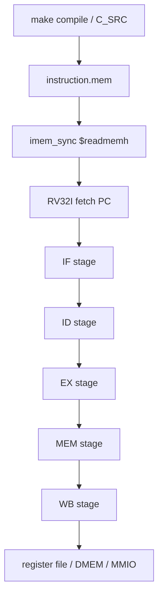

# 09. RV32I `instruction.mem` To Pipeline Flow Specification

## 1. Muc dich

Tai lieu nay giai thich luong **RV32I CPU** tu luc file `instruction.mem`
duoc nap vao `IMEM` cho toi khi CPU:

1. fetch lenh
2. decode
3. thuc thi
4. truy cap `DMEM` hoac `MMIO`
5. ghi ket qua ve thanh ghi hoac DMEM

Tai lieu nay tap trung vao **CPU pipeline**. No khong mo ta chi tiet TX/RX,
ngoai tru nhung cho CPU phai dung `lw/sw` de cau hinh DMA.

## 2. Pham vi file `.mem`

Trong he thong hien tai:

- `instruction.mem` la image cua chuong trinh RV32I
- file nay duoc tao khi `make compile`
- `imem_sync` nap file bang `$readmemh("instruction.mem", ...)`
- `instruction.mem` khong phai input data file

Luon phai tach 2 luong:

| Loai file | Noi nap | Muc dich |
|---|---|---|
| `instruction.mem` | `IMEM` | Chuong trinh RV32I |
| `input*.txt` / `input*.bin` | `DMEM` | Du lieu de CPU/DMA xu ly |

## 3. Tong quan flow



## 4. `instruction.mem` vao `IMEM`

### 4.1 Tao file

Flow build hien tai:

1. `make compile` build C testcase thanh ELF/BIN/MEM
2. file output duoc copy thanh `sim/instruction.mem`
3. `imem_sync` nap file nay khi simulation bat dau

### 4.2 IMEM load trong RTL

`rtl/imem_sync.v` co 2 che do:

- simulation behavioral:
  - dung `reg [31:0] instructions_r [0:2047]`
  - goi `$readmemh("instruction.mem", instructions_r)`
- Vivado IP:
  - dung `IMEM_ip`

Neu simulation:

```verilog
always @(posedge clk_i) begin
  if (en_i)
    instruction_r <= instructions_r[instr_addr_i];
  else
    instruction_r <= `NOP_INSTR;
end
```

Nghia la:

- khi CPU enable fetch, IMEM tra ve lenh tai `PC[12:2]`
- khi khong enable, output ve NOP

### 4.3 Chu ky dau tien sau khi reset

Sau khi simulation bat dau:

1. `instruction.mem` da nam trong `IMEM`
2. `rst_i` giu CPU o trang thai reset
3. `PC` quay ve `RESET_PC = 0x00000000`
4. khi reset duoc tha, IF stage bat dau fetch word dau tien tai `PC = 0`
5. `instruction_o` tu IMEM cap nhat theo clock sync, sau do di qua ID/EX/MEM/WB

Noi don gian:

- `instruction.mem` khong di qua DMA
- `instruction.mem` khong nam trong DMEM
- CPU chi fetch lenh tu IMEM, con data phai duoc nap vao DMEM bang loader/testbench/UART

## 5. RV32I pipeline trong `top_rv32_sync`

Pipeline hien tai gom 5 pha chinh:

1. IF
2. ID
3. EX
4. MEM
5. WB

### 5.1 IF stage (`if_stage_sync`)

| Muc | Noi dung |
|---|---|
| Input | `clk_i`, `rst_i`, `flush_i`, `stall_i`, `if_bj_taken_i`, `if_pc_bj_i`, `imem_instr_i` |
| Output | `imem_en_o`, `imem_addr_o`, `ifid_pc_o`, `ifid_instruction_o` |
| Chuc nang | Quan ly PC, gui fetch request sang IMEM, nhan instruction tra ve sau 1 chu ky, giu pipeline khi stall, xoa fetch cu khi branch/jump/flush |

Thanh ghi trong IF stage:

| Thanh ghi | Chuc nang |
|---|---|
| `pc_r` | PC hien tai cua IF stage, cung cap dia chi fetch cho IMEM |
| `req_pc_r` | PC cua fetch request dang outstanding, dung de ghep voi response |
| `req_valid_r` | Danh dau co fetch request dang cho instruction tra ve |
| `resp_pc_r` | PC duoc buffer lai khi response den trong luc stall |
| `resp_instr_r` | Instruction duoc buffer lai khi response den trong luc stall |
| `resp_valid_r` | Danh dau response buffer hop le |
| `ifid_pc_r` | Thanh ghi IF/ID chot PC sang ID stage |
| `ifid_instruction_r` | Thanh ghi IF/ID chot instruction sang ID stage |

### 5.2 ID stage (`id_stage`)

| Muc | Noi dung |
|---|---|
| Input | `clk_i`, `rst_i`, `ifid_pc_i`, `ifid_instruction_i`, `flush_i`, `hold_i`, `bubble_i`, `rf_rs1_data_i`, `rf_rs2_data_i` |
| Output | `rf_rs1_addr_o`, `rf_rs2_addr_o`, `idex_jal_o`, `idex_jalr_o`, `idex_se_alu_src1_o`, `idex_se_alu_src2_o`, `idex_aluop_o`, `idex_rs1_data_o`, `idex_rs2_data_o`, `idex_imm_o`, `idex_rs1_addr_o`, `idex_rs2_addr_o`, `idex_mem_we_o`, `idex_mem_en_o`, `idex_width_se_o`, `idex_wb_se_o`, `idex_regwrite_o`, `idex_rd_addr_o`, `idex_pc_o` |
| Chuc nang | Decode opcode/funct, chon `rs1/rs2/rd`, sinh immediate, tao control bit cho EX/MEM/WB, lay du lieu tu register file, va lat cac gia tri nay sang ID/EX. `hold_i` giu nguyen trang thai; `bubble_i` va `flush_i` xoa noi dung pipeline. |

Thanh ghi trong ID stage:

| Thanh ghi | Chuc nang |
|---|---|
| `idex_jal_o` | Danh dau lenh `jal`, cho EX stage biet phai jump va ghi `PC+4` ve rd |
| `idex_jalr_o` | Danh dau lenh `jalr`, cho EX stage biet phai jump qua dia chi tinh toan |
| `idex_se_alu_src1_o` | Chon `PC` lam operand A cua ALU (vi du `auipc`) |
| `idex_se_alu_src2_o` | Chon `rs2` lam operand B cua ALU; neu =0 thi dung immediate |
| `idex_aluop_o` | Ma dieu khien ALU / branch cho EX stage |
| `idex_rs1_data_o` | Gia tri doc tu register file o `rs1` |
| `idex_rs2_data_o` | Gia tri doc tu register file o `rs2` |
| `idex_imm_o` | Immediate da duoc sinh va sign-extend / zero-extend phu hop loai lenh |
| `idex_rs1_addr_o` | So hieu thanh ghi `rs1`, dung cho forwarding/hazard check |
| `idex_rs2_addr_o` | So hieu thanh ghi `rs2`, dung cho forwarding/hazard check |
| `idex_mem_we_o` | Bat ghi memory cho lenh store |
| `idex_mem_en_o` | Bat truy cap memory cho lenh load/store |
| `idex_width_se_o` | Chon do rong truy cap: byte/half/word |
| `idex_wb_se_o` | Chon nguon ghi ve rd: ALU, MEM, hoac `PC+4` |
| `idex_regwrite_o` | Cho phep ghi ve register file |
| `idex_rd_addr_o` | So hieu thanh ghi dich `rd` |
| `idex_pc_o` | PC cua instruction hien tai, dung cho `PC+4` va branch target |

### 5.3 EX stage (`ex_stage`)

| Muc | Noi dung |
|---|---|
| Input | `clk_i`, `rst_i`, `flush_i`, `stall_i`, `ex_pc_i`, `ex_imm_i`, `ex_rs1_data_i`, `ex_rs2_data_i`, `ex_jal_i`, `ex_jalr_i`, `ex_alu_src1_i`, `ex_alu_src2_i`, `ex_aluop_i`, `ex_mem_we_i`, `ex_mem_en_i`, `ex_width_se_i`, `ex_wb_se_i`, `ex_regwrite_i`, `ex_rd_addr_i` |
| Output | `exif_pc_bj_o`, `exif_bj_taken_o`, `exmem_mem_we_o`, `exmem_mem_en_o`, `exmem_width_se_o`, `exmem_wb_se_o`, `exmem_regwrite_o`, `exmem_rd_addr_o`, `exmem_alu_result_o`, `exmem_rs2_data_o`, `exmem_pc_plus_o` |
| Chuc nang | Chon operand, tinh ALU result, so sanh branch, tinh jump target, phat hien branch/jump taken, va chot thong tin sang EX/MEM cho MEM stage. |

Thanh ghi trong EX stage:

| Thanh ghi | Chuc nang |
|---|---|
| `exmem_mem_we_o` | Giu bit store enable sang MEM stage |
| `exmem_mem_en_o` | Giu bit memory access enable sang MEM stage |
| `exmem_width_se_o` | Giu do rong truy cap memory sang MEM stage |
| `exmem_wb_se_o` | Giu lua chon nguon writeback sang WB stage |
| `exmem_regwrite_o` | Giu bit cho phep ghi register file sang WB stage |
| `exmem_rd_addr_o` | Giu so hieu rd sang WB stage |
| `exmem_alu_result_o` | Giu ALU result, effective address, hoac ket qua branch-related can dung tiep |
| `exmem_rs2_data_o` | Giu du lieu rs2 thuc te de store vao memory/MMIO |
| `exmem_pc_plus_o` | Giu `PC + 4` de ghi ve rd khi lenh `jal/jalr` |

### 5.4 MEM stage (`mem_stage`)

| Muc | Noi dung |
|---|---|
| Input | `clk_i`, `rst_i`, `mem_we_i`, `mem_en_i`, `mem_width_se_i`, `mem_alu_result_i`, `mem_data_i`, `mem_regwrite_i`, `mem_rd_addr_i`, `mem_wb_se_i`, `mem_pc_plus_i`, `data_r_i` |
| Output | `en_o`, `we_o`, `addr_o`, `data_w_o`, `mem_data_w`, `memwb_regwrite_o`, `memwb_rd_addr_o`, `memwb_wb_se_o`, `memwb_pc_plus_o`, `memwb_alu_result_o`, `memwb_mem_data_o`, `mem_stage_err_o` |
| Chuc nang | Thuc hien read/write DMEM hoac MMIO, canh lane theo byte/half/word, sign/zero-extend du lieu doc, bao loi truy cap khong hop le, va chot du lieu sang MEM/WB. |

Thanh ghi trong MEM stage:

| Thanh ghi | Chuc nang |
|---|---|
| `write_error` | Danh dau store khong hop le (sai canh / sai do rong) |
| `read_error` | Danh dau load khong hop le (sai canh / sai do rong) |
| `data_r_cvt_w` | Du lieu doc sau khi da sign/zero extend, se di vao `memwb_mem_data_o` |
| `memwb_regwrite_o` | Giu bit cho phep ghi register file sang WB stage |
| `memwb_rd_addr_o` | Giu so hieu thanh ghi dich sang WB stage |
| `memwb_wb_se_o` | Giu lua chon nguon writeback sang WB stage |
| `memwb_pc_plus_o` | Giu `PC + 4` cho writeback cua jump |
| `memwb_alu_result_o` | Giu ALU result / dia chi tinh toan sang WB stage |
| `memwb_mem_data_o` | Giu du lieu load da chuan hoa sang WB stage |
| `mem_stage_err_o` | Ma loi 2-bit cua MEM stage: write error hoac read error |

### 5.5 WB stage

| Muc | Noi dung |
|---|---|
| Input | `memwb_regwrite_w`, `memwb_rd_addr_w`, `memwb_wb_se_w`, `memwb_pc_plus_w`, `memwb_alu_result_w`, `memwb_mem_data_w` |
| Output | `wb_data_w`, `rf_reg_write_w`, `rf_rd_addr_w` |
| Chuc nang | Chon du lieu ghi ve register file theo `wb_se` va phat xung write enable + rd index sang register file. Day la noi `addi`, `lw`, `jal`, `lui`, `auipc` ket thuc ve mat writeback. `sw` khong ghi rd. |

Thanh ghi trong WB stage:

| Thanh ghi | Chuc nang |
|---|---|
| Khong co thanh ghi rieng | WB stage khong chot them state moi; no su dung truc tiep cac thanh ghi `memwb_*` da duoc luu o MEM stage |

### 5.6 Control signal mapping theo nhom lenh

| Nhom lenh | `idex_mem_en_o` | `idex_mem_we_o` | `idex_wb_se_o` | `idex_regwrite_o` | Ghi chu |
|---|---|---|---|---|---|
| `lw/lh/lb/lhu/lbu` | `1` | `0` | `MEM` | `1` | load vao rd o WB |
| `sw/sh/sb` | `1` | `1` | invalid / don't care | `0` | chi ghi DMEM/MMIO |
| `add/sub/xor/...` | `0` | `0` | `ALU` | `1` | ALU result vao rd |
| `addi/ori/andi/xori/slli/srli/srai/slti/sltiu` | `0` | `0` | `ALU` | `1` | ALU voi immediate |
| `lui/auipc` | `0` | `0` | `ALU` | `1` | `lui` ghi imm, `auipc` ghi `PC+imm` |
| `jal/jalr` | `0` | `0` | `PC+4` | `1` | jump va ghi return address |
| `beq/bne/blt/bge/bltu/bgeu` | `0` | `0` | invalid | `0` | chi tao branch control |
| `fence` | `0` | `0` | invalid | `0` | placeholder, khong tao data result |
| `ebreak` | `0` | `0` | invalid | `0` | testcase terminator |

## 6. Data flow theo tung loai instruction

### 6.1 `lw`


Trong project nay, `lw` duoc dung de:

- doc `INPUT_LEN_ADDR`
- doc `DMA_STATUS`
- doc `BYTES_DONE`
- doc `CIPHERTEXT_BYTES_PRODUCED`
- doc result words tu DMEM

`lw` trong flow DMA la instruction quan trong nhat vi no tao polling loop:

1. CPU doc `STATUS`
2. CPU check `busy/done/error`
3. CPU lap lai neu chua xong
4. `mem_stage_sync` co the giu 1 cycle cho synchronous read

### 6.2 `sw`


Trong project nay, `sw` duoc dung de:

- ghi `SRC_ADDR`, `DST_ADDR`, `LEN_BYTES`, `MODE`, `BLOCK_CFG`
- ghi `IV0..IV3`
- ghi result words vao DMEM

`sw` trong flow DMA la cach CPU:

- chon vung source/destination
- nap mode cho TX/RX
- start transfer
- luu summary ket qua

### 6.3 Branch / jump

Branch/jump khong phai data-plane, nhung rat quan trong voi CPU:

- `beq`, `bne`
- `jal`
- `jalr`

Chung dung de:

- thoat vong polling
- nhay sang error handler
- lap check status

Trong testcase hien tai:

- `beq`/`bne` dung de thoat vong polling
- `jal`/`jalr` dung de nhay giua cac block code hoac vao `main`
- nhung lenh nay khong can MMIO, nhung van di qua IF/ID/EX/WB nhu binh thuong

### 6.4 ALU immediate

`addi`, `andi`, `ori`, `xori`, `slli`, `srli`, `lui` duoc dung nhieu cho:

- tinh dia chi MMIO
- tao IV demo
- mask bit status
- shift/pack gia tri

Day la nhom lenh RV32I dung nhieu de tao IV demo trong `test_mmio_dma.c`.
Vi du:

- `lui` tao gia tri base 20-bit tren
- `xori` tron input length, address, counter
- `slli/srli` tao entropy lua chon tu bit pattern
- `ori/andi` mask hoac gan bit control

## 7.1.1 Vi du flow voi `input1`

Mot testcase `input1` dien hinh co the hieu theo cac lenh sau:

```asm
lw    a2, 64(zero)        # doc input_len tu DMEM[0x40]
sw    a4, 40(a3)          # ghi IV0
sw    a5, 44(a4)          # ghi IV1
sw    a5, 48(a4)          # ghi IV2
sw    a5, 52(a4)          # ghi IV3
sw    a4, 8(a5)           # SRC_ADDR
sw    a4, 12(a5)          # DST_ADDR
sw    a2, 16(a5)          # LEN_BYTES
sw    a4, 20(a5)          # MODE
sw    a4, 24(a5)          # BLOCK_CFG
sw    a4, 0(a5)           # CONTROL.start
lw    a4, 4(a3)           # poll STATUS
bne   a4, zero, .poll
lw    a5, 28(a3)          # BYTES_DONE / result
ebreak                    # testcase end marker
```

Khong phai assembly nay luc nao cung giong 100% binary thuc te, nhung
day la luong logic ma CPU dang chay.

## 7. Luong CPU dung trong testcase DMA

### 7.1 Bat dau

CPU chay tu `instruction.mem`, roi:

1. `lw input_len` tu `DMEM[0x40]`
2. tao `IV0..IV3` bang instruction RV32I
3. ghi `DMA_SRC_ADDR`
4. ghi `DMA_DST_ADDR`
5. ghi `DMA_LEN_BYTES`
6. ghi `DMA_MODE`
7. ghi `DMA_BLOCK_CFG`
8. ghi `CONTROL.start`

### 7.2 Polling

CPU lap:

1. `lw DMA_STATUS`
2. kiem tra `busy/done/error`
3. neu chua xong thi lap lai

Day la **software polling**, khong phai interrupt.

### 7.3 Ket thuc

CPU doc:

- `BYTES_DONE`
- `CIPHERTEXT_BYTES_PRODUCED`
- `DEBUG`

Sau do ghi:

- signature
- error mask
- status summary
- result head

vao DMEM de testbench doc lai.

## 8. Pipeline semantics quan trong

### 8.1 Load-use hazard

`top_rv32_sync` co hazard detection cho load-use.
Neu `lw` tao ra gia tri ma instruction sau dung ngay, pipeline se bubble/hold.

### 8.2 MMIO hold

Khi CPU truy cap MMIO:

- `cpu_mmio_to_apb_bridge` tao `cpu_stall_req_o`
- `top_rv32_sync` hold front-end pipeline
- instruction hien tai khong duoc chay tiep cho toi khi APB xong

Day la ly do `lw DMA_STATUS` co the stall, con `DMA busy` khong lam CPU global stall.

### 8.3 Branch flush

Khi branch taken:

- IF va ID bi flush
- PC duoc nap lai dia chi branch target

### 8.4 Synchronous IMEM/DMEM

He thong hien tai giam sat synchronous BRAM behavior:

- instruction vao sau 1 cycle fetch
- load/store co response theo timing cua memory model

## 9. RV32I instruction set thuc su dung trong project

Chu yeu gom cac nhom sau:

### 9.1 Bang instruction ho tro

| Nhom | Lenh | Trang thai hien tai | Cach thuc thi trong RTL |
|---|---|---|---|
| U-type | `lui` | Ho tro | ID tao `imm_u`, EX khong can rs1, WB ghi `imm_u` vao `rd` |
| U-type | `auipc` | Ho tro | ID tao `imm_u`, EX dung `PC + imm_u`, WB ghi ket qua vao `rd` |
| J-type | `jal` | Ho tro | ID tao `imm_j`, EX tinh `PC + imm_j`, IF/ID bi flush khi taken, WB ghi `PC+4` |
| I-jump | `jalr` | Ho tro | ID tao `imm_i`, EX tinh `(rs1 + imm_i) & ~1`, IF/ID bi flush khi taken, WB ghi `PC+4` |
| Branch | `beq` | Ho tro | EX so sanh rs1/rs2 bang ALU branch opcode |
| Branch | `bne` | Ho tro | EX so sanh rs1/rs2 bang ALU branch opcode |
| Branch | `blt` | Ho tro | EX so sanh signed `<` |
| Branch | `bge` | Ho tro | EX so sanh signed `>=` |
| Branch | `bltu` | Ho tro | EX so sanh unsigned `<` |
| Branch | `bgeu` | Ho tro | EX so sanh unsigned `>=` |
| Load | `lb` | Ho tro | MEM doc 1 byte, sign-extend ve `rd` |
| Load | `lh` | Ho tro | MEM doc 2 byte, sign-extend ve `rd` |
| Load | `lw` | Ho tro | MEM doc 4 byte, write-back qua `MEM` path |
| Load | `lbu` | Ho tro | MEM doc 1 byte, zero-extend ve `rd` |
| Load | `lhu` | Ho tro | MEM doc 2 byte, zero-extend ve `rd` |
| Store | `sb` | Ho tro | MEM ghi 1 byte theo `we_o` byte-enable |
| Store | `sh` | Ho tro | MEM ghi 2 byte theo halfword alignment |
| Store | `sw` | Ho tro | MEM ghi 4 byte vao DMEM hoac MMIO |
| OP-IMM | `addi` | Ho tro | ID tao `imm_i`, EX thuc hien `ADD` voi immediate |
| OP-IMM | `slti` | Ho tro | ID tao `imm_i`, EX thuc hien signed compare |
| OP-IMM | `sltiu` | Ho tro | ID tao `imm_i`, EX thuc hien unsigned compare |
| OP-IMM | `xori` | Ho tro | ID tao `imm_i`, EX thuc hien XOR |
| OP-IMM | `ori` | Ho tro | ID tao `imm_i`, EX thuc hien OR |
| OP-IMM | `andi` | Ho tro | ID tao `imm_i`, EX thuc hien AND |
| OP-IMM | `slli` | Ho tro | ID tao `shamt`, EX shift left logical |
| OP-IMM | `srli` | Ho tro | ID tao `shamt`, EX shift right logical |
| OP-IMM | `srai` | Ho tro | ID tao `shamt`, EX shift right arithmetic |
| OP | `add` | Ho tro | EX ALU `ADD` |
| OP | `sub` | Ho tro | EX ALU `SUB` |
| OP | `sll` | Ho tro | EX ALU `SLL` |
| OP | `slt` | Ho tro | EX ALU `SLT` |
| OP | `sltu` | Ho tro | EX ALU `SLTU` |
| OP | `xor` | Ho tro | EX ALU `XOR` |
| OP | `srl` | Ho tro | EX ALU `SRL` |
| OP | `sra` | Ho tro | EX ALU `SRA` |
| OP | `or` | Ho tro | EX ALU `OR` |
| OP | `and` | Ho tro | EX ALU `AND` |
| Fence | `fence` | Placeholder | Decoder cho qua nhu instruction non-data; khong co memory ordering engine rieng |
| System | `ebreak` | Used as testcase terminator | Assembly testcase dung `ebreak` de danh dau ket thuc; CPU hien tai khong co trap/interrupt handler day du |
| System | `ecall` / CSR ops | Khong dung trong flow chinh | Decoder co nhan `SYSTEM` baseline, nhung SoC hien tai chua co CSR/trap architecture day du |

### 9.2 Ghi chu ve `SYSTEM`

Trong RTL hien tai:

- `opcode == SYSTEM` duoc decoder nhan dien
- nhung he thong chua co trap handler/CSR block day du
- testcase dung `ebreak` nhu mot terminal marker trong assembly, khong phai
  mot trap flow hoan chinh

### 9.3 Cach tung nhom lenh di qua pipeline

| Nhom lenh | IF | ID | EX | MEM | WB |
|---|---|---|---|---|---|
| `lui`, `auipc` | fetch | decode imm_u | tinh/lay gia tri | khong dung memory | ghi `rd` |
| `jal`, `jalr` | fetch | decode jump | tinh target, flush IF/ID | khong dung memory | ghi `PC+4` |
| Branch | fetch | decode branch | so sanh va quyet dinh taken | khong dung memory | khong writeback |
| `lb/lh/lw/lbu/lhu` | fetch | decode load | tinh address | doc DMEM/MMIO, co synchronous wait | ghi `rd` |
| `sb/sh/sw` | fetch | decode store | tinh address | ghi DMEM/MMIO | khong writeback |
| OP/OP-IMM | fetch | decode ALU | tinh ket qua ALU | khong dung memory | ghi `rd` |
| `fence` | fetch | decode placeholder | khong co hanh dong data-plane | khong co hanh dong | khong writeback |
| `ebreak` | fetch | decode terminal marker | khong co trap handler day du | khong co hanh dong | khong writeback |

Khong can cac lenh phuc tap hon de chay flow chinh.

### 9.4 Ghi chu chi tiet cho tung lenh quan trong

| Lenh | Mo ta chi tiet trong design hien tai |
|---|---|
| `lui` | Doc 20 bit tren cua immediate, dat len thanh ghi rd; dung de tao constant 0x4000_0000, 0x0000_2000, 0x0000_6000, ... |
| `auipc` | Cong `PC + imm_u`; khong dung trong control-path chinh nhieu bang `lui`, nhung pipeline van ho tro |
| `addi` | Dung de cong offset nho, tao `sp`, tang counter, cong dia chi, cong lenh loop |
| `lw` | Dung de doc `INPUT_LEN_ADDR`, `DMA_STATUS`, `BYTES_DONE`, `CIPHERTEXT_BYTES_PRODUCED`, result words |
| `sw` | Dung de ghi thanh ghi DMA va result words; day la lenh chinh de cau hinh TX/RX |
| `beq/bne` | Dung de lap polling loop va thoat khi `done/error` |
| `jal/jalr` | Dung de nhay vao `main`, goi block control, va quay ve neu can |
| `xori/ori/andi` | Dung de tao IV demo, mask flag, and bit twiddle |
| `slli/srli/srai` | Dung de mix bit khi tao IV va xu ly gia tri control |
| `ebreak` | Dung nhu dau hieu ket thuc testcase trong simulation, khong phai trap handler day du |
| `fence` | Khong phai instruction mainline trong testcase; hien tai chi la decode placeholder va khong co memory-order engine rieng |

## 10. Instruction-to-use summary for this SoC

Trong cac testcase control-plane cua he thong nay, nhung lenh RV32I quan trong
nhat la:

- `lw` de doc `INPUT_LEN_ADDR`, `STATUS`, `BYTES_DONE`, result words
- `sw` de ghi `SRC_ADDR`, `DST_ADDR`, `LEN_BYTES`, `MODE`, `BLOCK_CFG`, `IV0..IV3`
- `addi` / `lui` / `xori` / `ori` / `andi` / shift ops de tao IV demo va mask flag
- `beq` / `bne` de polling loop thoat khi done/error
- `jal` / `jalr` de control luong program

## 11. Ket luan

`instruction.mem` chi chua **chuong trinh**.
Du lieu thuc su ma CPU xu ly nam trong `DMEM`.

Luong chinh cua RV32I hien tai la:

1. fetch lenh tu `IMEM`
2. doc input length va status tu `DMEM/MMIO`
3. ghi config DMA qua MMIO
4. polling `STATUS`
5. ghi ket qua/metadata ve `DMEM`

Nghia la:

- file `.mem` khong phai data stream
- CPU khong “parse file input” truc tiep
- CPU chi dieu khien he thong va quan sat ket qua qua memory-mapped registers
