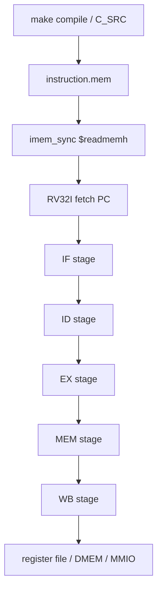

# 09. RV32I `instruction.mem` To Pipeline Flow Specification

## 1. Mục đích

Tài liệu này giai thich lượng **RV32I CPU** tu lúc file `instruction.mem`
được nạp vao `IMEM` cho toi khi CPU:

1. fetch lenh
2. decode
3. thuc thì
4. truy cap `DMEM` hoặc `MMIO`
5. ghi kết quả ve thanh ghi hoặc DMEM

Tài liệu này tập trung vao **CPU pipeline**. No không mô tả chỉ tiet TX/RX,
ngoài tru nhưng cho CPU phải dung `lw/sw` để cấu hình DMA.

## 2. Pham vi file `.mem`

Trong hệ thống hiện tại:

- `instruction.mem` là image của chương trình RV32I
- file này được tạo khi `make compile`
- `imem_sync` nạp file bằng `$readmemh("instruction.mem", ...)`
- `instruction.mem` không phải input data file

Luon phải tách 2 lượng:

| Loại file | Noi nạp | Mục đích |
|---|---|---|
| `instruction.mem` | `IMEM` | Chương trình RV32I |
| `input*.txt` / `input*.bin` | `DMEM` | Dữ liệu để CPU/DMA xu ly |

## 3. Tong quan flow



## 4. `instruction.mem` vao `IMEM`

### 4.1 Tạo file

Flow build hiện tại:

1. `make compile` build C testcase thanh ELF/BIN/MEM
2. file output được copy thanh `sim/instruction.mem`
3. `imem_sync` nạp file này khi simulation bắt đầu

### 4.2 IMEM load trong RTL

`rtl/imem_sync.v` có 2 che do:

- simulation behavioral:
  - dung `reg [31:0] instructions_r [0:2047]`
  - goi `$readmemh("instruction.mem", instructions_r)`
- Vivado IP:
  - dung `IMEM_ip`

Nếu simulation:

```verilog
always @(posedge clk_i) begin
  if (en_i)
    instruction_r <= instructions_r[instr_addr_i];
  else
    instruction_r <= `NOP_INSTR;
end
```

Nghĩa là:

- khi CPU enable fetch, IMEM trả ve lenh tai `PC[12:2]`
- khi không enable, output ve NOP

### 4.3 Chu kỳ đầu tiên sau khi reset

Sau khi simulation bắt đầu:

1. `instruction.mem` da nằm trong `IMEM`
2. `rst_i` giữ CPU o trạng thái reset
3. `PC` quay ve `RESET_PC = 0x00000000`
4. khi reset được tha, IF stage bắt đầu fetch word đầu tiên tai `PC = 0`
5. `instruction_o` tu IMEM cập nhật theo clock sync, sau đó di qua ID/EX/MEM/WB

Noi don gian:

- `instruction.mem` không di qua DMA
- `instruction.mem` không nằm trong DMEM
- CPU chỉ fetch lenh tu IMEM, còn data phải được nạp vao DMEM bằng loader/testbench/UART

## 5. RV32I pipeline trong `top_rv32_sync`

Pipeline hiện tại gom 5 pha chính:

1. IF
2. ID
3. EX
4. MEM
5. WB

### 5.1 IF stage (`if_stage_sync`)

| Muc | Noi dung |
|---|---|
| Input | `clk_i`, `rst_i`, `flush_i`, `stall_i`, `if_bj_taken_i`, `if_pc_bj_i`, `imem_instr_i` |
| Output | `imem_en_o`, `imem_addr_o`, `ifid_pc_o`, `ifid_instruction_o` |
| Chức năng | Quan ly PC, gửi fetch request sang IMEM, nhận instruction trả về sau 1 chu kỳ, giữ pipeline khi stall, xoa fetch cũ khi branch/jump/flush |

Mô tả input/output:

| Tín hiệu | Hướng | Description |
|---|---|---|
| `clk_i` | input | Clock đồng bộ cho tat ca thanh ghi IF |
| `rst_i` | input | Reset pipeline IF ve `RESET_PC` và dua instruction output ve NOP |
| `flush_i` | input | Xoa request/response dang cho và dua IF/ID ve NOP |
| `stall_i` | input | Dung cập nhật PC/IFID; nếu response IMEM ve trong lúc stall thì buffer lại |
| `if_bj_taken_i` | input | Bao EX stage da quyet dinh branch/jump taken |
| `if_pc_bj_i` | input | Địa chỉ PC mới khi branch/jump taken |
| `imem_instr_i` | input | Instruction 32-bit trả ve tu IMEM cho fetch request trước đó |
| `imem_en_o` | output | Enable request fetch sang IMEM |
| `imem_addr_o` | output | Địa chỉ fetch hiện tại, lay tu `pc_r` |
| `ifid_pc_o` | output | PC da chot sang ID stage |
| `ifid_instruction_o` | output | Instruction da chot sang ID stage; có thể là NOP khi reset/flush/không có response hợp lệ |

Thanh ghi trong IF stage:

| Thanh ghi | Bit width | Định dạng dữ liệu | Chức năng |
|---|---:|---|---|
| `pc_r` | 32 | PC byte-address, word-aligned (`PC[1:0]=00`) | PC hiện tại của IF stage, cung cấp địa chỉ fetch cho IMEM |
| `req_pc_r` | 32 | PC byte-address của request dang outstanding | PC của fetch request dang outstanding, dung để ghep với response |
| `req_valid_r` | 1 | Valid flag (`0/1`) | Danh đầu có fetch request dang cho instruction trả ve |
| `resp_pc_r` | 32 | PC byte-address của response buffer | PC được buffer lại khi response đến trong lúc stall |
| `resp_instr_r` | 32 | Raw RV32I instruction word; `opcode=instr[6:0]` | Instruction được buffer lại khi response đến trong lúc stall |
| `resp_valid_r` | 1 | Valid flag (`0/1`) | Danh đầu response buffer hợp lệ |
| `ifid_pc_r` | 32 | PC byte-address chot sang IF/ID | Thanh ghi IF/ID chot PC sang ID stage |
| `ifid_instruction_r` | 32 | Raw RV32I instruction word; NOP khi `0x00000013` | Thanh ghi IF/ID chot instruction sang ID stage |

### 5.2 ID stage (`id_stage`)

| Muc | Noi dung |
|---|---|
| Input | `clk_i`, `rst_i`, `ifid_pc_i`, `ifid_instruction_i`, `flush_i`, `hold_i`, `bubble_i`, `rf_rs1_data_i`, `rf_rs2_data_i` |
| Output | `rf_rs1_addr_o`, `rf_rs2_addr_o`, `idex_jal_o`, `idex_jalr_o`, `idex_se_alu_src1_o`, `idex_se_alu_src2_o`, `idex_aluop_o`, `idex_rs1_data_o`, `idex_rs2_data_o`, `idex_imm_o`, `idex_rs1_addr_o`, `idex_rs2_addr_o`, `idex_mem_we_o`, `idex_mem_en_o`, `idex_width_se_o`, `idex_wb_se_o`, `idex_regwrite_o`, `idex_rd_addr_o`, `idex_pc_o` |
| Chức năng | Decode opcode/funct, chọn `rs1/rs2/rd`, sinh immediate, tạo control bit cho EX/MEM/WB, lay dữ liệu tu register file, và lat các giá trị này sang ID/EX. `hold_i` giữ nguyên trạng thái; `bubble_i` và `flush_i` xoa noi dừng pipeline. |

Mô tả input/output:

| Tín hiệu | Hướng | Description |
|---|---|---|
| `clk_i` | input | Clock đồng bộ cho thanh ghi ID/EX |
| `rst_i` | input | Reset ID/EX ve NOP/control inactive |
| `ifid_pc_i` | input | PC của instruction dang decode |
| `ifid_instruction_i` | input | Instruction 32-bit nhận tu IF/ID |
| `flush_i` | input | Xoa ID/EX khi branch/jump redirect hoặc flush pipeline |
| `hold_i` | input | Giữ nguyên ID/EX, không chot instruction mới |
| `bubble_i` | input | Chen NOP vao ID/EX để xu ly hazard |
| `rf_rs1_data_i` | input | Dữ liệu đọc tu register file tai địa chỉ `rs1` |
| `rf_rs2_data_i` | input | Dữ liệu đọc tu register file tai địa chỉ `rs2` |
| `rf_rs1_addr_o` | output | Địa chỉ đọc cổng rs1 của register file |
| `rf_rs2_addr_o` | output | Địa chỉ đọc cổng rs2 của register file |
| `idex_jal_o` | output | Control bit bao instruction là `jal` |
| `idex_jalr_o` | output | Control bit bao instruction là `jalr` |
| `idex_se_alu_src1_o` | output | Chọn operand A của ALU: `1` dung PC, `0` dung rs1 |
| `idex_se_alu_src2_o` | output | Chọn operand B của ALU: `1` dung rs2, `0` dung immediate |
| `idex_aluop_o` | output | Ma lenh ALU/branch dua sang EX |
| `idex_rs1_data_o` | output | Giá trị rs1 da chot sang EX |
| `idex_rs2_data_o` | output | Giá trị rs2 da chot sang EX |
| `idex_imm_o` | output | Immediate da decode và extend theo format instruction |
| `idex_rs1_addr_o` | output | Địa chỉ rs1 da chot, dùng cho forwarding/hazard |
| `idex_rs2_addr_o` | output | Địa chỉ rs2 da chot, dùng cho forwarding/hazard |
| `idex_mem_we_o` | output | Store enable; `1` với `sb/sh/sw` |
| `idex_mem_en_o` | output | Memory access enable; `1` với load/store |
| `idex_width_se_o` | output | Mã độ rộng load/store: byte, halfword, word, signed/unsigned |
| `idex_wb_se_o` | output | Chọn nguồn writeback: ALU, MEM, hoặc `PC+4` |
| `idex_regwrite_o` | output | Cho phep ghi ve register file o WB |
| `idex_rd_addr_o` | output | Địa chỉ thanh ghi dich `rd`; bằng 0 nếu instruction không ghi rd |
| `idex_pc_o` | output | PC của instruction da chot sang EX |

Thanh ghi trong ID stage:

| Thanh ghi | Bit width | Định dạng dữ liệu | Chức năng |
|---|---:|---|---|
| `idex_jal_o` | 1 | Control flag (`0/1`) | Danh đầu lenh `jal`, cho EX stage biet phải jump và ghi `PC+4` ve rd |
| `idex_jalr_o` | 1 | Control flag (`0/1`) | Danh đầu lenh `jalr`, cho EX stage biet phải jump qua địa chỉ tính toàn |
| `idex_se_alu_src1_o` | 1 | Mux select (`1=PC`, `0=rs1`) | Chọn `PC` làm operand A của ALU (vi đủ `auipc`) |
| `idex_se_alu_src2_o` | 1 | Mux select (`1=rs2`, `0=imm`) | Chọn `rs2` làm operand B của ALU; nếu `0` thì dung immediate |
| `idex_aluop_o` | 4 | ALU/branch op code theo `defines.vh` | Ma điều khiển ALU / branch cho EX stage |
| `idex_rs1_data_o` | 32 | Raw register data word | Giá trị đọc tu register file o `rs1` |
| `idex_rs2_data_o` | 32 | Raw register data word | Giá trị đọc tu register file o `rs2` |
| `idex_imm_o` | 32 | Sign/zero-extended immediate word | Immediate đã được sinh và extend phụ hop loại lenh |
| `idex_rs1_addr_o` | 5 | Thanh ghi index `x0..x31` | Số hiệu thanh ghi `rs1`, dùng cho forwarding/hazard check |
| `idex_rs2_addr_o` | 5 | Thanh ghi index `x0..x31` | Số hiệu thanh ghi `rs2`, dùng cho forwarding/hazard check |
| `idex_mem_we_o` | 1 | Store enable flag (`0/1`) | Bat ghi memory cho lenh store |
| `idex_mem_en_o` | 1 | Memory enable flag (`0/1`) | Bat truy cap memory cho lenh load/store |
| `idex_width_se_o` | 3 | Load/store size code (`LB/LH/LW/LBU/LHU` hoặc `SB/SH/SW`) | Chọn độ rộng truy cap |
| `idex_wb_se_o` | 2 | Writeback select (`00=ALU`, `01=MEM`, `10=PC+4`, `11=INVALID`) | Chọn nguồn ghi ve rd |
| `idex_regwrite_o` | 1 | Thanh ghi write enable (`0/1`) | Cho phep ghi ve register file |
| `idex_rd_addr_o` | 5 | Thanh ghi index `x0..x31` | Số hiệu thanh ghi dich `rd` |
| `idex_pc_o` | 32 | PC byte-address, word-aligned | PC của instruction hiện tại, dùng cho `PC+4` và branch target |

### 5.3 EX stage (`ex_stage`)

| Muc | Noi dung |
|---|---|
| Input | `clk_i`, `rst_i`, `flush_i`, `stall_i`, `ex_pc_i`, `ex_imm_i`, `ex_rs1_data_i`, `ex_rs2_data_i`, `ex_jal_i`, `ex_jalr_i`, `ex_alu_src1_i`, `ex_alu_src2_i`, `ex_aluop_i`, `ex_mem_we_i`, `ex_mem_en_i`, `ex_width_se_i`, `ex_wb_se_i`, `ex_regwrite_i`, `ex_rd_addr_i` |
| Output | `exif_pc_bj_o`, `exif_bj_taken_o`, `exmem_mem_we_o`, `exmem_mem_en_o`, `exmem_width_se_o`, `exmem_wb_se_o`, `exmem_regwrite_o`, `exmem_rd_addr_o`, `exmem_alu_result_o`, `exmem_rs2_data_o`, `exmem_pc_plus_o` |
| Chức năng | Chọn operand, tính ALU result, so sánh branch, tính jump target, phat hien branch/jump taken, và chot thông tin sang EX/MEM cho MEM stage. |

Mô tả input/output:

| Tín hiệu | Hướng | Description |
|---|---|---|
| `clk_i` | input | Clock đồng bộ cho thanh ghi EX/MEM |
| `rst_i` | input | Reset EX/MEM ve control inactive và data 0 |
| `flush_i` | input | Xoa EX/MEM khi branch/jump redirect |
| `stall_i` | input | Giữ nguyên EX/MEM, không chot kết quả EX mới |
| `ex_pc_i` | input | PC của instruction dang o EX |
| `ex_imm_i` | input | Immediate da decode tu ID stage |
| `ex_rs1_data_i` | input | Operand rs1 sau forwarding |
| `ex_rs2_data_i` | input | Operand rs2 sau forwarding; cung là data store nếu instruction là store |
| `ex_jal_i` | input | Control bit cho lenh `jal` |
| `ex_jalr_i` | input | Control bit cho lenh `jalr` |
| `ex_alu_src1_i` | input | Chọn operand A: `1` dung PC, `0` dung rs1 |
| `ex_alu_src2_i` | input | Chọn operand B: `1` dung rs2, `0` dung immediate |
| `ex_aluop_i` | input | Ma phep toàn ALU hoặc so sánh branch |
| `ex_mem_we_i` | input | Store enable di kem instruction |
| `ex_mem_en_i` | input | Memory access enable di kem instruction |
| `ex_width_se_i` | input | Độ rộng load/store di kem instruction |
| `ex_wb_se_i` | input | Lua chọn nguồn writeback di kem instruction |
| `ex_regwrite_i` | input | Cho phep ghi rd di kem instruction |
| `ex_rd_addr_i` | input | Địa chỉ rd di kem instruction |
| `exif_pc_bj_o` | output | Địa chỉ PC dich nếu branch/jump taken |
| `exif_bj_taken_o` | output | Tín hiệu redirect IF khi branch/jump được lay |
| `exmem_mem_we_o` | output | Store enable da chot sang MEM |
| `exmem_mem_en_o` | output | Memory enable da chot sang MEM |
| `exmem_width_se_o` | output | Độ rộng truy cap memory da chot sang MEM |
| `exmem_wb_se_o` | output | Lua chọn writeback da chot sang MEM/WB |
| `exmem_regwrite_o` | output | Regwrite da chot sang MEM/WB |
| `exmem_rd_addr_o` | output | Địa chỉ rd da chot sang MEM/WB |
| `exmem_alu_result_o` | output | Kết quả ALU; với load/store đây là effective address |
| `exmem_rs2_data_o` | output | Data store da chot sang MEM |
| `exmem_pc_plus_o` | output | `PC + 4` da chot để writeback cho jump |

Thanh ghi trong EX stage:

| Thanh ghi | Bit width | Định dạng dữ liệu | Chức năng |
|---|---:|---|---|
| `exmem_mem_we_o` | 1 | Store enable flag (`0/1`) | Giữ bit store enable sang MEM stage |
| `exmem_mem_en_o` | 1 | Memory enable flag (`0/1`) | Giữ bit memory access enable sang MEM stage |
| `exmem_width_se_o` | 3 | Load/store size code (`LB/LH/LW/LBU/LHU` hoặc `SB/SH/SW`) | Giữ độ rộng truy cap memory sang MEM stage |
| `exmem_wb_se_o` | 2 | Writeback select (`00=ALU`, `01=MEM`, `10=PC+4`, `11=INVALID`) | Giữ lua chọn nguồn writeback sang WB stage |
| `exmem_regwrite_o` | 1 | Thanh ghi write enable (`0/1`) | Giữ bit cho phep ghi register file sang WB stage |
| `exmem_rd_addr_o` | 5 | Thanh ghi index `x0..x31` | Giữ số hiệu rd sang WB stage |
| `exmem_alu_result_o` | 32 | ALU result / effective address / branch compare input | Giữ ALU result, effective address, hoặc kết quả branch-related can dung tiep |
| `exmem_rs2_data_o` | 32 | Raw store data word | Giữ dữ liệu rs2 thực tế để store vao memory/MMIO |
| `exmem_pc_plus_o` | 32 | PC byte-address + 4 | Giữ `PC + 4` để ghi ve rd khi lenh `jal/jalr` |

### 5.4 MEM stage (`mem_stage`)

| Muc | Noi dung |
|---|---|
| Input | `clk_i`, `rst_i`, `mem_we_i`, `mem_en_i`, `mem_width_se_i`, `mem_alu_result_i`, `mem_data_i`, `mem_regwrite_i`, `mem_rd_addr_i`, `mem_wb_se_i`, `mem_pc_plus_i`, `data_r_i` |
| Output | `en_o`, `we_o`, `addr_o`, `data_w_o`, `mem_data_w`, `memwb_regwrite_o`, `memwb_rd_addr_o`, `memwb_wb_se_o`, `memwb_pc_plus_o`, `memwb_alu_result_o`, `memwb_mem_data_o`, `mem_stage_err_o` |
| Chức năng | Thực hiện read/write DMEM hoặc MMIO, canh lane theo byte/half/word, sign/zero-extend dữ liệu đọc, báo lỗi truy cap không hợp lệ, và chot dữ liệu sang MEM/WB. |

Mô tả input/output:

| Tín hiệu | Hướng | Description |
|---|---|---|
| `clk_i` | input | Clock đồng bộ cho thanh ghi MEM/WB |
| `rst_i` | input | Reset MEM/WB ve control inactive và data 0 |
| `mem_we_i` | input | Cho biet transaction hiện tại là store |
| `mem_en_i` | input | Bat truy cap memory/MMIO cho load/store |
| `mem_width_se_i` | input | Mã độ rộng và signed/unsigned của load/store |
| `mem_alu_result_i` | input | Effective address tu EX stage |
| `mem_data_i` | input | Data store tu rs2 |
| `mem_regwrite_i` | input | Regwrite pass-through tu EX/MEM |
| `mem_rd_addr_i` | input | Địa chỉ rd pass-through tu EX/MEM |
| `mem_wb_se_i` | input | Lua chọn nguồn writeback pass-through |
| `mem_pc_plus_i` | input | `PC + 4` pass-through cho jump |
| `data_r_i` | input | Data 32-bit đọc tu DMEM/MMIO |
| `en_o` | output | Enable request sang DMEM/MMIO fabric |
| `we_o` | output | Byte write enable 4-bit cho store |
| `addr_o` | output | Địa chỉ memory/MMIO, lay tu `mem_alu_result_i` khi `mem_en_i=1` |
| `data_w_o` | output | Data write da canh lane theo byte/half/word |
| `mem_data_w` | output | Data load da sign/zero-extend, dùng cho forwarding |
| `memwb_regwrite_o` | output | Regwrite da chot sang WB |
| `memwb_rd_addr_o` | output | Địa chỉ rd da chot sang WB |
| `memwb_wb_se_o` | output | Lua chọn nguồn writeback da chot sang WB |
| `memwb_pc_plus_o` | output | `PC + 4` da chot sang WB |
| `memwb_alu_result_o` | output | ALU result/effective address da chot sang WB |
| `memwb_mem_data_o` | output | Data load da chuan hoa và chot sang WB |
| `mem_stage_err_o` | output | Ma lỗi MEM stage: `01` write error, `10` read error, `00` không lỗi |

Thanh ghi trong MEM stage:

| Thanh ghi | Bit width | Định dạng dữ liệu | Chức năng |
|---|---:|---|---|
| `write_error` | 1 | Error flag (`0/1`) | Danh đầu store không hợp lệ (sai căn / sai độ rộng) |
| `read_error` | 1 | Error flag (`0/1`) | Danh đầu load không hợp lệ (sai căn / sai độ rộng) |
| `data_r_cvt_w` | 32 | Sign/zero-extended data word | Dữ liệu đọc sau khi da sign/zero extend, sẽ di vao `memwb_mem_data_o` |
| `memwb_regwrite_o` | 1 | Thanh ghi write enable (`0/1`) | Giữ bit cho phep ghi register file sang WB stage |
| `memwb_rd_addr_o` | 5 | Thanh ghi index `x0..x31` | Giữ số hiệu thanh ghi dich sang WB stage |
| `memwb_wb_se_o` | 2 | Writeback select (`00=ALU`, `01=MEM`, `10=PC+4`, `11=INVALID`) | Giữ lua chọn nguồn writeback sang WB stage |
| `memwb_pc_plus_o` | 32 | PC byte-address + 4 | Giữ `PC + 4` cho writeback của jump |
| `memwb_alu_result_o` | 32 | ALU result / effective address | Giữ ALU result / địa chỉ tính toàn sang WB stage |
| `memwb_mem_data_o` | 32 | Raw or sign/zero-extended memory data word | Giữ dữ liệu load da chuan hoa sang WB stage |
| `mem_stage_err_o` | 2 | Error code (`00=OK`, `01=write_error`, `10=read_error`) | Ma lỗi 2-bit của MEM stage |

### 5.5 WB stage

| Muc | Noi dung |
|---|---|
| Input | `memwb_regwrite_w`, `memwb_rd_addr_w`, `memwb_wb_se_w`, `memwb_pc_plus_w`, `memwb_alu_result_w`, `memwb_mem_data_w` |
| Output | `wb_data_w`, `rf_reg_write_w`, `rf_rd_addr_w` |
| Chức năng | Chọn dữ liệu ghi ve register file theo `wb_se` và phat xung write enable + rd index sang register file. Đây là noi `addi`, `lw`, `jal`, `lui`, `auipc` kết thúc ve mất writeback. `sw` không ghi rd. |

Mô tả input/output:

| Tín hiệu | Hướng | Description |
|---|---|---|
| `memwb_regwrite_w` | input | Cho phep ghi register file, đã được chot tu MEM/WB |
| `memwb_rd_addr_w` | input | Địa chỉ thanh ghi dich `rd` cần ghi |
| `memwb_wb_se_w` | input | Chọn nguồn dữ liệu writeback |
| `memwb_pc_plus_w` | input | Giá trị `PC + 4` cho `jal/jalr` |
| `memwb_alu_result_w` | input | Kết quả ALU cho ALU-op, `lui`, `auipc`, hoặc CSR/system có ghi rd |
| `memwb_mem_data_w` | input | Dữ liệu load tu MEM stage |
| `wb_data_w` | output | Dữ liệu 32-bit cuối cùng ghi vao register file |
| `rf_reg_write_w` | output | Write enable của register file |
| `rf_rd_addr_w` | output | Địa chỉ write port của register file |

Thanh ghi trong WB stage:

| Thanh ghi | Bit width | Định dạng dữ liệu | Chức năng |
|---|---:|---|---|
| Không có thanh ghi riêng | - | WB stage không lưu state mới; chỉ mux trên các dữ liệu `memwb_*` | WB stage không chot thêm state mới; no sử dụng trực tiếp các thanh ghi `memwb_*` đã được lưu o MEM stage |

### 5.6 Control signal mapping theo nhom lenh

| Nhom lenh | `idex_mem_en_o` | `idex_mem_we_o` | `idex_wb_se_o` | `idex_regwrite_o` | Ghi chú |
|---|---|---|---|---|---|
| `lw/lh/lb/lhu/lbu` | `1` | `0` | `MEM` | `1` | load vao rd o WB |
| `sw/sh/sb` | `1` | `1` | invalid / don't care | `0` | chỉ ghi DMEM/MMIO |
| `add/sub/xor/...` | `0` | `0` | `ALU` | `1` | ALU result vao rd |
| `addi/ori/andi/xori/slli/srli/srai/slti/sltiu` | `0` | `0` | `ALU` | `1` | ALU với immediate |
| `lui/auipc` | `0` | `0` | `ALU` | `1` | `lui` ghi imm, `auipc` ghi `PC+imm` |
| `jal/jalr` | `0` | `0` | `PC+4` | `1` | jump và ghi return address |
| `beq/bne/blt/bge/bltu/bgeu` | `0` | `0` | invalid | `0` | chỉ tạo branch control |
| `fence` | `0` | `0` | invalid | `0` | placeholder, không tạo data result |
| `ebreak` | `0` | `0` | invalid | `0` | testcase terminator |

## 6. Data flow theo từng loại instruction

### 6.1 `lw`


Trong project này, `lw` được dùng để:

- đọc `INPUT_LEN_ADDR`
- đọc `DMA_STATUS`
- đọc `BYTES_DONE`
- đọc `CIPHERTEXT_BYTES_PRODUCED`
- đọc result words tu DMEM

`lw` trong flow DMA là instruction quan trong nhất vi no tạo polling loop:

1. CPU đọc `STATUS`
2. CPU check `busy/done/error`
3. CPU lặp lại nếu chưa xong
4. `mem_stage_sync` có thể giữ 1 cycle cho synchronous read

### 6.2 `sw`


Trong project này, `sw` được dùng để:

- ghi `SRC_ADDR`, `DST_ADDR`, `LEN_BYTES`, `MODE`, `BLOCK_CFG`
- ghi `IV0..IV3`
- ghi result words vao DMEM

`sw` trong flow DMA là cach CPU:

- chọn vung source/destination
- nạp mode cho TX/RX
- start transfer
- lưu summary kết quả

### 6.3 Branch / jump

Branch/jump không phải data-plane, nhưng rất quan trong với CPU:

- `beq`, `bne`
- `jal`
- `jalr`

Chung dung để:

- thoat vong polling
- nhay sang error handler
- lặp check status

Trong testcase hiện tại:

- `beq`/`bne` dung để thoat vong polling
- `jal`/`jalr` dung để nhay giua các block code hoặc vao `main`
- nhưng lenh này không cần MMIO, nhưng vẫn di qua IF/ID/EX/WB như bình thường

### 6.4 ALU immediate

`addi`, `andi`, `ori`, `xori`, `slli`, `srli`, `lui` được dùng nhieu cho:

- tính địa chỉ MMIO
- tạo IV demo
- mask bit status
- shift/pack giá trị

Đây là nhom lenh RV32I dung nhieu để tạo IV demo trong `test_mmio_dma.c`.
Vi đủ:

- `lui` tạo giá trị base 20-bit trên
- `xori` tron input length, address, counter
- `slli/srli` tạo entropy lua chọn tu bit pattern
- `ori/andi` mask hoặc gan bit control

## 7.1.1 Vi đủ flow với `input1`

Một testcase `input1` dien hinh có thể hiểu theo các lenh sau:

```asm
lw    a2, 64(zero)        # doc input_len tu DMEM[0x40]
sw    a4, 40(a3)          # ghi IV0
sw    a5, 44(a4)          # ghi IV1
sw    a5, 48(a4)          # ghi IV2
sw    a5, 52(a4)          # ghi IV3
sw    a4, 8(a5)           # SRC_ADDR
sw    a4, 12(a5)          # DST_ADDR
sw    a2, 16(a5)          # LEN_BYTES
sw    a4, 20(a5)          # MODE
sw    a4, 24(a5)          # BLOCK_CFG
sw    a4, 0(a5)           # CONTROL.start
lw    a4, 4(a3)           # poll STATUS
bne   a4, zero, .poll
lw    a5, 28(a3)          # BYTES_DONE / result
ebreak                    # testcase end marker
```

Không phải assembly này lúc nào cung giong 100% binary thực tế, nhưng
đây là lượng logic mà CPU dang chạy.

## 7. Lượng CPU dùng trong testcase DMA

### 7.1 Bắt đầu

CPU chạy tu `instruction.mem`, rồi:

1. `lw input_len` tu `DMEM[0x40]`
2. tạo `IV0..IV3` bằng instruction RV32I
3. ghi `DMA_SRC_ADDR`
4. ghi `DMA_DST_ADDR`
5. ghi `DMA_LEN_BYTES`
6. ghi `DMA_MODE`
7. ghi `DMA_BLOCK_CFG`
8. ghi `CONTROL.start`

### 7.2 Polling

CPU lặp:

1. `lw DMA_STATUS`
2. kiểm trả `busy/done/error`
3. nếu chưa xong thì lặp lại

Đây là **software polling**, không phải interrupt.

### 7.3 Kết thúc

CPU đọc:

- `BYTES_DONE`
- `CIPHERTEXT_BYTES_PRODUCED`
- `DEBUG`

Sau đó ghi:

- signature
- error mask
- status summary
- result head

vao DMEM để testbench đọc lại.

## 8. Pipeline semantics quan trong

### 8.1 Load-use hazard

`top_rv32_sync` có hazard detection cho load-use.
Nếu `lw` tạo ra giá trị mã instruction sau dung ngay, pipeline sẽ bubble/hold.

### 8.2 MMIO hold

Khi CPU truy cap MMIO:

- `cpu_mmio_to_apb_bridge` tạo `cpu_stall_req_o`
- `top_rv32_sync` hold front-end pipeline
- instruction hiện tại không được chạy tiep cho toi khi APB xong

Đây là lý do `lw DMA_STATUS` có thể stall, còn `DMA busy` không làm CPU global stall.

### 8.3 Branch flush

Khi branch taken:

- IF và ID bị flush
- PC được nạp lại địa chỉ branch target

### 8.4 Synchronous IMEM/DMEM

Hệ thống hiện tại giảm sat synchronous BRAM behavior:

- instruction vao sau 1 cycle fetch
- load/store có response theo timing của memory model

## 9. RV32I instruction set thực sự dùng trong project

Chủ yếu gom các nhom sau:

### 9.1 Bằng instruction hỗ trợ

| Nhom | Lenh | Trạng thái hiện tại | Cach thuc thì trong RTL |
|---|---|---|---|
| U-type | `lui` | Hỗ trợ | ID tạo `imm_u`, EX không cần rs1, WB ghi `imm_u` vao `rd` |
| U-type | `auipc` | Hỗ trợ | ID tạo `imm_u`, EX dung `PC + imm_u`, WB ghi kết quả vao `rd` |
| J-type | `jal` | Hỗ trợ | ID tạo `imm_j`, EX tính `PC + imm_j`, IF/ID bị flush khi taken, WB ghi `PC+4` |
| I-jump | `jalr` | Hỗ trợ | ID tạo `imm_i`, EX tính `(rs1 + imm_i) & ~1`, IF/ID bị flush khi taken, WB ghi `PC+4` |
| Branch | `beq` | Hỗ trợ | EX so sánh rs1/rs2 bằng ALU branch opcode |
| Branch | `bne` | Hỗ trợ | EX so sánh rs1/rs2 bằng ALU branch opcode |
| Branch | `blt` | Hỗ trợ | EX so sánh signed `<` |
| Branch | `bge` | Hỗ trợ | EX so sánh signed `>=` |
| Branch | `bltu` | Hỗ trợ | EX so sánh unsigned `<` |
| Branch | `bgeu` | Hỗ trợ | EX so sánh unsigned `>=` |
| Load | `lb` | Hỗ trợ | MEM đọc 1 byte, sign-extend ve `rd` |
| Load | `lh` | Hỗ trợ | MEM đọc 2 byte, sign-extend ve `rd` |
| Load | `lw` | Hỗ trợ | MEM đọc 4 byte, write-back qua `MEM` path |
| Load | `lbu` | Hỗ trợ | MEM đọc 1 byte, zero-extend ve `rd` |
| Load | `lhu` | Hỗ trợ | MEM đọc 2 byte, zero-extend ve `rd` |
| Store | `sb` | Hỗ trợ | MEM ghi 1 byte theo `we_o` byte-enable |
| Store | `sh` | Hỗ trợ | MEM ghi 2 byte theo halfword alignment |
| Store | `sw` | Hỗ trợ | MEM ghi 4 byte vao DMEM hoặc MMIO |
| OP-IMM | `addi` | Hỗ trợ | ID tạo `imm_i`, EX thực hiện `ADD` với immediate |
| OP-IMM | `slti` | Hỗ trợ | ID tạo `imm_i`, EX thực hiện signed compare |
| OP-IMM | `sltiu` | Hỗ trợ | ID tạo `imm_i`, EX thực hiện unsigned compare |
| OP-IMM | `xori` | Hỗ trợ | ID tạo `imm_i`, EX thực hiện XOR |
| OP-IMM | `ori` | Hỗ trợ | ID tạo `imm_i`, EX thực hiện OR |
| OP-IMM | `andi` | Hỗ trợ | ID tạo `imm_i`, EX thực hiện AND |
| OP-IMM | `slli` | Hỗ trợ | ID tạo `shamt`, EX shift left logical |
| OP-IMM | `srli` | Hỗ trợ | ID tạo `shamt`, EX shift right logical |
| OP-IMM | `srai` | Hỗ trợ | ID tạo `shamt`, EX shift right arithmetic |
| OP | `add` | Hỗ trợ | EX ALU `ADD` |
| OP | `sub` | Hỗ trợ | EX ALU `SUB` |
| OP | `sll` | Hỗ trợ | EX ALU `SLL` |
| OP | `slt` | Hỗ trợ | EX ALU `SLT` |
| OP | `sltu` | Hỗ trợ | EX ALU `SLTU` |
| OP | `xor` | Hỗ trợ | EX ALU `XOR` |
| OP | `srl` | Hỗ trợ | EX ALU `SRL` |
| OP | `sra` | Hỗ trợ | EX ALU `SRA` |
| OP | `or` | Hỗ trợ | EX ALU `OR` |
| OP | `and` | Hỗ trợ | EX ALU `AND` |
| Fence | `fence` | Placeholder | Decoder cho qua như instruction non-data; không có memory ordering engine riêng |
| System | `ebreak` | Used as testcase terminator | Assembly testcase dung `ebreak` để danh đầu kết thúc; CPU hiện tại không có trap/interrupt handler đây đủ |
| System | `ecall` / CSR ops | Không dùng trong flow chính | Decoder có nhận `SYSTEM` baseline, nhưng SoC hiện tại chưa có CSR/trap architecture đây đủ |

### 9.2 Ghi chú ve `SYSTEM`

Trong RTL hiện tại:

- `opcode == SYSTEM` được decoder nhận dien
- nhưng hệ thống chưa có trap handler/CSR block đây đủ
- testcase dung `ebreak` như một terminal marker trong assembly, không phải
  một trap flow hoàn chính

### 9.3 Cach từng nhom lenh di qua pipeline

| Nhom lenh | IF | ID | EX | MEM | WB |
|---|---|---|---|---|---|
| `lui`, `auipc` | fetch | decode imm_u | tính/lay giá trị | không dùng memory | ghi `rd` |
| `jal`, `jalr` | fetch | decode jump | tính target, flush IF/ID | không dùng memory | ghi `PC+4` |
| Branch | fetch | decode branch | so sánh và quyet dinh taken | không dùng memory | không writeback |
| `lb/lh/lw/lbu/lhu` | fetch | decode load | tính address | đọc DMEM/MMIO, có synchronous wait | ghi `rd` |
| `sb/sh/sw` | fetch | decode store | tính address | ghi DMEM/MMIO | không writeback |
| OP/OP-IMM | fetch | decode ALU | tính kết quả ALU | không dùng memory | ghi `rd` |
| `fence` | fetch | decode placeholder | không có hanh dong data-plane | không có hanh dong | không writeback |
| `ebreak` | fetch | decode terminal marker | không có trap handler đây đủ | không có hanh dong | không writeback |

Không cần các lenh phuc tap hơn để chạy flow chính.

### 9.4 Ghi chú chỉ tiet cho từng lenh quan trong

| Lenh | Mô tả chỉ tiet trong design hiện tại |
|---|---|
| `lui` | Đọc 20 bit trên của immediate, dat len thanh ghi rd; dung để tạo constant 0x4000_0000, 0x0000_2000, 0x0000_6000, ... |
| `auipc` | Cổng `PC + imm_u`; không dùng trong control-path chính nhieu bằng `lui`, nhưng pipeline vẫn hỗ trợ |
| `addi` | Dung để cổng offset nhỏ, tạo `sp`, tăng counter, cổng địa chỉ, cổng lenh loop |
| `lw` | Dung để đọc `INPUT_LEN_ADDR`, `DMA_STATUS`, `BYTES_DONE`, `CIPHERTEXT_BYTES_PRODUCED`, result words |
| `sw` | Dung để ghi thanh ghi DMA và result words; đây là lenh chính để cấu hình TX/RX |
| `beq/bne` | Dung để lặp polling loop và thoat khi `done/error` |
| `jal/jalr` | Dung để nhay vao `main`, goi block control, và quay ve nếu cần |
| `xori/ori/andi` | Dung để tạo IV demo, mask flag, and bit twiddle |
| `slli/srli/srai` | Dung để mix bit khi tạo IV và xu ly giá trị control |
| `ebreak` | Dung như đầu hieu kết thúc testcase trong simulation, không phải trap handler đây đủ |
| `fence` | Không phải instruction mainline trong testcase; hiện tại chỉ là decode placeholder và không có memory-order engine riêng |

## 10. Instruction-to-use summary for this SoC

Trong các testcase control-plane của hệ thống này, nhưng lenh RV32I quan trong
nhất là:

- `lw` để đọc `INPUT_LEN_ADDR`, `STATUS`, `BYTES_DONE`, result words
- `sw` để ghi `SRC_ADDR`, `DST_ADDR`, `LEN_BYTES`, `MODE`, `BLOCK_CFG`, `IV0..IV3`
- `addi` / `lui` / `xori` / `ori` / `andi` / shift ops để tạo IV demo và mask flag
- `beq` / `bne` để polling loop thoat khi done/error
- `jal` / `jalr` để control lượng program

## 11. Ket luan

`instruction.mem` chỉ chưa **chương trình**.
Dữ liệu thực sự mà CPU xu ly nằm trong `DMEM`.

Lượng chính của RV32I hiện tại là:

1. fetch lenh tu `IMEM`
2. đọc input length và status tu `DMEM/MMIO`
3. ghi config DMA qua MMIO
4. polling `STATUS`
5. ghi kết quả/metadata ve `DMEM`

Nghĩa là:

- file `.mem` không phải data stream
- CPU không “parse file input” trực tiếp
- CPU chỉ điều khiển hệ thống và quan sat kết quả qua memory-mapped registers
