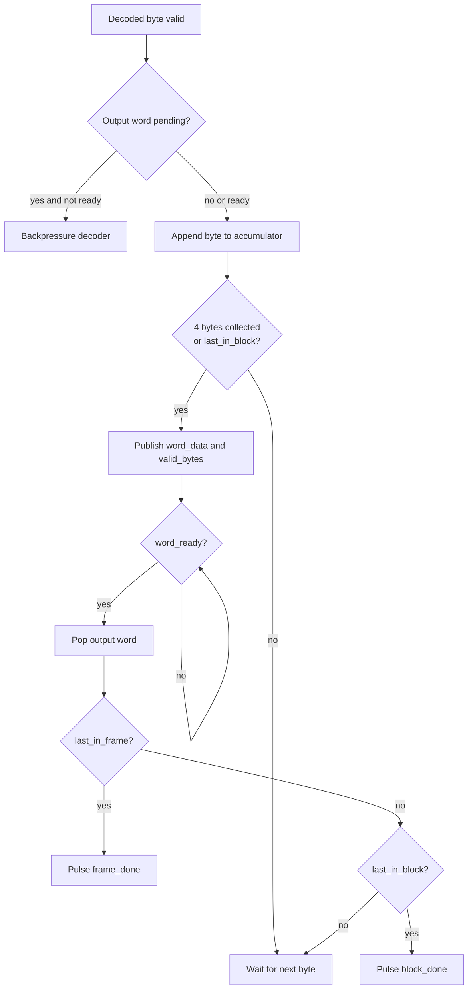

# RX Byte Packer 32 Specification

## 1. Purpose

`rx_byte_packer_32` gop byte plaintext tu `huffman_block_decoder` thanh word
32-bit cho APB output FIFO va `dma_rx_engine`.

Module nay bao toan thu tu little-endian cua `DMEM`.

Current verification status:

| Case | Coverage/use |
|---|---|
| `dma_compress_aes_input1/input3/alnum63` | Normal byte-to-word packing before DMEM writeback |
| `rx_backpressure_cov` | Output word held while APB/FIFO path is not ready |
| `rx_depacker_packer_direct_cov` | Partial final word, last-in-block, last-in-frame branches |
| `rx_if_direct_cov` | APB FIFO consumes packed word/meta correctly |

## 1.1 Packing Flow Chart



## 2. Position In RX Path

```text
huffman_block_decoder
-> rx_byte_packer_32
-> apb_huffman_rx_if
-> dma_rx_engine
```

## 3. Packing Order

Byte dau tien vao word o bits thap:

```text
byte0 -> word[7:0]
byte1 -> word[15:8]
byte2 -> word[23:16]
byte3 -> word[31:24]
```

Word cuoi block/frame co the co it hon 4 byte hop le. So byte hop le nam trong
`word_valid_bytes`.

## 4. Input Contract

| Port | Dir | Width | Data format | Meaning |
|---|---|---:|---|---|
| `clk` | in | 1 | `clk` | System clock |
| `rst_n` | in | 1 | `rst_n` | Active-low reset |
| `in_byte` | in | 8 | symbol byte | Input plaintext byte |
| `in_valid` | in | 1 | valid flag | Input byte is valid |
| `in_last_in_block` | in | 1 | bool | Last byte in current block |
| `in_last_in_frame` | in | 1 | bool | Last byte in current frame |
| `in_ready` | out | 1 | ready flag | Packer can accept next byte |

`in_last_in_frame` phai di cung `in_last_in_block`.

## 5. Output Contract

| Port | Dir | Width | Data format | Meaning |
|---|---|---:|---|---|
| `word_data` | out | 32 | little-endian word | Packed output word |
| `word_valid_bytes` | out | 3 | unsigned byte count | Number of valid bytes in `word_data` |
| `word_last_in_block` | out | 1 | bool | Last word in current block |
| `word_last_in_frame` | out | 1 | bool | Last word in current frame |
| `word_valid` | out | 1 | valid flag | Output word is valid |
| `word_ready` | in | 1 | ready flag | Downstream FIFO ready |
| `busy` | out | 1 | busy flag | Packer has buffered data |
| `block_done` | out | 1 | pulse | Block completion pulse |
| `frame_done` | out | 1 | pulse | Frame completion pulse |
| `error_flag` | out | 1 | error flag | Packing error |

`word_valid_bytes` hop le trong range `1..4`.

## 6. Completion

Module assert:

- `block_done` khi output word last-in-block duoc downstream accept
- `frame_done` khi output word last-in-frame duoc downstream accept

`apb_huffman_aes_rx_top.rx_done` currently follows `word_packer_frame_done`.

## 7. Internal registers

| Reg | Width | Data format | Meaning |
|---|---:|---|---|
| `accum_data_r` | 32 | little-endian word | Accumulator for incoming bytes |
| `accum_count_r` | 3 | unsigned byte count | Number of bytes buffered |
| `word_data_r` | 32 | little-endian word | Output word register |
| `word_valid_bytes_r` | 3 | unsigned byte count | Valid byte count in output word |
| `word_last_in_block_r` | 1 | bool | Output word last-in-block |
| `word_last_in_frame_r` | 1 | bool | Output word last-in-frame |
| `word_valid_r` | 1 | valid flag | Output word valid |
| `block_done_r` | 1 | pulse | Block done pulse |
| `frame_done_r` | 1 | pulse | Frame done pulse |
| `error_r` | 1 | error flag | Error sticky |
| `assembled_word_w` | 32 | little-endian word | Combinational assembled word |
| `next_count_w` | 3 | unsigned byte count | Next accumulator count |
| `flush_now_w` | 1 | bool | Flush decision |
| `sanitized_last_block_w` | 1 | bool | Sanitized block-last flag |
| `sanitized_last_frame_w` | 1 | bool | Sanitized frame-last flag |
| `illegal_frame_flag_w` | 1 | error flag | Illegal frame flag |

## 8. Error Conditions

`error_flag` duoc set khi:

- internal accumulated byte count vuot 3
- frame-last khong dong thoi block-last
- generated valid byte count bang zero

## 9. Related Specs

- [RX path end-to-end](./rx_path_end_to_end_spec.md)
- [APB Huffman RX interface](./apb_huffman_rx_if_spec.md)
- [DMA RX engine](./dma_rx_engine_spec.md)
