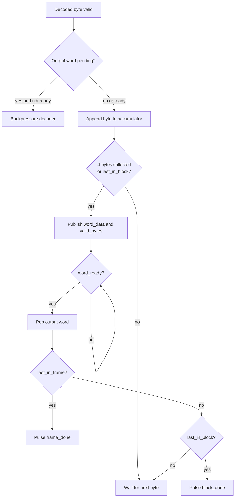

# RX Byte Packer 32 Specification

## 1. Purpose

`rx_byte_packer_32` gop byte plaintext tu `huffman_block_decoder` thanh word
32-bit cho APB output FIFO va `dma_rx_engine`.

Module nay bao toan thu tu little-endian cua `DMEM`.

## 1.1 Packing Flow Chart



## 2. Position In RX Path

```text
huffman_block_decoder
-> rx_byte_packer_32
-> apb_huffman_rx_if
-> dma_rx_engine
```

## 3. Packing Order

Byte dau tien vao word o bits thap:

```text
byte0 -> word[7:0]
byte1 -> word[15:8]
byte2 -> word[23:16]
byte3 -> word[31:24]
```

Word cuoi block/frame co the co it hon 4 byte hop le. So byte hop le nam trong
`word_valid_bytes`.

## 4. Input Contract

Input handshake:

- `in_byte`
- `in_valid`
- `in_ready`
- `in_last_in_block`
- `in_last_in_frame`

`in_last_in_frame` phai di cung `in_last_in_block`.

## 5. Output Contract

Output handshake:

- `word_data[31:0]`
- `word_valid_bytes[2:0]`
- `word_last_in_block`
- `word_last_in_frame`
- `word_valid`
- `word_ready`

`word_valid_bytes` hop le trong range `1..4`.

## 6. Completion

Module assert:

- `block_done` khi output word last-in-block duoc downstream accept
- `frame_done` khi output word last-in-frame duoc downstream accept

`apb_huffman_aes_rx_top.rx_done` currently follows `word_packer_frame_done`.

## 7. Error Conditions

`error_flag` duoc set khi:

- internal accumulated byte count vuot 3
- frame-last khong dong thoi block-last
- generated valid byte count bang zero

## 8. Related Specs

- [RX path end-to-end](./rx_path_end_to_end_spec.md)
- [APB Huffman RX interface](./apb_huffman_rx_if_spec.md)
- [DMA RX engine](./dma_rx_engine_spec.md)
