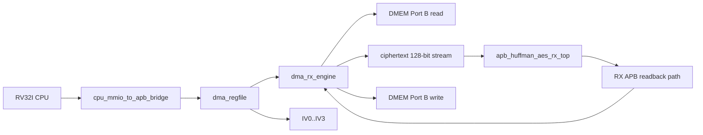
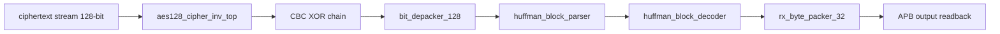

# RX Path End-to-End Specification

## 1. Mục đích

Tài liệu này mô tả riêng nhanh `RX` của SoC hiện tại:

- module nào tham gia
- ket noi giua các module
- chức năng của từng module
- flow chỉ tiet tu CPU/MMIO đến `DMEM ciphertext -> RX -> DMEM plaintext`

Spec này chỉ mô tả path active hiện tại trong repo.

Trạng thái kiểm chứng hiện tại:

| Item | Trạng thái |
|---|---|
| Main RX mode | `MODE=0x2`, AES-CBC decrypt + Huffman decode |
| Active RX testcase examples | `dma_compress_aes_input1`, `dma_compress_aes_input3`, `dma_compress_aes_alnum63_cov` |
| Error/backpressure cases | `mmio_rx_bad_length`, `rx_backpressure_cov` |
| Coverage hooks | `rx_if_direct_cov`, `rx_parser_decoder_cov`, `rx_decoder_direct_cov`, `rx_depacker_packer_direct_cov`, `rx_parser_decoder_error_direct_cov` |
| Latest regression | included in `34/34` PASS coverage baseline |

## 2. RX Goal

RX nhận ciphertext đã được TX tạo trước đó, sau đó:

- AES-128 CBC decrypt
- Huffman decode

và ghi plaintext phục hồi tro lại `DMEM`.

## 3. Đường RX top-level



## 4. Module và vai trò

### 4.0 Module to spec map

| RX module | Spec |
|---|---|
| `top_rv32_sync` | [00_current_system_spec.md](./00_current_system_spec.md) |
| `cpu_mmio_to_apb_bridge` | [cpu_mmio_to_apb_bridge_spec.md](./cpu_mmio_to_apb_bridge_spec.md) |
| `dma_regfile` | [dma_regfile_spec.md](./dma_regfile_spec.md) |
| `dma_rx_engine` | [dma_rx_engine_spec.md](./dma_rx_engine_spec.md) |
| `dmem_ip_wrapper` / `DMEM_ip` | [bram_port_usage_spec.md](./bram_port_usage_spec.md) |
| `apb_huffman_aes_rx_top` | [apb_huffman_aes_rx_top_spec.md](./apb_huffman_aes_rx_top_spec.md) |
| `aes128_cipher_inv_top` | [apb_huffman_aes_rx_top_spec.md](./apb_huffman_aes_rx_top_spec.md) |
| `bit_depacker_128` | [bit_depacker_128_spec.md](./bit_depacker_128_spec.md) |
| `huffman_block_parser` | [huffman_block_parser_spec.md](./huffman_block_parser_spec.md) |
| `huffman_block_decoder` | [huffman_block_decoder_spec.md](./huffman_block_decoder_spec.md) |
| `rx_byte_packer_32` | [rx_byte_packer_32_spec.md](./rx_byte_packer_32_spec.md) |
| `apb_huffman_rx_if` | [apb_huffman_rx_if_spec.md](./apb_huffman_rx_if_spec.md) |
| IV/CBC contract | [iv_generation_and_cbc_contract_spec.md](./iv_generation_and_cbc_contract_spec.md) |

### 4.1 Control plane modules

| Module | Vai trò |
|---|---|
| `top_rv32_sync` | Chạy chương trình RV32I để cấu hình DMA RX |
| `cpu_mmio_to_apb_bridge` | Chuyen CPU MMIO read/write thanh APB transaction |
| `dma_regfile` | Giữ config RX: `SRC_ADDR`, `DST_ADDR`, `LEN_BYTES`, `MODE`, `IV0..IV3` |

### 4.2 Data plane modules

| Module | Vai trò |
|---|---|
| `DMEM_ip` / `dmem_ip_wrapper` | Nơi lưu ciphertext input và plaintext output |
| `dma_rx_engine` | Data mover RX, đọc DMEM, feed RX stream, poll RX APB, ghi DMEM |
| `apb_huffman_aes_rx_top` | RX accelerator top |
| `aes128_cipher_inv_top` | AES decrypt core active |
| `bit_depacker_128` | [bit_depacker_128_spec.md](./bit_depacker_128_spec.md) |
| `huffman_block_parser` | [huffman_block_parser_spec.md](./huffman_block_parser_spec.md) |
| `huffman_block_decoder` | [huffman_block_decoder_spec.md](./huffman_block_decoder_spec.md) |
| `rx_byte_packer_32` | [rx_byte_packer_32_spec.md](./rx_byte_packer_32_spec.md) |
| `apb_huffman_rx_if` | [apb_huffman_rx_if_spec.md](./apb_huffman_rx_if_spec.md) |

## 5. Kết nối chính

### 5.1 CPU to DMA register file

CPU ghi MMIO vao:

- `SRC_ADDR`
- `DST_ADDR`
- `LEN_BYTES`
- `MODE = RX`
- `CONTROL.start`

Và giữ nguyên hoặc ghi lại:

- `IV0..IV3`

### 5.2 `dma_regfile` to `dma_rx_engine`

`dma_regfile` xuất:

- `src_addr_o`
- `dst_addr_o`
- `len_bytes_o`
- `direction_o`
- `start_pulse_o`

### 5.3 `dma_regfile` to RX CBC path

`dma_regfile` xuất:

```text
iv_o = {IV3, IV2, IV1, IV0}
```

Trong [rv32_soc_top.v](/mnt/h/Academic/senior_project/DATN/work/lúc/AES_huffman_all6/rtl/rv32_soc_top.v), `iv_o` được nối vao:

- `apb_huffman_aes_rx_top.cbc_iv_i`

### 5.4 `dma_rx_engine` to DMEM

`dma_rx_engine` dung `DMEM` Cổng B để:

- đọc ciphertext tu `SRC_ADDR`
- ghi plaintext phục hồi ve `DST_ADDR`

### 5.5 `dma_rx_engine` to RX top

RX input active hiện tại là stream 128-bit:

- `rx_ciphertext_word_o`
- `rx_ciphertext_word_valid_o`
- `rx_ciphertext_word_ready_i`

DMA vẫn dung private APB để đọc output RX:

- `RX_STATUS`
- `RX_META`
- `RX_DATA`

## 6. Internal RX Structure



## 7. Chức năng từng stage RX

### 7.1 `aes128_cipher_inv_top`

Giải mã từng transport block 128-bit.

### 7.2 CBC XOR chain

Phục hồi transport plaintext:

```text
P0 = AES_decrypt(C0) XOR IV
Pn = AES_decrypt(Cn) XOR Cn-1
```

RX top giữ:

- previous ciphertext block
- trạng thái block đầu / block sau

### 7.3 `bit_depacker_128`

Tách transport word 128-bit thanh stream bit/chunk cho parser.

### 7.4 `huffman_block_parser`

Đọc:

- block mode
- block size
- symbol count
- code length info
- payload window

### 7.5 `huffman_block_decoder`

Dung canonical Huffman decode để phục hồi byte stream.

### 7.6 `rx_byte_packer_32`

Gộp byte da decode thanh word 32-bit và meta số byte hợp lệ để DMA đọc qua APB.

## 8. Luồng software RX

### 8.1 CPU steps

1. đợi TX xong
2. đọc `tx_cipher_len = CIPHERTEXT_BYTES_PRODUCED`
3. giữ nguyên hoặc ghi lại dung `IV0..IV3`
4. ghi `SRC_ADDR = ciphertext buffer`
5. ghi `DST_ADDR = plaintext output buffer`
6. ghi `LEN_BYTES = tx_cipher_len`
7. ghi `MODE = 0x2`
8. ghi `CONTROL.start`
9. poll `STATUS`
10. đọc `BYTES_DONE`

### 8.2 RX input contract

- `LEN_BYTES` phải là ciphertext length tu TX
- hiện tại phải là bởi so của `16`
- RX phải dung cung IV da dung lúc TX encrypt

## 9. Luồng DMA RX

### 9.1 Start và cấu hình

`dma_rx_engine`:

1. đợi `start_i`
2. check:
   - `direction_i == RX`
   - `len_bytes_i != 0`
   - `len_bytes_i % 16 == 0`
   - `src/dst` aligned
3. snapshot config
4. soft reset RX wrapper

### 9.2 Ciphertext fetch

Với mới transport word:

1. đọc `W0` tu `DMEM`
2. đọc `W1`
3. đọc `W2`
4. đọc `W3`
5. ghep thanh:

```text
{W3, W2, W1, W0}
```

6. assert `rx_ciphertext_word_valid_o`
7. đợi `rx_ciphertext_word_ready_i`

### 9.3 RX processing

Sau khi RX top nhận 1 word 128-bit:

1. `aes128_cipher_inv_top` giải mã
2. CBC XOR chain phục hồi transport plaintext
3. `bit_depacker_128` tách chunk
4. `huffman_block_parser` tách metadata/payload
5. `huffman_block_decoder` phục hồi byte
6. `rx_byte_packer_32` đóng gói lại thanh word 32-bit

### 9.4 Output drain

`dma_rx_engine` poll:

- `RX_STATUS`

Nếu có output:

1. đọc `RX_META`
2. đọc `RX_DATA`
3. ghi plaintext word ve `DMEM`
4. cổng `bytes_done_o` theo số byte hợp lệ

### 9.5 Completion

Transfer RX complete khi:

- RX bao `frame_done`
- `ctxt_bytes_remaining == 0`
- không còn word stream dang pending

Lúc đó:

- `dma_done_o` pulse
- `bytes_done_o` là plaintext bytes da phục hồi

## 10. Active Data Ý nghĩa

### 10.1 RX input

- `SRC_ADDR` tro vao ciphertext buffer trong `DMEM`
- `LEN_BYTES` là ciphertext length tu TX

### 10.2 RX output

- `DST_ADDR` tro vao plaintext output buffer
- `BYTES_DONE` là plaintext bytes da phục hồi

## 11. Current Main Regression Flow

```text
CPU reads CIPHERTEXT_BYTES_PRODUCED
-> CPU reuses same IV0..IV3
-> CPU writes MODE=0x2 and LEN_BYTES=ciphertext_len
-> start RX
-> DMA RX reads ciphertext from DMEM
-> feeds 128-bit stream to RX top
-> AES-128 CBC decrypt
-> Huffman decode
-> rx_byte_packer_32
-> DMA RX reads RX_DATA/RX_META
-> plaintext written back to DMEM
```

## 12. Giới hạn hiện tại

- RX main flow hiện tại không phải bypass-AES loopback cho `COMPRESS_ONLY`
- `LEN_BYTES` phải là multiple of `16`
- IV không di trong ciphertext payload; software phải giữ và reuse dung IV
- RX top không dùng `AES_top.v` da-mode; chỉ dung `aes128_cipher_inv_top` + CBC wrapper nhỏ
- parser/decoder raw full coverage còn bị anh hướng bởi condition/expression/toggle bins; functional loopback và malformed/error coverage da pass trong regression chung

## 13. Source Files

- [rv32_soc_top.v](/mnt/h/Academic/senior_project/DATN/work/lúc/AES_huffman_all6/rtl/rv32_soc_top.v)
- [dma_rx_engine.v](/mnt/h/Academic/senior_project/DATN/work/lúc/AES_huffman_all6/rtl/dma_rx_engine.v)
- [apb_huffman_aes_rx_top.v](/mnt/h/Academic/senior_project/DATN/work/lúc/AES_huffman_all6/rtl/apb_huffman_aes_rx_top.v)
- [bit_depacker_128.v](/mnt/h/Academic/senior_project/DATN/work/lúc/AES_huffman_all6/rtl/bit_depacker_128.v)
- [huffman_block_parser.v](/mnt/h/Academic/senior_project/DATN/work/lúc/AES_huffman_all6/rtl/huffman_block_parser.v)
- [huffman_block_decoder.v](/mnt/h/Academic/senior_project/DATN/work/lúc/AES_huffman_all6/rtl/huffman_block_decoder.v)
- [rx_byte_packer_32.v](/mnt/h/Academic/senior_project/DATN/work/lúc/AES_huffman_all6/rtl/rx_byte_packer_32.v)
- [apb_huffman_rx_if.v](/mnt/h/Academic/senior_project/DATN/work/lúc/AES_huffman_all6/rtl/apb_huffman_rx_if.v)
- [dma_regfile.v](/mnt/h/Academic/senior_project/DATN/work/lúc/AES_huffman_all6/rtl/dma_regfile.v)
- [apb_huffman_aes_rx_top_spec.md](/mnt/h/Academic/senior_project/DATN/work/lúc/AES_huffman_all6/docs/apb_huffman_aes_rx_top_spec.md)
- [bit_depacker_128_spec.md](/mnt/h/Academic/senior_project/DATN/work/lúc/AES_huffman_all6/docs/bit_depacker_128_spec.md)
- [huffman_block_parser_spec.md](/mnt/h/Academic/senior_project/DATN/work/lúc/AES_huffman_all6/docs/huffman_block_parser_spec.md)
- [huffman_block_decoder_spec.md](/mnt/h/Academic/senior_project/DATN/work/lúc/AES_huffman_all6/docs/huffman_block_decoder_spec.md)
- [rx_byte_packer_32_spec.md](/mnt/h/Academic/senior_project/DATN/work/lúc/AES_huffman_all6/docs/rx_byte_packer_32_spec.md)
- [apb_huffman_rx_if_spec.md](/mnt/h/Academic/senior_project/DATN/work/lúc/AES_huffman_all6/docs/apb_huffman_rx_if_spec.md)
- [test_mmio_dma.c](/mnt/h/Academic/senior_project/DATN/work/lúc/AES_huffman_all6/testcase/test_mmio_dma.c)
