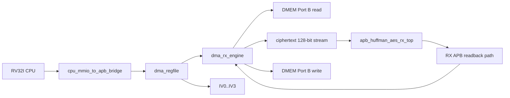

# RX Path End-to-End Specification

## 1. Purpose

This document describes the current SoC's own fast `RX`:

- Which module is involved?
- connections between modules
- function of each module
- flow only sets CPU/MMIO to `DMEM ciphertext -> RX -> DMEM plaintext`

This spec only describes the current active path in the repo.

Current verification status:

| Item | Status |
|---|---|
| Main RX mode | `MODE=0x2`, AES-CBC decrypt + Huffman decode |
| Active RX testcase examples | `dma_compress_aes_input1`, `dma_compress_aes_input3`, `dma_compress_aes_alnum63_cov` |
| Error/backpressure cases | `mmio_rx_bad_length`, `rx_backpressure_cov` |
| Coverage hooks | `rx_if_direct_cov`, `rx_parser_decoder_cov`, `rx_decoder_direct_cov`, `rx_depacker_packer_direct_cov`, `rx_parser_decoder_error_direct_cov` |
| Latest regression | included in `34/34` PASS coverage baseline |

## 2. RX Goal

The RX receives the ciphertext previously generated by the TX, then:

- AES-128 CBC decrypt
- Huffman decode

and write the recovered plaintext back to `DMEM`.

## 3. Top-level RX line



## 4. Modules and roles

### 4.0 Module to spec map

| RX module | Spec |
|---|---|
| `top_rv32_sync` | [00_current_system_spec.md](./00_current_system_spec.md) |
| `cpu_mmio_to_apb_bridge` | [cpu_mmio_to_apb_bridge_spec.md](./cpu_mmio_to_apb_bridge_spec.md) |
| `dma_regfile` | [dma_regfile_spec.md](./dma_regfile_spec.md) |
| `dma_rx_engine` | [dma_rx_engine_spec.md](./dma_rx_engine_spec.md) |
| `dmem_ip_wrapper` / `DMEM_ip` | [bram_port_usage_spec.md](./bram_port_usage_spec.md) |
| `apb_huffman_aes_rx_top` | [apb_huffman_aes_rx_top_spec.md](./apb_huffman_aes_rx_top_spec.md) |
| `aes128_cipher_inv_top` | [apb_huffman_aes_rx_top_spec.md](./apb_huffman_aes_rx_top_spec.md) |
| `bit_depacker_128` | [bit_depacker_128_spec.md](./bit_depacker_128_spec.md) |
| `huffman_block_parser` | [huffman_block_parser_spec.md](./huffman_block_parser_spec.md) |
| `huffman_block_decoder` | [huffman_block_decoder_spec.md](./huffman_block_decoder_spec.md) |
| `rx_byte_packer_32` | [rx_byte_packer_32_spec.md](./rx_byte_packer_32_spec.md) |
| `apb_huffman_rx_if` | [apb_huffman_rx_if_spec.md](./apb_huffman_rx_if_spec.md) |
| IV/CBC contract | [iv_generation_and_cbc_contract_spec.md](./iv_generation_and_cbc_contract_spec.md) |

### 4.1 Control plane modules

| Module | Role |
|---|---|
| `top_rv32_sync` | Run program RV32I to configure DMA RX |
| `cpu_mmio_to_apb_bridge` | Switch CPU MMIO read/write to APB transaction |
| `dma_regfile` | Keep RX config: `SRC_ADDR`, `DST_ADDR`, `LEN_BYTES`, `MODE`, `IV0..IV3` |

### 4.2 Data plane modules

| Module | Role |
|---|---|
| `DMEM_ip` / `dmem_ip_wrapper` | Where to store ciphertext input and plaintext output |
| `dma_rx_engine` | Data mover RX, read DMEM, feed RX stream, poll RX APB, write DMEM |
| `apb_huffman_aes_rx_top` | RX accelerator top |
| `aes128_cipher_inv_top` | AES decrypt core active |
| `bit_depacker_128` | [bit_depacker_128_spec.md](./bit_depacker_128_spec.md) |
| `huffman_block_parser` | [huffman_block_parser_spec.md](./huffman_block_parser_spec.md) |
| `huffman_block_decoder` | [huffman_block_decoder_spec.md](./huffman_block_decoder_spec.md) |
| `rx_byte_packer_32` | [rx_byte_packer_32_spec.md](./rx_byte_packer_32_spec.md) |
| `apb_huffman_rx_if` | [apb_huffman_rx_if_spec.md](./apb_huffman_rx_if_spec.md) |

## 5. Main connection

### 5.1 CPU to DMA register file

CPU writes MMIO to:

- `SRC_ADDR`
- `DST_ADDR`
- `LEN_BYTES`
- `MODE = RX`
- `CONTROL.start`

And keep it or write it down:

- `IV0..IV3`

### 5.2 `dma_regfile` to `dma_rx_engine`

`dma_regfile` output:

- `src_addr_o`
- `dst_addr_o`
- `len_bytes_o`
- `direction_o`
- `start_pulse_o`

### 5.3 `dma_regfile` In RX CBC Path

`dma_regfile` output:

```text
iv_o = {IV3, IV2, IV1, IV0}
```

In [rv32_soc_top.v](/mnt/h/Academic/senior_project/DATN/work/luc/AES_huffman_all6/rtl/rv32_soc_top.v), `iv_o` is appended:

- `apb_huffman_aes_rx_top.cbc_iv_i`

### 5.4 `dma_rx_engine` to DMEM

`dma_rx_engine` uses `DMEM` Port B to:

- Read ciphertext from `SRC_ADDR`
- Write recovery plaintext tick `DST_ADDR`

### 5.5 `dma_rx_engine` To RX Top

The current active RX input is a 128-bit stream:

- `rx_ciphertext_word_o`
- `rx_ciphertext_word_valid_o`
- `rx_ciphertext_word_ready_i`

DMA still uses private APB to read RX output:

- `RX_STATUS`
- `RX_META`
- `RX_DATA`

## 6. Internal RX Structure


## 7. Function of each RX stage

### 7.1 `aes128_cipher_inv_top`

Decode each 128-bit transport block.

### 7.2 CBC XOR chain

Recover transport plaintext:

```text
P0 = AES_decrypt(C0) XOR IV
Pn = AES_decrypt(Cn) XOR Cn-1
```

RX top holds:

- previous ciphertext block
- first block / next block status

### 7.3 `bit_depacker_128`

Split 128-bit transport word into stream bit/chunk for parser.

### 7.4 `huffman_block_parser`

Read:

- block mode
- block size
- symbol count
- code length info
- payload window

### 7.5 `huffman_block_decoder`

Use canonical Huffman decode to recover byte stream.

### 7.6 `rx_byte_packer_32`

Combine the bytes to decode the 32-bit word and meta the number of valid bytes for DMA to read through the APB.

## 8. RX software flow

### 8.1 CPU steps

1. Wait for TX to finish
2. read `tx_cipher_len = CIPHERTEXT_BYTES_PRODUCED`
3. Leave it as is or register the content `IV0..IV3`
4. write `SRC_ADDR = ciphertext buffer`
5. write `DST_ADDR = plaintext output buffer`
6. write `LEN_BYTES = tx_cipher_len`
7. write `MODE = 0x2`
8. write `CONTROL.start`
9. poll `STATUS`
10. read `BYTES_DONE`

### 8.2 RX input contract

- `LEN_BYTES` must be the ciphertext length from TX
- Current must be the number of `16`
- RX must use sector IV used when TX encrypts

## 9. DMA RX stream

### 9.1 Start and configuration

`dma_rx_engine`:

1. wait for `start_i`
2. check:
   - `direction_i == RX`
   - `len_bytes_i != 0`
   - `len_bytes_i % 16 == 0`
   - `src/dst` aligned
3. snapshot config
4. soft reset RX wrapper

### 9.2 Ciphertext fetch

With the new transport word:

1. read `W0` from `DMEM`
2. read `W1`
3. read `W2`
4. read `W3`
5. merge bars:

```text
{W3, W2, W1, W0}
```

6. assert `rx_ciphertext_word_valid_o`
7. wait for `rx_ciphertext_word_ready_i`

### 9.3 RX processing

After RX top receives 1 128-bit word:

1. `aes128_cipher_inv_top` decoding
2. CBC XOR chain recovers transport plaintext
3. `bit_depacker_128` split chunks
4. `huffman_block_parser` separates metadata/payload
5. `huffman_block_decoder` byte recovery
6. `rx_byte_packer_32` repackages the 32-bit word

### 9.4 Output drain

`dma_rx_engine` poll:

- `RX_STATUS`

If there is output:

1. read `RX_META`
2. read `RX_DATA`
3. Write plaintext word to `DMEM`
4. port `bytes_done_o` according to the number of valid bytes

### 9.5 Completion

Transfer RX is complete when:

- RX includes `frame_done`
- `ctxt_bytes_remaining == 0`
- no more pending word streams

At that time:

- `dma_done_o` pulse
- `bytes_done_o` is the recovered plaintext byte count

## 10. Active Data Meaning

### 10.1 RX input

- `SRC_ADDR` enters the ciphertext buffer in `DMEM`
- `LEN_BYTES` is the ciphertext length from TX

### 10.2 RX output

- `DST_ADDR` goes into the plaintext output buffer
- `BYTES_DONE` is the recovered plaintext byte count

## 11. Current Main Regression Flow

```text
CPU reads CIPHERTEXT_BYTES_PRODUCED
-> CPU reuses same IV0..IV3
-> CPU writes MODE=0x2 and LEN_BYTES=ciphertext_len
-> start RX
-> DMA RX reads ciphertext from DMEM
-> feeds 128-bit stream to RX top
-> AES-128 CBC decrypt
-> Huffman decode
-> rx_byte_packer_32
-> DMA RX reads RX_DATA/RX_META
-> plaintext written back to DMEM
```

## 12. Current limit

- RX main flow is currently not bypass-AES loopback for `COMPRESS_ONLY`
- `LEN_BYTES` must be multiple of `16`
- IV does not appear in ciphertext payload; software must keep and reuse content IV
- RX top does not use `AES_top.v` da-mode; Just use `aes128_cipher_inv_top` + small CBC wrapper
- parser/decoder raw full coverage is also guided by condition/expression/toggle bins; Functional loopback and malformed/error coverage da pass in general regression

## 13. Source Files

- [rv32_soc_top.v](/mnt/h/Academic/senior_project/DATN/work/luc/AES_huffman_all6/rtl/rv32_soc_top.v)
- [dma_rx_engine.v](/mnt/h/Academic/senior_project/DATN/work/luc/AES_huffman_all6/rtl/dma_rx_engine.v)
- [apb_huffman_aes_rx_top.v](/mnt/h/Academic/senior_project/DATN/work/luc/AES_huffman_all6/rtl/apb_huffman_aes_rx_top.v)
- [bit_depacker_128.v](/mnt/h/Academic/senior_project/DATN/work/luc/AES_huffman_all6/rtl/bit_depacker_128.v)
- [huffman_block_parser.v](/mnt/h/Academic/senior_project/DATN/work/luc/AES_huffman_all6/rtl/huffman_block_parser.v)
- [huffman_block_decoder.v](/mnt/h/Academic/senior_project/DATN/work/luc/AES_huffman_all6/rtl/huffman_block_decoder.v)
- [rx_byte_packer_32.v](/mnt/h/Academic/senior_project/DATN/work/luc/AES_huffman_all6/rtl/rx_byte_packer_32.v)
- [apb_huffman_rx_if.v](/mnt/h/Academic/senior_project/DATN/work/luc/AES_huffman_all6/rtl/apb_huffman_rx_if.v)
- [dma_regfile.v](/mnt/h/Academic/senior_project/DATN/work/luc/AES_huffman_all6/rtl/dma_regfile.v)
- [apb_huffman_aes_rx_top_spec.md](/mnt/h/Academic/senior_project/DATN/work/luc/AES_huffman_all6/docs/apb_huffman_aes_rx_top_spec.md)
- [bit_depacker_128_spec.md](/mnt/h/Academic/senior_project/DATN/work/luc/AES_huffman_all6/docs/bit_depacker_128_spec.md)
- [huffman_block_parser_spec.md](/mnt/h/Academic/senior_project/DATN/work/luc/AES_huffman_all6/docs/huffman_block_parser_spec.md)
- [huffman_block_decoder_spec.md](/mnt/h/Academic/senior_project/DATN/work/luc/AES_huffman_all6/docs/huffman_block_decoder_spec.md)
- [rx_byte_packer_32_spec.md](/mnt/h/Academic/senior_project/DATN/work/luc/AES_huffman_all6/docs/rx_byte_packer_32_spec.md)
- [apb_huffman_rx_if_spec.md](/mnt/h/Academic/senior_project/DATN/work/luc/AES_huffman_all6/docs/apb_huffman_rx_if_spec.md)
- [test_mmio_dma.c](/mnt/h/Academic/senior_project/DATN/work/luc/AES_huffman_all6/testcase/test_mmio_dma.c)
