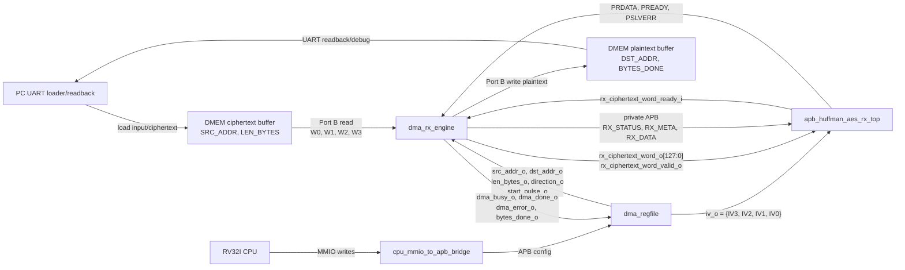
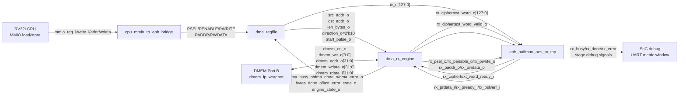
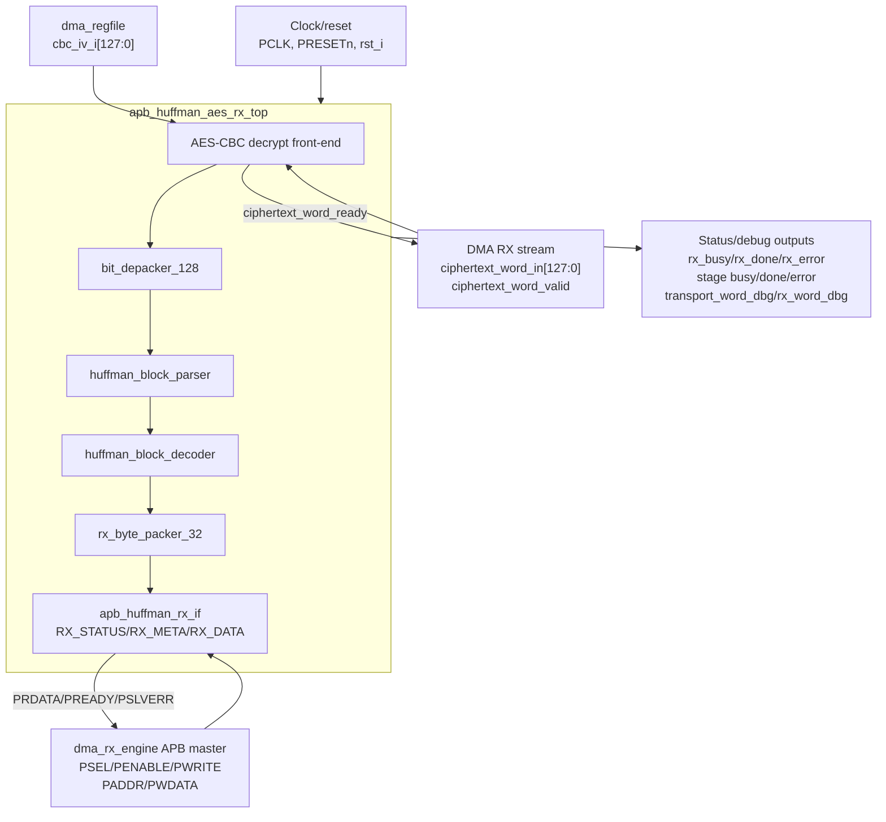
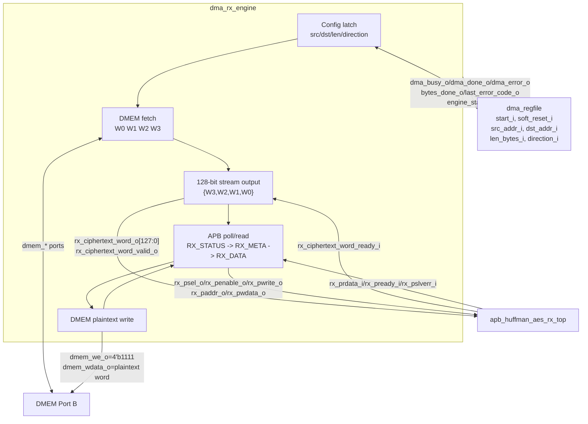

# RX Path End-to-End Specification

## 1. Purpose

Tai lieu nay mo ta rieng nhanh `RX` cua SoC hien tai:

- module nao tham gia
- ket noi giua cac module
- chuc nang cua tung module
- flow chi tiet tu CPU/MMIO den `DMEM ciphertext -> RX -> DMEM plaintext`

Spec nay chi mo ta path active hien tai trong repo.

Current verification status:

| Item | Status |
|---|---|
| Main RX mode | `MODE=0x2`, AES-CBC decrypt + Huffman decode |
| Active RX testcase examples | `dma_compress_aes_input1`, `dma_compress_aes_input2`, `dma_compress_aes_alnum63_cov`, secure-storage selected-file readback |
| Error/backpressure cases | `mmio_rx_bad_length`, `rx_backpressure_cov` |
| Coverage hooks | `rx_if_direct_cov`, `rx_parser_decoder_cov`, `rx_decoder_direct_cov`, `rx_depacker_packer_direct_cov`, `rx_parser_decoder_error_direct_cov` |
| Historical full regression | included in `34/34` PASS coverage baseline before secure-storage API refactor |

## 2. RX Goal

RX nhan ciphertext da duoc TX tao truoc do, sau do:

- AES-128 CBC decrypt
- Huffman decode

va ghi plaintext phuc hoi tro lai `DMEM`.

## 3. Top-Level RX Path

Normal FPGA path:



Short version:

```text
PC/UART loads ciphertext or secure-storage bundle into DMEM
-> RV32I firmware configures DMA RX
-> dma_rx_engine reads DMEM as 128-bit ciphertext words
-> apb_huffman_aes_rx_top decrypts AES-CBC and decodes Huffman
-> dma_rx_engine drains plaintext words from RX APB FIFO
-> DMEM stores recovered plaintext
-> PC/UART reads result and metrics back
```

### 3.1 RX external I/O boundary

| Boundary | Signals | Direction | Meaning |
|---|---|---|---|
| Clock/reset | `PCLK`, `PRESETn`, `rst_i` | SoC -> RX top | Clock and reset for the RX accelerator pipeline |
| Ciphertext stream | `ciphertext_word_in[127:0]`, `ciphertext_word_valid`, `ciphertext_word_ready` | DMA RX <-> RX top | Primary 128-bit ciphertext input path |
| APB slave | `PSEL`, `PENABLE`, `PWRITE`, `PADDR[31:0]`, `PWDATA[31:0]`, `PRDATA[31:0]`, `PREADY`, `PSLVERR` | DMA RX/APB master <-> RX top | Status polling, output FIFO readback, RX local control, legacy staging |
| CBC IV | `cbc_iv_i[127:0]` | `dma_regfile` -> RX top | IV used for CBC block 0; must match TX IV |
| Top status | `rx_busy`, `rx_done`, `rx_error`, `aes_ready_out` | RX top -> SoC/debug | Coarse RX activity, completion, error, AES ready |
| Stage status/debug | `depacker_*`, `parser_*`, `decoder_*`, `word_packer_*`, `transport_word_dbg`, `rx_word_dbg` | RX top -> SoC/debug | Per-stage visibility for simulation, waveform, and FPGA debug |
| DMEM master | `dmem_en_o`, `dmem_we_o[3:0]`, `dmem_addr_o[31:0]`, `dmem_wdata_o[31:0]`, `dmem_rdata_i[31:0]` | DMA RX <-> DMEM | DMA RX reads ciphertext and writes recovered plaintext |
| DMA status | `dma_busy_o`, `dma_done_o`, `dma_error_o`, `bytes_done_o`, `last_error_code_o`, `engine_state_o` | DMA RX -> `dma_regfile`/CPU | Software-visible transfer result and debug state |

### 3.2 RTL-level I/O diagram

This diagram shows the real RTL ports used by the active full SoC build.



Important implementation detail: `dma_rx_engine` is not only a stream
producer. It also acts as a private APB master for RX output readback. The
RX accelerator emits plaintext into `apb_huffman_rx_if`; DMA RX repeatedly
reads `RX_STATUS`, `RX_META`, and `RX_DATA`, then writes recovered words into
DMEM.

### 3.3 `apb_huffman_aes_rx_top` detailed I/O



| Group | RX top input ports | RX top output ports | Meaning |
|---|---|---|---|
| Clock/reset | `PCLK`, `PRESETn`, `rst_i` | - | `PCLK` is the SoC clock. `PRESETn` is active-low APB reset. `rst_i` is active-high local reset. |
| Ciphertext stream | `ciphertext_word_in[127:0]`, `ciphertext_word_valid` | `ciphertext_word_ready` | Main 128-bit transport-word input from `dma_rx_engine`. This is the normal FPGA data path. |
| APB slave | `PSEL`, `PENABLE`, `PWRITE`, `PADDR[31:0]`, `PWDATA[31:0]` | `PRDATA[31:0]`, `PREADY`, `PSLVERR` | Private RX APB window used by DMA RX to reset RX, poll status, read metadata, and pop plaintext words. |
| CBC IV | `cbc_iv_i[127:0]` | - | Initial CBC chain value. Firmware must use the same IV as the TX frame. |
| Top status | - | `rx_busy`, `rx_done`, `rx_error`, `aes_ready_out` | Coarse pipeline state for SoC debug and performance counters. |
| Depacker status | - | `depacker_busy`, `depacker_done`, `depacker_error` | `bit_depacker_128` activity/error. |
| Parser status | - | `parser_busy`, `parser_block_done`, `parser_frame_done`, `parser_error` | Huffman header/payload parser activity/error. |
| Decoder status | - | `decoder_busy`, `decoder_block_done`, `decoder_frame_done`, `decoder_error` | Huffman decoder activity/error. |
| Word packer status | - | `word_packer_busy`, `word_packer_block_done`, `word_packer_frame_done`, `word_packer_error` | Byte-to-word packer activity/error. |
| Debug words | - | `transport_word_dbg[127:0]`, `transport_word_valid_dbg`, `rx_word_dbg[31:0]`, `rx_word_valid_bytes_dbg[2:0]`, `rx_word_last_in_block_dbg`, `rx_word_last_in_frame_dbg`, `rx_word_valid_dbg` | Waveform/UART debug visibility into decrypted transport words and output plaintext words. |

### 3.4 `dma_rx_engine` detailed I/O



| Group | DMA RX input ports | DMA RX output ports | Meaning |
|---|---|---|---|
| Control | `clk_i`, `rst_i`, `start_i`, `soft_reset_i`, `clear_done_i`, `clear_error_i` | - | Start/reset/clear from `dma_regfile`. |
| Config | `src_addr_i[31:0]`, `dst_addr_i[31:0]`, `len_bytes_i[31:0]`, `direction_i[1:0]`, `block_size_i[5:0]` | - | RX job descriptor. `direction_i` must be `2'b10`. `len_bytes_i` must be nonzero and 16-byte aligned. |
| DMEM Port B | `dmem_rdata_i[31:0]` | `dmem_en_o`, `dmem_we_o[3:0]`, `dmem_addr_o[31:0]`, `dmem_wdata_o[31:0]` | Reads ciphertext from `src_addr_i`; writes plaintext to `dst_addr_i`. |
| RX stream | `rx_ciphertext_word_ready_i` | `rx_ciphertext_word_o[127:0]`, `rx_ciphertext_word_valid_o` | Sends one AES transport word at a time. Word order is `{W3,W2,W1,W0}` after four DMEM 32-bit reads. |
| RX APB master | `rx_prdata_i[31:0]`, `rx_pready_i`, `rx_pslverr_i` | `rx_psel_o`, `rx_penable_o`, `rx_pwrite_o`, `rx_paddr_o[31:0]`, `rx_pwdata_o[31:0]` | Resets RX interface and drains output FIFO through APB reads. |
| DMA status | - | `dma_busy_o`, `dma_done_o`, `dma_error_o`, `bytes_done_o[31:0]`, `last_error_code_o[7:0]`, `engine_state_o[3:0]` | CPU-visible completion, error, recovered plaintext byte count, and debug state. |

### 3.5 RX APB local address use

`dma_rx_engine` currently uses this private RX APB map:

| Address | Name | Access by DMA RX | Meaning |
|---|---|---|---|
| `0x0000_000C` | `RX_ADDR_CONTROL` | write `0x1` before transfer | Soft-reset/clear RX APB front-end before a new RX job. |
| `0x0000_0008` | `RX_ADDR_STATUS` | repeated read | Bit 0 means plaintext word available, bit 4 means frame done, bit 5 means RX error. |
| `0x0000_0004` | `RX_ADDR_META` | read before each data pop | Low 3 bits give valid plaintext bytes in the next `RX_DATA` word. Valid range is `1..4`. |
| `0x0000_0000` | `RX_ADDR_DATA` | read/pop plaintext word | 32-bit plaintext word from `apb_huffman_rx_if` output FIFO. |

### 3.6 RX performance/debug counter visibility

The full FPGA top exports RX counters into the UART CPU debug window. The
UART decode script prints them when `debug_version` is `0x00020000` and the
performance signature is `PRF1`.

| Metric | RTL source | Meaning |
|---|---|---|
| `rx_dma_cycles` | `rx_dma_busy_w` in `rv32_soc_top` | Total cycles spent by `dma_rx_engine` for selected RX job. |
| `rx_huffman_cycles` | RX depacker/parser/decoder/packer active OR | Cycles where Huffman-side RX stages are active. |
| `rx_aes_cycles` | ciphertext valid or AES not ready while RX DMA busy | Cycles attributed to AES decrypt path during RX. |
| `cpu_cycles_live` | CPU debug counter | Total CPU cycles since SoC reset release. |
| `cpu_dmem_access`, `cpu_mmio_access` | CPU debug counters | Memory/MMIO traffic while firmware manages secure storage. |

## 4. Modules And Roles

### 4.0 Module to spec map

| RX module | Spec |
|---|---|
| `top_rv32_sync` | [00_current_system_spec.md](./00_current_system_spec.md) |
| `cpu_mmio_to_apb_bridge` | [cpu_mmio_to_apb_bridge_spec.md](./cpu_mmio_to_apb_bridge_spec.md) |
| `dma_regfile` | [dma_regfile_spec.md](./dma_regfile_spec.md) |
| `dma_rx_engine` | [dma_rx_engine_spec.md](./dma_rx_engine_spec.md) |
| `dmem_ip_wrapper` / `DMEM_ip` | [bram_port_usage_spec.md](./bram_port_usage_spec.md) |
| `apb_huffman_aes_rx_top` | [apb_huffman_aes_rx_top_spec.md](./apb_huffman_aes_rx_top_spec.md) |
| `aes128_cipher_inv_top` | [apb_huffman_aes_rx_top_spec.md](./apb_huffman_aes_rx_top_spec.md) |
| `bit_depacker_128` | [bit_depacker_128_spec.md](./bit_depacker_128_spec.md) |
| `huffman_block_parser` | [huffman_block_parser_spec.md](./huffman_block_parser_spec.md) |
| `huffman_block_decoder` | [huffman_block_decoder_spec.md](./huffman_block_decoder_spec.md) |
| `rx_byte_packer_32` | [rx_byte_packer_32_spec.md](./rx_byte_packer_32_spec.md) |
| `apb_huffman_rx_if` | [apb_huffman_rx_if_spec.md](./apb_huffman_rx_if_spec.md) |
| IV/CBC contract | [iv_generation_and_cbc_contract_spec.md](./iv_generation_and_cbc_contract_spec.md) |

### 4.1 Control plane modules

| Module | Role |
|---|---|
| `top_rv32_sync` | Chay chuong trinh RV32I de cau hinh DMA RX |
| `cpu_mmio_to_apb_bridge` | Chuyen CPU MMIO read/write thanh APB transaction |
| `dma_regfile` | Giu config RX: `SRC_ADDR`, `DST_ADDR`, `LEN_BYTES`, `MODE`, `IV0..IV3` |

### 4.2 Data plane modules

| Module | Role |
|---|---|
| `DMEM_ip` / `dmem_ip_wrapper` | Noi luu ciphertext input va plaintext output |
| `dma_rx_engine` | Data mover RX, doc DMEM, feed RX stream, poll RX APB, ghi DMEM |
| `apb_huffman_aes_rx_top` | RX accelerator top |
| `aes128_cipher_inv_top` | AES decrypt core active |
| `bit_depacker_128` | [bit_depacker_128_spec.md](./bit_depacker_128_spec.md) |
| `huffman_block_parser` | [huffman_block_parser_spec.md](./huffman_block_parser_spec.md) |
| `huffman_block_decoder` | [huffman_block_decoder_spec.md](./huffman_block_decoder_spec.md) |
| `rx_byte_packer_32` | [rx_byte_packer_32_spec.md](./rx_byte_packer_32_spec.md) |
| `apb_huffman_rx_if` | [apb_huffman_rx_if_spec.md](./apb_huffman_rx_if_spec.md) |

## 5. Key Connections

### 5.1 CPU to DMA register file

CPU ghi MMIO vao:

- `SRC_ADDR`
- `DST_ADDR`
- `LEN_BYTES`
- `MODE = RX`
- `CONTROL.start`

Va giu nguyen hoac ghi lai:

- `IV0..IV3`

### 5.2 `dma_regfile` to `dma_rx_engine`

`dma_regfile` xuat:

- `src_addr_o`
- `dst_addr_o`
- `len_bytes_o`
- `direction_o`
- `start_pulse_o`

### 5.3 `dma_regfile` to RX CBC path

`dma_regfile` xuat:

```text
iv_o = {IV3, IV2, IV1, IV0}
```

Trong [rv32_soc_top.v](/mnt/h/Academic/senior_project/DATN/work/luc/AES_huffman_all6/rtl/rv32_soc_top.v), `iv_o` duoc noi vao:

- `apb_huffman_aes_rx_top.cbc_iv_i`

### 5.4 `dma_rx_engine` to DMEM

`dma_rx_engine` dung `DMEM` Port B de:

- doc ciphertext tu `SRC_ADDR`
- ghi plaintext phuc hoi ve `DST_ADDR`

### 5.5 `dma_rx_engine` to RX top

RX input active hien tai la stream 128-bit:

- `rx_ciphertext_word_o`
- `rx_ciphertext_word_valid_o`
- `rx_ciphertext_word_ready_i`

DMA van dung private APB de doc output RX:

- `RX_STATUS`
- `RX_META`
- `RX_DATA`

## 6. Internal RX Structure

```mermaid
flowchart LR
    DMASTRM["DMA ciphertext stream<br/>ciphertext_word_in[127:0]<br/>valid/ready"] --> SEL["RX input select"]
    APBCTXT["Legacy APB staging<br/>CTXT_W0..W3, CTXT_START<br/>debug/legacy only"] -.-> SEL
    SEL --> CBUF["cipher_buf_data_r<br/>cipher_buf_valid_r"]
    CBUF --> WRAP["wrapper_rx<br/>decipher_en, data_in<br/>round_key_10"]
    WRAP --> AESD["aes128_cipher_inv_top<br/>AES-128 decrypt"]
    AESD --> CBC["CBC XOR chain<br/>P0 = D(C0) XOR IV<br/>Pn = D(Cn) XOR Cn-1"]
    CBC --> TBUF["transport_buf_data_r[127:0]<br/>transport_buf_valid_r"]
    TBUF --> DEPK["bit_depacker_128"]
    DEPK -->|"stream_data[31:0]<br/>stream_len[5:0]<br/>stream_valid/ready"| PAR["huffman_block_parser"]
    PAR -->|"block_meta<br/>canonical entries<br/>payload_window"| DEC["huffman_block_decoder"]
    DEC -->|"out_byte[7:0]<br/>out_valid/ready<br/>last flags"| PK32["rx_byte_packer_32"]
    PK32 -->|"rx_word_data[31:0]<br/>valid_bytes[2:0]<br/>word_valid/ready"| APBIF["apb_huffman_rx_if<br/>output FIFO"]
    APBIF -->|"RX_STATUS, RX_META, RX_DATA"| RXDMA["dma_rx_engine"]
    RXDMA -->|"plaintext word write"| DMEM["DMEM plaintext buffer"]
    DEPK -.-> STS["RX status/error OR<br/>busy/done/error"]
    PAR -.-> STS
    DEC -.-> STS
    PK32 -.-> STS
    STS -->|"rx_busy, rx_done, rx_error"| SOC["SoC/debug"]
```



### 6.1 Stage boundary signals

| Boundary | Main signals | Meaning |
|---|---|---|
| DMA RX -> RX top | `ciphertext_word_in[127:0]`, `ciphertext_word_valid`, `ciphertext_word_ready` | 128-bit AES-CBC ciphertext transport word with ready/valid backpressure |
| APB legacy staging -> RX top | `apb_ciphertext_word_w[127:0]`, `apb_ciphertext_word_valid_w`, `apb_ciphertext_word_ready_w` | Optional debug path from `apb_huffman_rx_if`; not the normal SoC DMA path |
| AES input wrapper -> AES core | `data_in[127:0]`, `decipher_en`, `round_key_10[127:0]`, `aes_ready` | One accepted ciphertext block launches AES inverse cipher |
| AES/CBC -> depacker | `transport_buf_data_r[127:0]`, `transport_buf_valid_r`, `transport_word_ready_w` | Decrypted and CBC-XORed transport plaintext |
| Depacker -> parser | `stream_data[31:0]`, `stream_len[5:0]`, `stream_valid`, `stream_last`, `stream_ready` | Bit/chunk stream reconstructed from 128-bit transport words |
| Parser -> decoder | `block_mode`, `block_size`, `symbol_count`, `one_symbol_value`, `entry_symbol`, `entry_code_len`, `payload_window_*` | Huffman block metadata, canonical code lengths, and payload window |
| Decoder -> packer | `out_byte[7:0]`, `out_valid`, `out_last_in_block`, `out_last_in_frame`, `out_ready` | Recovered plaintext byte stream |
| Packer -> APB RX IF | `rx_word_data[31:0]`, `rx_word_valid_bytes[2:0]`, `rx_word_last_in_block`, `rx_word_last_in_frame`, `rx_word_valid`, `rx_word_ready` | Plaintext words and byte-valid metadata for APB/DMA drain |
| APB RX IF -> DMA RX | `RX_STATUS`, `RX_META`, `RX_DATA` through `PRDATA[31:0]` | DMA polls FIFO state, reads valid-byte count, then reads/pops plaintext word |

## 7. Function Of Each RX Stage

### 7.1 `aes128_cipher_inv_top`

Giai ma tung transport block 128-bit.

### 7.2 CBC XOR chain

Phuc hoi transport plaintext:

```text
P0 = AES_decrypt(C0) XOR IV
Pn = AES_decrypt(Cn) XOR Cn-1
```

RX top giu:

- previous ciphertext block
- trang thai block dau / block sau

### 7.3 `bit_depacker_128`

Tach transport word 128-bit thanh stream bit/chunk cho parser.

### 7.4 `huffman_block_parser`

Doc:

- block mode
- block size
- symbol count
- code length info
- payload window

### 7.5 `huffman_block_decoder`

Dung canonical Huffman decode de phuc hoi byte stream.

Implementation/resource notes from the latest area run:

- `HUFFMAN_DECODE_TABLE_IP` is the main short-code BRAM lookup
  (`2048 x 15`).
- Long Huffman codes use distributed-RAM fallback tables.
- RX APB output FIFO memories use distributed RAM.
- The local canonical sort/build arrays remain register/mux based in the
  current RTL, but the full ZCU102 SoC routes and writes bitstream with WNS
  `+10.383 ns` and WHS `+0.008 ns`.

### 7.6 `rx_byte_packer_32`

Gop byte da decode thanh word 32-bit va meta so byte hop le de DMA doc qua APB.

## 8. RX Software Flow

### 8.1 CPU steps

1. doi TX xong
2. doc `tx_cipher_len = CIPHERTEXT_BYTES_PRODUCED`
3. giu nguyen hoac ghi lai dung `IV0..IV3`
4. ghi `SRC_ADDR = ciphertext buffer`
5. ghi `DST_ADDR = plaintext output buffer`
6. ghi `LEN_BYTES = tx_cipher_len`
7. ghi `MODE = 0x2`
8. ghi `CONTROL.start`
9. poll `STATUS`
10. doc `BYTES_DONE`

### 8.2 RX input contract

- `LEN_BYTES` phai la ciphertext length tu TX
- hien tai phai la boi so cua `16`
- RX phai dung cung IV da dung luc TX encrypt

## 9. RX DMA Flow

### 9.1 Start and config

`dma_rx_engine`:

1. doi `start_i`
2. check:
   - `direction_i == RX`
   - `len_bytes_i != 0`
   - `len_bytes_i % 16 == 0`
   - `src/dst` aligned
3. snapshot config
4. soft reset RX wrapper

### 9.2 Ciphertext fetch

Voi moi transport word:

1. doc `W0` tu `DMEM`
2. doc `W1`
3. doc `W2`
4. doc `W3`
5. ghep thanh:

```text
{W3, W2, W1, W0}
```

6. assert `rx_ciphertext_word_valid_o`
7. doi `rx_ciphertext_word_ready_i`

### 9.3 RX processing

Sau khi RX top nhan 1 word 128-bit:

1. `aes128_cipher_inv_top` giai ma
2. CBC XOR chain phuc hoi transport plaintext
3. `bit_depacker_128` tach chunk
4. `huffman_block_parser` tach metadata/payload
5. `huffman_block_decoder` phuc hoi byte
6. `rx_byte_packer_32` dong goi lai thanh word 32-bit

### 9.4 Output drain

`dma_rx_engine` poll:

- `RX_STATUS`

Neu co output:

1. doc `RX_META`
2. doc `RX_DATA`
3. ghi plaintext word ve `DMEM`
4. cong `bytes_done_o` theo so byte hop le

### 9.5 Completion

Transfer RX complete khi:

- RX bao `frame_done`
- `ctxt_bytes_remaining == 0`
- khong con word stream dang pending

Luc do:

- `dma_done_o` pulse
- `bytes_done_o` la plaintext bytes da phuc hoi

## 10. Active Data Meaning

### 10.1 RX input

- `SRC_ADDR` tro vao ciphertext buffer trong `DMEM`
- `LEN_BYTES` la ciphertext length tu TX

### 10.2 RX output

- `DST_ADDR` tro vao plaintext output buffer
- `BYTES_DONE` la plaintext bytes da phuc hoi

## 11. Current Main Regression Flow

```text
CPU reads CIPHERTEXT_BYTES_PRODUCED
-> CPU reuses same IV0..IV3
-> CPU writes MODE=0x2 and LEN_BYTES=ciphertext_len
-> start RX
-> DMA RX reads ciphertext from DMEM
-> feeds 128-bit stream to RX top
-> AES-128 CBC decrypt
-> Huffman decode
-> rx_byte_packer_32
-> DMA RX reads RX_DATA/RX_META
-> plaintext written back to DMEM
```

## 12. Current Limitations

- RX main flow hien tai khong phai bypass-AES loopback cho `COMPRESS_ONLY`
- `LEN_BYTES` phai la multiple of `16`
- IV khong di trong ciphertext payload; software phai giu va reuse dung IV
- RX top khong dung `AES_top.v` da-mode; chi dung `aes128_cipher_inv_top` + CBC wrapper nho
- parser/decoder raw full coverage con bi anh huong boi condition/expression/toggle bins; functional loopback va malformed/error coverage da pass trong regression chung

## 13. Source Files

- [rv32_soc_top.v](/mnt/h/Academic/senior_project/DATN/work/luc/AES_huffman_all6/rtl/rv32_soc_top.v)
- [dma_rx_engine.v](/mnt/h/Academic/senior_project/DATN/work/luc/AES_huffman_all6/rtl/dma_rx_engine.v)
- [apb_huffman_aes_rx_top.v](/mnt/h/Academic/senior_project/DATN/work/luc/AES_huffman_all6/rtl/apb_huffman_aes_rx_top.v)
- [bit_depacker_128.v](/mnt/h/Academic/senior_project/DATN/work/luc/AES_huffman_all6/rtl/bit_depacker_128.v)
- [huffman_block_parser.v](/mnt/h/Academic/senior_project/DATN/work/luc/AES_huffman_all6/rtl/huffman_block_parser.v)
- [huffman_block_decoder.v](/mnt/h/Academic/senior_project/DATN/work/luc/AES_huffman_all6/rtl/huffman_block_decoder.v)
- [rx_byte_packer_32.v](/mnt/h/Academic/senior_project/DATN/work/luc/AES_huffman_all6/rtl/rx_byte_packer_32.v)
- [apb_huffman_rx_if.v](/mnt/h/Academic/senior_project/DATN/work/luc/AES_huffman_all6/rtl/apb_huffman_rx_if.v)
- [dma_regfile.v](/mnt/h/Academic/senior_project/DATN/work/luc/AES_huffman_all6/rtl/dma_regfile.v)
- [apb_huffman_aes_rx_top_spec.md](/mnt/h/Academic/senior_project/DATN/work/luc/AES_huffman_all6/docs/apb_huffman_aes_rx_top_spec.md)
- [bit_depacker_128_spec.md](/mnt/h/Academic/senior_project/DATN/work/luc/AES_huffman_all6/docs/bit_depacker_128_spec.md)
- [huffman_block_parser_spec.md](/mnt/h/Academic/senior_project/DATN/work/luc/AES_huffman_all6/docs/huffman_block_parser_spec.md)
- [huffman_block_decoder_spec.md](/mnt/h/Academic/senior_project/DATN/work/luc/AES_huffman_all6/docs/huffman_block_decoder_spec.md)
- [rx_byte_packer_32_spec.md](/mnt/h/Academic/senior_project/DATN/work/luc/AES_huffman_all6/docs/rx_byte_packer_32_spec.md)
- [apb_huffman_rx_if_spec.md](/mnt/h/Academic/senior_project/DATN/work/luc/AES_huffman_all6/docs/apb_huffman_rx_if_spec.md)
- [test_mmio_dma.c](/mnt/h/Academic/senior_project/DATN/work/luc/AES_huffman_all6/testcase/test_mmio_dma.c)
