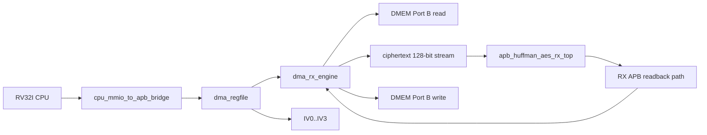
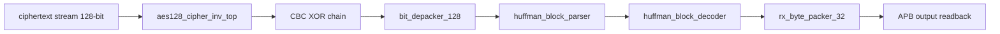

# RX Path End-to-End Specification

## 1. Purpose

Tai lieu nay mo ta rieng nhanh `RX` cua SoC hien tai:

- module nao tham gia
- ket noi giua cac module
- chuc nang cua tung module
- flow chi tiet tu CPU/MMIO den `DMEM ciphertext -> RX -> DMEM plaintext`

Spec nay chi mo ta path active hien tai trong repo.

Current verification status:

| Item | Status |
|---|---|
| Main RX mode | `MODE=0x2`, AES-CBC decrypt + Huffman decode |
| Active RX testcase examples | `dma_compress_aes_input1`, `dma_compress_aes_input3`, `dma_compress_aes_alnum63_cov` |
| Error/backpressure cases | `mmio_rx_bad_length`, `rx_backpressure_cov` |
| Coverage hooks | `rx_if_direct_cov`, `rx_parser_decoder_cov`, `rx_decoder_direct_cov`, `rx_depacker_packer_direct_cov`, `rx_parser_decoder_error_direct_cov` |
| Historical full regression | included in `34/34` PASS coverage baseline before secure-storage API refactor |

## 2. RX Goal

RX nhan ciphertext da duoc TX tao truoc do, sau do:

- AES-128 CBC decrypt
- Huffman decode

va ghi plaintext phuc hoi tro lai `DMEM`.

## 3. Top-Level RX Path



## 4. Modules And Roles

### 4.0 Module to spec map

| RX module | Spec |
|---|---|
| `top_rv32_sync` | [00_current_system_spec.md](./00_current_system_spec.md) |
| `cpu_mmio_to_apb_bridge` | [cpu_mmio_to_apb_bridge_spec.md](./cpu_mmio_to_apb_bridge_spec.md) |
| `dma_regfile` | [dma_regfile_spec.md](./dma_regfile_spec.md) |
| `dma_rx_engine` | [dma_rx_engine_spec.md](./dma_rx_engine_spec.md) |
| `dmem_ip_wrapper` / `DMEM_ip` | [bram_port_usage_spec.md](./bram_port_usage_spec.md) |
| `apb_huffman_aes_rx_top` | [apb_huffman_aes_rx_top_spec.md](./apb_huffman_aes_rx_top_spec.md) |
| `aes128_cipher_inv_top` | [apb_huffman_aes_rx_top_spec.md](./apb_huffman_aes_rx_top_spec.md) |
| `bit_depacker_128` | [bit_depacker_128_spec.md](./bit_depacker_128_spec.md) |
| `huffman_block_parser` | [huffman_block_parser_spec.md](./huffman_block_parser_spec.md) |
| `huffman_block_decoder` | [huffman_block_decoder_spec.md](./huffman_block_decoder_spec.md) |
| `rx_byte_packer_32` | [rx_byte_packer_32_spec.md](./rx_byte_packer_32_spec.md) |
| `apb_huffman_rx_if` | [apb_huffman_rx_if_spec.md](./apb_huffman_rx_if_spec.md) |
| IV/CBC contract | [iv_generation_and_cbc_contract_spec.md](./iv_generation_and_cbc_contract_spec.md) |

### 4.1 Control plane modules

| Module | Role |
|---|---|
| `top_rv32_sync` | Chay chuong trinh RV32I de cau hinh DMA RX |
| `cpu_mmio_to_apb_bridge` | Chuyen CPU MMIO read/write thanh APB transaction |
| `dma_regfile` | Giu config RX: `SRC_ADDR`, `DST_ADDR`, `LEN_BYTES`, `MODE`, `IV0..IV3` |

### 4.2 Data plane modules

| Module | Role |
|---|---|
| `DMEM_ip` / `dmem_ip_wrapper` | Noi luu ciphertext input va plaintext output |
| `dma_rx_engine` | Data mover RX, doc DMEM, feed RX stream, poll RX APB, ghi DMEM |
| `apb_huffman_aes_rx_top` | RX accelerator top |
| `aes128_cipher_inv_top` | AES decrypt core active |
| `bit_depacker_128` | [bit_depacker_128_spec.md](./bit_depacker_128_spec.md) |
| `huffman_block_parser` | [huffman_block_parser_spec.md](./huffman_block_parser_spec.md) |
| `huffman_block_decoder` | [huffman_block_decoder_spec.md](./huffman_block_decoder_spec.md) |
| `rx_byte_packer_32` | [rx_byte_packer_32_spec.md](./rx_byte_packer_32_spec.md) |
| `apb_huffman_rx_if` | [apb_huffman_rx_if_spec.md](./apb_huffman_rx_if_spec.md) |

## 5. Key Connections

### 5.1 CPU to DMA register file

CPU ghi MMIO vao:

- `SRC_ADDR`
- `DST_ADDR`
- `LEN_BYTES`
- `MODE = RX`
- `CONTROL.start`

Va giu nguyen hoac ghi lai:

- `IV0..IV3`

### 5.2 `dma_regfile` to `dma_rx_engine`

`dma_regfile` xuat:

- `src_addr_o`
- `dst_addr_o`
- `len_bytes_o`
- `direction_o`
- `start_pulse_o`

### 5.3 `dma_regfile` to RX CBC path

`dma_regfile` xuat:

```text
iv_o = {IV3, IV2, IV1, IV0}
```

Trong [rv32_soc_top.v](/mnt/h/Academic/senior_project/DATN/work/luc/AES_huffman_all6/rtl/rv32_soc_top.v), `iv_o` duoc noi vao:

- `apb_huffman_aes_rx_top.cbc_iv_i`

### 5.4 `dma_rx_engine` to DMEM

`dma_rx_engine` dung `DMEM` Port B de:

- doc ciphertext tu `SRC_ADDR`
- ghi plaintext phuc hoi ve `DST_ADDR`

### 5.5 `dma_rx_engine` to RX top

RX input active hien tai la stream 128-bit:

- `rx_ciphertext_word_o`
- `rx_ciphertext_word_valid_o`
- `rx_ciphertext_word_ready_i`

DMA van dung private APB de doc output RX:

- `RX_STATUS`
- `RX_META`
- `RX_DATA`

## 6. Internal RX Structure



## 7. Function Of Each RX Stage

### 7.1 `aes128_cipher_inv_top`

Giai ma tung transport block 128-bit.

### 7.2 CBC XOR chain

Phuc hoi transport plaintext:

```text
P0 = AES_decrypt(C0) XOR IV
Pn = AES_decrypt(Cn) XOR Cn-1
```

RX top giu:

- previous ciphertext block
- trang thai block dau / block sau

### 7.3 `bit_depacker_128`

Tach transport word 128-bit thanh stream bit/chunk cho parser.

### 7.4 `huffman_block_parser`

Doc:

- block mode
- block size
- symbol count
- code length info
- payload window

### 7.5 `huffman_block_decoder`

Dung canonical Huffman decode de phuc hoi byte stream.

### 7.6 `rx_byte_packer_32`

Gop byte da decode thanh word 32-bit va meta so byte hop le de DMA doc qua APB.

## 8. RX Software Flow

### 8.1 CPU steps

1. doi TX xong
2. doc `tx_cipher_len = CIPHERTEXT_BYTES_PRODUCED`
3. giu nguyen hoac ghi lai dung `IV0..IV3`
4. ghi `SRC_ADDR = ciphertext buffer`
5. ghi `DST_ADDR = plaintext output buffer`
6. ghi `LEN_BYTES = tx_cipher_len`
7. ghi `MODE = 0x2`
8. ghi `CONTROL.start`
9. poll `STATUS`
10. doc `BYTES_DONE`

### 8.2 RX input contract

- `LEN_BYTES` phai la ciphertext length tu TX
- hien tai phai la boi so cua `16`
- RX phai dung cung IV da dung luc TX encrypt

## 9. RX DMA Flow

### 9.1 Start and config

`dma_rx_engine`:

1. doi `start_i`
2. check:
   - `direction_i == RX`
   - `len_bytes_i != 0`
   - `len_bytes_i % 16 == 0`
   - `src/dst` aligned
3. snapshot config
4. soft reset RX wrapper

### 9.2 Ciphertext fetch

Voi moi transport word:

1. doc `W0` tu `DMEM`
2. doc `W1`
3. doc `W2`
4. doc `W3`
5. ghep thanh:

```text
{W3, W2, W1, W0}
```

6. assert `rx_ciphertext_word_valid_o`
7. doi `rx_ciphertext_word_ready_i`

### 9.3 RX processing

Sau khi RX top nhan 1 word 128-bit:

1. `aes128_cipher_inv_top` giai ma
2. CBC XOR chain phuc hoi transport plaintext
3. `bit_depacker_128` tach chunk
4. `huffman_block_parser` tach metadata/payload
5. `huffman_block_decoder` phuc hoi byte
6. `rx_byte_packer_32` dong goi lai thanh word 32-bit

### 9.4 Output drain

`dma_rx_engine` poll:

- `RX_STATUS`

Neu co output:

1. doc `RX_META`
2. doc `RX_DATA`
3. ghi plaintext word ve `DMEM`
4. cong `bytes_done_o` theo so byte hop le

### 9.5 Completion

Transfer RX complete khi:

- RX bao `frame_done`
- `ctxt_bytes_remaining == 0`
- khong con word stream dang pending

Luc do:

- `dma_done_o` pulse
- `bytes_done_o` la plaintext bytes da phuc hoi

## 10. Active Data Meaning

### 10.1 RX input

- `SRC_ADDR` tro vao ciphertext buffer trong `DMEM`
- `LEN_BYTES` la ciphertext length tu TX

### 10.2 RX output

- `DST_ADDR` tro vao plaintext output buffer
- `BYTES_DONE` la plaintext bytes da phuc hoi

## 11. Current Main Regression Flow

```text
CPU reads CIPHERTEXT_BYTES_PRODUCED
-> CPU reuses same IV0..IV3
-> CPU writes MODE=0x2 and LEN_BYTES=ciphertext_len
-> start RX
-> DMA RX reads ciphertext from DMEM
-> feeds 128-bit stream to RX top
-> AES-128 CBC decrypt
-> Huffman decode
-> rx_byte_packer_32
-> DMA RX reads RX_DATA/RX_META
-> plaintext written back to DMEM
```

## 12. Current Limitations

- RX main flow hien tai khong phai bypass-AES loopback cho `COMPRESS_ONLY`
- `LEN_BYTES` phai la multiple of `16`
- IV khong di trong ciphertext payload; software phai giu va reuse dung IV
- RX top khong dung `AES_top.v` da-mode; chi dung `aes128_cipher_inv_top` + CBC wrapper nho
- parser/decoder raw full coverage con bi anh huong boi condition/expression/toggle bins; functional loopback va malformed/error coverage da pass trong regression chung

## 13. Source Files

- [rv32_soc_top.v](/mnt/h/Academic/senior_project/DATN/work/luc/AES_huffman_all6/rtl/rv32_soc_top.v)
- [dma_rx_engine.v](/mnt/h/Academic/senior_project/DATN/work/luc/AES_huffman_all6/rtl/dma_rx_engine.v)
- [apb_huffman_aes_rx_top.v](/mnt/h/Academic/senior_project/DATN/work/luc/AES_huffman_all6/rtl/apb_huffman_aes_rx_top.v)
- [bit_depacker_128.v](/mnt/h/Academic/senior_project/DATN/work/luc/AES_huffman_all6/rtl/bit_depacker_128.v)
- [huffman_block_parser.v](/mnt/h/Academic/senior_project/DATN/work/luc/AES_huffman_all6/rtl/huffman_block_parser.v)
- [huffman_block_decoder.v](/mnt/h/Academic/senior_project/DATN/work/luc/AES_huffman_all6/rtl/huffman_block_decoder.v)
- [rx_byte_packer_32.v](/mnt/h/Academic/senior_project/DATN/work/luc/AES_huffman_all6/rtl/rx_byte_packer_32.v)
- [apb_huffman_rx_if.v](/mnt/h/Academic/senior_project/DATN/work/luc/AES_huffman_all6/rtl/apb_huffman_rx_if.v)
- [dma_regfile.v](/mnt/h/Academic/senior_project/DATN/work/luc/AES_huffman_all6/rtl/dma_regfile.v)
- [apb_huffman_aes_rx_top_spec.md](/mnt/h/Academic/senior_project/DATN/work/luc/AES_huffman_all6/docs/apb_huffman_aes_rx_top_spec.md)
- [bit_depacker_128_spec.md](/mnt/h/Academic/senior_project/DATN/work/luc/AES_huffman_all6/docs/bit_depacker_128_spec.md)
- [huffman_block_parser_spec.md](/mnt/h/Academic/senior_project/DATN/work/luc/AES_huffman_all6/docs/huffman_block_parser_spec.md)
- [huffman_block_decoder_spec.md](/mnt/h/Academic/senior_project/DATN/work/luc/AES_huffman_all6/docs/huffman_block_decoder_spec.md)
- [rx_byte_packer_32_spec.md](/mnt/h/Academic/senior_project/DATN/work/luc/AES_huffman_all6/docs/rx_byte_packer_32_spec.md)
- [apb_huffman_rx_if_spec.md](/mnt/h/Academic/senior_project/DATN/work/luc/AES_huffman_all6/docs/apb_huffman_rx_if_spec.md)
- [test_mmio_dma.c](/mnt/h/Academic/senior_project/DATN/work/luc/AES_huffman_all6/testcase/test_mmio_dma.c)
