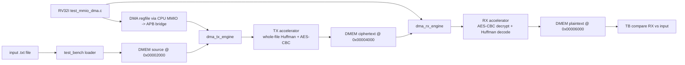

# SOC 4.5 End-to-End Test Report

## 1. Scope

Tai lieu nay chi tap trung vao nhom testcase **4.5 SoC End-To-End** de dung
cho bao cao:

| ID | Testname | Input | Purpose |
|---|---|---|---|
| SOC-01 | `dma_compress_aes_input1` | `input1.txt` | Main secure-storage loopback |
| SOC-02 | `dma_compress_aes_input3` | `input3.txt` | Small/repeated input loopback |
| SOC-03 | `dma_compress_aes_alnum63_cov` | `input_cov_alnum63.txt` | Max-valid-symbol stress loopback |

Tat ca testcase dung cung software:

```text
testcase/test_mmio_dma.c
```

`TESTNAME` chon file testcase Verilog trong `testcase/`. `CASE_NAME` la
plusarg de testbench in ten case vao log va gan report/dump voi dung testcase.

## 2. Commands

Chay lai rieng nhom 4.5:

```bash
cd sim
make license SUDO_PASS=1412
make compile C_SRC=test_mmio_dma.c
make all TESTNAME=dma_compress_aes_input1 RUN_ARGS="+CASE_NAME=dma_compress_aes_input1 +INPUT_FILE=input1.txt"
make all TESTNAME=dma_compress_aes_input3 RUN_ARGS="+CASE_NAME=dma_compress_aes_input3 +INPUT_FILE=input3.txt"
make all TESTNAME=dma_compress_aes_alnum63_cov RUN_ARGS="+CASE_NAME=dma_compress_aes_alnum63_cov +INPUT_FILE=input_cov_alnum63.txt"
./report.csh
```

Latest run:

```text
Date: 2026-05-05
Clock used by TB benchmark: 10 ns period, 100 MHz
Result: all 3 SOC 4.5 tests PASS
```

## 3. Data Flow Under Test



Step-by-step:

1. Testbench load input text vao `DMEM` source region `0x00002000`.
2. CPU RV32I doc `input_len` tu DMEM, tao IV demo, va ghi `DMA_IV0..3`.
3. CPU cau hinh TX: `SRC=0x00002000`, `DST=0x00004000`, `LEN=input_len`, `MODE=0x9`, `BLOCK=0x20`, roi start DMA.
4. `dma_tx_engine` doc plaintext tu DMEM, nap TX accelerator qua private APB.
5. TX accelerator tao dynamic Huffman codebook cho whole file, pack thanh transport word 128-bit, AES-CBC encrypt, va ghi ciphertext ve DMEM TX region.
6. CPU polling TX done, doc `tx_bytes_done`, sau do cau hinh RX: `SRC=0x00004000`, `DST=0x00006000`, `LEN=tx_bytes_done`, `MODE=0x2`.
7. `dma_rx_engine` doc ciphertext, feed RX accelerator.
8. RX accelerator AES-CBC decrypt, depack transport, parse Huffman header/codebook, decode plaintext, va ghi RX plaintext ve DMEM.
9. Testbench dump 3 vung DMEM va compare:
   - source DMEM vs input file
   - RX DMEM vs input file
   - TX region must not be all zero

## 4. Pass/Fail Criteria

Moi SOC testcase pass khi:

| Check | Meaning |
|---|---|
| `cpu_error_mask_should_be_zero` | CPU software khong thay loi MMIO/DMA |
| `tx_status_before_start` / `tx_status_after_done` | TX status dung truoc va sau DMA |
| `tx_bytes_done_should_be_transport_aligned` | Ciphertext/transport output align 16 byte |
| `rx_status_after_done` | RX done sticky set dung |
| `rx_bytes_done_should_match_input_len` | RX restore dung so byte plaintext ban dau |
| `source_dmem_should_match_input_file` | Loader nap dung input vao DMEM |
| `loopback_rx_should_match_input_file` | End-to-end TX->RX khop input goc |
| `tx_ciphertext_region_should_not_be_all_zero` | TX thuc su tao ciphertext/transport data |
| `dma_start_pulse_count == 2` | Co dung 2 DMA transfer: TX roi RX |

## 5. Latest Results

| Testname | PASS/FAIL | Input bytes | TX bytes | RX bytes | Payload ratio | Payload saving | Storage ratio | Storage saving |
|---|---:|---:|---:|---:|---:|---:|---:|---:|
| `dma_compress_aes_input1` | PASS | 2551 | 992 | 2551 | 36.32% | 63.68% | 38.89% | 61.11% |
| `dma_compress_aes_input3` | PASS | 242 | 112 | 242 | 40.81% | 59.19% | 46.28% | 53.72% |
| `dma_compress_aes_alnum63_cov` | PASS | 504 | 544 | 504 | 100.67% | -0.67% | 107.94% | -7.94% |

Interpretation:

| Testname | Note |
|---|---|
| `dma_compress_aes_input1` | Nen tot, storage saving `61.11%`, loopback dung. |
| `dma_compress_aes_input3` | Input ngan/lap lai cao, storage saving `53.72%`, loopback dung. |
| `dma_compress_aes_alnum63_cov` | Input gan uniform voi 63 symbol, header/codebook overhead lon hon payload saving, nen storage saving am. Day la stress functional, khong phai case toi uu nen. |

## 6. Throughput Benchmark

Throughput duoc TB tinh theo:

```text
bytes_per_cycle = bytes / busy_cycles
MB/s = bytes_per_cycle * (1000 / CLOCK_PERIOD_NS)
```

Voi `CLOCK_PERIOD_NS = 10 ns`, tuc benchmark simulation dang quy doi theo
`100 MHz`. Neu demo FPGA chay `50 MHz`, throughput xap xi bang mot nua bang
duoi.

| Testname | TX cycles | RX cycles | TX input MB/s | TX output MB/s | RX input MB/s | RX output MB/s |
|---|---:|---:|---:|---:|---:|---:|
| `dma_compress_aes_input1` | 32533 | 14904 | 7.841 | 3.049 | 6.656 | 17.116 |
| `dma_compress_aes_input3` | 4341 | 5202 | 5.575 | 2.580 | 2.153 | 4.652 |
| `dma_compress_aes_alnum63_cov` | 17313 | 8475 | 2.911 | 3.142 | 6.419 | 5.947 |

## 7. Output Files

Per-test logs:

| Testname | Log |
|---|---|
| `dma_compress_aes_input1` | `sim/log/dma_compress_aes_input1.log` |
| `dma_compress_aes_input3` | `sim/log/dma_compress_aes_input3.log` |
| `dma_compress_aes_alnum63_cov` | `sim/log/dma_compress_aes_alnum63_cov.log` |

Per-test loopback summaries:

| Testname | Summary | Compare |
|---|---|---|
| `dma_compress_aes_input1` | `sim/loopback/dma_compress_aes_input1_summary.txt` | `sim/loopback/dma_compress_aes_input1_compare.txt` |
| `dma_compress_aes_input3` | `sim/loopback/dma_compress_aes_input3_summary.txt` | `sim/loopback/dma_compress_aes_input3_compare.txt` |
| `dma_compress_aes_alnum63_cov` | `sim/loopback/dma_compress_aes_alnum63_cov_summary.txt` | `sim/loopback/dma_compress_aes_alnum63_cov_compare.txt` |

Per-test DMEM dumps:

| Testname | Source dump | TX dump | RX dump |
|---|---|---|---|
| `dma_compress_aes_input1` | `sim/dmem_dump/dma_compress_aes_input1_src.txt` | `sim/dmem_dump/dma_compress_aes_input1_tx.txt` | `sim/dmem_dump/dma_compress_aes_input1_rx.txt` |
| `dma_compress_aes_input3` | `sim/dmem_dump/dma_compress_aes_input3_src.txt` | `sim/dmem_dump/dma_compress_aes_input3_tx.txt` | `sim/dmem_dump/dma_compress_aes_input3_rx.txt` |
| `dma_compress_aes_alnum63_cov` | `sim/dmem_dump/dma_compress_aes_alnum63_cov_src.txt` | `sim/dmem_dump/dma_compress_aes_alnum63_cov_tx.txt` | `sim/dmem_dump/dma_compress_aes_alnum63_cov_rx.txt` |

`sim/rep.log` also has a dedicated section:

```text
SOC 4.5 END-TO-END MAIN TESTCASES
```

## 8. Report Wording

Suggested wording:

```text
The SoC end-to-end tests validate the complete secure-storage data path.
The testbench first loads a text input into DMEM. The RV32I software configures
the DMA register file through MMIO/APB, starts the TX DMA transfer, and the TX
accelerator performs whole-file dynamic Huffman compression followed by AES-CBC
encryption. The ciphertext is stored back into DMEM. The CPU then configures the
RX DMA transfer, which reads the ciphertext from DMEM, performs AES-CBC
decryption and Huffman decoding, and writes the restored plaintext to another
DMEM region. The testbench compares the restored plaintext byte-by-byte with
the original input and dumps the source, TX, and RX memory regions for review.
```
