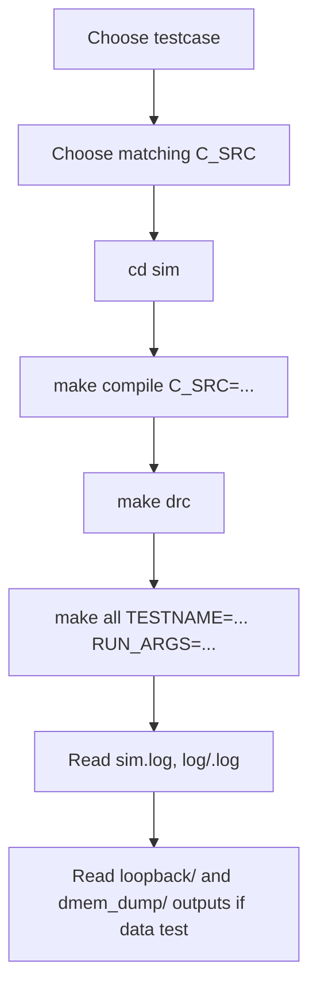
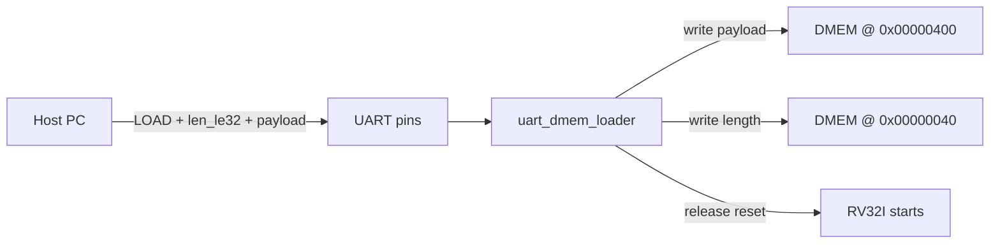

# SoC Usage And FPGA Bring-Up Guide

## 1. Purpose

Tai lieu nay la huong dan su dung SoC hien tai sau khi da gom regression ve
mot testbench chinh. Neu chi can chay nhanh, doc cac muc lenh trong phan 10.

Trang thai hien tai:

| Item | Current status |
|---|---|
| Simulation top | `test_bench` only |
| Testbench file | `tb/tb_rv32_soc_mmio_dma.v` |
| Testcase wrapper | `testcase/<TESTNAME>.v`, duoc Makefile copy thanh `sim/run_test.v` |
| Coverage regression | `cd sim && ./run.csh cov` |
| Latest pass/fail | `32/32` PASS |
| Raw DUT full coverage | `86.44%` |
| Raw DUT branch+statement | `94.93%` |
| Closed DUT coverage | `95.59%` |

Khong con dung `tb_rv32_soc_tx_only` hay `tb_rv32_log_preprocess` trong clean
baseline. TX-only, RX, DMA, CPU va coverage hooks deu chay qua `test_bench`.

## 2. Main Usage Flow



Rule quan trong:

- `make compile` tao `sim/instruction.mem` tu file C.
- `make all` build va run RTL, nhung khong tu chon lai C file.
- `TESTNAME` chon wrapper Verilog trong `testcase/`.
- `RUN_ARGS` chon `CASE_NAME`, `INPUT_FILE`, va coverage hook plusargs.
- `TB_NAME` thuong khong can set vi mac dinh da la `test_bench`.

## 3. Prerequisites

Can co:

- `riscv64-unknown-elf-gcc`
- `riscv64-unknown-elf-objcopy`
- Questa command line: `vlib`, `vlog`, `vsim`, `vcover`
- Verilator cho `make drc`
- Vivado Windows neu build FPGA

Neu Questa license loi, chay:

```bash
cd sim
make license
```

## 4. Active Simulation Flows

| Goal | C file | TESTNAME | INPUT_FILE | Mode |
|---|---|---|---|---|
| Main TX->RX loopback | `test_mmio_dma.c` | `dma_compress_aes_input1` | `input1.txt` | TX `0x9`, RX `0x2` |
| Small TX->RX loopback | `test_mmio_dma.c` | `dma_compress_aes_input3` | `input3.txt` | TX `0x9`, RX `0x2` |
| Max-valid-symbol loopback | `test_mmio_dma.c` | `dma_compress_aes_alnum63_cov` | `input_cov_alnum63.txt` | TX `0x9`, RX `0x2` |
| TX-only saving benchmark | `test_mmio_tx_only.c` | `tx_compress_only_input1` | `input1.txt` | TX `0xD` |
| TX-only log-like benchmark | `test_mmio_tx_only.c` | `tx_compress_only_input4_cov` | `input4_cov.txt` | TX `0xD` |
| TX symbol overflow error | `test_mmio_tx_encoder_error.c` | `tx_compress_only_ascii_sweep_cov` | `input_cov_ascii_sweep.txt` | expected TX error |
| MMIO regfile basic | `test_mmio_regfile_basic.c` | `mmio_regfile_basic` | optional | no DMA start |
| Full coverage regression | selected by `run.csh` | from `pat.list` | from `run.csh` | all active cases |

Known debug-only entries are commented in `sim/pat.list`; do not use them as
clean baseline.

## 5. Input File Handling

Trong simulation, C program khong mo file text. Testbench lam viec nay:

1. doc `+INPUT_FILE=<file>` trong thu muc `sim/`;
2. load bytes vao `DMEM` tai `SRC_BASE_ADDR = 0x00000400`;
3. ghi input length vao `INPUT_LEN_ADDR = 0x00000040`;
4. CPU RV32I doc `INPUT_LEN_ADDR`.

Vi vay:

- doi noi dung `input*.txt` khong can sua input length thu cong;
- doi input file khong can `make compile` lai;
- doi file C thi bat buoc `make compile C_SRC=...` lai.

Practical limits:

| Limit | Value |
|---|---:|
| DMEM total | 32 KiB |
| Testbench loader max | 10000 bytes |
| Main source buffer | 7168 bytes: `0x00000400..0x00001FFF` |
| TX output region | 8192 bytes: `0x00002000..0x00003FFF` |
| RX output region | 16384 bytes: `0x00004000..0x00007FFF` |

## 6. DMA Mode Selection

| MODE | Meaning | Active use |
|---:|---|---|
| `0x1` | TX `COMPRESS_AES`, per-block Huffman | compatibility/coverage |
| `0x5` | TX `COMPRESS_ONLY`, per-block Huffman | compatibility/coverage |
| `0x9` | TX `COMPRESS_AES`, whole-file dynamic Huffman | main TX->RX loopback |
| `0xD` | TX `COMPRESS_ONLY`, whole-file dynamic Huffman | TX-only saving benchmark |
| `0x2` | RX decrypt + Huffman decode | second phase of loopback |

Recommended use:

- dung `test_mmio_dma.c` neu muon secure-storage loopback `TX -> RX`;
- dung `test_mmio_tx_only.c` neu chi muon do compression saving truc tiep;
- dung `test_mmio_mode_matrix.c` neu chi muon verify mode/register contract.

## 7. Common Simulation Commands

Main loopback voi `input1.txt`:

```bash
cd sim
make compile C_SRC=test_mmio_dma.c
make drc
make all TESTNAME=dma_compress_aes_input1 RUN_ARGS="+CASE_NAME=dma_compress_aes_input1 +INPUT_FILE=input1.txt"
```

Main loopback voi `input3.txt`:

```bash
cd sim
make compile C_SRC=test_mmio_dma.c
make drc
make all TESTNAME=dma_compress_aes_input3 RUN_ARGS="+CASE_NAME=dma_compress_aes_input3 +INPUT_FILE=input3.txt"
```

TX-only benchmark voi `input4_cov.txt`:

```bash
cd sim
make compile C_SRC=test_mmio_tx_only.c
make drc
make all TESTNAME=tx_compress_only_input4_cov RUN_ARGS="+CASE_NAME=tx_compress_only_input4_cov +INPUT_FILE=input4_cov.txt"
```

MMIO regfile basic:

```bash
cd sim
make compile C_SRC=test_mmio_regfile_basic.c
make drc
make all TESTNAME=mmio_regfile_basic RUN_ARGS="+CASE_NAME=mmio_regfile_basic"
```

Neu chi doi input file sau khi da build dung C/testcase:

```bash
make run TESTNAME=dma_compress_aes_input1 RUN_ARGS="+CASE_NAME=dma_compress_aes_input1 +INPUT_FILE=input1.txt"
```

## 8. Coverage Regression

Clean coverage regression dung form `timer_standard_hv`:

```bash
cd sim
./run.csh cov
./report.csh
```

`./run.csh cov` se:

1. chay `make clean`;
2. doc tung testcase trong `sim/pat.list`;
3. compile dung `C_SRC`;
4. copy `testcase/<TESTNAME>.v` thanh `run_test.v`;
5. chay `make all_cov`;
6. merge UCDB bang `make gen_cov`.

Ket qua moi nhat:

| Metric | Value |
|---|---:|
| Active testcase count | 32 |
| Passed testcase count | 32 |
| Raw DUT full `bcesft` | 86.44% |
| Raw DUT no-toggle `bcesf` | 87.78% |
| Raw DUT branch+statement `bs` | 94.93% |
| Closed DUT coverage | 95.59% |

Report files:

| File | Meaning |
|---|---|
| `sim/coverage/summary_report.txt` | raw overall summary |
| `sim/coverage/detail_report.txt` | detailed bins/lines/toggles |
| `sim/coverage/dut_raw_bcesft_report.txt` | raw DUT full |
| `sim/coverage/dut_raw_bs_report.txt` | raw DUT branch+statement |
| `sim/coverage/dut_closed_report.txt` | closed DUT report after exclusions |

## 9. Output Files To Inspect

Sau run data-path:

| File/folder | Meaning |
|---|---|
| `sim/sim.log` | latest simulation log |
| `sim/log/<TESTNAME>.log` | per-test log |
| `sim/loopback/tb_rv32_soc_mmio_dma_summary.txt` | benchmark/saving summary |
| `sim/loopback/tb_rv32_soc_mmio_dma_compare.txt` | loopback compare |
| `sim/dmem_dump/tb_rv32_soc_mmio_dma_src.txt` | source DMEM dump |
| `sim/dmem_dump/tb_rv32_soc_mmio_dma_tx.txt` | TX output/ciphertext dump |
| `sim/dmem_dump/tb_rv32_soc_mmio_dma_rx.txt` | RX plaintext dump |

Pass condition chinh:

- log co `[PASS] rv32_soc_unified_test`;
- `SUMMARY: PASS=... FAIL=0`;
- loopback RX mismatch bang `0` voi full TX->RX cases.

## 10. Clean Commands

Simulation clean:

```bash
cd sim
make clean
```

Xoa:

- `work/`, `work_*`
- `instruction.mem`
- `log/`, `ucdb/`, `coverage/`
- `loopback/`, `dmem_dump/`, debug outputs
- generated `.elf/.bin/.mem/.S` trong `testcase/`

Vivado clean:

```bash
cd sim
make clean_vivado
```

Xoa:

- `vivado/build`
- `sim/vivado_reports`
- `sim/vivado_bitstreams`
- Vivado logs/jou/temp files

Khong chay `make clean` sau `make compile` neu ban sap build Vivado, vi no se
xoa `instruction.mem`.

## 11. FPGA Build Flow

Huong FPGA thuc dung hien tai la split bitstreams:

| Build | Command | Purpose |
|---|---|---|
| TX-only | `make vivado_flow_tx` | compression/encryption demo |
| RX-only | `make vivado_flow_rx` | decrypt/decode demo |
| TX + RX split | `make vivado_flow_split` | build ca hai bitstreams rieng |

TX-only FPGA build:

```bash
cd sim
make clean_vivado
make compile C_SRC=test_mmio_tx_only.c
make vivado_flow_tx
```

RX-only FPGA build:

```bash
cd sim
make clean_vivado
make compile C_SRC=test_mmio_dma.c
make vivado_flow_rx
```

Open Vivado GUI:

```bash
cd sim
make vivado_gui_tx
make vivado_gui_rx
```

Open reports:

```bash
cd sim
make vivado_report VIVADO_PROJECT=rv32_soc_synth_tx
make vivado_report VIVADO_PROJECT=rv32_soc_synth_rx
```

## 12. UART Loader Flow For FPGA

`rv32_soc_fpga_demo_top` co `uart_dmem_loader`:



Protocol:

```text
"LOAD" + payload_len_le32 + payload_bytes
```

Host command:

```bash
cd sim
make uart_load UART_PORT=/dev/ttyUSB0 UART_INPUT=input1.txt
```

Mac dinh:

- baud `115200`;
- ACK `0x79`;
- NACK/error `0x1F`;
- script host: `tools/uart_dmem_loader.py`.

## 13. What Still Needs Work Before Board Demo Is Complete

Da co loader input, nhung demo board thuc dung van can:

| Missing item | Why it matters |
|---|---|
| Runtime output readback | Can doc ciphertext/plaintext/saving ra ngoai board |
| IV storage/transport policy | RX can dung lai dung IV cua TX |
| Board-level observation | LED chi du de heartbeat/error, chua du de xem data |
| Final XDC confirmation | Can map dung clock/reset/UART pins theo board that |
| Demo script | Can script host nap bitstream, load input, dump output, tinh saving |

## 14. Recommended Next Steps

Thu tu hop ly:

1. giu simulation regression `32/32` PASS lam baseline;
2. neu can bao cao coverage, dung `coverage_regression_report.md`;
3. chot demo FPGA la TX-only hay RX-only;
4. build lai `instruction.mem` tu dung file C;
5. build bitstream split o 50 MHz;
6. nap bitstream len board;
7. load input qua UART;
8. bo sung UART/JTAG output dump de doc ket qua runtime.
