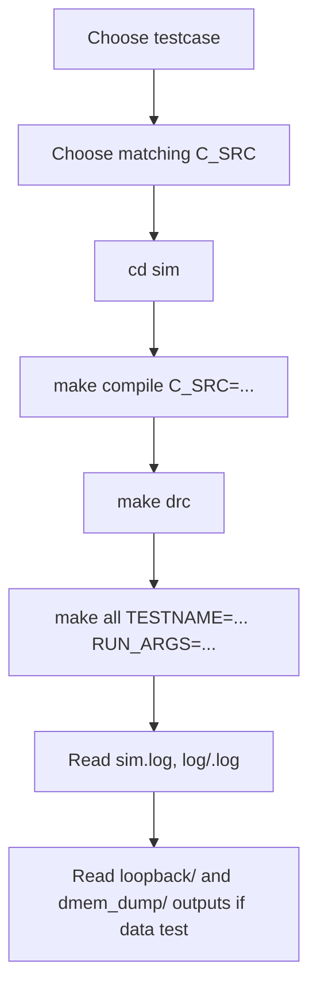
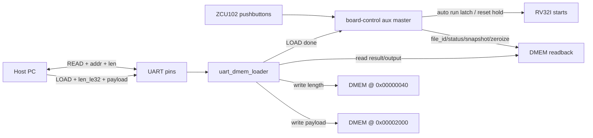

# SoC Usage And FPGA Bring-Up Guide

## 1. Purpose

Tai lieu nay la huong dan su dung SoC hien tai sau khi da gom regression ve
mot testbench chinh. Neu chi can chay nhanh, doc cac muc lenh trong phan 10.

Trang thai hien tai:

| Item | Current status |
|---|---|
| Simulation top | `test_bench` only |
| Testbench file | `tb/tb_rv32_soc_mmio_dma.v` |
| Testcase wrapper | `testcase/<TESTNAME>.v`, duoc Makefile copy thanh `sim/run_test.v` |
| Bare `make all` default | `dma_compress_aes_input1` / `input1.txt` |
| Coverage regression | `cd sim && ./run.csh cov` |
| Latest focused secure-storage API result | `dma_storage_table_input1_then_input3`: `PASS=22`, `FAIL=0` |
| Historical full-regression pass/fail | `34/34` PASS before secure-storage API refactor |
| Raw DUT full coverage | `93.52%` |
| Raw DUT branch+statement | `95.27%` |
| Closed DUT coverage | `95.90%` |

Khong con dung `tb_rv32_soc_tx_only` hay `tb_rv32_log_preprocess` trong clean
baseline. TX-only, RX, DMA, CPU va coverage hooks deu chay qua `test_bench`.

## 2. Main Usage Flow



Rule quan trong:

- `make compile` tao `sim/instruction.mem` tu file C.
- `make all` build va run RTL; neu khong truyen `TESTNAME`, flow mac dinh chay `dma_compress_aes_input1` voi `input1.txt`.
- `TESTNAME` chon wrapper Verilog trong `testcase/`.
- `RUN_ARGS` chon `CASE_NAME`, `INPUT_FILE`, va coverage hook plusargs.
- `TB_NAME` thuong khong can set vi mac dinh da la `test_bench`.

## 3. Prerequisites

Can co:

- `riscv64-unknown-elf-gcc`
- `riscv64-unknown-elf-objcopy`
- Questa command line: `vlib`, `vlog`, `vsim`, `vcover`
- Verilator cho `make drc`
- Vivado Windows neu build FPGA

Neu Questa license loi, chay:

```bash
cd sim
make license
```

## 4. Active Simulation Flows

| Goal | C file | TESTNAME | INPUT_FILE | Mode |
|---|---|---|---|---|
| Current secure-storage API demo | `test_mmio_dma_storage_table.c` + `secure_storage_fw.h` | `dma_storage_table_input1_then_input3` | `input1.txt` + `input3.txt` | `secure_write`, `secure_write`, `secure_read` |
| Legacy direct TX->RX loopback | `test_mmio_dma.c` | `dma_compress_aes_input1` | `input1.txt` | TX `0x9`, RX `0x2` |
| Small TX->RX loopback | `test_mmio_dma.c` | `dma_compress_aes_input3` | `input3.txt` | TX `0x9`, RX `0x2` |
| Alnum63 stress loopback | `test_mmio_dma.c` | `dma_compress_aes_alnum63_cov` | `input_cov_alnum63.txt` | TX `0x9`, RX `0x2` |
| TX-only saving benchmark | `test_mmio_tx_only.c` | `tx_compress_only_input1` | `input1.txt` | TX `0xD` |
| TX-only log-like benchmark | `test_mmio_tx_only.c` | `tx_compress_only_input4_cov` | `input4_cov.txt` | TX `0xD` |
| TX 256-symbol stress | `test_mmio_tx_only.c` | `tx_compress_only_ascii_sweep_cov` | `input_cov_ascii_sweep.txt` | TX `0xD`, expected expansion |
| DMEM load/readback smoke | any compiled C image | `dmem_load_readback_smoke` | not used | aux Port B write/read contract used by UART loader |
| MIT-BIH paper comparison | `test_mmio_dma.c` | `dma_mitdb_100_delta2_var_e2e` | `mitdb_100_mlii_10s_delta2_var.bin` | TX `0x9`, RX `0x2`, `+INPUT_BINARY` |
| MMIO regfile basic | `test_mmio_regfile_basic.c` | `mmio_regfile_basic` | optional | no DMA start |
| Multi-record storage demo | `test_mmio_dma_storage_table.c` + `secure_storage_fw.h` | `dma_storage_table_input1_then_input3` | `input1.txt` + `input3.txt` | `secure_write` input1, `secure_write` input3, `secure_read` input1 |
| Full coverage regression | selected by `run.csh` | from `pat.list` | from `run.csh` | all active cases |

Known debug-only entries are commented in `sim/pat.list`; do not use them as
clean baseline.

## 5. Input File Handling

Trong simulation, C program khong mo file text. Testbench lam viec nay:

1. doc `+INPUT_FILE=<file>` trong thu muc `sim/`;
2. load bytes vao `DMEM` tai `SRC_BASE_ADDR = 0x00002000`;
3. ghi input length vao `INPUT_LEN_ADDR = 0x00000040`;
4. CPU RV32I doc `INPUT_LEN_ADDR`.

Vi vay:

- doi noi dung `input*.txt` khong can sua input length thu cong;
- doi input file khong can `make compile` lai;
- doi file C thi bat buoc `make compile C_SRC=...` lai.

Practical limits:

| Limit | Value |
|---|---:|
| DMEM total | 32 KiB |
| Testbench loader max | 10000 bytes |
| FPGA UART loader max | 7168 bytes |
| Main source buffer | 8192 bytes: `0x00002000..0x00003FFF` |
| TX output region | 8192 bytes: `0x00004000..0x00005FFF` |
| RX output region | 8192 bytes: `0x00006000..0x00007FFF` |

MIT-BIH comparison inputs:

| Record | Input file in `sim/` |
|---:|---|
| 100 | `mitdb_100_mlii_10s_delta2_var.bin` |
| 106 | `mitdb_106_mlii_10s_delta2_var.bin` |
| 112 | `mitdb_112_mlii_10s_delta2_var.bin` |
| 117 | `mitdb_117_mlii_10s_delta2_var.bin` |
| 213 | `mitdb_213_mlii_10s_delta2_var.bin` |

These files are already-preprocessed binary byte streams. Use `+INPUT_BINARY`
so the testbench preserves all byte values exactly.

## 6. DMA Mode Selection

| MODE | Meaning | Active use |
|---:|---|---|
| `0x1` | TX `COMPRESS_AES`, per-block Huffman | compatibility/coverage |
| `0x5` | TX `COMPRESS_ONLY`, per-block Huffman | compatibility/coverage |
| `0x9` | TX `COMPRESS_AES`, whole-file dynamic Huffman | main TX->RX loopback |
| `0xD` | TX `COMPRESS_ONLY`, whole-file dynamic Huffman | TX-only saving benchmark |
| `0x2` | RX decrypt + Huffman decode | second phase of loopback |

Recommended use:

- dung `test_mmio_dma_storage_table.c` neu muon chay secure-storage firmware
  API voi metadata/IV va readback theo `file_id`;
- dung `test_mmio_dma.c` neu muon direct TX -> RX loopback;
- dung `test_mmio_tx_only.c` neu chi muon do compression saving truc tiep;
- dung `test_mmio_mode_matrix.c` neu chi muon verify mode/register contract.

## 7. Common Simulation Commands

Current secure-storage API demo:

```bash
cd sim
make compile C_SRC=test_mmio_dma_storage_table.c
make drc
make all TESTNAME=dma_storage_table_input1_then_input3 RUN_ARGS="+CASE_NAME=dma_storage_table_input1_then_input3 +INPUT_FILE=input1.txt +INPUT_FILE2=input3.txt"
```

This case proves that RV32I firmware can store metadata for two encrypted
objects and later select the first record for RX restore using only `file_id`.

Direct loopback voi `input1.txt`:

```bash
cd sim
make compile C_SRC=test_mmio_dma.c
make drc
make all
```

Day la baseline mac dinh khi khong truyen `TESTNAME`.

Main loopback voi `input3.txt`:

```bash
cd sim
make compile C_SRC=test_mmio_dma.c
make drc
make all TESTNAME=dma_compress_aes_input3 RUN_ARGS="+CASE_NAME=dma_compress_aes_input3 +INPUT_FILE=input3.txt"
```

TX-only benchmark voi `input4_cov.txt`:

```bash
cd sim
make compile C_SRC=test_mmio_tx_only.c
make drc
make all TESTNAME=tx_compress_only_input4_cov RUN_ARGS="+CASE_NAME=tx_compress_only_input4_cov +INPUT_FILE=input4_cov.txt"
```

MMIO regfile basic:

```bash
cd sim
make compile C_SRC=test_mmio_regfile_basic.c
make drc
make all TESTNAME=mmio_regfile_basic RUN_ARGS="+CASE_NAME=mmio_regfile_basic"
```

DMEM load/readback smoke for the FPGA UART loader memory contract:

```bash
cd sim
make compile C_SRC=test_mmio_dma.c
make all TESTNAME=dmem_load_readback_smoke RUN_ARGS="+CASE_NAME=dmem_load_readback_smoke"
```

This testcase stays inside the standard `make all` simulation system. It does
not instantiate the FPGA wrapper UART serial parser. It verifies the shared
contract behind that parser: data written through the SoC auxiliary DMEM Port B
is packed little-endian, byte enables work for a partial final word, and
`INPUT_LEN_ADDR = 0x00000040` can be read back correctly.

Multi-record storage demo command is the same current secure-storage API demo:

```bash
cd sim
make compile C_SRC=test_mmio_dma_storage_table.c
make drc
make all TESTNAME=dma_storage_table_input1_then_input3 RUN_ARGS="+CASE_NAME=dma_storage_table_input1_then_input3 +INPUT_FILE=input1.txt +INPUT_FILE2=input3.txt"
```

The storage metadata and IV policy are implemented in `secure_storage_fw.h`.

MIT-BIH preprocessed paper comparison:

```bash
cd sim
make compile C_SRC=test_mmio_dma.c
make drc
make all TESTNAME=dma_mitdb_100_delta2_var_e2e RUN_ARGS="+CASE_NAME=dma_mitdb_100_delta2_var_e2e +INPUT_FILE=mitdb_100_mlii_10s_delta2_var.bin +INPUT_BINARY"
```

Change the record number in both `TESTNAME` and `INPUT_FILE` to run
`106`, `112`, `117`, or `213`.

Neu chi doi input file sau khi da build dung C/testcase:

```bash
make run TESTNAME=dma_compress_aes_input1 RUN_ARGS="+CASE_NAME=dma_compress_aes_input1 +INPUT_FILE=input1.txt"
```

## 8. Coverage Regression

Clean coverage regression dung form `timer_standard_hv`:

```bash
cd sim
./run.csh cov
./report.csh
```

`./run.csh cov` se:

1. chay `make clean`;
2. doc tung testcase trong `sim/pat.list`;
3. compile dung `C_SRC`;
4. copy `testcase/<TESTNAME>.v` thanh `run_test.v`;
5. chay `make all_cov`;
6. merge UCDB bang `make gen_cov`.

Historical full-regression result:

| Metric | Value |
|---|---:|
| Active testcase count | 34 |
| Passed testcase count | 34 |
| Raw DUT full `bcesft` | 93.52% |
| Raw DUT no-toggle `bcesf` | 94.44% |
| Raw DUT branch+statement `bs` | 95.27% |
| Closed DUT coverage | 95.90% |

Report files:

| File | Meaning |
|---|---|
| `sim/coverage/summary_report.txt` | raw overall summary |
| `sim/coverage/detail_report.txt` | detailed bins/lines/toggles |
| `sim/coverage/dut_raw_bcesft_report.txt` | raw DUT full |
| `sim/coverage/dut_raw_bs_report.txt` | raw DUT branch+statement |
| `sim/coverage/dut_closed_report.txt` | closed DUT report after exclusions |

## 9. Output Files To Inspect

Sau run data-path:

| File/folder | Meaning |
|---|---|
| `sim/sim.log` | latest simulation log |
| `sim/log/<TESTNAME>.log` | per-test log |
| `sim/loopback/<CASE_NAME>_summary.txt` | benchmark/saving summary |
| `sim/loopback/<CASE_NAME>_compare.txt` | loopback compare |
| `sim/dmem_dump/<CASE_NAME>_src.txt` | source DMEM dump |
| `sim/dmem_dump/<CASE_NAME>_tx.txt` | TX output/ciphertext dump |
| `sim/dmem_dump/<CASE_NAME>_rx.txt` | RX plaintext dump |
| `sim/<TESTNAME>.wlf` | waveform database created by the latest run |
| `sim/sim.wlf` | copy of the latest waveform database used by `make wave` |
| `sim/log/<TESTNAME>.wlf` | archived waveform database for that testcase |

Pass condition chinh:

- log co `[PASS] rv32_soc_unified_test`;
- `SUMMARY: PASS=... FAIL=0`;
- loopback RX mismatch bang `0` voi full TX->RX cases.

Waveform commands:

```bash
cd sim
make wave
make kill_wave
```

`make wave` opens `sim.wlf` and adds only the curated root-level flow signals
`clk`, `rst`, and `wf_*` from `test_bench`. It does not recursively add the
whole DUT by default, to reduce Questa GUI load. `make kill_wave` is the
emergency cleanup command if the Questa viewer gets stuck.

## 10. Clean Commands

Simulation clean:

```bash
cd sim
make clean
```

Xoa:

- `work/`, `work_*`
- `instruction.mem`
- `log/`, `ucdb/`, `coverage/`
- `loopback/`, `dmem_dump/`, debug outputs
- generated `.elf/.bin/.mem/.S` trong `testcase/`

Vivado clean:

```bash
cd sim
make clean_vivado
```

Xoa:

- `vivado/build`
- `sim/vivado_reports`
- `sim/vivado_bitstreams`
- Vivado logs/jou/temp files

Khong chay `make clean` sau `make compile` neu ban sap build Vivado, vi no se
xoa `instruction.mem`.

## 11. FPGA Build Flow

Huong FPGA hien tai mac dinh target ZCU102, co ba muc:

- `rv32_soc_fpga_zcu102_top`: ZCU102 board/demo wrapper co UART loader. Top
  nay nhan USER_SI570 differential 300 MHz, chia noi bo xuong 50 MHz cho SoC
  va UART loader. Sau khi UART `LOAD` xong, wrapper tu release SoC reset de
  RV32I chay ngay. Pushbutton van dung cho reset, manual run/resume debug,
  zeroize, select `file_id`, va snapshot ket qua.
- `rv32_soc_fpga_demo_top`: legacy ZedBoard wrapper, van co the override lai
  bang Makefile variables neu can.
- `rv32_soc_top`: raw SoC integration top, van co the override bang bien
  `VIVADO_TOP` neu can phan tich noi bo khong can UART wrapper.

Default ZCU102 variables:

```text
VIVADO_FPGA_TOP=rv32_soc_fpga_zcu102_top
VIVADO_BOARD_XDC=vivado/constraints/zcu102_demo.xdc
VIVADO_PART=xczu9eg-ffvb1156-2-e
VIVADO_BOARD_PART=xilinx.com:zcu102:part0:3.3
VIVADO_CLOCK_MHZ=300
VIVADO_CLOCK_PORT=clk_p_i
VIVADO_LICENSE=H:\Academic\senior_project\DATN\work\kingofvivado.lic
VIVADO_SYNTH_DIRECTIVE=RuntimeOptimized
VIVADO_OPT_DIRECTIVE=Explore
VIVADO_PLACE_DIRECTIVE=Explore
VIVADO_PHYS_OPT_DIRECTIVE=AggressiveExplore
VIVADO_ROUTE_DIRECTIVE=Explore
VIVADO_POWER_OPT=1
```

ZCU102 uses the UltraScale+ device `xczu9eg-ffvb1156-2-e`, so Vivado must have
a valid synthesis/device license for `xczu9eg`. Without that license, the flow
can create/read the project but stops at `synth_design`.

Neu can quay lai ZedBoard:

```bash
make vivado_flow_full \
  VIVADO_FPGA_TOP=rv32_soc_fpga_demo_top \
  VIVADO_BOARD_XDC=vivado/constraints/zedboard_demo.xdc \
  VIVADO_PART=xc7z020clg484-1 \
  VIVADO_BOARD_PART= \
  VIVADO_CLOCK_MHZ=50 \
  VIVADO_CLOCK_PORT=clk_i
```

| Build | Command | Purpose |
|---|---|---|
| TX-only | `make vivado_flow_tx` | compression/encryption demo |
| RX-only | `make vivado_flow_rx` | decrypt/decode demo |
| TX + RX split | `make vivado_flow_split` | build ca hai bitstreams rieng |
| Full TX+RX FPGA SoC | `make vivado_flow_full` | synth/implement/write bitstream cho full SoC chung TX, RX va UART loader |

TX-only FPGA build:

```bash
cd sim
make clean_vivado
make compile C_SRC=test_mmio_tx_only.c
make vivado_flow_tx
```

RX-only FPGA build:

```bash
cd sim
make clean_vivado
make compile C_SRC=test_mmio_dma.c
make vivado_flow_rx
```

Full TX+RX FPGA SoC implementation + bitstream:

```bash
cd sim
make compile C_SRC=test_mmio_dma.c
make vivado_flow_full \
  VIVADO_REUSE_SYNTH=0 \
  VIVADO_REUSE_IMPL=0 \
  VIVADO_OPT_DIRECTIVE=Explore \
  VIVADO_PLACE_DIRECTIVE=Explore \
  VIVADO_PHYS_OPT_DIRECTIVE=AggressiveExplore \
  VIVADO_ROUTE_DIRECTIVE=Explore
```

Open Vivado GUI:

```bash
cd sim
make vivado_gui
make vivado_gui_tx
make vivado_gui_rx
make vivado_gui_full
```

Open reports:

```bash
cd sim
make vivado_report VIVADO_PROJECT=rv32_soc_synth_tx_zcu102
make vivado_report VIVADO_PROJECT=rv32_soc_synth_rx_zcu102
make vivado_report VIVADO_PROJECT=rv32_soc_synth_full_zcu102
```

Latest ZCU102 full TX+RX implementation and bitstream result after adding
pushbutton board-control and UART-load auto-run:

| Build | WNS | WHS | LUT | FF | CLB | Control sets | BRAM | DSP | Power | Status |
|---|---:|---:|---:|---:|---:|---:|---:|---:|---:|---|
| Full `rv32_soc_synth_full_zcu102` | +9.093 ns | +0.015 ns | 36382 | 19382 | 7281 | 1628 | 11 | 0 | 0.796 W | Timing pass, bitstream pass |

Route status for this build is `0` failed nets, `0` unrouted nets, and `0`
partially routed nets. Bitstream copies:

```text
sim/vivado_bitstreams/rv32_soc_synth_full_zcu102.bit
sim/vivado_bitstreams/rv32_soc_synth_full_zcu102_rv32_soc_fpga_zcu102_top.bit
```

Both files currently have SHA256:

```text
faf8d51c72f5287e9bd46063e9baf37b7aeef8317dd0cbc4b98f6e20f5a7d62e
```

This bitstream was built with the default `RuntimeOptimized` synthesis directive
and the default implementation directives. Override
`VIVADO_SYNTH_DIRECTIVE=AreaOptimized_high` only when a slower area-focused build
is acceptable. Post-implementation DRC has one non-fatal
`RTSTAT-10` warning for unused high address bits on the UART loader auxiliary
address bus.

Power is Vivado vectorless `report_power`: `0.796 W` total, `0.146 W`
dynamic, `0.649 W` static. Vivado warns that high-fanout reset activity can
make vectorless power inaccurate; use SAIF/VCD switching activity for a final
measured-style power claim.

Historical routed 50 MHz implementation result before the ZCU102 board retarget:

| Build | WNS | LUT | FF | Slices | Control sets | BRAM | Status |
|---|---:|---:|---:|---:|---:|---:|---|
| TX-only `rv32_soc_synth_tx_opt4` | +1.277 ns | 11933 | 5469 | 3979 | 208 | 10 | Timing pass |
| Full FPGA demo SoC `rv32_soc_synth_full_fpga` | +0.811 ns | 28379 | 18898 | 10165 | 778 | 11 | Timing pass |
| Legacy RX-only | +0.341 ns | 22730 | 27658 | n/a | 917 | 11 | Timing pass |

The previous full-build packing failure was fixed by moving large Huffman
tables/FIFOs to distributed RAM, avoiding reset loops on memories, reducing
control sets, and removing block-level `mode_decision_logic` from the active TX
datapath. After the ZCU102 retarget, new default project names are
`rv32_soc_synth_tx_zcu102`, `rv32_soc_synth_rx_zcu102`, and
`rv32_soc_synth_full_zcu102`.

## 12. UART Loader Flow For FPGA

`rv32_soc_fpga_zcu102_top` co `uart_dmem_loader`:



Protocol:

```text
"LOAD" + payload_len_le32 + payload_bytes
"READ" + dmem_addr_le32 + read_len_le32
```

Host command:

```bash
cd sim
make uart_load UART_PORT=/dev/ttyUSB0 UART_INPUT=input1.txt
make uart_read UART_PORT=/dev/ttyUSB0 UART_READ_ADDR=0x0 UART_READ_LEN=64
make uart_load_read UART_PORT=/dev/ttyUSB0 UART_INPUT=input1.txt UART_READ_ADDR=0x0 UART_READ_LEN=64
python3 ../tools/uart_dmem_loader.py --port /dev/ttyUSB0 --cpu-info
```

Mac dinh:

- baud `115200`;
- ACK `0x79`;
- NACK/error `0x1F`;
- script host: `tools/uart_dmem_loader.py`.
- READ requires 4-byte aligned address/length and returns raw little-endian
  DMEM bytes after the ACK.
- When READ covers `0x0..0x3f`, the host script auto-decodes result words and
  prints CPU/firmware information: signature, error mask, boot convention,
  CPU polling-loop counts, DMA jobs, input lengths, board status, and the live
  CPU debug window at `0x7f80..0x7fbf`.

Live CPU debug over UART:

| Address | Meaning |
|---:|---|
| `0x0000_7F80` | `"CPU1"` signature |
| `0x0000_7F84` | CPU status bits: reset/hold, IMEM seen, bus activity, TX/RX done/error |
| `0x0000_7F88` | current fetch PC |
| `0x0000_7F8C` | current IMEM instruction word |
| `0x0000_7F90` | cycle counter since SoC reset release |
| `0x0000_7F94` | IMEM fetch count |
| `0x0000_7F98` | DMEM access count |
| `0x0000_7F9C` | MMIO access count |
| `0x0000_7FA0..0x0000_7FB4` | last DMEM/MMIO and writeback snapshot |
| `0x0000_7FB8` | UART loader bytes loaded |
| `0x0000_7FBC` | debug version |

ZCU102 button map:

| Button | Function |
|---|---|
| CPU_RESET / SW20 | reset loader + SoC logic, then host must send UART `LOAD` again; this is not a DMEM erase |
| Center / SW15 | optional manual run/resume latch; normal flow auto-runs after UART `LOAD` completes |
| North / SW18 | zeroize secure metadata/IV region `0x100..0x1FF`, reset/hold SoC, clear run latch |
| East / SW17 | select next demo `file_id`, toggles between `1` and `3` |
| West / SW14 | select previous demo `file_id`, toggles between `1` and `3` |
| South / SW16 | snapshot result words from `0x00..0x3C` into `0x200..0x23F` |

ZCU102 LED map:

| LED | Function |
|---|---|
| LD0 | heartbeat; proves the programmed PL clock/reset path is alive |
| LD1 | IMEM program seen; CPU fetched a nonzero instruction from built-in `instruction.mem` |
| LD2 | UART loader: blink while loading, solid after input load done |
| LD3 | TX DMA: blink while active, solid after TX done |
| LD4 | RX DMA: blink while active, solid after RX done |
| LD5 | sticky error: loader, DMA, or DMEM memory error |
| LD6 | selected secure-storage `file_id`: off = `file_id=1`, on = `file_id=3` |
| LD7 | board-control function: blink while zeroize/snapshot/file-select logic is busy, solid after zeroize or snapshot done |

Useful readback commands after pressing buttons:

```bash
make uart_read UART_PORT=/dev/ttyUSB0 UART_READ_ADDR=0x50 UART_READ_LEN=16
make uart_read UART_PORT=/dev/ttyUSB0 UART_READ_ADDR=0x200 UART_READ_LEN=80
```

## 13. What Still Needs Work Before Board Demo Is Complete

Da co loader input va DMEM readback, nhung demo board thuc dung van can:

| Missing item | Why it matters |
|---|---|
| Firmware-done handshake | Hien host phai delay/poll result words, chua co UART interrupt/ACK rieng |
| Higher-level dump script | Can script doc metadata/cipher/plaintext va tinh saving mot cach tu dong |
| RX-only metadata transport | Neu muon demo RX-only tu ciphertext ngoai thi can nap IV + metadata + ciphertext |
| Board-level observation | LED now shows heartbeat, IMEM program fetch, loader, TX, RX, and sticky error; UART readback is still needed for detailed bytes/benchmark |

## 14. Recommended Next Steps

Thu tu hop ly:

1. dung focused secure-storage API testcase `PASS=22`, `FAIL=0` lam bang chung
   moi nhat cho metadata/IV/readback;
2. giu simulation regression lich su `34/34` PASS lam coverage baseline;
3. neu can bao cao coverage cuoi cung, chay lai `./run.csh cov`;
4. chot demo FPGA la TX-only, RX-only hay full TX+RX tren ZCU102;
5. build lai `instruction.mem` tu dung file C;
6. build bitstream ZCU102; external clock la 300 MHz, wrapper chia noi bo
   xuong 50 MHz;
7. nap bitstream len board;
8. load input qua UART;
9. bo sung UART/JTAG output dump de doc ket qua runtime.
