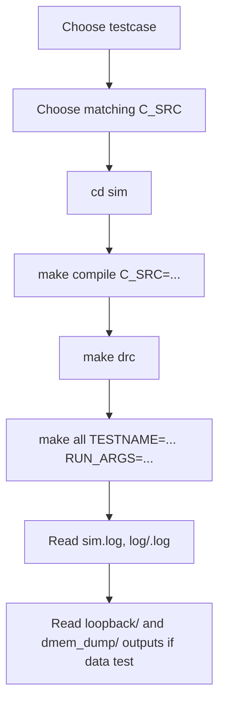

# SoC Usage And FPGA Bring-Up Guide

## 1. Purpose

Tai lieu nay la huong dan su dung SoC hien tai sau khi da gom regression ve
mot testbench chinh. Neu chi can chay nhanh, doc cac muc lenh trong phan 10.

Trang thai hien tai:

| Item | Current status |
|---|---|
| Simulation top | `test_bench` only |
| Testbench file | `tb/tb_rv32_soc_mmio_dma.v` |
| Testcase wrapper | `testcase/<TESTNAME>.v`, duoc Makefile copy thanh `sim/run_test.v` |
| Bare `make all` default | `dma_compress_aes_input1` / `input1.txt` |
| Coverage regression | `cd sim && ./run.csh cov` |
| Latest focused secure-storage API result | `dma_storage_table_input1_then_input3`: `PASS=22`, `FAIL=0` |
| Historical full-regression pass/fail | `34/34` PASS before secure-storage API refactor |
| Raw DUT full coverage | `93.52%` |
| Raw DUT branch+statement | `95.27%` |
| Closed DUT coverage | `95.90%` |

Khong con dung `tb_rv32_soc_tx_only` hay `tb_rv32_log_preprocess` trong clean
baseline. TX-only, RX, DMA, CPU va coverage hooks deu chay qua `test_bench`.

## 2. Main Usage Flow



Rule quan trong:

- `make compile` tao `sim/instruction.mem` tu file C.
- `make all` build va run RTL; neu khong truyen `TESTNAME`, flow mac dinh chay `dma_compress_aes_input1` voi `input1.txt`.
- `TESTNAME` chon wrapper Verilog trong `testcase/`.
- `RUN_ARGS` chon `CASE_NAME`, `INPUT_FILE`, va coverage hook plusargs.
- `TB_NAME` thuong khong can set vi mac dinh da la `test_bench`.

## 3. Prerequisites

Can co:

- `riscv64-unknown-elf-gcc`
- `riscv64-unknown-elf-objcopy`
- Questa command line: `vlib`, `vlog`, `vsim`, `vcover`
- Verilator cho `make drc`
- Vivado Windows neu build FPGA

Neu Questa license loi, chay:

```bash
cd sim
make license
```

## 4. Active Simulation Flows

| Goal | C file | TESTNAME | INPUT_FILE | Mode |
|---|---|---|---|---|
| Current secure-storage API demo | `test_mmio_dma_storage_table.c` + `secure_storage_fw.h` | `dma_storage_table_input1_then_input3` | `input1.txt` + `input3.txt` | `secure_write`, `secure_write`, `secure_read` |
| Legacy direct TX->RX loopback | `test_mmio_dma.c` | `dma_compress_aes_input1` | `input1.txt` | TX `0x9`, RX `0x2` |
| Small TX->RX loopback | `test_mmio_dma.c` | `dma_compress_aes_input3` | `input3.txt` | TX `0x9`, RX `0x2` |
| Alnum63 stress loopback | `test_mmio_dma.c` | `dma_compress_aes_alnum63_cov` | `input_cov_alnum63.txt` | TX `0x9`, RX `0x2` |
| TX-only saving benchmark | `test_mmio_tx_only.c` | `tx_compress_only_input1` | `input1.txt` | TX `0xD` |
| TX-only log-like benchmark | `test_mmio_tx_only.c` | `tx_compress_only_input4_cov` | `input4_cov.txt` | TX `0xD` |
| TX 256-symbol stress | `test_mmio_tx_only.c` | `tx_compress_only_ascii_sweep_cov` | `input_cov_ascii_sweep.txt` | TX `0xD`, expected expansion |
| MIT-BIH paper comparison | `test_mmio_dma.c` | `dma_mitdb_100_delta2_var_e2e` | `mitdb_100_mlii_10s_delta2_var.bin` | TX `0x9`, RX `0x2`, `+INPUT_BINARY` |
| MMIO regfile basic | `test_mmio_regfile_basic.c` | `mmio_regfile_basic` | optional | no DMA start |
| Multi-record storage demo | `test_mmio_dma_storage_table.c` + `secure_storage_fw.h` | `dma_storage_table_input1_then_input3` | `input1.txt` + `input3.txt` | `secure_write` input1, `secure_write` input3, `secure_read` input1 |
| Full coverage regression | selected by `run.csh` | from `pat.list` | from `run.csh` | all active cases |

Known debug-only entries are commented in `sim/pat.list`; do not use them as
clean baseline.

## 5. Input File Handling

Trong simulation, C program khong mo file text. Testbench lam viec nay:

1. doc `+INPUT_FILE=<file>` trong thu muc `sim/`;
2. load bytes vao `DMEM` tai `SRC_BASE_ADDR = 0x00002000`;
3. ghi input length vao `INPUT_LEN_ADDR = 0x00000040`;
4. CPU RV32I doc `INPUT_LEN_ADDR`.

Vi vay:

- doi noi dung `input*.txt` khong can sua input length thu cong;
- doi input file khong can `make compile` lai;
- doi file C thi bat buoc `make compile C_SRC=...` lai.

Practical limits:

| Limit | Value |
|---|---:|
| DMEM total | 32 KiB |
| Testbench loader max | 10000 bytes |
| Main source buffer | 8192 bytes: `0x00002000..0x00003FFF` |
| TX output region | 8192 bytes: `0x00004000..0x00005FFF` |
| RX output region | 8192 bytes: `0x00006000..0x00007FFF` |

MIT-BIH comparison inputs:

| Record | Input file in `sim/` |
|---:|---|
| 100 | `mitdb_100_mlii_10s_delta2_var.bin` |
| 106 | `mitdb_106_mlii_10s_delta2_var.bin` |
| 112 | `mitdb_112_mlii_10s_delta2_var.bin` |
| 117 | `mitdb_117_mlii_10s_delta2_var.bin` |
| 213 | `mitdb_213_mlii_10s_delta2_var.bin` |

These files are already-preprocessed binary byte streams. Use `+INPUT_BINARY`
so the testbench preserves all byte values exactly.

## 6. DMA Mode Selection

| MODE | Meaning | Active use |
|---:|---|---|
| `0x1` | TX `COMPRESS_AES`, per-block Huffman | compatibility/coverage |
| `0x5` | TX `COMPRESS_ONLY`, per-block Huffman | compatibility/coverage |
| `0x9` | TX `COMPRESS_AES`, whole-file dynamic Huffman | main TX->RX loopback |
| `0xD` | TX `COMPRESS_ONLY`, whole-file dynamic Huffman | TX-only saving benchmark |
| `0x2` | RX decrypt + Huffman decode | second phase of loopback |

Recommended use:

- dung `test_mmio_dma_storage_table.c` neu muon chay secure-storage firmware
  API voi metadata/IV va readback theo `file_id`;
- dung `test_mmio_dma.c` neu muon direct TX -> RX loopback;
- dung `test_mmio_tx_only.c` neu chi muon do compression saving truc tiep;
- dung `test_mmio_mode_matrix.c` neu chi muon verify mode/register contract.

## 7. Common Simulation Commands

Current secure-storage API demo:

```bash
cd sim
make compile C_SRC=test_mmio_dma_storage_table.c
make drc
make all TESTNAME=dma_storage_table_input1_then_input3 RUN_ARGS="+CASE_NAME=dma_storage_table_input1_then_input3 +INPUT_FILE=input1.txt +INPUT_FILE2=input3.txt"
```

This case proves that RV32I firmware can store metadata for two encrypted
objects and later select the first record for RX restore using only `file_id`.

Direct loopback voi `input1.txt`:

```bash
cd sim
make compile C_SRC=test_mmio_dma.c
make drc
make all
```

Day la baseline mac dinh khi khong truyen `TESTNAME`.

Main loopback voi `input3.txt`:

```bash
cd sim
make compile C_SRC=test_mmio_dma.c
make drc
make all TESTNAME=dma_compress_aes_input3 RUN_ARGS="+CASE_NAME=dma_compress_aes_input3 +INPUT_FILE=input3.txt"
```

TX-only benchmark voi `input4_cov.txt`:

```bash
cd sim
make compile C_SRC=test_mmio_tx_only.c
make drc
make all TESTNAME=tx_compress_only_input4_cov RUN_ARGS="+CASE_NAME=tx_compress_only_input4_cov +INPUT_FILE=input4_cov.txt"
```

MMIO regfile basic:

```bash
cd sim
make compile C_SRC=test_mmio_regfile_basic.c
make drc
make all TESTNAME=mmio_regfile_basic RUN_ARGS="+CASE_NAME=mmio_regfile_basic"
```

Multi-record storage demo command is the same current secure-storage API demo:

```bash
cd sim
make compile C_SRC=test_mmio_dma_storage_table.c
make drc
make all TESTNAME=dma_storage_table_input1_then_input3 RUN_ARGS="+CASE_NAME=dma_storage_table_input1_then_input3 +INPUT_FILE=input1.txt +INPUT_FILE2=input3.txt"
```

The storage metadata and IV policy are implemented in `secure_storage_fw.h`.

MIT-BIH preprocessed paper comparison:

```bash
cd sim
make compile C_SRC=test_mmio_dma.c
make drc
make all TESTNAME=dma_mitdb_100_delta2_var_e2e RUN_ARGS="+CASE_NAME=dma_mitdb_100_delta2_var_e2e +INPUT_FILE=mitdb_100_mlii_10s_delta2_var.bin +INPUT_BINARY"
```

Change the record number in both `TESTNAME` and `INPUT_FILE` to run
`106`, `112`, `117`, or `213`.

Neu chi doi input file sau khi da build dung C/testcase:

```bash
make run TESTNAME=dma_compress_aes_input1 RUN_ARGS="+CASE_NAME=dma_compress_aes_input1 +INPUT_FILE=input1.txt"
```

## 8. Coverage Regression

Clean coverage regression dung form `timer_standard_hv`:

```bash
cd sim
./run.csh cov
./report.csh
```

`./run.csh cov` se:

1. chay `make clean`;
2. doc tung testcase trong `sim/pat.list`;
3. compile dung `C_SRC`;
4. copy `testcase/<TESTNAME>.v` thanh `run_test.v`;
5. chay `make all_cov`;
6. merge UCDB bang `make gen_cov`.

Historical full-regression result:

| Metric | Value |
|---|---:|
| Active testcase count | 34 |
| Passed testcase count | 34 |
| Raw DUT full `bcesft` | 93.52% |
| Raw DUT no-toggle `bcesf` | 94.44% |
| Raw DUT branch+statement `bs` | 95.27% |
| Closed DUT coverage | 95.90% |

Report files:

| File | Meaning |
|---|---|
| `sim/coverage/summary_report.txt` | raw overall summary |
| `sim/coverage/detail_report.txt` | detailed bins/lines/toggles |
| `sim/coverage/dut_raw_bcesft_report.txt` | raw DUT full |
| `sim/coverage/dut_raw_bs_report.txt` | raw DUT branch+statement |
| `sim/coverage/dut_closed_report.txt` | closed DUT report after exclusions |

## 9. Output Files To Inspect

Sau run data-path:

| File/folder | Meaning |
|---|---|
| `sim/sim.log` | latest simulation log |
| `sim/log/<TESTNAME>.log` | per-test log |
| `sim/loopback/<CASE_NAME>_summary.txt` | benchmark/saving summary |
| `sim/loopback/<CASE_NAME>_compare.txt` | loopback compare |
| `sim/dmem_dump/<CASE_NAME>_src.txt` | source DMEM dump |
| `sim/dmem_dump/<CASE_NAME>_tx.txt` | TX output/ciphertext dump |
| `sim/dmem_dump/<CASE_NAME>_rx.txt` | RX plaintext dump |

Pass condition chinh:

- log co `[PASS] rv32_soc_unified_test`;
- `SUMMARY: PASS=... FAIL=0`;
- loopback RX mismatch bang `0` voi full TX->RX cases.

## 10. Clean Commands

Simulation clean:

```bash
cd sim
make clean
```

Xoa:

- `work/`, `work_*`
- `instruction.mem`
- `log/`, `ucdb/`, `coverage/`
- `loopback/`, `dmem_dump/`, debug outputs
- generated `.elf/.bin/.mem/.S` trong `testcase/`

Vivado clean:

```bash
cd sim
make clean_vivado
```

Xoa:

- `vivado/build`
- `sim/vivado_reports`
- `sim/vivado_bitstreams`
- Vivado logs/jou/temp files

Khong chay `make clean` sau `make compile` neu ban sap build Vivado, vi no se
xoa `instruction.mem`.

## 11. FPGA Build Flow

Huong FPGA hien tai co hai muc:

- `rv32_soc_fpga_demo_top`: board/demo wrapper, co the build TX-only hoac
  RX-only de demo nhe hon.
- `rv32_soc_top`: raw full SoC TX+RX, dung de kiem tra closure tai nguyen va
  timing chung.

| Build | Command | Purpose |
|---|---|---|
| TX-only | `make vivado_flow_tx` | compression/encryption demo |
| RX-only | `make vivado_flow_rx` | decrypt/decode demo |
| TX + RX split | `make vivado_flow_split` | build ca hai bitstreams rieng |
| Full TX+RX raw SoC | `make vivado_impl_full` | synth/implement full SoC chung TX va RX |

TX-only FPGA build:

```bash
cd sim
make clean_vivado
make compile C_SRC=test_mmio_tx_only.c
make vivado_flow_tx
```

RX-only FPGA build:

```bash
cd sim
make clean_vivado
make compile C_SRC=test_mmio_dma.c
make vivado_flow_rx
```

Full TX+RX raw SoC implementation:

```bash
cd sim
make compile C_SRC=test_mmio_dma.c
make vivado_impl_full \
  VIVADO_REUSE_SYNTH=0 \
  VIVADO_REUSE_IMPL=0 \
  VIVADO_OPT_DIRECTIVE=Explore \
  VIVADO_PLACE_DIRECTIVE=Explore \
  VIVADO_PHYS_OPT_DIRECTIVE=AggressiveExplore \
  VIVADO_ROUTE_DIRECTIVE=Explore
```

Open Vivado GUI:

```bash
cd sim
make vivado_gui_tx
make vivado_gui_rx
```

Open reports:

```bash
cd sim
make vivado_report VIVADO_PROJECT=rv32_soc_synth_tx
make vivado_report VIVADO_PROJECT=rv32_soc_synth_rx
make vivado_report VIVADO_PROJECT=rv32_soc_synth_full_opt4
```

Latest 50 MHz implementation result after Huffman table/control-set
optimization:

| Build | WNS | LUT | FF | Slices | Control sets | BRAM | Status |
|---|---:|---:|---:|---:|---:|---:|---|
| TX-only `rv32_soc_synth_tx_opt4` | +1.277 ns | 11933 | 5469 | 3979 | 208 | 10 | Timing pass |
| Full TX+RX `rv32_soc_synth_full_opt4` | +0.334 ns | 28067 | 18501 | 9955 | 757 | 11 | Timing pass |
| Legacy RX-only | +0.341 ns | 22730 | 27658 | n/a | 917 | 11 | Timing pass |

The previous full-build packing failure was fixed by moving large Huffman
tables/FIFOs to distributed RAM, avoiding reset loops on memories, and
reducing control sets. `rv32_soc_synth_full_opt4` routes with zero failed nets.

## 12. UART Loader Flow For FPGA

`rv32_soc_fpga_demo_top` co `uart_dmem_loader`:


Protocol:

```text
"LOAD" + payload_len_le32 + payload_bytes
```

Host command:

```bash
cd sim
make uart_load UART_PORT=/dev/ttyUSB0 UART_INPUT=input1.txt
```

Mac dinh:

- baud `115200`;
- ACK `0x79`;
- NACK/error `0x1F`;
- script host: `tools/uart_dmem_loader.py`.

## 13. What Still Needs Work Before Board Demo Is Complete

Da co loader input, nhung demo board thuc dung van can:

| Missing item | Why it matters |
|---|---|
| Runtime output readback | Can doc ciphertext/plaintext/saving ra ngoai board |
| IV storage/transport policy | RX can dung lai dung IV cua TX |
| Board-level observation | LED chi du de heartbeat/error, chua du de xem data |
| Final XDC confirmation | Can map dung clock/reset/UART pins theo board that |
| Demo script | Can script host nap bitstream, load input, dump output, tinh saving |

## 14. Recommended Next Steps

Thu tu hop ly:

1. dung focused secure-storage API testcase `PASS=22`, `FAIL=0` lam bang chung
   moi nhat cho metadata/IV/readback;
2. giu simulation regression lich su `34/34` PASS lam coverage baseline;
3. neu can bao cao coverage cuoi cung, chay lai `./run.csh cov`;
4. chot demo FPGA la TX-only hay RX-only;
5. build lai `instruction.mem` tu dung file C;
6. build bitstream split o 50 MHz;
7. nap bitstream len board;
8. load input qua UART;
9. bo sung UART/JTAG output dump de doc ket qua runtime.
