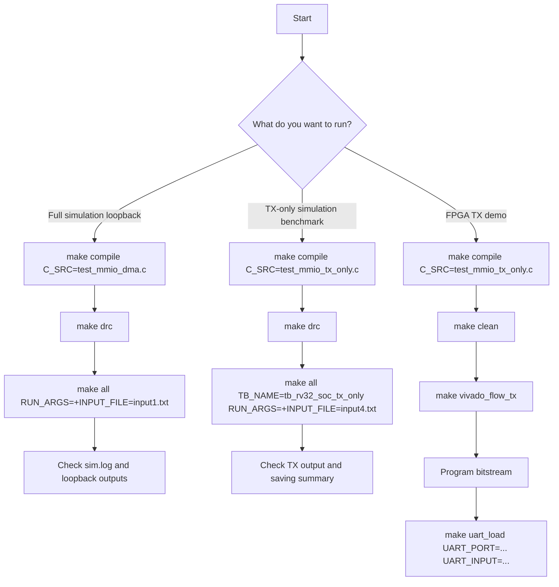

# SoC Usage and FPGA Bring-Up Guide

## 1. Purpose

Tai lieu nay la huong dan su dung SoC hien tai trong repo:

- chon mode TX/RX nhu the nao
- chon file C nhu the nao
- chon `input.txt` nhu the nao
- co can sua `input length` thu cong hay khong
- `make compile`, `make all`, `TB_NAME`, `RUN_ARGS` dung ra sao
- khi len FPGA thi can chuan bi them gi

Spec nay mo ta **flow active hien tai** cua repo.

## 1.0 Usage Flow Chart



## 1.1 Prerequisites

De chay duoc flow hien tai, ban can:

- toolchain `riscv64-unknown-elf-gcc`
- Questa/ModelSim command line (`vlib`, `vlog`, `vsim`)
- Vivado neu muon synth/impl/bitstream

Neu `vsim` bi loi license, chay:

```bash
cd sim
make license
```

Neu muon build bitstream, can dam bao:

- duong dan `VIVADO_BAT` trong `sim/Makefile` dung voi may hien tai
- file `instruction.mem` da duoc tao tu dung chuong trinh C ma ban muon demo

## 2. Current Supported Flows

Hien tai co 3 flow thuc dung trong `sim/`:

| Flow | C file | Testbench | Muc dich |
|---|---|---|---|
| Main loopback | `test_mmio_dma.c` | `test_bench` | `DMEM -> TX -> DMEM -> RX -> DMEM` |
| TX-only benchmark | `test_mmio_tx_only.c` | `tb_rv32_soc_tx_only` | do compression/saving phia TX |
| Optional host-preprocess benchmark | `test_log_preprocess.c` | `tb_rv32_log_preprocess` | benchmark huong preprocess host, khong phai flow SoC chinh |

Flow chinh de demo SoC hien tai la:

- `test_mmio_dma.c`
- `TB_NAME=test_bench`

## 3. Current DMA Modes

### 3.1 Mode values

| Mode | Y nghia |
|---:|---|
| `0x1` | TX `COMPRESS_AES` theo per-block |
| `0x5` | TX `COMPRESS_ONLY` per-block legacy |
| `0xD` | TX `COMPRESS_ONLY + whole_file` default TX-only |
| `0x9` | TX `COMPRESS_AES + whole_file` |
| `0x2` | RX |

### 3.2 Which mode is used now

Flow loopback chinh hien tai:

- TX dung `0x9`
- RX dung `0x2`

TX-only benchmark:

- TX dung `0xD`

### 3.3 How to choose mode

Cach de dung nhat hien tai la chon dung file C:

- `test_mmio_dma.c` cho loopback `TX(0x9) -> RX(0x2)`
- `test_mmio_tx_only.c` cho `TX COMPRESS_ONLY + whole_file (0xD)`

Neu muon test mode khac, cach nhanh nhat la:

- copy tu mot file C dang co
- sua macro `TEST_MODE_*`
- compile lai bang `make compile C_SRC=<file_moi>.c`

## 4. Current Input File Handling

### 4.1 Input file is loaded by testbench

Trong flow `sim`, file input khong do C program tu mo.

Testbench se:

1. mo file input
2. doc tung byte
3. ghi noi dung vao `DMEM` tai `SRC_BASE_ADDR = 0x00000400`
4. tinh `input_len_bytes`
5. ghi `input_len_bytes` vao `INPUT_LEN_ADDR = 0x00000040`

Do do:

- **khong can sua `input length` thu cong trong file C**
- C chi can doc `INPUT_LEN_ADDR`

### 4.2 Default input files

Mac dinh:

- `tb_rv32_soc_mmio_dma.v` dung `input1.txt`
- `tb_rv32_soc_tx_only.v` dung `input4.txt`

Nhung user co the override bang plusarg:

```text
+INPUT_FILE=<ten_file>
```

### 4.3 How to change input file

Vi du chay loopback voi `input3.txt`:

```bash
cd sim
make all RUN_ARGS="+INPUT_FILE=input3.txt"
```

Vi du chay TX-only voi `input2.txt`:

```bash
cd sim
make all TB_NAME=tb_rv32_soc_tx_only RUN_ARGS="+INPUT_FILE=input2.txt"
```

File duoc resolve theo thu muc `sim/` neu ban chay `make` trong `sim`.

### 4.4 Do I need to edit the text file length anywhere

Khong.

Neu ban:

- thay noi dung trong `sim/input1.txt`
- hoac chon file khac bang `+INPUT_FILE=...`

thi testbench tu doc lai file va tu tinh `input_len_bytes`.

## 5. Practical Input Size Limits

### 5.1 Testbench loader limit

Ca `tb_rv32_soc_mmio_dma.v` va `tb_rv32_soc_tx_only.v` deu dat:

- `MAX_INPUT_BYTES = 10000`

Neu file lon hon muc nay, testbench se fail.

### 5.2 Main source buffer limit

Trong loopback main:

- `SRC_BASE_ADDR = 0x00000400`
- `TX_DST_BASE_ADDR = 0x00002000`

Nen source buffer size la:

```text
0x2000 - 0x0400 = 0x1C00 = 7168 bytes
```

Vi vay input cho loopback/TX-only thuc te phai thoa:

- `input_len <= 7168 bytes`

Neu vuot, testbench se fail voi loi vuot source buffer.

### 5.3 TX destination buffer limit

Trong loopback main:

- `TX_DST_BASE_ADDR = 0x00002000`
- `RX_DST_BASE_ADDR = 0x00004000`

Nen TX output region co:

- `8192 bytes`

Ban can theo doi:

- `tx_ciphertext_bytes`

de dam bao output cua TX khong tran qua region nay.

### 5.4 RX destination buffer limit

Trong loopback main:

- `RX_DST_BASE_ADDR = 0x00004000`
- `DMEM_SIZE_BYTES = 32768`

Nen RX output region co:

- `16384 bytes`

## 6. How To Choose C File

### 6.1 Compile step

`make compile` chon file C bang bien `C_SRC`.

Vi du:

```bash
cd sim
make compile C_SRC=test_mmio_dma.c
```

Hoac:

```bash
cd sim
make compile C_SRC=test_mmio_tx_only.c
```

Ket qua:

- `.S`, `.elf`, `.bin`, `.mem` duoc tao trong `../testcase/`
- file `.mem` duoc copy thanh `sim/instruction.mem`

### 6.2 Important rule

`make all` **khong tu compile lai file C**.

Cho nen:

- neu doi file C hoac sua file C: phai `make compile` lai
- neu chi doi `input.txt`: khong can `make compile`, chi can rerun `make all`

## 7. How To Run Main Loopback

### 7.1 Recommended sequence

```bash
cd sim
make compile C_SRC=test_mmio_dma.c
make drc
make build
make all RUN_ARGS="+INPUT_FILE=input1.txt"
```

`make all` trong Makefile hien tai = `build + run`.

Neu da `make build` xong va chi doi input file, ban co the dung:

```bash
make run RUN_ARGS="+INPUT_FILE=input2.txt"
```

### 7.2 What this run does

Run nay:

1. testbench nap file input vao `DMEM`
2. C program doc `INPUT_LEN_ADDR`
3. RV32I tao IV demo va ghi `IV0..IV3`
4. RV32I start TX mode `0x9`
5. TX nen whole-file + AES-CBC
6. RV32I doc `CIPHERTEXT_BYTES_PRODUCED`
7. RV32I start RX mode `0x2`
8. RX AES-CBC decrypt + Huffman decode
9. testbench so sanh du lieu output voi input ban dau

### 7.3 Main outputs to inspect

Sau khi chay:

- log chinh: `sim/sim.log`
- log goc theo `TESTNAME`: `sim/log/*.log`
- summary loopback: `sim/loopback/tb_rv32_soc_mmio_dma_summary.txt`
- compare loopback: `sim/loopback/tb_rv32_soc_mmio_dma_compare.txt`
- dump DMEM source/TX/RX:
  - `sim/dmem_dump/tb_rv32_soc_mmio_dma_src.txt`
  - `sim/dmem_dump/tb_rv32_soc_mmio_dma_tx.txt`
  - `sim/dmem_dump/tb_rv32_soc_mmio_dma_rx.txt`

## 8. How To Run TX-Only

### 8.1 Command

```bash
cd sim
make compile C_SRC=test_mmio_tx_only.c
make drc
make build
make all TB_NAME=tb_rv32_soc_tx_only RUN_ARGS="+INPUT_FILE=input4.txt"
```

### 8.2 Why `TB_NAME` is needed

Mac dinh Makefile dung:

- `TB_NAME=test_bench`

Day la top cua loopback main.

TX-only testbench co top rieng:

- `tb_rv32_soc_tx_only`

Cho nen khi chay TX-only, phai set `TB_NAME`.

### 8.3 What this run does

Run nay:

1. nap file input vao source buffer
2. RV32I start TX mode `0xD`
3. TX nen va bypass AES
4. testbench do:
   - `payload compression`
   - `storage ratio`
   - `space saving`

## 9. Optional Host-Preprocess Flow

Flow nay khong phai main SoC flow, nhung van con trong repo.

Neu dung:

```bash
cd sim
make compile C_SRC=test_log_preprocess.c
make build
make all TB_NAME=tb_rv32_log_preprocess RUN_ARGS="+INPUT_FILE=input4.txt"
```

Luu y:

- day la benchmark nhanh optional
- khong phai flow ma ban nen dung de mo ta kien truc SoC chinh

## 10. Current C Files And Their Roles

| File | Role |
|---|---|
| `test_mmio_dma.c` | main TX->RX loopback |
| `test_mmio_tx_only.c` | TX-only `COMPRESS_ONLY` |
| `test_log_preprocess.c` | optional host-preprocess benchmark |
| `test.c` | smoke test core sync don gian |

## 11. Current IV Usage

Neu dung AES mode:

- CPU RV32I tu tinh IV
- ghi `IV0..IV3`
- TX va RX cung doc IV tu `dma_regfile`

Neu chi doi `input.txt`:

- khong can sua IV bang tay
- chuong trinh C se tao lai IV theo input length/context

## 12. Clean Build

Neu muon don file sinh ra:

```bash
cd sim
make clean
```

Lenh nay xoa:

- `work/`
- `instruction.mem`
- output compile trong `../testcase/`
- log, dump, loopback summary

## 13. Current FPGA Build Commands

### 13.1 TX-only

```bash
cd sim
make compile C_SRC=test_mmio_tx_only.c
make vivado_flow_tx
```

Hoac tung buoc:

```bash
make vivado_synth_tx
make vivado_impl_tx
make vivado_bit_tx
```

### 13.2 RX-only

```bash
cd sim
make compile C_SRC=test_mmio_dma.c
make vivado_flow_rx
```

Hoac tung buoc:

```bash
make vivado_synth_rx
make vivado_impl_rx
make vivado_bit_rx
```

### 13.3 Rebuild both

```bash
cd sim
make clean
make vivado_flow_split
```

### 13.4 Important note before Vivado

Vivado copy:

- `sim/instruction.mem`

vao project build.

Cho nen truoc khi synth/impl/bitstream, ban phai dam bao da compile dung file C:

```bash
make compile C_SRC=test_mmio_dma.c
```

hoac file C ma ban muon demo tren FPGA.

## 14. Current UART Loader FPGA Flow

### 14.1 What now exists in the FPGA top

`rv32_soc_fpga_demo_top` bay gio da co:

- `uart_rx_i`
- `uart_tx_o`
- `uart_dmem_loader`

Loader nay:

1. nhan frame UART
2. ghi payload vao `DMEM` tai `SRC_BASE_ADDR = 0x00000400`
3. ghi `INPUT_LEN_ADDR = 0x00000040`
4. tha reset cua SoC de CPU bat dau chay

### 14.2 UART protocol

Frame hien tai:

```text
"LOAD" + payload_len_le32 + payload_bytes
```

ACK:

- `0x79` = success
- `0x1F` = error

### 14.3 Board wiring

Theo `vivado/constraints/zedboard_demo.xdc`:

- `uart_rx_i` -> `JA1`
- `uart_tx_o` -> `JA2`

Noi day:

1. USB-UART TX -> `JA1`
2. USB-UART RX -> `JA2`
3. GND chung

### 14.4 Host command

Tu `sim/`:

```bash
make uart_load UART_PORT=/dev/ttyUSB0 UART_INPUT=input1.txt
```

Mac dinh:

- baud `115200`
- script host: `../tools/uart_dmem_loader.py`

### 14.5 Recommended real use right now

Flow thuc dung nhat hien tai:

1. build `instruction.mem` tu `test_mmio_tx_only.c`
2. build `TX-only` bitstream bang `make clean` roi `make vivado_flow_tx`
3. nap bitstream len board
4. push `input.txt` qua `make uart_load`
5. de RV32I tu doc `INPUT_LEN_ADDR` va start TX

Ly do:

- loader chi lo phan input runtime
- TX-only la nhanh demo board don gian nhat
- chua can giai bai toan ciphertext readback tren board trong cung buoc nay

## 15. Current Recommended FPGA Direction

Huong khuyen nghi hien tai la:

- `TX-only bitstream`
- `RX-only bitstream`

Khong phai full TX+RX bitstream gom chung.

Ly do:

- split build da meet timing 50 MHz
- de debug hon
- de demo tung nhanh hon

## 16. What Is Still Missing Before A Real FPGA Demo

Bitstream da co, nhung de demo board that mot cach thuc dung ban van can:

1. **Duong lay output runtime**
   - can co cach doc ciphertext/plaintext ra ngoai
   - vi du `UART dump`, `PS readback`, `JTAG memory read`, hoac interface host

2. **Cach truyen hoac luu IV**
   - flow hien tai giu IV trong `dma_regfile`
   - tren board that, ban can quyet dinh:
     - host gui IV
     - CPU tu tao IV
     - hoac luu IV kem ciphertext

3. **Kich ban demo board**
   - chon demo `TX-only` hay `RX-only`
   - chot file C nao se duoc build thanh `instruction.mem`
   - chot cach quan sat ket qua

4. **Constraint va board wiring**
   - dam bao `XDC` khop board
   - dam bao reset/clock/pin mapping dung

## 17. Suggested Future Steps To Reach FPGA Demo

Thu tu hop ly:

1. chot file C demo chinh
2. chot mode demo:
   - `TX-only`
   - hoac `loopback` de simulation
   - hoac `RX-only` neu da co ciphertext mau
3. build lai `instruction.mem`
4. build bitstream
5. nap bitstream len board
6. load input that qua UART loader
7. kiem tra LED/ACK
8. bo sung readback output that
9. chot IV policy tren board

## 18. Fast Command Examples

### 18.1 Main loopback with `input1.txt`

```bash
cd sim
make compile C_SRC=test_mmio_dma.c
make drc
make build
make all RUN_ARGS="+INPUT_FILE=input1.txt"
```

### 18.2 Main loopback with `input3.txt`

```bash
cd sim
make run RUN_ARGS="+INPUT_FILE=input3.txt"
```

Dieu kien:

- da compile `test_mmio_dma.c`
- da build xong truoc do

### 18.3 TX-only with `input4.txt`

```bash
cd sim
make compile C_SRC=test_mmio_tx_only.c
make drc
make build
make all TB_NAME=tb_rv32_soc_tx_only RUN_ARGS="+INPUT_FILE=input4.txt"
```

### 18.4 Rebuild TX and RX FPGA bitstreams

```bash
cd sim
make clean
make vivado_flow_split
```

### 18.5 Build TX UART-demo bitstream and load `input1.txt`

```bash
cd sim
make compile C_SRC=test_mmio_tx_only.c
make clean
make vivado_flow_tx
make uart_load UART_PORT=/dev/ttyUSB0 UART_INPUT=input1.txt
```
