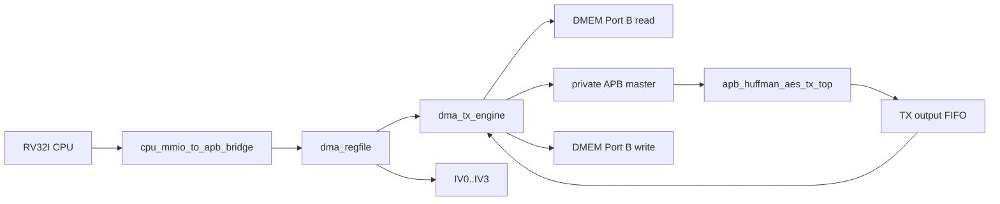
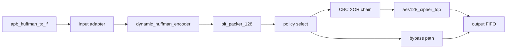

# TX Path End-to-End Specification

## 1. Purpose

This document describes the current SoC's own fast `TX`:

- Which module is involved?
- connections between modules
- function of each module
- flow only sets CPU/MMIO to `DMEM -> TX -> DMEM`

This spec only describes the current active path in the repo.

Current verification status:

| Item | Status |
|---|---|
| Main TX loopback mode | `MODE=0x9`, whole-file Huffman + AES-CBC |
| TX-only saving mode | `MODE=0xD`, whole-file Huffman + AES bypass |
| Active TX testcase examples | `dma_compress_aes_input1`, `tx_compress_only_input4_cov`, `tx_apb_error_cov` |
| Coverage hooks | `tx_if_direct_cov`, `tx_encoder_direct_cov`, `tx_builder_packer_direct_cov` |
| Latest regression | included in `34/34` PASS coverage baseline |

## 2. TX Goal

TX receives plaintext in `DMEM`, Huffman compression, then:

- if `COMPRESS_AES`: AES-128 CBC encryption
- if `COMPRESS_ONLY`: bypass AES

and write output back to `DMEM`.

## 3. Top-level TX line



## 4. Modules and roles

### 4.0 Module to spec map

| TX module | Spec |
|---|---|
| `top_rv32_sync` | [00_current_system_spec.md](./00_current_system_spec.md) |
| `cpu_mmio_to_apb_bridge` | [cpu_mmio_to_apb_bridge_spec.md](./cpu_mmio_to_apb_bridge_spec.md) |
| `dma_regfile` | [dma_regfile_spec.md](./dma_regfile_spec.md) |
| `dma_tx_engine` | [dma_tx_engine_spec.md](./dma_tx_engine_spec.md) |
| `dmem_ip_wrapper` / `DMEM_ip` | [bram_port_usage_spec.md](./bram_port_usage_spec.md) |
| `apb_huffman_aes_tx_top` | [apb_huffman_aes_tx_top_spec.md](./apb_huffman_aes_tx_top_spec.md) |
| `apb_huffman_tx_if` | [apb_huffman_aes_tx_top_spec.md](./apb_huffman_aes_tx_top_spec.md) |
| `huffman_aes_tx_top` | [apb_huffman_aes_tx_top_spec.md](./apb_huffman_aes_tx_top_spec.md) |
| `dynamic_huffman_encoder` | [dynamic_huffman_encoder_spec.md](./dynamic_huffman_encoder_spec.md) |
| `bit_packer_128` | [bit_packer_128_spec.md](./bit_packer_128_spec.md) |
| `aes128_cipher_top` | [apb_huffman_aes_tx_top_spec.md](./apb_huffman_aes_tx_top_spec.md) |
| whole-file Huffman policy | [14_dynamic_whole_file_huffman_spec.md](./14_dynamic_whole_file_huffman_spec.md) |
| IV/CBC contract | [iv_generation_and_cbc_contract_spec.md](./iv_generation_and_cbc_contract_spec.md) |

### 4.1 Control plane modules

| Module | Role |
|---|---|
| `top_rv32_sync` | Run program RV32I to configure DMA |
| `cpu_mmio_to_apb_bridge` | Switch CPU MMIO read/write to APB transaction |
| `dma_regfile` | Keep TX config: `SRC_ADDR`, `DST_ADDR`, `LEN_BYTES`, `MODE`, `BLOCK_CFG`, `IV0..IV3` |

### 4.2 Data plane modules

| Module | Role |
|---|---|
| `DMEM_ip` / `dmem_ip_wrapper` | Where to store plaintext input and ciphertext output |
| `dma_tx_engine` | Data mover TX, read DMEM, loop TX APB, drain output FIFO, write DMEM |
| `apb_huffman_aes_tx_top` | TX accelerator top |
| `apb_huffman_tx_if` | APB slave wrapper inside TX |
| `huffman_aes_tx_top` | Input adapter + Huffman TX + bit packer |
| `dynamic_huffman_encoder` | [dynamic_huffman_encoder_spec.md](./dynamic_huffman_encoder_spec.md) |
| `bit_packer_128` | [bit_packer_128_spec.md](./bit_packer_128_spec.md) |
| `aes128_cipher_top` | AES encrypt core active |

## 5. Main connection

### 5.1 CPU to DMA register file

CPU writes MMIO to:

- `SRC_ADDR`
- `DST_ADDR`
- `LEN_BYTES`
- `MODE`
- `BLOCK_CFG`
- `IV0..IV3`
- `CONTROL.start`

### 5.2 `dma_regfile` to `dma_tx_engine`

`dma_regfile` output:

- `src_addr_o`
- `dst_addr_o`
- `len_bytes_o`
- `direction_o`
- `compress_only_o`
- `whole_file_o`
- `block_size_o`
- `start_pulse_o`

`dma_tx_engine` receives this config board to run transfer.

### 5.3 `dma_regfile` In TX CBC Path

`dma_regfile` output:

```text
iv_o = {IV3, IV2, IV1, IV0}
```

In [rv32_soc_top.v](/mnt/h/Academic/senior_project/DATN/work/luc/AES_huffman_all6/rtl/rv32_soc_top.v), `iv_o` is appended:

- `apb_huffman_aes_tx_top.cbc_iv_i`

### 5.4 `dma_tx_engine` to DMEM

`dma_tx_engine` uses `DMEM` Port B to:

- Read plaintext from `SRC_ADDR`
- Write ciphertext or compressed transport stream to `DST_ADDR`

### 5.5 `dma_tx_engine` to `apb_huffman_aes_tx_top`

`dma_tx_engine` is TX's private APB master:

- `tx_psel_o`
- `tx_penable_o`
- `tx_pwrite_o`
- `tx_paddr_o`
- `tx_pwdata_o`

TX top is APB slave returns:

- `tx_prdata_i`
- `tx_pready_i`
- `tx_pslverr_i`

## 6. Internal TX Structure



## 7. Function of each TX stage

### 7.1 `apb_huffman_tx_if`

Function:

- get `BLOCK_SIZE`
- get `WORD_IN`
- get `START_BLOCK`
- hold FIFO input APB
- expose the TX's FIFO output for DMA to read
- keep sticky status/error

### 7.2 Input adapter

Convert each 32-bit word into the byte stream in TX internal byte order.

### 7.3 `dynamic_huffman_encoder`

Function:

- collect bytes of block
- build codebook
- Decide on encoding mode
- emit header + payload bitstream

TX currently has 2 types of content:

- per-block dynamic Huffman
- whole-file dynamic Huffman

### 7.4 `bit_packer_128`

Include 128-bit `transport_word` into bitstream.

If the transfer has the next block in the same frame:

- packer keeps the frame continuously
- just flush on the last block

### 7.5 CBC + AES

If `compress_only = 0`:

```text
C0 = AES_encrypt(P0 XOR IV)
Cn = AES_encrypt(Pn XOR Cn-1)
```

If `compress_only = 1`:

- board via AES
- output is compressed transport stream

### 7.6 Output FIFO

Save output 32-bit word to `dma_tx_engine` drain via APB:

- `AES_OUT_STATUS`
- `AES_OUT_META`
- `AES_OUT_DATA`

## 8. TX software flow

### 8.1 CPU steps

1. Load plaintext into `DMEM`
2. write `SRC_ADDR`
3. write `DST_ADDR`
4. write `LEN_BYTES = plaintext_len`
5. write `MODE`
6. write `BLOCK_CFG`
7. If using AES, write `IV0..IV3`
8. write `CONTROL.start`
9. poll `STATUS`
10. read `CIPHERTEXT_BYTES_PRODUCED`

### 8.2 Main TX mode currently used

Current main regression mode:

- `MODE = 0x9`
- meaning `TX + COMPRESS_AES + whole_file`
- `BLOCK_CFG = 32`

## 9. DMA TX stream

### 9.1 Start and configuration

`dma_tx_engine`:

1. wait for `start_i`
2. check:
   - `direction_i == TX`
   - `len_bytes_i != 0`
   - `block_size_i` is valid
   - `src/dst` aligned
3. snapshot config
4. soft reset TX wrapper
5. loop `TX_POLICY`

If `whole_file_i = 1`, the engine runs a global-count/global-build phase before the emit phase.

### 9.2 Per-block load

For each block:

1. calculate `current_block_bytes = min(bytes_remaining, block_size)`
2. calculate `words_remaining = ceil(current_block_bytes / 4)`
3. Read each word from `DMEM`
4. write `BLOCK_SIZE`
5. write each `WORD_IN`
6. poll `TX STATUS.can_start`
7. write `START_BLOCK`

### 9.3 Continue-frame policy

If transfer still blocks:

- `START_BLOCK = 0x3`
- bit `continue_frame = 1`

If it is the last block:

- `START_BLOCK = 0x1`
- bit `continue_frame = 0`

### 9.4 Output drain

After the block has been released by TX:

1. poll `AES_OUT_STATUS`
2. if FIFO nonempty:
   - read `AES_OUT_META`
   - read `AES_OUT_DATA`
   - write word output to `DMEM`
3. Repeat for me when output FIFO is wide

### 9.5 Completion

Transfer TX is complete when:

- no more plaintext input
- output FIFO has been drained
- TX wrapper is idle on Dinh

At that time:

- `dma_done_o` pulse
- `bytes_done_o` contains the number of output bytes number write to `DMEM`
- `CIPHERTEXT_BYTES_PRODUCED` mirrors this value for software

## 10. Active Data Meaning

### 10.1 TX input

- `SRC_ADDR` enters plaintext in `DMEM`
- `LEN_BYTES` is the plaintext byte number

### 10.2 TX output

If `COMPRESS_AES`:

- output is ciphertext stream after Huffman + CBC + AES

If `COMPRESS_ONLY`:

- output is compressed transport stream, not encrypted

## 11. Current Main Regression Flow

```text
CPU writes MODE=0x9, BLOCK_CFG=32, IV0..IV3
-> start TX
-> DMA TX reads plaintext from DMEM
-> whole-file Huffman encode
-> bit_packer_128
-> CBC XOR
-> aes128_cipher_top
-> output FIFO
-> DMA TX drains output
-> ciphertext written back to DMEM
-> CPU reads CIPHERTEXT_BYTES_PRODUCED
```

## 12. Current limit

- `COMPRESS_ONLY` TX can run, but RX symmetric bypass path is not the main flow
- The current AES key is a fixed key in RTL
- The current IV is created by software RV32I, not strong entropy
- TX top does not use `AES_top.v` da-mode; Just use `aes128_cipher_top` + small CBC wrapper
- Raw full coverage of TX-related logic is still stuck by toggle and some condition/expression rare; Functional branch/statement closure is reached in general regression

## 13. Source Files

- [rv32_soc_top.v](/mnt/h/Academic/senior_project/DATN/work/luc/AES_huffman_all6/rtl/rv32_soc_top.v)
- [dma_tx_engine.v](/mnt/h/Academic/senior_project/DATN/work/luc/AES_huffman_all6/rtl/dma_tx_engine.v)
- [apb_huffman_aes_tx_top.v](/mnt/h/Academic/senior_project/DATN/work/luc/AES_huffman_all6/rtl/apb_huffman_aes_tx_top.v)
- [dma_regfile.v](/mnt/h/Academic/senior_project/DATN/work/luc/AES_huffman_all6/rtl/dma_regfile.v)
- [dynamic_huffman_encoder_spec.md](/mnt/h/Academic/senior_project/DATN/work/luc/AES_huffman_all6/docs/dynamic_huffman_encoder_spec.md)
- [bit_packer_128_spec.md](/mnt/h/Academic/senior_project/DATN/work/luc/AES_huffman_all6/docs/bit_packer_128_spec.md)
- [test_mmio_dma.c](/mnt/h/Academic/senior_project/DATN/work/luc/AES_huffman_all6/testcase/test_mmio_dma.c)
