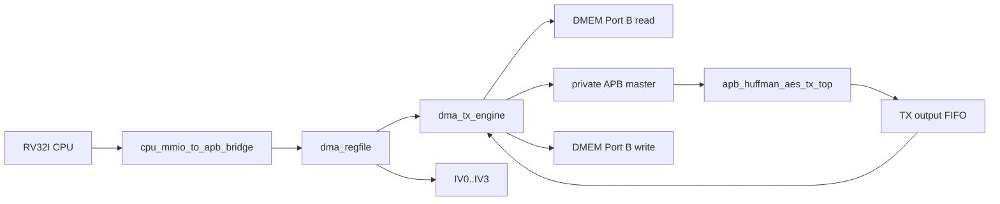
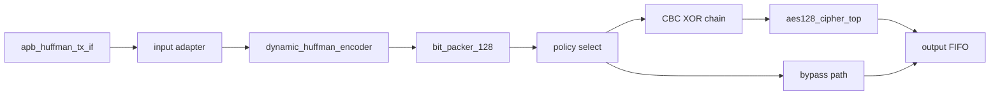

# TX Path End-to-End Specification

## 1. Mục đích

Tài liệu này mô tả riêng nhanh `TX` của SoC hiện tại:

- module nào tham gia
- ket noi giua các module
- chức năng của từng module
- flow chỉ tiet tu CPU/MMIO đến `DMEM -> TX -> DMEM`

Spec này chỉ mô tả path active hiện tại trong repo.

Trạng thái kiểm chứng hiện tại:

| Item | Trạng thái |
|---|---|
| Main TX loopback mode | `MODE=0x9`, whole-file Huffman + AES-CBC |
| TX-only saving mode | `MODE=0xD`, whole-file Huffman + AES bypass |
| Active TX testcase examples | `dma_compress_aes_input1`, `tx_compress_only_input4_cov`, `tx_apb_error_cov` |
| Coverage hooks | `tx_if_direct_cov`, `tx_encoder_direct_cov`, `tx_builder_packer_direct_cov` |
| Latest regression | included in `34/34` PASS coverage baseline |

## 2. TX Goal

TX nhận plaintext trong `DMEM`, nén Huffman, sau đó:

- nếu `COMPRESS_AES`: mã hóa AES-128 CBC
- nếu `COMPRESS_ONLY`: bo qua AES

và ghi output tro lại `DMEM`.

## 3. Đường TX top-level



## 4. Module và vai trò

### 4.0 Module to spec map

| TX module | Spec |
|---|---|
| `top_rv32_sync` | [00_current_system_spec.md](./00_current_system_spec.md) |
| `cpu_mmio_to_apb_bridge` | [cpu_mmio_to_apb_bridge_spec.md](./cpu_mmio_to_apb_bridge_spec.md) |
| `dma_regfile` | [dma_regfile_spec.md](./dma_regfile_spec.md) |
| `dma_tx_engine` | [dma_tx_engine_spec.md](./dma_tx_engine_spec.md) |
| `dmem_ip_wrapper` / `DMEM_ip` | [bram_port_usage_spec.md](./bram_port_usage_spec.md) |
| `apb_huffman_aes_tx_top` | [apb_huffman_aes_tx_top_spec.md](./apb_huffman_aes_tx_top_spec.md) |
| `apb_huffman_tx_if` | [apb_huffman_aes_tx_top_spec.md](./apb_huffman_aes_tx_top_spec.md) |
| `huffman_aes_tx_top` | [apb_huffman_aes_tx_top_spec.md](./apb_huffman_aes_tx_top_spec.md) |
| `dynamic_huffman_encoder` | [dynamic_huffman_encoder_spec.md](./dynamic_huffman_encoder_spec.md) |
| `bit_packer_128` | [bit_packer_128_spec.md](./bit_packer_128_spec.md) |
| `aes128_cipher_top` | [apb_huffman_aes_tx_top_spec.md](./apb_huffman_aes_tx_top_spec.md) |
| whole-file Huffman policy | [14_dynamic_whole_file_huffman_spec.md](./14_dynamic_whole_file_huffman_spec.md) |
| IV/CBC contract | [iv_generation_and_cbc_contract_spec.md](./iv_generation_and_cbc_contract_spec.md) |

### 4.1 Control plane modules

| Module | Vai trò |
|---|---|
| `top_rv32_sync` | Chạy chương trình RV32I để cấu hình DMA |
| `cpu_mmio_to_apb_bridge` | Chuyen CPU MMIO read/write thanh APB transaction |
| `dma_regfile` | Giữ config TX: `SRC_ADDR`, `DST_ADDR`, `LEN_BYTES`, `MODE`, `BLOCK_CFG`, `IV0..IV3` |

### 4.2 Data plane modules

| Module | Vai trò |
|---|---|
| `DMEM_ip` / `dmem_ip_wrapper` | Nơi lưu plaintext input và ciphertext output |
| `dma_tx_engine` | Data mover TX, đọc DMEM, lặp trinh TX APB, drain output FIFO, ghi DMEM |
| `apb_huffman_aes_tx_top` | TX accelerator top |
| `apb_huffman_tx_if` | APB slave wrapper ben trong TX |
| `huffman_aes_tx_top` | Input adapter + Huffman TX + bit packer |
| `dynamic_huffman_encoder` | [dynamic_huffman_encoder_spec.md](./dynamic_huffman_encoder_spec.md) |
| `bit_packer_128` | [bit_packer_128_spec.md](./bit_packer_128_spec.md) |
| `aes128_cipher_top` | AES encrypt core active |

## 5. Kết nối chính

### 5.1 CPU to DMA register file

CPU ghi MMIO vao:

- `SRC_ADDR`
- `DST_ADDR`
- `LEN_BYTES`
- `MODE`
- `BLOCK_CFG`
- `IV0..IV3`
- `CONTROL.start`

### 5.2 `dma_regfile` to `dma_tx_engine`

`dma_regfile` xuất:

- `src_addr_o`
- `dst_addr_o`
- `len_bytes_o`
- `direction_o`
- `compress_only_o`
- `whole_file_o`
- `block_size_o`
- `start_pulse_o`

`dma_tx_engine` nhận bo config này để chạy transfer.

### 5.3 `dma_regfile` to TX CBC path

`dma_regfile` xuất:

```text
iv_o = {IV3, IV2, IV1, IV0}
```

Trong [rv32_soc_top.v](/mnt/h/Academic/senior_project/DATN/work/lúc/AES_huffman_all6/rtl/rv32_soc_top.v), `iv_o` được nối vao:

- `apb_huffman_aes_tx_top.cbc_iv_i`

### 5.4 `dma_tx_engine` to DMEM

`dma_tx_engine` dung `DMEM` Cổng B để:

- đọc plaintext tu `SRC_ADDR`
- ghi ciphertext hoặc compressed transport stream ve `DST_ADDR`

### 5.5 `dma_tx_engine` to `apb_huffman_aes_tx_top`

`dma_tx_engine` là private APB master của TX:

- `tx_psel_o`
- `tx_penable_o`
- `tx_pwrite_o`
- `tx_paddr_o`
- `tx_pwdata_o`

TX top là APB slave trả:

- `tx_prdata_i`
- `tx_pready_i`
- `tx_pslverr_i`

## 6. Internal TX Structure



## 7. Chức năng từng stage TX

### 7.1 `apb_huffman_tx_if`

Chức năng:

- nhận `BLOCK_SIZE`
- nhận `WORD_IN`
- nhận `START_BLOCK`
- giữ FIFO input APB
- expose output FIFO của TX để DMA đọc
- giữ sticky status / error

### 7.2 Input adapter

Chuyen từng word 32-bit thanh byte stream theo thứ tự byte nội bộ của TX.

### 7.3 `dynamic_huffman_encoder`

Chức năng:

- collect byte của block
- build codebook
- quyet dinh mode encode
- emit header + payload bitstream

TX hiện tại có 2 kiểu dung:

- per-block dynamic Huffman
- whole-file dynamic Huffman

### 7.4 `bit_packer_128`

Gộp bitstream thanh `transport_word` 128-bit.

Nếu transfer còn block tiếp theo trong cùng frame:

- packer giữ frame liên tục
- chỉ flush o block cuối

### 7.5 CBC + AES

Nếu `compress_only = 0`:

```text
C0 = AES_encrypt(P0 XOR IV)
Cn = AES_encrypt(Pn XOR Cn-1)
```

Nếu `compress_only = 1`:

- bo qua AES
- output là compressed transport stream

### 7.6 Output FIFO

Lưu output 32-bit word để `dma_tx_engine` drain qua APB:

- `AES_OUT_STATUS`
- `AES_OUT_META`
- `AES_OUT_DATA`

## 8. Luồng software TX

### 8.1 CPU steps

1. nạp plaintext vao `DMEM`
2. ghi `SRC_ADDR`
3. ghi `DST_ADDR`
4. ghi `LEN_BYTES = plaintext_len`
5. ghi `MODE`
6. ghi `BLOCK_CFG`
7. nếu dung AES, ghi `IV0..IV3`
8. ghi `CONTROL.start`
9. poll `STATUS`
10. đọc `CIPHERTEXT_BYTES_PRODUCED`

### 8.2 Main TX mode currently used

Mode regression chính hiện tại:

- `MODE = 0x9`
- nghĩa là `TX + COMPRESS_AES + whole_file`
- `BLOCK_CFG = 32`

## 9. Luồng DMA TX

### 9.1 Start và cấu hình

`dma_tx_engine`:

1. đợi `start_i`
2. check:
   - `direction_i == TX`
   - `len_bytes_i != 0`
   - `block_size_i` hợp lệ
   - `src/dst` aligned
3. snapshot config
4. soft reset TX wrapper
5. lặp trinh `TX_POLICY`

Nếu `whole_file_i = 1`, engine chạy thêm pha global-count/global-build trước pha emit.

### 9.2 Per-block load

Với mỗi block:

1. tính `current_block_bytes = min(bytes_remaining, block_size)`
2. tính `words_remaining = ceil(current_block_bytes / 4)`
3. đọc từng word tu `DMEM`
4. ghi `BLOCK_SIZE`
5. ghi từng `WORD_IN`
6. poll `TX STATUS.can_start`
7. ghi `START_BLOCK`

### 9.3 Continue-frame policy

Nếu transfer còn block nữa:

- `START_BLOCK = 0x3`
- bit `continue_frame = 1`

Nếu là block cuối:

- `START_BLOCK = 0x1`
- bit `continue_frame = 0`

### 9.4 Output drain

Sau khi block đã được TX xu ly:

1. poll `AES_OUT_STATUS`
2. nếu FIFO nonempty:
   - đọc `AES_OUT_META`
   - đọc `AES_OUT_DATA`
   - ghi word output ve `DMEM`
3. lặp lại cho toi khi output FIFO rộng

### 9.5 Completion

Transfer TX complete khi:

- không còn plaintext input
- output FIFO đã được drain
- TX wrapper da idle on dinh

Lúc đó:

- `dma_done_o` pulse
- `bytes_done_o` chưa số byte output da ghi ve `DMEM`
- `CIPHERTEXT_BYTES_PRODUCED` mirror giá trị này cho software

## 10. Active Data Ý nghĩa

### 10.1 TX input

- `SRC_ADDR` tro vao plaintext trong `DMEM`
- `LEN_BYTES` là so plaintext byte

### 10.2 TX output

Nếu `COMPRESS_AES`:

- output là ciphertext stream sau Huffman + CBC + AES

Nếu `COMPRESS_ONLY`:

- output là compressed transport stream, chưa encrypt

## 11. Current Main Regression Flow

```text
CPU writes MODE=0x9, BLOCK_CFG=32, IV0..IV3
-> start TX
-> DMA TX reads plaintext from DMEM
-> whole-file Huffman encode
-> bit_packer_128
-> CBC XOR
-> aes128_cipher_top
-> output FIFO
-> DMA TX drains output
-> ciphertext written back to DMEM
-> CPU reads CIPHERTEXT_BYTES_PRODUCED
```

## 12. Giới hạn hiện tại

- `COMPRESS_ONLY` TX da chạy được, nhưng RX symmetric bypass path chưa là flow chính
- key AES hiện tại là fixed key trong RTL
- IV hiện tại do software RV32I tạo, chưa phải entropy manh
- TX top không dùng `AES_top.v` da-mode; chỉ dung `aes128_cipher_top` + CBC wrapper nhỏ
- raw full coverage của TX-related logic vẫn bị keo bởi toggle và một so condition/expression hiem; functional branch/statement closure da dat trong regression chung

## 13. Source Files

- [rv32_soc_top.v](/mnt/h/Academic/senior_project/DATN/work/lúc/AES_huffman_all6/rtl/rv32_soc_top.v)
- [dma_tx_engine.v](/mnt/h/Academic/senior_project/DATN/work/lúc/AES_huffman_all6/rtl/dma_tx_engine.v)
- [apb_huffman_aes_tx_top.v](/mnt/h/Academic/senior_project/DATN/work/lúc/AES_huffman_all6/rtl/apb_huffman_aes_tx_top.v)
- [dma_regfile.v](/mnt/h/Academic/senior_project/DATN/work/lúc/AES_huffman_all6/rtl/dma_regfile.v)
- [dynamic_huffman_encoder_spec.md](/mnt/h/Academic/senior_project/DATN/work/lúc/AES_huffman_all6/docs/dynamic_huffman_encoder_spec.md)
- [bit_packer_128_spec.md](/mnt/h/Academic/senior_project/DATN/work/lúc/AES_huffman_all6/docs/bit_packer_128_spec.md)
- [test_mmio_dma.c](/mnt/h/Academic/senior_project/DATN/work/lúc/AES_huffman_all6/testcase/test_mmio_dma.c)
