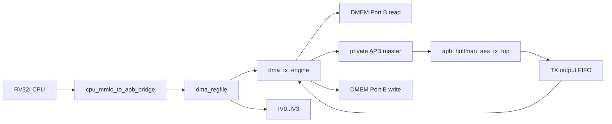
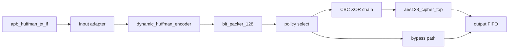

# TX Path End-to-End Specification

## 1. Purpose

Tai lieu nay mo ta rieng nhanh `TX` cua SoC hien tai:

- module nao tham gia
- ket noi giua cac module
- chuc nang cua tung module
- flow chi tiet tu CPU/MMIO den `DMEM -> TX -> DMEM`

Spec nay chi mo ta path active hien tai trong repo.

Current verification status:

| Item | Status |
|---|---|
| Main TX loopback mode | `MODE=0x9`, whole-file Huffman + AES-CBC |
| TX-only saving mode | `MODE=0xD`, whole-file Huffman + AES bypass |
| Active TX testcase examples | `dma_compress_aes_input1`, `tx_compress_only_input4_cov`, `tx_apb_error_cov` |
| Coverage hooks | `tx_if_direct_cov`, `tx_encoder_direct_cov`, `tx_builder_packer_direct_cov` |
| Historical full regression | included in `34/34` PASS coverage baseline before secure-storage API refactor |

## 2. TX Goal

TX nhan plaintext trong `DMEM`, nen Huffman, sau do:

- neu `COMPRESS_AES`: ma hoa AES-128 CBC
- neu `COMPRESS_ONLY`: bo qua AES

va ghi output tro lai `DMEM`.

## 3. Top-Level TX Path



## 4. Modules And Roles

### 4.0 Module to spec map

| TX module | Spec |
|---|---|
| `top_rv32_sync` | [00_current_system_spec.md](./00_current_system_spec.md) |
| `cpu_mmio_to_apb_bridge` | [cpu_mmio_to_apb_bridge_spec.md](./cpu_mmio_to_apb_bridge_spec.md) |
| `dma_regfile` | [dma_regfile_spec.md](./dma_regfile_spec.md) |
| `dma_tx_engine` | [dma_tx_engine_spec.md](./dma_tx_engine_spec.md) |
| `dmem_ip_wrapper` / `DMEM_ip` | [bram_port_usage_spec.md](./bram_port_usage_spec.md) |
| `apb_huffman_aes_tx_top` | [apb_huffman_aes_tx_top_spec.md](./apb_huffman_aes_tx_top_spec.md) |
| `apb_huffman_tx_if` | [apb_huffman_aes_tx_top_spec.md](./apb_huffman_aes_tx_top_spec.md) |
| `huffman_aes_tx_top` | [apb_huffman_aes_tx_top_spec.md](./apb_huffman_aes_tx_top_spec.md) |
| `dynamic_huffman_encoder` | [dynamic_huffman_encoder_spec.md](./dynamic_huffman_encoder_spec.md) |
| `bit_packer_128` | [bit_packer_128_spec.md](./bit_packer_128_spec.md) |
| `aes128_cipher_top` | [apb_huffman_aes_tx_top_spec.md](./apb_huffman_aes_tx_top_spec.md) |
| whole-file Huffman policy | [14_dynamic_whole_file_huffman_spec.md](./14_dynamic_whole_file_huffman_spec.md) |
| IV/CBC contract | [iv_generation_and_cbc_contract_spec.md](./iv_generation_and_cbc_contract_spec.md) |

### 4.1 Control plane modules

| Module | Role |
|---|---|
| `top_rv32_sync` | Chay chuong trinh RV32I de cau hinh DMA |
| `cpu_mmio_to_apb_bridge` | Chuyen CPU MMIO read/write thanh APB transaction |
| `dma_regfile` | Giu config TX: `SRC_ADDR`, `DST_ADDR`, `LEN_BYTES`, `MODE`, `BLOCK_CFG`, `IV0..IV3` |

### 4.2 Data plane modules

| Module | Role |
|---|---|
| `DMEM_ip` / `dmem_ip_wrapper` | Noi luu plaintext input va ciphertext output |
| `dma_tx_engine` | Data mover TX, doc DMEM, lap trinh TX APB, drain output FIFO, ghi DMEM |
| `apb_huffman_aes_tx_top` | TX accelerator top |
| `apb_huffman_tx_if` | APB slave wrapper ben trong TX |
| `huffman_aes_tx_top` | Input adapter + Huffman TX + bit packer |
| `dynamic_huffman_encoder` | [dynamic_huffman_encoder_spec.md](./dynamic_huffman_encoder_spec.md) |
| `bit_packer_128` | [bit_packer_128_spec.md](./bit_packer_128_spec.md) |
| `aes128_cipher_top` | AES encrypt core active |

## 5. Key Connections

### 5.1 CPU to DMA register file

CPU ghi MMIO vao:

- `SRC_ADDR`
- `DST_ADDR`
- `LEN_BYTES`
- `MODE`
- `BLOCK_CFG`
- `IV0..IV3`
- `CONTROL.start`

### 5.2 `dma_regfile` to `dma_tx_engine`

`dma_regfile` xuat:

- `src_addr_o`
- `dst_addr_o`
- `len_bytes_o`
- `direction_o`
- `compress_only_o`
- `whole_file_o`
- `block_size_o`
- `start_pulse_o`

`dma_tx_engine` nhan bo config nay de chay transfer.

### 5.3 `dma_regfile` to TX CBC path

`dma_regfile` xuat:

```text
iv_o = {IV3, IV2, IV1, IV0}
```

Trong [rv32_soc_top.v](/mnt/h/Academic/senior_project/DATN/work/luc/AES_huffman_all6/rtl/rv32_soc_top.v), `iv_o` duoc noi vao:

- `apb_huffman_aes_tx_top.cbc_iv_i`

### 5.4 `dma_tx_engine` to DMEM

`dma_tx_engine` dung `DMEM` Port B de:

- doc plaintext tu `SRC_ADDR`
- ghi ciphertext hoac compressed transport stream ve `DST_ADDR`

### 5.5 `dma_tx_engine` to `apb_huffman_aes_tx_top`

`dma_tx_engine` la private APB master cua TX:

- `tx_psel_o`
- `tx_penable_o`
- `tx_pwrite_o`
- `tx_paddr_o`
- `tx_pwdata_o`

TX top la APB slave tra:

- `tx_prdata_i`
- `tx_pready_i`
- `tx_pslverr_i`

## 6. Internal TX Structure



## 7. Function Of Each TX Stage

### 7.1 `apb_huffman_tx_if`

Chuc nang:

- nhan `BLOCK_SIZE`
- nhan `WORD_IN`
- nhan `START_BLOCK`
- giu FIFO input APB
- expose output FIFO cua TX de DMA doc
- giu sticky status / error

### 7.2 Input adapter

Chuyen tung word 32-bit thanh byte stream theo thu tu byte noi bo cua TX.

### 7.3 `dynamic_huffman_encoder`

Chuc nang:

- collect byte cua block
- dung codebook per-block legacy hoac global whole-file
- active TX hien emit mode `COMPRESSED` co dinh
- emit header + payload bitstream

TX hien tai co 2 kieu dung:

- per-block dynamic Huffman
- whole-file dynamic Huffman

Trong `whole_file` mode, "whole-file" nghia la codebook/frequency table duoc
tinh tren toan input. Du lieu van duoc DMA feed vao TX theo cac block payload
toi da 32 byte de giu adapter, packer, AES-CBC va RX parser khop voi RTL hien
tai.

### 7.4 `bit_packer_128`

Gop bitstream thanh `transport_word` 128-bit.

Neu transfer con block tiep theo trong cung frame:

- packer giu frame lien tuc
- chi flush o block cuoi

### 7.5 CBC + AES

Neu `compress_only = 0`:

```text
C0 = AES_encrypt(P0 XOR IV)
Cn = AES_encrypt(Pn XOR Cn-1)
```

Neu `compress_only = 1`:

- bo qua AES
- output la compressed transport stream

### 7.6 Output FIFO

Luu output 32-bit word de `dma_tx_engine` drain qua APB:

- `AES_OUT_STATUS`
- `AES_OUT_META`
- `AES_OUT_DATA`

Area-optimized implementation notes:

- Global frequency, Huffman tree, code-length, canonical-code, block-buffer,
  and APB FIFO tables infer distributed RAM in `rv32_soc_synth_tx_opt4`.
- Large table contents are not reset entry-by-entry in synthesis; reset clears
  control state and validity only.
- `code_length_builder` separates parent/weight/order table writes into
  one-write-port memory processes, which removes the previous LUT/FF explosion.
- Latest TX-only implementation at 50 MHz: `11933` LUTs, `5469` FFs,
  `3979` slices, `208` control sets, WNS `+1.277 ns`.
- Latest full ZCU102 TX+RX implementation and bitstream pass:
  `29542` LUTs, `18873` FFs, `6045` CLBs, `1699` control sets, WNS
  `+9.331 ns`, WHS `+0.017 ns`.

## 8. TX Software Flow

### 8.1 CPU steps

1. nap plaintext vao `DMEM`
2. ghi `SRC_ADDR`
3. ghi `DST_ADDR`
4. ghi `LEN_BYTES = plaintext_len`
5. ghi `MODE`
6. ghi `BLOCK_CFG`
7. neu dung AES, ghi `IV0..IV3`
8. ghi `CONTROL.start`
9. poll `STATUS`
10. doc `CIPHERTEXT_BYTES_PRODUCED`

### 8.2 Main TX mode currently used

Mode regression chinh hien tai:

- `MODE = 0x9`
- nghia la `TX + COMPRESS_AES + whole_file`
- `BLOCK_CFG = 32`

## 9. TX DMA Flow

### 9.1 Start and config

`dma_tx_engine`:

1. doi `start_i`
2. check:
   - `direction_i == TX`
   - `len_bytes_i != 0`
   - `block_size_i` hop le
   - `src/dst` aligned
3. snapshot config
4. soft reset TX wrapper
5. lap trinh `TX_POLICY`

Neu `whole_file_i = 1`, engine chay them pha global-count/global-build truoc pha emit.

### 9.2 Block chunk load

Voi moi block:

1. tinh `current_block_bytes = min(bytes_remaining, block_size)`
2. tinh `words_remaining = ceil(current_block_bytes / 4)`
3. ghi `BLOCK_SIZE`
4. doc tung word tu `DMEM`
5. ghi tung `WORD_IN`
6. poll `TX STATUS.can_start`
7. ghi `START_BLOCK`

Trinh tu nay van xay ra trong `whole_file` mode. Khac biet la count pass dung
cac block nay chi de dem tan suat, con emit pass dung global codebook da build
tu toan file thay vi build codebook moi cho tung block.

### 9.3 Continue-frame policy

Neu transfer con block nua:

- `START_BLOCK = 0x3`
- bit `continue_frame = 1`

Neu la block cuoi:

- `START_BLOCK = 0x1`
- bit `continue_frame = 0`

### 9.4 Output drain

Sau khi block da duoc TX xu ly:

1. poll `AES_OUT_STATUS`
2. neu FIFO nonempty:
   - doc `AES_OUT_META`
   - doc `AES_OUT_DATA`
   - ghi word output ve `DMEM`
3. lap lai cho toi khi output FIFO rong

### 9.5 Completion

Transfer TX complete khi:

- khong con plaintext input
- output FIFO da duoc drain
- TX wrapper da idle on dinh

Luc do:

- `dma_done_o` pulse
- `bytes_done_o` chua so byte output da ghi ve `DMEM`
- `CIPHERTEXT_BYTES_PRODUCED` mirror gia tri nay cho software

## 10. Active Data Meaning

### 10.1 TX input

- `SRC_ADDR` tro vao plaintext trong `DMEM`
- `LEN_BYTES` la so plaintext byte

### 10.2 TX output

Neu `COMPRESS_AES`:

- output la ciphertext stream sau Huffman + CBC + AES

Neu `COMPRESS_ONLY`:

- output la compressed transport stream, chua encrypt

## 11. Current Main Regression Flow

```text
CPU writes MODE=0x9, BLOCK_CFG=32, IV0..IV3
-> start TX
-> DMA TX reads plaintext from DMEM
-> whole-file Huffman encode
-> bit_packer_128
-> CBC XOR
-> aes128_cipher_top
-> output FIFO
-> DMA TX drains output
-> ciphertext written back to DMEM
-> CPU reads CIPHERTEXT_BYTES_PRODUCED
```

## 12. Current Limitations

- `COMPRESS_ONLY` TX da chay duoc, nhung RX symmetric bypass path chua la flow chinh
- key AES hien tai la fixed key trong RTL
- IV hien tai do firmware RV32I tao va luu trong metadata, chua phai entropy manh
- TX top khong dung `AES_top.v` da-mode; chi dung `aes128_cipher_top` + CBC wrapper nho
- raw full coverage cua TX-related logic van bi keo boi toggle va mot so condition/expression hiem; functional branch/statement closure da dat trong regression chung

## 13. Source Files

- [rv32_soc_top.v](/mnt/h/Academic/senior_project/DATN/work/luc/AES_huffman_all6/rtl/rv32_soc_top.v)
- [dma_tx_engine.v](/mnt/h/Academic/senior_project/DATN/work/luc/AES_huffman_all6/rtl/dma_tx_engine.v)
- [apb_huffman_aes_tx_top.v](/mnt/h/Academic/senior_project/DATN/work/luc/AES_huffman_all6/rtl/apb_huffman_aes_tx_top.v)
- [dma_regfile.v](/mnt/h/Academic/senior_project/DATN/work/luc/AES_huffman_all6/rtl/dma_regfile.v)
- [dynamic_huffman_encoder_spec.md](/mnt/h/Academic/senior_project/DATN/work/luc/AES_huffman_all6/docs/dynamic_huffman_encoder_spec.md)
- [bit_packer_128_spec.md](/mnt/h/Academic/senior_project/DATN/work/luc/AES_huffman_all6/docs/bit_packer_128_spec.md)
- [test_mmio_dma.c](/mnt/h/Academic/senior_project/DATN/work/luc/AES_huffman_all6/testcase/test_mmio_dma.c)
